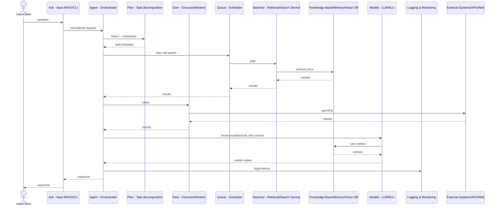

# AI Architecture Sequence

```mermaid
sequenceDiagram
    actor User as User/Client
    participant UI as Ask - Input API/UI/CLI
    participant Orchestrator as Agent - Orchestrator
    participant Planner as Plan - Task decomposition
    participant Executor as Doer - Executor/Workers
    participant Queue as Queue - Scheduler
    participant Searcher as Searcher - Retrieval/Search Service
    participant Knowledge as Knowledge Base/Memory/Vector DB
    participant Models as Models - LLM/NLU
    participant Monitor as Logging & Monitoring
    participant External as External Systems/APIs/Web

    User->>UI: question
    UI->>Orchestrator: normalized request
    Orchestrator->>Planner: intent + constraints
    Planner-->>Orchestrator: task list/steps

    Orchestrator->>Queue: may call search
    Queue->>Searcher: jobs
    Searcher->>Knowledge: retrieve docs
    Knowledge-->>Searcher: context
    Searcher-->>Queue: results
    Queue-->>Orchestrator: results

    Orchestrator->>Executor: tasks
    Executor->>External: call APIs
    External-->>Executor: results
    Executor-->>Orchestrator: results

    Orchestrator->>Models: invoke models/tools with context
    Models->>Knowledge: use context
    Knowledge-->>Models: context
    Models-->>Orchestrator: model output

    Orchestrator->>Monitor: logs/metrics
    Orchestrator-->>UI: response
    UI-->>User: response
```
