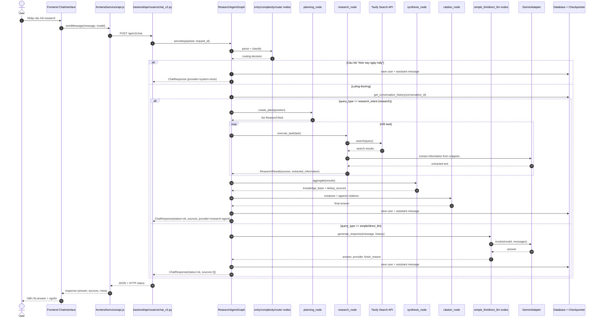

# AI Architecture Sequence (Research Request)

```mermaid
sequenceDiagram
    autonumber
    actor User
    participant UI as Frontend ChatInterface
    participant API as frontend/services/api.js
    participant Router as backend/api/routers/chat_v2.py
    participant Graph as ResearchAgentGraph
    participant Parser as entry/complexity/router nodes
    participant Planner as planning_node
    participant Tool as research_node
    participant Tavily as Tavily Search API
    participant Aggregator as synthesis_node
    participant Composer as citation_node
    participant DirectLLM as simple_llm/direct_llm nodes
    participant Gemini as GeminiAdapter
    participant DB as Database + Checkpointer

    User->>UI: Nhập câu hỏi research
    UI->>API: sendMessage(message, model)
    API->>Router: POST /api/v2/chat
    Router->>Graph: ainvoke(payload, request_id)

    Graph->>Parser: parse + classify
    Parser-->>Graph: routing decision

    alt Câu hỏi "hôm nay ngày mấy"
        Graph->>DB: save user + assistant message
        Graph-->>Router: ChatResponse (provider=system-clock)
    else Luồng thường
        Graph->>DB: get_conversation_history(conversation_id)

        alt query_type == research_intent (research)
            Graph->>Planner: create_plan(question)
            Planner-->>Graph: list ResearchTask

            loop mỗi task
                Graph->>Tool: execute_task(task)
                Tool->>Tavily: search(query)
                Tavily-->>Tool: search results
                Tool->>Gemini: extract information from snippets
                Gemini-->>Tool: extracted text
                Tool-->>Graph: ResearchResult(sources, extracted_information)
            end

            Graph->>Aggregator: aggregate(results)
            Aggregator-->>Graph: knowledge_base + dedup_sources
            Graph->>Composer: compose + append citations
            Composer-->>Graph: final answer
            Graph->>DB: save user + assistant message
            Graph-->>Router: ChatResponse(status=ok, sources, provider=research-agent)

        else query_type == simple/direct_llm
            Graph->>DirectLLM: generate_response(message, history)
            DirectLLM->>Gemini: invoke(model, messages)
            Gemini-->>DirectLLM: answer
            DirectLLM-->>Graph: answer, provider, finish_reason
            Graph->>DB: save user + assistant message
            Graph-->>Router: ChatResponse(status=ok, sources=[])
        end
    end

    Router-->>API: JSON + HTTP status
    API-->>UI: response (answer, sources, meta)
    UI-->>User: Hiển thị answer + nguồn
```
