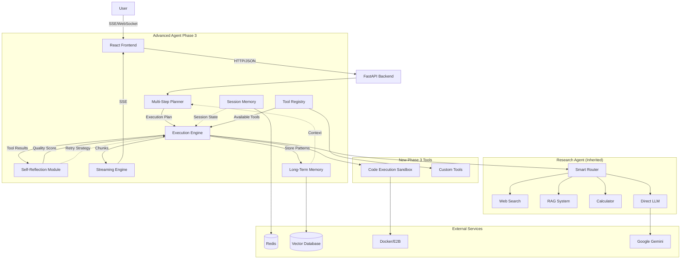
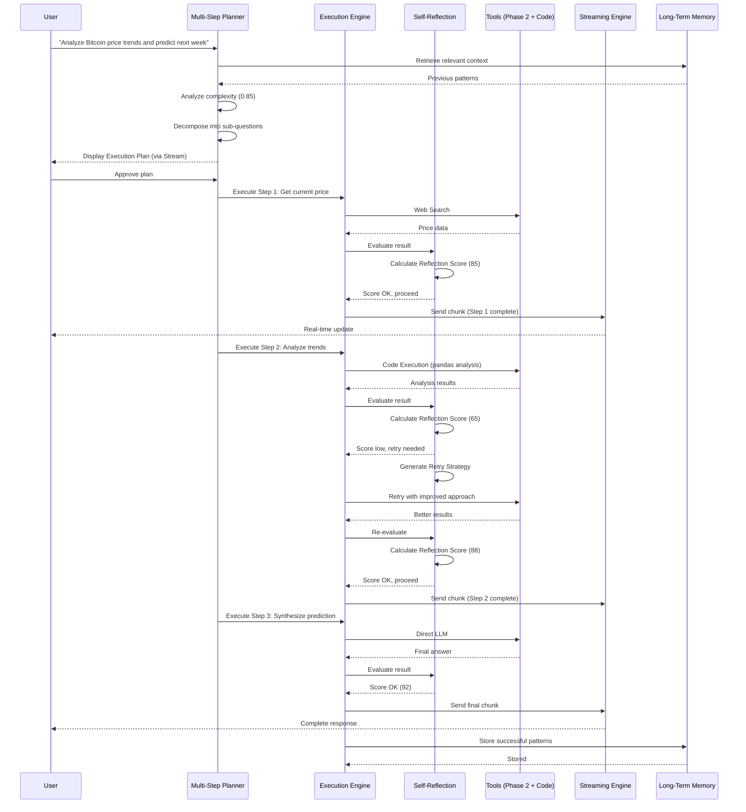
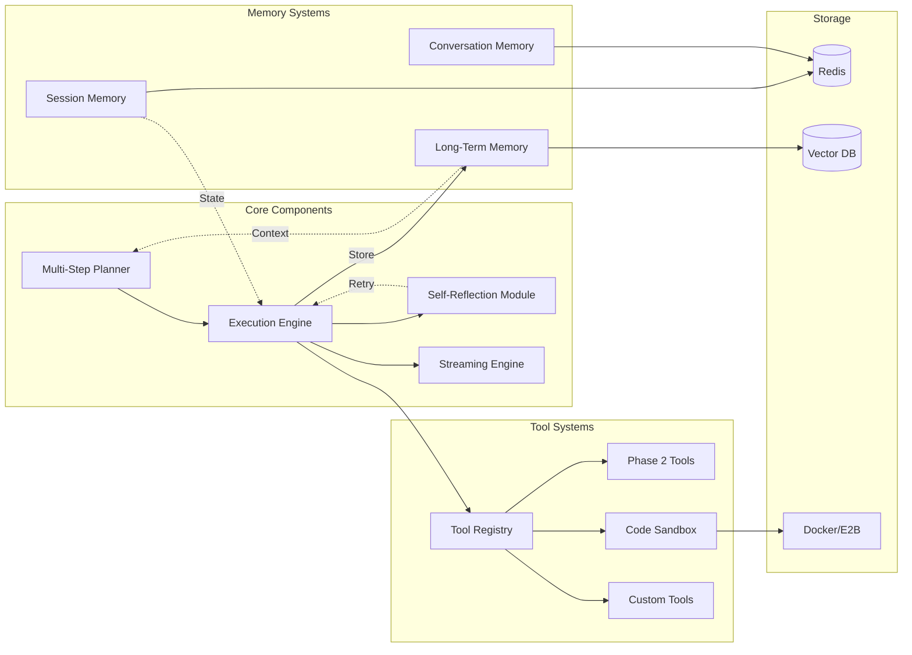

# Tài liệu Thiết kế - Advanced Agent Phase 3

## Tổng quan

Advanced Agent Phase 3 nâng cấp Research Agent (Phase 2) thành một autonomous AI agent với khả năng tự chủ cao hơn. Hệ thống bổ sung self-reflection để tự đánh giá và sửa lỗi, multi-step reasoning để xử lý câu hỏi phức tạp, code execution sandbox để chạy Python code an toàn, streaming responses để cải thiện UX, và advanced memory system để học từ người dùng.

Phase 3 xây dựng trên nền tảng Phase 1 (Multi-Model AI Chat) và Phase 2 (Research Agent), tái sử dụng toàn bộ tools (web search, RAG, calculator), Smart Router, và conversation memory hiện có.

### Mục tiêu thiết kế

- **Self-Reflection**: Agent tự đánh giá chất lượng output và tự động sửa lỗi
- **Multi-Step Reasoning**: Phân tách câu hỏi phức tạp thành các bước nhỏ
- **Safe Code Execution**: Chạy Python code trong môi trường cách ly an toàn
- **Real-Time Streaming**: Gửi responses theo chunks để cải thiện UX
- **Long-Term Memory**: Học từ conversations và user preferences
- **Dynamic Tool Extension**: Đăng ký custom tools mà không cần restart
- **Backward Compatibility**: Hoàn toàn tương thích với Phase 2 API
- **Graceful Degradation**: Tắt advanced features khi dependencies unavailable

### Kiến trúc tổng quan

Phase 3 mở rộng Phase 2 pipeline bằng cách thêm self-reflection loop, multi-step planner, và streaming engine:

```
User Question → Multi-Step Planner → Execution Plan → Tool Execution (with Self-Reflection) → Streaming Response → Long-Term Memory
```

## Kiến trúc

### Architecture Overview




### Data Flow - Complex Query with Self-Reflection



### Component Interaction




## Components và Interfaces

### 1. Self-Reflection Module

**Trách nhiệm**: Đánh giá chất lượng output của agent và phát hiện lỗi để trigger retry.

**Input**:
```python
@dataclass
class ReflectionInput:
    question: str
    answer: str
    tool_used: str
    retrieved_sources: Optional[List[Dict[str, Any]]]
    execution_context: Dict[str, Any]
```

**Output**:
```python
@dataclass
class ErrorPattern:
    pattern_type: str  # "factual_inconsistency", "incomplete_answer", "hallucination", "source_mismatch"
    description: str
    severity: float  # 0.0 to 1.0
    location: Optional[str]  # Where in the answer

@dataclass
class RetryStrategy:
    strategy_type: str  # "refine_query", "use_different_tool", "add_context", "decompose_further"
    instructions: str
    suggested_tool: Optional[str]
    additional_context: Optional[Dict[str, Any]]

@dataclass
class ReflectionResult:
    reflection_score: float  # 0 to 100
    passed: bool  # True if score >= threshold (default 70)
    error_patterns: List[ErrorPattern]
    retry_strategy: Optional[RetryStrategy]
    reasoning: str
    evaluation_time_ms: float
```

**Implementation**:
```python
class SelfReflectionModule:
    SCORE_THRESHOLD = 70
    MAX_RETRIES = 3
    
    def __init__(self, llm: BaseChatModel):
        self.llm = llm
        self.reflection_prompt = self._build_reflection_prompt()
        self.retry_count = {}
    
    async def evaluate(self, reflection_input: ReflectionInput) -> ReflectionResult:
        start_time = time.time()
        
        # Build evaluation prompt
        prompt = self.reflection_prompt.format(
            question=reflection_input.question,
            answer=reflection_input.answer,
            tool_used=reflection_input.tool_used,
            sources=self._format_sources(reflection_input.retrieved_sources)
        )
        
        # Use LLM to evaluate
        response = await self.llm.ainvoke(prompt)
        evaluation = self._parse_evaluation(response.content)
        
        # Calculate reflection score
        reflection_score = evaluation['score']
        passed = reflection_score >= self.SCORE_THRESHOLD
        
        # Detect error patterns if score is low
        error_patterns = []
        retry_strategy = None
        
        if not passed:
            error_patterns = self._detect_error_patterns(
                reflection_input.answer,
                reflection_input.retrieved_sources,
                evaluation
            )
            
            # Generate retry strategy if retries available
            query_key = self._get_query_key(reflection_input.question)
            retry_count = self.retry_count.get(query_key, 0)
            
            if retry_count < self.MAX_RETRIES:
                retry_strategy = self._generate_retry_strategy(
                    error_patterns,
                    reflection_input
                )
                self.retry_count[query_key] = retry_count + 1
            else:
                logger.warning(f"Max retries ({self.MAX_RETRIES}) exhausted for query")
        
        evaluation_time_ms = (time.time() - start_time) * 1000
        
        logger.info(
            "reflection_completed",
            score=reflection_score,
            passed=passed,
            num_errors=len(error_patterns),
            has_retry=retry_strategy is not None,
            evaluation_time_ms=evaluation_time_ms
        )
        
        return ReflectionResult(
            reflection_score=reflection_score,
            passed=passed,
            error_patterns=error_patterns,
            retry_strategy=retry_strategy,
            reasoning=evaluation.get('reasoning', ''),
            evaluation_time_ms=evaluation_time_ms
        )
    
    def _build_reflection_prompt(self) -> ChatPromptTemplate:
        return ChatPromptTemplate.from_messages([
            ("system", """Bạn là một AI evaluator chuyên đánh giá chất lượng câu trả lời.
Đánh giá câu trả lời dựa trên các tiêu chí:
1. Factual Accuracy: Thông tin có chính xác không?
2. Completeness: Câu trả lời có đầy đủ không?
3. Source Consistency: Câu trả lời có khớp với sources không?
4. Relevance: Câu trả lời có liên quan đến câu hỏi không?
5. Hallucination Check: Có thông tin bịa đặt không?

Trả lời theo format JSON:
{{
  "score": 0-100,
  "reasoning": "...",
  "issues": ["issue1", "issue2", ...]
}}"""),
            ("user", """Question: {question}

Answer: {answer}

Tool Used: {tool_used}

Sources: {sources}

Đánh giá câu trả lời:""")
        ])
    
    def _detect_error_patterns(
        self,
        answer: str,
        sources: Optional[List[Dict[str, Any]]],
        evaluation: Dict[str, Any]
    ) -> List[ErrorPattern]:
        patterns = []
        issues = evaluation.get('issues', [])
        
        for issue in issues:
            if 'factual' in issue.lower() or 'incorrect' in issue.lower():
                patterns.append(ErrorPattern(
                    pattern_type="factual_inconsistency",
                    description=issue,
                    severity=0.9,
                    location=None
                ))
            elif 'incomplete' in issue.lower() or 'missing' in issue.lower():
                patterns.append(ErrorPattern(
                    pattern_type="incomplete_answer",
                    description=issue,
                    severity=0.7,
                    location=None
                ))
            elif 'hallucination' in issue.lower() or 'unsupported' in issue.lower():
                patterns.append(ErrorPattern(
                    pattern_type="hallucination",
                    description=issue,
                    severity=0.95,
                    location=None
                ))
            elif 'source' in issue.lower() or 'mismatch' in issue.lower():
                patterns.append(ErrorPattern(
                    pattern_type="source_mismatch",
                    description=issue,
                    severity=0.8,
                    location=None
                ))
        
        return patterns
    
    def _generate_retry_strategy(
        self,
        error_patterns: List[ErrorPattern],
        reflection_input: ReflectionInput
    ) -> RetryStrategy:
        # Determine strategy based on error patterns
        if any(p.pattern_type == "hallucination" for p in error_patterns):
            return RetryStrategy(
                strategy_type="use_different_tool",
                instructions="Use web search or RAG to get factual information",
                suggested_tool="web_search" if reflection_input.tool_used != "web_search" else "rag",
                additional_context=None
            )
        
        elif any(p.pattern_type == "incomplete_answer" for p in error_patterns):
            return RetryStrategy(
                strategy_type="decompose_further",
                instructions="Break down the question into more specific sub-questions",
                suggested_tool=None,
                additional_context={"decompose": True}
            )
        
        elif any(p.pattern_type == "source_mismatch" for p in error_patterns):
            return RetryStrategy(
                strategy_type="refine_query",
                instructions="Refine the query to better match available sources",
                suggested_tool=reflection_input.tool_used,
                additional_context={"refine": True}
            )
        
        else:
            return RetryStrategy(
                strategy_type="add_context",
                instructions="Add more context from conversation history",
                suggested_tool=reflection_input.tool_used,
                additional_context={"add_history": True}
            )
    
    def _get_query_key(self, question: str) -> str:
        return hashlib.md5(question.lower().strip().encode()).hexdigest()
    
    def reset_retry_count(self, question: str):
        query_key = self._get_query_key(question)
        if query_key in self.retry_count:
            del self.retry_count[query_key]
```


### 2. Multi-Step Planner

**Trách nhiệm**: Phân tích câu hỏi phức tạp và tạo execution plan với các bước tuần tự hoặc song song.

**Input**:
```python
@dataclass
class PlannerInput:
    question: str
    conversation_history: List[Message]
    available_tools: List[str]
    user_context: Optional[Dict[str, Any]]
```

**Output**:
```python
@dataclass
class SubQuestion:
    step_id: str
    question: str
    suggested_tool: str
    dependencies: List[str]  # List of step_ids that must complete first
    can_run_parallel: bool

@dataclass
class ExecutionPlan:
    plan_id: str
    original_question: str
    complexity_score: float  # 0.0 to 1.0
    sub_questions: List[SubQuestion]
    requires_approval: bool
    estimated_time_seconds: float
    reasoning: str
```

**Implementation**:
```python
class MultiStepPlanner:
    COMPLEXITY_THRESHOLD = 0.7
    
    def __init__(self, llm: BaseChatModel, memory: LongTermMemory):
        self.llm = llm
        self.memory = memory
        self.planning_prompt = self._build_planning_prompt()
    
    async def analyze_and_plan(self, planner_input: PlannerInput) -> Optional[ExecutionPlan]:
        # Calculate complexity
        complexity = await self._calculate_complexity(planner_input.question)
        
        if complexity < self.COMPLEXITY_THRESHOLD:
            logger.info(f"Question complexity {complexity} below threshold, no planning needed")
            return None
        
        # Retrieve similar patterns from memory
        similar_patterns = await self.memory.retrieve_execution_patterns(
            planner_input.question,
            top_k=3
        )
        
        # Generate plan
        prompt = self.planning_prompt.format(
            question=planner_input.question,
            available_tools=", ".join(planner_input.available_tools),
            similar_patterns=self._format_patterns(similar_patterns),
            history=self._format_history(planner_input.conversation_history)
        )
        
        response = await self.llm.ainvoke(prompt)
        plan_data = self._parse_plan(response.content)
        
        # Build execution plan
        sub_questions = []
        for i, step in enumerate(plan_data['steps']):
            sub_questions.append(SubQuestion(
                step_id=f"step_{i+1}",
                question=step['question'],
                suggested_tool=step['tool'],
                dependencies=step.get('dependencies', []),
                can_run_parallel=step.get('parallel', False)
            ))
        
        plan = ExecutionPlan(
            plan_id=str(uuid.uuid4()),
            original_question=planner_input.question,
            complexity_score=complexity,
            sub_questions=sub_questions,
            requires_approval=plan_data.get('requires_approval', True),
            estimated_time_seconds=self._estimate_time(sub_questions),
            reasoning=plan_data.get('reasoning', '')
        )
        
        logger.info(
            "execution_plan_created",
            plan_id=plan.plan_id,
            num_steps=len(sub_questions),
            complexity=complexity,
            requires_approval=plan.requires_approval
        )
        
        return plan
    
    async def _calculate_complexity(self, question: str) -> float:
        # Use LLM to assess complexity
        complexity_prompt = f"""Đánh giá độ phức tạp của câu hỏi sau trên thang 0.0-1.0:
- 0.0-0.3: Câu hỏi đơn giản, 1 bước
- 0.4-0.6: Câu hỏi trung bình, 2-3 bước
- 0.7-1.0: Câu hỏi phức tạp, cần nhiều bước

Question: {question}

Trả lời chỉ một số từ 0.0 đến 1.0:"""
        
        response = await self.llm.ainvoke(complexity_prompt)
        try:
            complexity = float(response.content.strip())
            return max(0.0, min(1.0, complexity))
        except:
            return 0.5  # Default to medium complexity
    
    def _build_planning_prompt(self) -> ChatPromptTemplate:
        return ChatPromptTemplate.from_messages([
            ("system", """Bạn là một AI planner chuyên phân tách câu hỏi phức tạp thành các bước.

Available Tools:
- web_search: Tìm kiếm thông tin real-time
- rag: Truy xuất từ documents đã upload
- calculator: Tính toán toán học
- code_execution: Chạy Python code để phân tích dữ liệu
- direct_llm: Trả lời từ kiến thức chung

Trả lời theo format JSON:
{{
  "steps": [
    {{
      "question": "...",
      "tool": "...",
      "dependencies": ["step_1", "step_2"],
      "parallel": false
    }}
  ],
  "requires_approval": true,
  "reasoning": "..."
}}"""),
            ("user", """Question: {question}

Available Tools: {available_tools}

Similar Patterns: {similar_patterns}

Conversation History: {history}

Tạo execution plan:""")
        ])
    
    def _estimate_time(self, sub_questions: List[SubQuestion]) -> float:
        # Estimate based on tool types
        tool_times = {
            "web_search": 3.0,
            "rag": 2.0,
            "calculator": 0.5,
            "code_execution": 5.0,
            "direct_llm": 2.0
        }
        
        # Calculate critical path (accounting for parallelization)
        total_time = 0.0
        for sq in sub_questions:
            if not sq.can_run_parallel:
                total_time += tool_times.get(sq.suggested_tool, 2.0)
        
        return total_time
    
    async def replan(
        self,
        original_plan: ExecutionPlan,
        failed_step: SubQuestion,
        error: Exception
    ) -> ExecutionPlan:
        """Replan remaining steps after a failure."""
        logger.info(f"Replanning after step {failed_step.step_id} failed")
        
        # Find remaining steps
        failed_index = next(
            i for i, sq in enumerate(original_plan.sub_questions)
            if sq.step_id == failed_step.step_id
        )
        remaining_steps = original_plan.sub_questions[failed_index + 1:]
        
        # Create new plan for remaining steps
        replan_input = PlannerInput(
            question=f"Continue from: {failed_step.question} (failed). Remaining: {original_plan.original_question}",
            conversation_history=[],
            available_tools=["web_search", "rag", "calculator", "code_execution", "direct_llm"],
            user_context={"failed_step": failed_step.step_id, "error": str(error)}
        )
        
        new_plan = await self.analyze_and_plan(replan_input)
        return new_plan if new_plan else original_plan
```


### 3. Code Execution Sandbox

**Trách nhiệm**: Chạy Python code trong môi trường cách ly an toàn với resource limits.

**Input**:
```python
@dataclass
class CodeExecutionRequest:
    code: str
    language: str = "python"
    timeout_seconds: int = 30
    memory_limit_mb: int = 512
    requires_approval: bool = True
```

**Output**:
```python
@dataclass
class SandboxResult:
    execution_id: str
    success: bool
    stdout: str
    stderr: str
    return_value: Optional[Any]
    execution_time_ms: float
    memory_used_mb: float
    images: List[bytes]  # For matplotlib plots
    error: Optional[str]
```

**Implementation using Docker**:
```python
import docker
import tempfile
import os

class CodeExecutionSandbox:
    TIMEOUT_SECONDS = 30
    MEMORY_LIMIT_MB = 512
    ALLOWED_PACKAGES = [
        "numpy", "pandas", "matplotlib", "scikit-learn",
        "scipy", "seaborn", "plotly"
    ]
    
    BLOCKED_IMPORTS = [
        "os", "sys", "subprocess", "socket", "urllib",
        "requests", "http", "ftplib", "smtplib"
    ]
    
    def __init__(self):
        self.docker_client = docker.from_env()
        self.sandbox_image = "python:3.11-slim"
        self._ensure_image()
    
    def _ensure_image(self):
        """Ensure sandbox image exists with required packages."""
        try:
            self.docker_client.images.get(self.sandbox_image)
        except docker.errors.ImageNotFound:
            logger.info(f"Pulling image {self.sandbox_image}")
            self.docker_client.images.pull(self.sandbox_image)
    
    async def execute(self, request: CodeExecutionRequest) -> SandboxResult:
        execution_id = str(uuid.uuid4())
        start_time = time.time()
        
        # Security check
        if not self._is_safe_code(request.code):
            return SandboxResult(
                execution_id=execution_id,
                success=False,
                stdout="",
                stderr="",
                return_value=None,
                execution_time_ms=0,
                memory_used_mb=0,
                images=[],
                error="Code contains blocked imports or dangerous patterns"
            )
        
        # Create temporary directory for code and output
        with tempfile.TemporaryDirectory() as tmpdir:
            code_file = os.path.join(tmpdir, "script.py")
            output_dir = os.path.join(tmpdir, "output")
            os.makedirs(output_dir)
            
            # Write code to file
            with open(code_file, 'w') as f:
                f.write(self._wrap_code(request.code, output_dir))
            
            try:
                # Run container
                container = self.docker_client.containers.run(
                    self.sandbox_image,
                    command=f"python /code/script.py",
                    volumes={
                        tmpdir: {'bind': '/code', 'mode': 'ro'},
                        output_dir: {'bind': '/output', 'mode': 'rw'}
                    },
                    mem_limit=f"{request.memory_limit_mb}m",
                    network_disabled=True,
                    detach=True,
                    remove=True
                )
                
                # Wait for completion with timeout
                try:
                    result = container.wait(timeout=request.timeout_seconds)
                    logs = container.logs(stdout=True, stderr=True).decode('utf-8')
                    
                    # Parse stdout and stderr
                    stdout, stderr = self._parse_logs(logs)
                    
                    # Get memory usage
                    stats = container.stats(stream=False)
                    memory_used_mb = stats['memory_stats']['usage'] / (1024 * 1024)
                    
                    # Check for images
                    images = self._collect_images(output_dir)
                    
                    execution_time_ms = (time.time() - start_time) * 1000
                    
                    success = result['StatusCode'] == 0
                    
                    logger.info(
                        "code_execution_completed",
                        execution_id=execution_id,
                        success=success,
                        execution_time_ms=execution_time_ms,
                        memory_used_mb=memory_used_mb
                    )
                    
                    return SandboxResult(
                        execution_id=execution_id,
                        success=success,
                        stdout=stdout,
                        stderr=stderr,
                        return_value=None,
                        execution_time_ms=execution_time_ms,
                        memory_used_mb=memory_used_mb,
                        images=images,
                        error=stderr if not success else None
                    )
                
                except docker.errors.ContainerError as e:
                    return SandboxResult(
                        execution_id=execution_id,
                        success=False,
                        stdout="",
                        stderr=str(e),
                        return_value=None,
                        execution_time_ms=(time.time() - start_time) * 1000,
                        memory_used_mb=0,
                        images=[],
                        error=f"Container error: {str(e)}"
                    )
                
                except Exception as e:
                    if "timeout" in str(e).lower():
                        container.stop(timeout=1)
                        return SandboxResult(
                            execution_id=execution_id,
                            success=False,
                            stdout="",
                            stderr="",
                            return_value=None,
                            execution_time_ms=(time.time() - start_time) * 1000,
                            memory_used_mb=0,
                            images=[],
                            error=f"Execution timeout after {request.timeout_seconds}s"
                        )
                    raise
            
            except Exception as e:
                logger.error(f"Code execution failed: {e}")
                return SandboxResult(
                    execution_id=execution_id,
                    success=False,
                    stdout="",
                    stderr="",
                    return_value=None,
                    execution_time_ms=(time.time() - start_time) * 1000,
                    memory_used_mb=0,
                    images=[],
                    error=str(e)
                )
    
    def _is_safe_code(self, code: str) -> bool:
        """Check for dangerous patterns."""
        code_lower = code.lower()
        
        # Check for blocked imports
        for blocked in self.BLOCKED_IMPORTS:
            if f"import {blocked}" in code_lower or f"from {blocked}" in code_lower:
                logger.warning(f"Blocked import detected: {blocked}")
                return False
        
        # Check for dangerous patterns
        dangerous_patterns = [
            "__import__", "eval(", "exec(", "compile(",
            "open(", "file(", "input(", "raw_input("
        ]
        
        for pattern in dangerous_patterns:
            if pattern in code_lower:
                logger.warning(f"Dangerous pattern detected: {pattern}")
                return False
        
        return True
    
    def _wrap_code(self, code: str, output_dir: str) -> str:
        """Wrap user code with matplotlib configuration."""
        wrapper = f"""
import matplotlib
matplotlib.use('Agg')  # Non-interactive backend
import matplotlib.pyplot as plt

# User code
{code}

# Save any open figures
for i, fig in enumerate(plt.get_fignums()):
    plt.figure(fig)
    plt.savefig(f'{output_dir}/plot_{{i}}.png')
plt.close('all')
"""
        return wrapper
    
    def _collect_images(self, output_dir: str) -> List[bytes]:
        """Collect generated images."""
        images = []
        for filename in os.listdir(output_dir):
            if filename.endswith('.png'):
                filepath = os.path.join(output_dir, filename)
                with open(filepath, 'rb') as f:
                    images.append(f.read())
        return images
    
    def _parse_logs(self, logs: str) -> tuple[str, str]:
        """Parse stdout and stderr from logs."""
        # Simple split - in practice, Docker logs are interleaved
        lines = logs.split('\n')
        stdout_lines = [l for l in lines if not l.startswith('ERROR')]
        stderr_lines = [l for l in lines if l.startswith('ERROR')]
        return '\n'.join(stdout_lines), '\n'.join(stderr_lines)
```

**Alternative Implementation using E2B**:
```python
from e2b import Sandbox

class E2BCodeExecutionSandbox:
    def __init__(self, api_key: str):
        self.api_key = api_key
    
    async def execute(self, request: CodeExecutionRequest) -> SandboxResult:
        execution_id = str(uuid.uuid4())
        start_time = time.time()
        
        if not self._is_safe_code(request.code):
            return SandboxResult(
                execution_id=execution_id,
                success=False,
                stdout="",
                stderr="",
                return_value=None,
                execution_time_ms=0,
                memory_used_mb=0,
                images=[],
                error="Code contains blocked imports or dangerous patterns"
            )
        
        try:
            sandbox = Sandbox(api_key=self.api_key, timeout=request.timeout_seconds)
            
            # Execute code
            execution = sandbox.run_code(request.code)
            
            execution_time_ms = (time.time() - start_time) * 1000
            
            return SandboxResult(
                execution_id=execution_id,
                success=not execution.error,
                stdout=execution.stdout,
                stderr=execution.stderr,
                return_value=execution.result,
                execution_time_ms=execution_time_ms,
                memory_used_mb=0,  # E2B doesn't expose this
                images=[],  # Would need to handle separately
                error=execution.error
            )
        
        except Exception as e:
            logger.error(f"E2B execution failed: {e}")
            return SandboxResult(
                execution_id=execution_id,
                success=False,
                stdout="",
                stderr="",
                return_value=None,
                execution_time_ms=(time.time() - start_time) * 1000,
                memory_used_mb=0,
                images=[],
                error=str(e)
            )
        finally:
            sandbox.close()
```


### 4. Streaming Engine

**Trách nhiệm**: Gửi responses theo real-time chunks sử dụng Server-Sent Events (SSE).

**Data Models**:
```python
from enum import Enum

class ChunkType(str, Enum):
    TEXT = "text"
    TOOL_CALL = "tool_call"
    TOOL_RESULT = "tool_result"
    PROGRESS = "progress"
    PLAN = "plan"
    REFLECTION = "reflection"
    ERROR = "error"
    DONE = "done"

@dataclass
class StreamChunk:
    chunk_id: str
    chunk_type: ChunkType
    content: str
    metadata: Optional[Dict[str, Any]]
    timestamp: datetime
    sequence_number: int

@dataclass
class StreamSession:
    session_id: str
    user_id: str
    conversation_id: str
    chunks: List[StreamChunk]
    last_acknowledged: int  # Last sequence number client acknowledged
    created_at: datetime
    expires_at: datetime
```

**Implementation**:
```python
from fastapi import Request
from fastapi.responses import StreamingResponse
from sse_starlette.sse import EventSourceResponse
import asyncio
import json

class StreamingEngine:
    MAX_BUFFER_SIZE = 100
    CHUNK_LATENCY_MS = 100
    SESSION_TTL_SECONDS = 300  # 5 minutes
    
    def __init__(self, redis_client):
        self.redis = redis_client
        self.active_sessions = {}
    
    async def create_session(
        self,
        user_id: str,
        conversation_id: str
    ) -> StreamSession:
        session_id = str(uuid.uuid4())
        session = StreamSession(
            session_id=session_id,
            user_id=user_id,
            conversation_id=conversation_id,
            chunks=[],
            last_acknowledged=0,
            created_at=datetime.utcnow(),
            expires_at=datetime.utcnow() + timedelta(seconds=self.SESSION_TTL_SECONDS)
        )
        
        # Store in Redis for reconnection
        await self.redis.setex(
            f"stream_session:{session_id}",
            self.SESSION_TTL_SECONDS,
            json.dumps(asdict(session), default=str)
        )
        
        self.active_sessions[session_id] = session
        
        logger.info(f"Stream session created: {session_id}")
        return session
    
    async def send_chunk(
        self,
        session_id: str,
        chunk_type: ChunkType,
        content: str,
        metadata: Optional[Dict[str, Any]] = None
    ):
        session = self.active_sessions.get(session_id)
        if not session:
            logger.warning(f"Session {session_id} not found")
            return
        
        chunk = StreamChunk(
            chunk_id=str(uuid.uuid4()),
            chunk_type=chunk_type,
            content=content,
            metadata=metadata or {},
            timestamp=datetime.utcnow(),
            sequence_number=len(session.chunks) + 1
        )
        
        session.chunks.append(chunk)
        
        # Keep only last MAX_BUFFER_SIZE chunks
        if len(session.chunks) > self.MAX_BUFFER_SIZE:
            session.chunks = session.chunks[-self.MAX_BUFFER_SIZE:]
        
        # Update in Redis
        await self.redis.setex(
            f"stream_session:{session_id}",
            self.SESSION_TTL_SECONDS,
            json.dumps(asdict(session), default=str)
        )
        
        logger.debug(
            "chunk_sent",
            session_id=session_id,
            chunk_type=chunk_type,
            sequence=chunk.sequence_number
        )
    
    async def stream_response(
        self,
        session_id: str,
        request: Request
    ) -> EventSourceResponse:
        """SSE endpoint for streaming."""
        
        async def event_generator():
            session = self.active_sessions.get(session_id)
            if not session:
                # Try to restore from Redis
                session = await self._restore_session(session_id)
                if not session:
                    yield {
                        "event": "error",
                        "data": json.dumps({"error": "Session not found"})
                    }
                    return
            
            last_sent = 0
            
            while True:
                # Check if client disconnected
                if await request.is_disconnected():
                    logger.info(f"Client disconnected from session {session_id}")
                    break
                
                # Send new chunks
                new_chunks = [
                    c for c in session.chunks
                    if c.sequence_number > last_sent
                ]
                
                for chunk in new_chunks:
                    yield {
                        "event": chunk.chunk_type.value,
                        "id": str(chunk.sequence_number),
                        "data": json.dumps({
                            "chunk_id": chunk.chunk_id,
                            "content": chunk.content,
                            "metadata": chunk.metadata,
                            "timestamp": chunk.timestamp.isoformat()
                        })
                    }
                    last_sent = chunk.sequence_number
                    
                    # Add latency between chunks
                    await asyncio.sleep(self.CHUNK_LATENCY_MS / 1000)
                
                # Check if done
                if session.chunks and session.chunks[-1].chunk_type == ChunkType.DONE:
                    logger.info(f"Stream completed for session {session_id}")
                    break
                
                # Wait before checking for new chunks
                await asyncio.sleep(0.1)
        
        return EventSourceResponse(event_generator())
    
    async def acknowledge(self, session_id: str, sequence_number: int):
        """Client acknowledges receiving chunks up to sequence_number."""
        session = self.active_sessions.get(session_id)
        if session:
            session.last_acknowledged = sequence_number
            logger.debug(f"Session {session_id} acknowledged up to {sequence_number}")
    
    async def resume_session(
        self,
        session_id: str,
        last_received: int
    ) -> List[StreamChunk]:
        """Resume streaming from last_received sequence number."""
        session = await self._restore_session(session_id)
        if not session:
            return []
        
        # Return chunks after last_received
        missed_chunks = [
            c for c in session.chunks
            if c.sequence_number > last_received
        ]
        
        logger.info(
            f"Resuming session {session_id} from {last_received}, "
            f"sending {len(missed_chunks)} missed chunks"
        )
        
        return missed_chunks
    
    async def _restore_session(self, session_id: str) -> Optional[StreamSession]:
        """Restore session from Redis."""
        data = await self.redis.get(f"stream_session:{session_id}")
        if not data:
            return None
        
        session_dict = json.loads(data)
        session = StreamSession(**session_dict)
        self.active_sessions[session_id] = session
        return session
    
    async def close_session(self, session_id: str):
        """Clean up session."""
        if session_id in self.active_sessions:
            del self.active_sessions[session_id]
        await self.redis.delete(f"stream_session:{session_id}")
        logger.info(f"Stream session closed: {session_id}")
```

**FastAPI Integration**:
```python
from fastapi import APIRouter, Depends

router = APIRouter()

@router.post("/stream/start")
async def start_stream(
    user_id: str,
    conversation_id: str,
    streaming_engine: StreamingEngine = Depends()
):
    session = await streaming_engine.create_session(user_id, conversation_id)
    return {"session_id": session.session_id}

@router.get("/stream/{session_id}")
async def stream_events(
    session_id: str,
    request: Request,
    streaming_engine: StreamingEngine = Depends()
):
    return await streaming_engine.stream_response(session_id, request)

@router.post("/stream/{session_id}/ack")
async def acknowledge_chunks(
    session_id: str,
    sequence_number: int,
    streaming_engine: StreamingEngine = Depends()
):
    await streaming_engine.acknowledge(session_id, sequence_number)
    return {"status": "acknowledged"}

@router.get("/stream/{session_id}/resume")
async def resume_stream(
    session_id: str,
    last_received: int,
    streaming_engine: StreamingEngine = Depends()
):
    chunks = await streaming_engine.resume_session(session_id, last_received)
    return {"chunks": [asdict(c) for c in chunks]}
```


### 5. Long-Term Memory

**Trách nhiệm**: Lưu trữ và truy xuất conversation history, user preferences, và successful patterns.

**Data Models**:
```python
@dataclass
class MemoryEntry:
    entry_id: str
    user_id: str
    entry_type: str  # "conversation_summary", "user_preference", "error_pattern", "execution_pattern"
    content: str
    embedding: List[float]
    metadata: Dict[str, Any]
    relevance_score: float  # Calculated during retrieval
    created_at: datetime
    accessed_count: int

@dataclass
class ConversationSummary:
    conversation_id: str
    user_id: str
    summary: str
    key_topics: List[str]
    tools_used: List[str]
    success_rate: float
    created_at: datetime

@dataclass
class UserPreference:
    user_id: str
    preference_type: str  # "response_style", "tool_preference", "domain_interest"
    value: str
    confidence: float
    learned_from: List[str]  # Conversation IDs
    updated_at: datetime

@dataclass
class ExecutionPattern:
    pattern_id: str
    question_pattern: str
    execution_plan: Dict[str, Any]
    success_count: int
    failure_count: int
    avg_execution_time_ms: float
    created_at: datetime
    last_used: datetime
```

**Implementation**:
```python
class LongTermMemory:
    RELEVANCE_THRESHOLD = 0.6
    MAX_RETRIEVED_ENTRIES = 10
    SUMMARY_TOKEN_THRESHOLD = 10000
    
    def __init__(
        self,
        vector_db: VectorDatabase,
        embedding_service: EmbeddingService,
        redis_client
    ):
        self.vector_db = vector_db
        self.embedding_service = embedding_service
        self.redis = redis_client
    
    async def store_conversation_summary(
        self,
        conversation_id: str,
        user_id: str,
        messages: List[Message]
    ):
        """Summarize and store conversation."""
        # Check if conversation is long enough
        total_tokens = sum(len(m.content.split()) for m in messages)
        if total_tokens < self.SUMMARY_TOKEN_THRESHOLD:
            return
        
        # Generate summary using LLM
        summary = await self._generate_summary(messages)
        
        # Extract key topics
        key_topics = await self._extract_topics(summary)
        
        # Extract tools used
        tools_used = self._extract_tools_used(messages)
        
        # Calculate success rate
        success_rate = self._calculate_success_rate(messages)
        
        # Create summary object
        conv_summary = ConversationSummary(
            conversation_id=conversation_id,
            user_id=user_id,
            summary=summary,
            key_topics=key_topics,
            tools_used=tools_used,
            success_rate=success_rate,
            created_at=datetime.utcnow()
        )
        
        # Generate embedding
        embedding = await self.embedding_service.embed_query(summary)
        
        # Store in vector database
        entry = MemoryEntry(
            entry_id=str(uuid.uuid4()),
            user_id=user_id,
            entry_type="conversation_summary",
            content=summary,
            embedding=embedding,
            metadata=asdict(conv_summary),
            relevance_score=0.0,
            created_at=datetime.utcnow(),
            accessed_count=0
        )
        
        await self._store_entry(entry)
        
        logger.info(
            "conversation_summary_stored",
            conversation_id=conversation_id,
            user_id=user_id,
            num_topics=len(key_topics)
        )
    
    async def store_user_preference(
        self,
        user_id: str,
        preference_type: str,
        value: str,
        confidence: float,
        conversation_id: str
    ):
        """Store learned user preference."""
        # Check if preference already exists
        existing = await self._get_user_preference(user_id, preference_type)
        
        if existing:
            # Update existing preference
            existing.value = value
            existing.confidence = max(existing.confidence, confidence)
            existing.learned_from.append(conversation_id)
            existing.updated_at = datetime.utcnow()
            await self._update_preference(existing)
        else:
            # Create new preference
            preference = UserPreference(
                user_id=user_id,
                preference_type=preference_type,
                value=value,
                confidence=confidence,
                learned_from=[conversation_id],
                updated_at=datetime.utcnow()
            )
            
            # Store in Redis (preferences are small, don't need vector search)
            await self.redis.hset(
                f"user_preferences:{user_id}",
                preference_type,
                json.dumps(asdict(preference), default=str)
            )
        
        logger.info(
            "user_preference_stored",
            user_id=user_id,
            preference_type=preference_type,
            confidence=confidence
        )
    
    async def store_error_pattern(
        self,
        error_pattern: ErrorPattern,
        retry_strategy: RetryStrategy,
        success: bool
    ):
        """Store error pattern and retry strategy for learning."""
        pattern_key = f"{error_pattern.pattern_type}:{error_pattern.description}"
        
        # Get existing pattern stats
        stats = await self.redis.hgetall(f"error_pattern:{pattern_key}")
        
        if stats:
            success_count = int(stats.get('success_count', 0))
            failure_count = int(stats.get('failure_count', 0))
        else:
            success_count = 0
            failure_count = 0
        
        # Update stats
        if success:
            success_count += 1
        else:
            failure_count += 1
        
        # Store updated stats
        await self.redis.hset(
            f"error_pattern:{pattern_key}",
            mapping={
                'pattern_type': error_pattern.pattern_type,
                'description': error_pattern.description,
                'retry_strategy': json.dumps(asdict(retry_strategy)),
                'success_count': success_count,
                'failure_count': failure_count,
                'success_rate': success_count / (success_count + failure_count),
                'last_updated': datetime.utcnow().isoformat()
            }
        )
        
        logger.info(
            "error_pattern_stored",
            pattern_type=error_pattern.pattern_type,
            success=success,
            success_rate=success_count / (success_count + failure_count)
        )
    
    async def store_execution_pattern(
        self,
        question: str,
        execution_plan: ExecutionPlan,
        execution_time_ms: float,
        success: bool
    ):
        """Store successful execution patterns."""
        # Generate pattern key from question
        pattern_key = await self._generate_pattern_key(question)
        
        # Get existing pattern
        pattern_data = await self.redis.get(f"execution_pattern:{pattern_key}")
        
        if pattern_data:
            pattern = ExecutionPattern(**json.loads(pattern_data))
            pattern.success_count += 1 if success else 0
            pattern.failure_count += 0 if success else 1
            # Update average execution time
            total_executions = pattern.success_count + pattern.failure_count
            pattern.avg_execution_time_ms = (
                (pattern.avg_execution_time_ms * (total_executions - 1) + execution_time_ms)
                / total_executions
            )
            pattern.last_used = datetime.utcnow()
        else:
            pattern = ExecutionPattern(
                pattern_id=str(uuid.uuid4()),
                question_pattern=pattern_key,
                execution_plan=asdict(execution_plan),
                success_count=1 if success else 0,
                failure_count=0 if success else 1,
                avg_execution_time_ms=execution_time_ms,
                created_at=datetime.utcnow(),
                last_used=datetime.utcnow()
            )
        
        # Store pattern
        await self.redis.setex(
            f"execution_pattern:{pattern_key}",
            86400 * 30,  # 30 days TTL
            json.dumps(asdict(pattern), default=str)
        )
        
        logger.info(
            "execution_pattern_stored",
            pattern_key=pattern_key,
            success=success,
            success_rate=pattern.success_count / (pattern.success_count + pattern.failure_count)
        )
    
    async def retrieve_relevant_context(
        self,
        query: str,
        user_id: str,
        top_k: int = 10
    ) -> List[MemoryEntry]:
        """Retrieve relevant memory entries for current query."""
        # Generate query embedding
        query_embedding = await self.embedding_service.embed_query(query)
        
        # Search in vector database
        results = await self.vector_db.similarity_search(
            query_embedding=query_embedding,
            top_k=top_k * 2,  # Get more, then filter
            user_id=user_id,
            collection="long_term_memory"
        )
        
        # Filter by relevance threshold
        relevant_entries = [
            entry for entry in results
            if entry.relevance_score >= self.RELEVANCE_THRESHOLD
        ]
        
        # Limit to top_k
        relevant_entries = relevant_entries[:top_k]
        
        # Update access count
        for entry in relevant_entries:
            entry.accessed_count += 1
            await self._update_entry_access(entry.entry_id)
        
        logger.info(
            "context_retrieved",
            query=query[:100],
            num_results=len(relevant_entries),
            user_id=user_id
        )
        
        return relevant_entries
    
    async def retrieve_execution_patterns(
        self,
        question: str,
        top_k: int = 3
    ) -> List[ExecutionPattern]:
        """Retrieve similar execution patterns."""
        pattern_key = await self._generate_pattern_key(question)
        
        # Get all execution patterns (in practice, use vector search)
        pattern_keys = await self.redis.keys("execution_pattern:*")
        patterns = []
        
        for key in pattern_keys[:top_k]:
            data = await self.redis.get(key)
            if data:
                pattern = ExecutionPattern(**json.loads(data))
                # Calculate similarity (simplified)
                similarity = self._calculate_pattern_similarity(pattern_key, pattern.question_pattern)
                if similarity > 0.7:
                    patterns.append(pattern)
        
        # Sort by success rate and recency
        patterns.sort(
            key=lambda p: (
                p.success_count / (p.success_count + p.failure_count),
                p.last_used
            ),
            reverse=True
        )
        
        return patterns[:top_k]
    
    async def get_user_preferences(self, user_id: str) -> Dict[str, UserPreference]:
        """Get all preferences for a user."""
        prefs_data = await self.redis.hgetall(f"user_preferences:{user_id}")
        preferences = {}
        
        for pref_type, pref_json in prefs_data.items():
            preferences[pref_type] = UserPreference(**json.loads(pref_json))
        
        return preferences
    
    async def suggest_retry_strategy(
        self,
        error_pattern: ErrorPattern
    ) -> Optional[RetryStrategy]:
        """Suggest retry strategy based on past successes."""
        pattern_key = f"{error_pattern.pattern_type}:{error_pattern.description}"
        stats = await self.redis.hgetall(f"error_pattern:{pattern_key}")
        
        if not stats:
            return None
        
        success_rate = float(stats.get('success_rate', 0))
        if success_rate < 0.5:
            return None  # Don't suggest if success rate is low
        
        retry_strategy_json = stats.get('retry_strategy')
        if retry_strategy_json:
            return RetryStrategy(**json.loads(retry_strategy_json))
        
        return None
    
    async def _store_entry(self, entry: MemoryEntry):
        """Store memory entry in vector database."""
        await self.vector_db.add_documents(
            document_id=entry.entry_id,
            chunks=[entry.content],
            embeddings=[entry.embedding],
            metadata={
                "user_id": entry.user_id,
                "entry_type": entry.entry_type,
                "created_at": entry.created_at.isoformat(),
                **entry.metadata
            },
            collection="long_term_memory"
        )
    
    async def _generate_pattern_key(self, question: str) -> str:
        """Generate a pattern key from question."""
        # Simplified: use first 50 chars, lowercase, remove punctuation
        import re
        cleaned = re.sub(r'[^\w\s]', '', question.lower())
        return cleaned[:50].strip()
    
    def _calculate_pattern_similarity(self, pattern1: str, pattern2: str) -> float:
        """Calculate similarity between two patterns."""
        # Simplified: Jaccard similarity
        words1 = set(pattern1.split())
        words2 = set(pattern2.split())
        intersection = words1.intersection(words2)
        union = words1.union(words2)
        return len(intersection) / len(union) if union else 0.0
```


### 6. Tool Registry

**Trách nhiệm**: Quản lý và đăng ký dynamic tools, hỗ trợ tool composition.

**Data Models**:
```python
@dataclass
class ToolParameter:
    name: str
    type: str  # "string", "number", "boolean", "object", "array"
    description: str
    required: bool
    default: Optional[Any] = None

@dataclass
class ToolDefinition:
    tool_id: str
    name: str
    version: str  # Semantic version
    description: str
    parameters: List[ToolParameter]
    execution_function: Callable
    timeout_seconds: int = 60
    requires_auth: bool = False
    auth_credentials: Optional[Dict[str, str]] = None
    created_at: datetime
    updated_at: datetime
    execution_count: int = 0
    failure_count: int = 0

@dataclass
class ToolComposition:
    composition_id: str
    name: str
    description: str
    tools: List[str]  # Tool IDs in execution order
    data_flow: Dict[str, str]  # Map output of tool N to input of tool N+1
    created_at: datetime
```

**Implementation**:
```python
import semver
from typing import Callable

class ToolRegistry:
    MAX_TIMEOUT_SECONDS = 60
    MAX_FAILURES_BEFORE_DISABLE = 10
    
    def __init__(self, redis_client):
        self.redis = redis_client
        self.tools = {}  # In-memory cache
        self.compositions = {}
    
    async def register_tool(
        self,
        name: str,
        version: str,
        description: str,
        parameters: List[ToolParameter],
        execution_function: Callable,
        timeout_seconds: int = 60,
        requires_auth: bool = False,
        auth_credentials: Optional[Dict[str, str]] = None
    ) -> ToolDefinition:
        """Register a new custom tool."""
        # Validate version format
        try:
            semver.VersionInfo.parse(version)
        except ValueError:
            raise ValueError(f"Invalid semantic version: {version}")
        
        # Validate timeout
        if timeout_seconds > self.MAX_TIMEOUT_SECONDS:
            raise ValueError(f"Timeout exceeds maximum: {self.MAX_TIMEOUT_SECONDS}s")
        
        # Validate parameters schema
        self._validate_parameters(parameters)
        
        # Create tool definition
        tool_id = f"{name}:{version}"
        tool = ToolDefinition(
            tool_id=tool_id,
            name=name,
            version=version,
            description=description,
            parameters=parameters,
            execution_function=execution_function,
            timeout_seconds=timeout_seconds,
            requires_auth=requires_auth,
            auth_credentials=auth_credentials,
            created_at=datetime.utcnow(),
            updated_at=datetime.utcnow(),
            execution_count=0,
            failure_count=0
        )
        
        # Store in memory
        self.tools[tool_id] = tool
        
        # Store metadata in Redis (not the function)
        tool_metadata = {
            k: v for k, v in asdict(tool).items()
            if k != 'execution_function' and k != 'auth_credentials'
        }
        await self.redis.hset(
            "tool_registry",
            tool_id,
            json.dumps(tool_metadata, default=str)
        )
        
        logger.info(
            "tool_registered",
            tool_id=tool_id,
            name=name,
            version=version
        )
        
        return tool
    
    async def get_tool(
        self,
        name: str,
        version: Optional[str] = None
    ) -> Optional[ToolDefinition]:
        """Get tool by name and optional version."""
        if version:
            tool_id = f"{name}:{version}"
            return self.tools.get(tool_id)
        else:
            # Get latest version
            matching_tools = [
                t for t in self.tools.values()
                if t.name == name
            ]
            if not matching_tools:
                return None
            
            # Sort by version
            matching_tools.sort(
                key=lambda t: semver.VersionInfo.parse(t.version),
                reverse=True
            )
            return matching_tools[0]
    
    async def list_tools(self) -> List[ToolDefinition]:
        """List all registered tools."""
        return list(self.tools.values())
    
    async def get_tool_schema(self, tool_id: str) -> Dict[str, Any]:
        """Get tool schema for LLM."""
        tool = self.tools.get(tool_id)
        if not tool:
            return {}
        
        return {
            "name": tool.name,
            "description": tool.description,
            "parameters": {
                "type": "object",
                "properties": {
                    param.name: {
                        "type": param.type,
                        "description": param.description
                    }
                    for param in tool.parameters
                },
                "required": [p.name for p in tool.parameters if p.required]
            }
        }
    
    async def execute_tool(
        self,
        tool_id: str,
        parameters: Dict[str, Any],
        auth_context: Optional[Dict[str, str]] = None
    ) -> Any:
        """Execute a registered tool."""
        tool = self.tools.get(tool_id)
        if not tool:
            raise ValueError(f"Tool not found: {tool_id}")
        
        # Check if tool is disabled
        if tool.failure_count >= self.MAX_FAILURES_BEFORE_DISABLE:
            raise ValueError(f"Tool disabled due to repeated failures: {tool_id}")
        
        # Validate parameters
        self._validate_tool_parameters(tool, parameters)
        
        # Check authentication
        if tool.requires_auth and not auth_context:
            raise ValueError(f"Tool requires authentication: {tool_id}")
        
        start_time = time.time()
        
        try:
            # Execute with timeout
            result = await asyncio.wait_for(
                tool.execution_function(**parameters),
                timeout=tool.timeout_seconds
            )
            
            # Update stats
            tool.execution_count += 1
            tool.updated_at = datetime.utcnow()
            await self._update_tool_stats(tool_id, success=True)
            
            execution_time_ms = (time.time() - start_time) * 1000
            
            logger.info(
                "tool_executed",
                tool_id=tool_id,
                execution_time_ms=execution_time_ms,
                success=True
            )
            
            return result
        
        except asyncio.TimeoutError:
            tool.failure_count += 1
            await self._update_tool_stats(tool_id, success=False)
            logger.error(f"Tool execution timeout: {tool_id}")
            raise
        
        except Exception as e:
            tool.failure_count += 1
            await self._update_tool_stats(tool_id, success=False)
            logger.error(f"Tool execution failed: {tool_id}, error: {e}")
            
            # Disable tool if too many failures
            if tool.failure_count >= self.MAX_FAILURES_BEFORE_DISABLE:
                await self._disable_tool(tool_id)
            
            raise
    
    async def create_composition(
        self,
        name: str,
        description: str,
        tools: List[str],
        data_flow: Dict[str, str]
    ) -> ToolComposition:
        """Create a tool composition."""
        # Validate all tools exist
        for tool_id in tools:
            if tool_id not in self.tools:
                raise ValueError(f"Tool not found in composition: {tool_id}")
        
        # Validate data flow
        self._validate_data_flow(tools, data_flow)
        
        composition = ToolComposition(
            composition_id=str(uuid.uuid4()),
            name=name,
            description=description,
            tools=tools,
            data_flow=data_flow,
            created_at=datetime.utcnow()
        )
        
        self.compositions[composition.composition_id] = composition
        
        # Store in Redis
        await self.redis.hset(
            "tool_compositions",
            composition.composition_id,
            json.dumps(asdict(composition), default=str)
        )
        
        logger.info(
            "tool_composition_created",
            composition_id=composition.composition_id,
            num_tools=len(tools)
        )
        
        return composition
    
    async def execute_composition(
        self,
        composition_id: str,
        initial_input: Dict[str, Any]
    ) -> Any:
        """Execute a tool composition."""
        composition = self.compositions.get(composition_id)
        if not composition:
            raise ValueError(f"Composition not found: {composition_id}")
        
        current_output = initial_input
        
        for i, tool_id in enumerate(composition.tools):
            # Map output from previous tool to input for current tool
            if i > 0:
                prev_tool_id = composition.tools[i - 1]
                mapping_key = f"{prev_tool_id}->{tool_id}"
                if mapping_key in composition.data_flow:
                    output_field = composition.data_flow[mapping_key].split("->")[0]
                    input_field = composition.data_flow[mapping_key].split("->")[1]
                    current_output = {input_field: current_output.get(output_field)}
            
            # Execute tool
            current_output = await self.execute_tool(tool_id, current_output)
        
        return current_output
    
    def _validate_parameters(self, parameters: List[ToolParameter]):
        """Validate parameter definitions."""
        valid_types = ["string", "number", "boolean", "object", "array"]
        for param in parameters:
            if param.type not in valid_types:
                raise ValueError(f"Invalid parameter type: {param.type}")
    
    def _validate_tool_parameters(
        self,
        tool: ToolDefinition,
        parameters: Dict[str, Any]
    ):
        """Validate parameters match tool definition."""
        for param in tool.parameters:
            if param.required and param.name not in parameters:
                raise ValueError(f"Missing required parameter: {param.name}")
    
    def _validate_data_flow(self, tools: List[str], data_flow: Dict[str, str]):
        """Validate data flow between tools."""
        for i in range(len(tools) - 1):
            mapping_key = f"{tools[i]}->{tools[i+1]}"
            if mapping_key not in data_flow:
                raise ValueError(f"Missing data flow mapping: {mapping_key}")
    
    async def _update_tool_stats(self, tool_id: str, success: bool):
        """Update tool execution statistics."""
        await self.redis.hincrby(f"tool_stats:{tool_id}", "execution_count", 1)
        if not success:
            await self.redis.hincrby(f"tool_stats:{tool_id}", "failure_count", 1)
    
    async def _disable_tool(self, tool_id: str):
        """Disable a tool due to repeated failures."""
        await self.redis.hset("disabled_tools", tool_id, datetime.utcnow().isoformat())
        logger.warning(f"Tool disabled: {tool_id}")
        
        # Notify administrators
        # TODO: Send alert
```


### 7. Advanced Execution Engine

**Trách nhiệm**: Orchestrate execution với self-reflection loop và multi-step planning.

**Implementation**:
```python
class AdvancedExecutionEngine:
    def __init__(
        self,
        multi_step_planner: MultiStepPlanner,
        self_reflection: SelfReflectionModule,
        tool_registry: ToolRegistry,
        streaming_engine: StreamingEngine,
        long_term_memory: LongTermMemory,
        research_orchestrator: ResearchOrchestrator  # From Phase 2
    ):
        self.planner = multi_step_planner
        self.reflection = self_reflection
        self.tool_registry = tool_registry
        self.streaming = streaming_engine
        self.memory = long_term_memory
        self.research = research_orchestrator
    
    async def execute_query(
        self,
        question: str,
        user_id: str,
        conversation_id: str,
        session_id: str
    ) -> Dict[str, Any]:
        """Execute query with advanced features."""
        start_time = time.time()
        
        # Retrieve relevant context from long-term memory
        context = await self.memory.retrieve_relevant_context(
            query=question,
            user_id=user_id,
            top_k=5
        )
        
        # Send context to stream
        if context:
            await self.streaming.send_chunk(
                session_id,
                ChunkType.PROGRESS,
                f"Retrieved {len(context)} relevant memories",
                {"context_count": len(context)}
            )
        
        # Check if multi-step planning is needed
        plan = await self.planner.analyze_and_plan(PlannerInput(
            question=question,
            conversation_history=[],
            available_tools=await self._get_available_tools(),
            user_context={"user_id": user_id}
        ))
        
        if plan:
            # Send plan to user for approval
            await self.streaming.send_chunk(
                session_id,
                ChunkType.PLAN,
                json.dumps(asdict(plan)),
                {"requires_approval": plan.requires_approval}
            )
            
            if plan.requires_approval:
                # Wait for user approval (simplified)
                # In practice, would wait for approval via separate endpoint
                pass
            
            # Execute multi-step plan
            result = await self._execute_plan(plan, session_id, user_id, conversation_id)
        else:
            # Execute single-step query
            result = await self._execute_single_step(
                question,
                session_id,
                user_id,
                conversation_id
            )
        
        # Store execution pattern
        execution_time_ms = (time.time() - start_time) * 1000
        if plan:
            await self.memory.store_execution_pattern(
                question=question,
                execution_plan=plan,
                execution_time_ms=execution_time_ms,
                success=result['success']
            )
        
        # Send final chunk
        await self.streaming.send_chunk(
            session_id,
            ChunkType.DONE,
            "",
            {"execution_time_ms": execution_time_ms}
        )
        
        return result
    
    async def _execute_plan(
        self,
        plan: ExecutionPlan,
        session_id: str,
        user_id: str,
        conversation_id: str
    ) -> Dict[str, Any]:
        """Execute multi-step plan."""
        results = {}
        
        for sub_question in plan.sub_questions:
            # Check dependencies
            if not self._dependencies_met(sub_question, results):
                logger.warning(f"Dependencies not met for {sub_question.step_id}")
                continue
            
            # Send progress
            await self.streaming.send_chunk(
                session_id,
                ChunkType.PROGRESS,
                f"Executing step: {sub_question.question}",
                {"step_id": sub_question.step_id}
            )
            
            try:
                # Execute step with self-reflection
                step_result = await self._execute_step_with_reflection(
                    sub_question,
                    session_id,
                    user_id,
                    conversation_id
                )
                
                results[sub_question.step_id] = step_result
                
                # Send step completion
                await self.streaming.send_chunk(
                    session_id,
                    ChunkType.PROGRESS,
                    f"Step completed: {sub_question.step_id}",
                    {"step_id": sub_question.step_id, "success": True}
                )
            
            except Exception as e:
                logger.error(f"Step {sub_question.step_id} failed: {e}")
                
                # Attempt to replan
                new_plan = await self.planner.replan(plan, sub_question, e)
                if new_plan:
                    # Continue with new plan
                    return await self._execute_plan(
                        new_plan,
                        session_id,
                        user_id,
                        conversation_id
                    )
                else:
                    # Cannot recover
                    return {
                        "success": False,
                        "error": f"Step {sub_question.step_id} failed and cannot replan",
                        "partial_results": results
                    }
        
        # Synthesize final answer
        final_answer = await self._synthesize_results(plan.original_question, results)
        
        return {
            "success": True,
            "answer": final_answer,
            "plan": asdict(plan),
            "step_results": results
        }
    
    async def _execute_step_with_reflection(
        self,
        sub_question: SubQuestion,
        session_id: str,
        user_id: str,
        conversation_id: str
    ) -> Dict[str, Any]:
        """Execute a single step with self-reflection loop."""
        max_attempts = 3
        
        for attempt in range(max_attempts):
            # Execute using Research Orchestrator (Phase 2)
            result = await self.research.execute(
                question=sub_question.question,
                conversation_id=conversation_id,
                user_id=user_id
            )
            
            # Self-reflection
            reflection_result = await self.reflection.evaluate(ReflectionInput(
                question=sub_question.question,
                answer=result.answer,
                tool_used=result.tools_used[0].tool_name if result.tools_used else "unknown",
                retrieved_sources=result.citations,
                execution_context={}
            ))
            
            # Send reflection to stream
            await self.streaming.send_chunk(
                session_id,
                ChunkType.REFLECTION,
                json.dumps({
                    "score": reflection_result.reflection_score,
                    "passed": reflection_result.passed,
                    "attempt": attempt + 1
                }),
                {"step_id": sub_question.step_id}
            )
            
            if reflection_result.passed:
                # Success
                return {
                    "answer": result.answer,
                    "citations": result.citations,
                    "reflection_score": reflection_result.reflection_score,
                    "attempts": attempt + 1
                }
            
            # Failed reflection
            if attempt < max_attempts - 1 and reflection_result.retry_strategy:
                # Store error pattern
                if reflection_result.error_patterns:
                    for error_pattern in reflection_result.error_patterns:
                        await self.memory.store_error_pattern(
                            error_pattern,
                            reflection_result.retry_strategy,
                            success=False
                        )
                
                # Apply retry strategy
                logger.info(
                    f"Retrying with strategy: {reflection_result.retry_strategy.strategy_type}"
                )
                
                # Modify sub_question based on retry strategy
                if reflection_result.retry_strategy.suggested_tool:
                    sub_question.suggested_tool = reflection_result.retry_strategy.suggested_tool
            else:
                # Max attempts reached
                logger.warning(f"Max reflection attempts reached for {sub_question.step_id}")
                return {
                    "answer": result.answer,
                    "citations": result.citations,
                    "reflection_score": reflection_result.reflection_score,
                    "attempts": attempt + 1,
                    "warning": "Quality below threshold after max retries"
                }
        
        # Should not reach here
        raise Exception("Unexpected execution path")
    
    async def _execute_single_step(
        self,
        question: str,
        session_id: str,
        user_id: str,
        conversation_id: str
    ) -> Dict[str, Any]:
        """Execute single-step query with reflection."""
        sub_question = SubQuestion(
            step_id="single_step",
            question=question,
            suggested_tool="auto",
            dependencies=[],
            can_run_parallel=False
        )
        
        result = await self._execute_step_with_reflection(
            sub_question,
            session_id,
            user_id,
            conversation_id
        )
        
        return {
            "success": True,
            "answer": result["answer"],
            "citations": result["citations"],
            "reflection_score": result["reflection_score"]
        }
    
    def _dependencies_met(
        self,
        sub_question: SubQuestion,
        results: Dict[str, Any]
    ) -> bool:
        """Check if all dependencies are met."""
        return all(dep in results for dep in sub_question.dependencies)
    
    async def _synthesize_results(
        self,
        original_question: str,
        results: Dict[str, Any]
    ) -> str:
        """Synthesize final answer from step results."""
        # Combine all step answers
        combined = "\n\n".join([
            f"Step {step_id}: {result['answer']}"
            for step_id, result in results.items()
        ])
        
        # Use LLM to synthesize
        synthesis_prompt = f"""Original Question: {original_question}

Step Results:
{combined}

Synthesize a coherent final answer:"""
        
        # Use direct LLM (simplified)
        # In practice, would use proper LLM service
        return combined
    
    async def _get_available_tools(self) -> List[str]:
        """Get list of available tools."""
        tools = await self.tool_registry.list_tools()
        return [t.name for t in tools] + ["web_search", "rag", "calculator", "code_execution", "direct_llm"]
```


## Data Models

### Request/Response Schemas

**AdvancedChatRequest** (extends ResearchChatRequest):
```python
from pydantic import BaseModel, Field

class AdvancedChatRequest(BaseModel):
    message: str = Field(..., description="User question")
    conversation_id: Optional[str] = Field(None, description="Conversation ID")
    user_id: str = Field(..., description="User ID for memory and personalization")
    model: Optional[str] = Field(None, description="AI model to use")
    enable_streaming: bool = Field(True, description="Enable streaming responses")
    enable_reflection: bool = Field(True, description="Enable self-reflection")
    enable_planning: bool = Field(True, description="Enable multi-step planning")
    enable_memory: bool = Field(True, description="Enable long-term memory")
```

**AdvancedChatResponse**:
```python
class ReflectionMeta(BaseModel):
    reflection_score: float
    passed: bool
    attempts: int
    error_patterns: List[Dict[str, Any]]

class PlanMeta(BaseModel):
    plan_id: Optional[str]
    complexity_score: float
    num_steps: int
    estimated_time_seconds: float

class AdvancedMeta(BaseModel):
    provider: str
    model: str
    question_category: Optional[str]
    tools_used: List[Dict[str, Any]]
    reflection: Optional[ReflectionMeta]
    plan: Optional[PlanMeta]
    execution_time_ms: float
    memory_entries_used: int

class AdvancedChatResponse(BaseModel):
    request_id: str
    conversation_id: str
    session_id: Optional[str]  # For streaming
    status: str  # "ok", "error", "streaming"
    answer: str
    citations: List[Dict[str, Any]]
    error: Optional[Dict[str, Any]]
    meta: AdvancedMeta
```

**CodeExecutionRequest**:
```python
class CodeExecutionRequest(BaseModel):
    code: str = Field(..., description="Python code to execute")
    language: str = Field("python", description="Programming language")
    timeout_seconds: int = Field(30, description="Execution timeout")
    requires_approval: bool = Field(True, description="Require user approval")
```

**CodeExecutionResponse**:
```python
class CodeExecutionResponse(BaseModel):
    execution_id: str
    success: bool
    stdout: str
    stderr: str
    execution_time_ms: float
    memory_used_mb: float
    images: List[str]  # Base64 encoded images
    error: Optional[str]
```

**ToolRegistrationRequest**:
```python
class ToolParameterSchema(BaseModel):
    name: str
    type: str
    description: str
    required: bool
    default: Optional[Any] = None

class ToolRegistrationRequest(BaseModel):
    name: str
    version: str
    description: str
    parameters: List[ToolParameterSchema]
    endpoint_url: str  # URL to call for execution
    timeout_seconds: int = 60
    requires_auth: bool = False
```

**ToolRegistrationResponse**:
```python
class ToolRegistrationResponse(BaseModel):
    tool_id: str
    name: str
    version: str
    status: str  # "registered", "failed"
    error: Optional[str]
```

## API Endpoints

### POST /advanced/chat

Enhanced chat endpoint với advanced features.

**Request**:
```json
{
  "message": "Analyze Bitcoin price trends over the last month and predict next week",
  "conversation_id": "conv_123",
  "user_id": "user_456",
  "model": "gemini-1.5-pro",
  "enable_streaming": true,
  "enable_reflection": true,
  "enable_planning": true,
  "enable_memory": true
}
```

**Response (Non-Streaming - HTTP 200)**:
```json
{
  "request_id": "req_789",
  "conversation_id": "conv_123",
  "session_id": null,
  "status": "ok",
  "answer": "Based on analysis of Bitcoin price data...",
  "citations": [
    {
      "source_type": "web",
      "title": "Bitcoin Price Analysis",
      "url": "https://example.com/btc"
    }
  ],
  "error": null,
  "meta": {
    "provider": "google",
    "model": "gemini-1.5-pro",
    "question_category": "real_time_info",
    "tools_used": [
      {
        "tool_name": "web_search",
        "execution_time_ms": 1250.5,
        "success": true
      },
      {
        "tool_name": "code_execution",
        "execution_time_ms": 3500.2,
        "success": true
      }
    ],
    "reflection": {
      "reflection_score": 88.5,
      "passed": true,
      "attempts": 2,
      "error_patterns": []
    },
    "plan": {
      "plan_id": "plan_abc123",
      "complexity_score": 0.85,
      "num_steps": 3,
      "estimated_time_seconds": 10.5
    },
    "execution_time_ms": 8750.3,
    "memory_entries_used": 3
  }
}
```

**Response (Streaming - HTTP 200)**:
```json
{
  "request_id": "req_789",
  "conversation_id": "conv_123",
  "session_id": "stream_xyz789",
  "status": "streaming",
  "answer": "",
  "citations": [],
  "error": null,
  "meta": {
    "provider": "google",
    "model": "gemini-1.5-pro",
    "question_category": null,
    "tools_used": [],
    "reflection": null,
    "plan": null,
    "execution_time_ms": 0,
    "memory_entries_used": 0
  }
}
```

### GET /advanced/stream/{session_id}

SSE endpoint for streaming responses.

**Response (SSE Stream)**:
```
event: progress
id: 1
data: {"chunk_id": "chunk_1", "content": "Retrieved 3 relevant memories", "metadata": {"context_count": 3}, "timestamp": "2024-01-15T10:30:00Z"}

event: plan
id: 2
data: {"chunk_id": "chunk_2", "content": "{\"plan_id\": \"plan_abc\", \"sub_questions\": [...]}", "metadata": {"requires_approval": true}, "timestamp": "2024-01-15T10:30:01Z"}

event: progress
id: 3
data: {"chunk_id": "chunk_3", "content": "Executing step: Get current Bitcoin price", "metadata": {"step_id": "step_1"}, "timestamp": "2024-01-15T10:30:02Z"}

event: tool_call
id: 4
data: {"chunk_id": "chunk_4", "content": "web_search", "metadata": {"query": "Bitcoin price"}, "timestamp": "2024-01-15T10:30:03Z"}

event: reflection
id: 5
data: {"chunk_id": "chunk_5", "content": "{\"score\": 85, \"passed\": true, \"attempt\": 1}", "metadata": {"step_id": "step_1"}, "timestamp": "2024-01-15T10:30:05Z"}

event: text
id: 6
data: {"chunk_id": "chunk_6", "content": "Based on current data, Bitcoin is trading at $43,250...", "metadata": {}, "timestamp": "2024-01-15T10:30:06Z"}

event: done
id: 7
data: {"chunk_id": "chunk_7", "content": "", "metadata": {"execution_time_ms": 8750.3}, "timestamp": "2024-01-15T10:30:10Z"}
```

### POST /advanced/code/execute

Execute Python code in sandbox.

**Request**:
```json
{
  "code": "import pandas as pd\nimport matplotlib.pyplot as plt\n\ndata = [1, 2, 3, 4, 5]\nplt.plot(data)\nplt.title('Sample Plot')\nprint('Plot created')",
  "language": "python",
  "timeout_seconds": 30,
  "requires_approval": true
}
```

**Response (HTTP 200)**:
```json
{
  "execution_id": "exec_abc123",
  "success": true,
  "stdout": "Plot created\n",
  "stderr": "",
  "execution_time_ms": 1250.5,
  "memory_used_mb": 45.2,
  "images": ["iVBORw0KGgoAAAANSUhEUgAA..."],
  "error": null
}
```

### POST /advanced/tools/register

Register a custom tool.

**Request**:
```json
{
  "name": "weather_forecast",
  "version": "1.0.0",
  "description": "Get weather forecast for a location",
  "parameters": [
    {
      "name": "location",
      "type": "string",
      "description": "City name or coordinates",
      "required": true
    },
    {
      "name": "days",
      "type": "number",
      "description": "Number of days to forecast",
      "required": false,
      "default": 7
    }
  ],
  "endpoint_url": "https://api.example.com/weather/forecast",
  "timeout_seconds": 10,
  "requires_auth": true
}
```

**Response (HTTP 200)**:
```json
{
  "tool_id": "weather_forecast:1.0.0",
  "name": "weather_forecast",
  "version": "1.0.0",
  "status": "registered",
  "error": null
}
```

### GET /advanced/tools

List all registered tools.

**Response (HTTP 200)**:
```json
{
  "tools": [
    {
      "tool_id": "weather_forecast:1.0.0",
      "name": "weather_forecast",
      "version": "1.0.0",
      "description": "Get weather forecast for a location",
      "execution_count": 150,
      "failure_count": 2,
      "created_at": "2024-01-10T10:00:00Z"
    }
  ],
  "total": 1
}
```

### GET /advanced/tools/{tool_id}/schema

Get tool schema for LLM.

**Response (HTTP 200)**:
```json
{
  "name": "weather_forecast",
  "description": "Get weather forecast for a location",
  "parameters": {
    "type": "object",
    "properties": {
      "location": {
        "type": "string",
        "description": "City name or coordinates"
      },
      "days": {
        "type": "number",
        "description": "Number of days to forecast"
      }
    },
    "required": ["location"]
  }
}
```

### GET /advanced/memory/context

Get relevant context from long-term memory.

**Query Parameters**:
- `user_id` (required)
- `query` (required)
- `top_k` (optional, default: 10)

**Response (HTTP 200)**:
```json
{
  "entries": [
    {
      "entry_id": "entry_123",
      "entry_type": "conversation_summary",
      "content": "User frequently asks about cryptocurrency prices...",
      "relevance_score": 0.85,
      "created_at": "2024-01-10T10:00:00Z",
      "accessed_count": 5
    }
  ],
  "total": 1
}
```

### GET /advanced/health

Health check for advanced agent.

**Response (HTTP 200)**:
```json
{
  "status": "healthy",
  "components": {
    "self_reflection": {
      "available": true,
      "avg_evaluation_time_ms": 1250.5
    },
    "multi_step_planner": {
      "available": true,
      "avg_planning_time_ms": 2100.3
    },
    "code_sandbox": {
      "available": true,
      "provider": "docker",
      "avg_execution_time_ms": 3500.2
    },
    "streaming_engine": {
      "available": true,
      "active_sessions": 15,
      "avg_chunk_latency_ms": 45.2
    },
    "long_term_memory": {
      "available": true,
      "vector_db": "pinecone",
      "total_entries": 1500
    },
    "tool_registry": {
      "available": true,
      "registered_tools": 8,
      "disabled_tools": 0
    },
    "research_agent": {
      "available": true,
      "inherited_from": "phase_2"
    }
  },
  "dependencies": {
    "redis": {
      "available": true,
      "latency_ms": 2.5
    },
    "vector_db": {
      "available": true,
      "latency_ms": 15.3
    },
    "docker": {
      "available": true
    }
  }
}
```


## Configuration

### Environment Variables

```python
from pydantic_settings import BaseSettings

class AdvancedAgentSettings(BaseSettings):
    # Phase 1 & 2 settings (inherited)
    google_api_key: str
    default_model: str = "gemini-1.5-flash"
    tavily_api_key: Optional[str] = None
    vector_db_type: str = "chroma"
    
    # Self-Reflection
    reflection_enabled: bool = True
    reflection_score_threshold: float = 70.0
    max_reflection_retries: int = 3
    reflection_timeout_seconds: int = 2
    
    # Multi-Step Planning
    planning_enabled: bool = True
    complexity_threshold: float = 0.7
    max_plan_steps: int = 10
    require_plan_approval: bool = True
    
    # Code Execution
    code_execution_enabled: bool = True
    code_sandbox_provider: str = "docker"  # "docker" or "e2b"
    code_timeout_seconds: int = 30
    code_memory_limit_mb: int = 512
    e2b_api_key: Optional[str] = None
    docker_image: str = "python:3.11-slim"
    
    # Streaming
    streaming_enabled: bool = True
    streaming_protocol: str = "sse"  # "sse" or "websocket"
    max_stream_buffer_size: int = 100
    chunk_latency_ms: int = 100
    stream_session_ttl_seconds: int = 300
    
    # Long-Term Memory
    memory_enabled: bool = True
    memory_vector_db_type: str = "pinecone"  # "pinecone", "weaviate", "qdrant"
    pinecone_api_key: Optional[str] = None
    pinecone_environment: Optional[str] = None
    pinecone_index_name: str = "advanced-agent-memory"
    weaviate_url: Optional[str] = None
    qdrant_url: Optional[str] = None
    memory_relevance_threshold: float = 0.6
    memory_max_retrieved: int = 10
    conversation_summary_threshold_tokens: int = 10000
    
    # Session Memory (Redis)
    redis_host: str = "localhost"
    redis_port: int = 6379
    redis_password: Optional[str] = None
    redis_db: int = 0
    session_ttl_seconds: int = 3600
    
    # Tool Registry
    tool_registry_enabled: bool = True
    max_tool_timeout_seconds: int = 60
    max_tool_failures_before_disable: int = 10
    tool_rate_limit_per_minute: int = 100
    
    # Performance
    enable_query_cache: bool = True
    cache_ttl_seconds: int = 3600
    max_concurrent_executions: int = 100
    
    # Security
    api_auth_enabled: bool = True
    jwt_secret_key: str
    jwt_algorithm: str = "HS256"
    jwt_expiration_minutes: int = 60
    api_rate_limit_per_minute: int = 60
    max_concurrent_streams_per_user: int = 10
    
    # Monitoring
    prometheus_enabled: bool = True
    prometheus_port: int = 9090
    log_level: str = "INFO"
    
    class Config:
        env_file = ".env"
```

### Example .env file

```bash
# Phase 1 & 2 (inherited)
GOOGLE_API_KEY=AIza...
DEFAULT_MODEL=gemini-1.5-flash
TAVILY_API_KEY=tvly-...
VECTOR_DB_TYPE=chroma

# Self-Reflection
REFLECTION_ENABLED=true
REFLECTION_SCORE_THRESHOLD=70.0
MAX_REFLECTION_RETRIES=3

# Multi-Step Planning
PLANNING_ENABLED=true
COMPLEXITY_THRESHOLD=0.7
REQUIRE_PLAN_APPROVAL=true

# Code Execution
CODE_EXECUTION_ENABLED=true
CODE_SANDBOX_PROVIDER=docker
CODE_TIMEOUT_SECONDS=30
CODE_MEMORY_LIMIT_MB=512
DOCKER_IMAGE=python:3.11-slim

# Streaming
STREAMING_ENABLED=true
STREAMING_PROTOCOL=sse
CHUNK_LATENCY_MS=100

# Long-Term Memory
MEMORY_ENABLED=true
MEMORY_VECTOR_DB_TYPE=pinecone
PINECONE_API_KEY=pcone-...
PINECONE_ENVIRONMENT=us-east-1-aws
PINECONE_INDEX_NAME=advanced-agent-memory
MEMORY_RELEVANCE_THRESHOLD=0.6

# Redis
REDIS_HOST=localhost
REDIS_PORT=6379
REDIS_DB=0
SESSION_TTL_SECONDS=3600

# Tool Registry
TOOL_REGISTRY_ENABLED=true
MAX_TOOL_TIMEOUT_SECONDS=60

# Security
API_AUTH_ENABLED=true
JWT_SECRET_KEY=your-secret-key-here
API_RATE_LIMIT_PER_MINUTE=60

# Monitoring
PROMETHEUS_ENABLED=true
LOG_LEVEL=INFO
```

### Docker Compose Configuration

```yaml
version: '3.8'

services:
  advanced-agent:
    build: .
    ports:
      - "8000:8000"
      - "9090:9090"
    environment:
      - GOOGLE_API_KEY=${GOOGLE_API_KEY}
      - REDIS_HOST=redis
      - PINECONE_API_KEY=${PINECONE_API_KEY}
      - CODE_SANDBOX_PROVIDER=docker
    volumes:
      - /var/run/docker.sock:/var/run/docker.sock
    depends_on:
      - redis
    networks:
      - agent-network
  
  redis:
    image: redis:7-alpine
    ports:
      - "6379:6379"
    volumes:
      - redis-data:/data
    networks:
      - agent-network
  
  prometheus:
    image: prom/prometheus:latest
    ports:
      - "9091:9090"
    volumes:
      - ./prometheus.yml:/etc/prometheus/prometheus.yml
      - prometheus-data:/prometheus
    networks:
      - agent-network

volumes:
  redis-data:
  prometheus-data:

networks:
  agent-network:
    driver: bridge
```

## Error Handling

### Error Types

```python
class AdvancedAgentError(Exception):
    """Base exception for advanced agent errors."""
    pass

class ReflectionError(AdvancedAgentError):
    """Self-reflection evaluation failed."""
    pass

class PlanningError(AdvancedAgentError):
    """Multi-step planning failed."""
    pass

class CodeExecutionError(AdvancedAgentError):
    """Code execution failed."""
    pass

class CodeSecurityError(CodeExecutionError):
    """Code contains security violations."""
    pass

class CodeTimeoutError(CodeExecutionError):
    """Code execution timeout."""
    pass

class StreamingError(AdvancedAgentError):
    """Streaming connection error."""
    pass

class MemoryError(AdvancedAgentError):
    """Long-term memory operation failed."""
    pass

class ToolRegistryError(AdvancedAgentError):
    """Tool registration or execution failed."""
    pass
```

### Error Handling Strategy

**Self-Reflection Failures**:
1. **Evaluation Timeout** → Log warning, proceed without reflection
2. **Max Retries Exhausted** → Return best available answer with quality warning
3. **LLM Unavailable** → Disable reflection, continue with Phase 2 behavior

**Planning Failures**:
1. **Complexity Calculation Fails** → Default to single-step execution
2. **Plan Generation Fails** → Fallback to direct execution
3. **Step Execution Fails** → Attempt replan, or continue with partial results

**Code Execution Failures**:
1. **Security Violation** → Reject code, return error message
2. **Timeout** → Terminate process, return timeout error
3. **Memory Limit** → Terminate process, suggest optimization
4. **Docker Unavailable** → Disable code execution, inform user

**Streaming Failures**:
1. **Connection Lost** → Buffer chunks for reconnection
2. **Client Disconnect** → Clean up session after TTL
3. **Buffer Overflow** → Drop oldest chunks, log warning

**Memory Failures**:
1. **Vector DB Unavailable** → Disable memory features, continue without context
2. **Redis Unavailable** → Disable session memory, use in-memory fallback
3. **Retrieval Timeout** → Proceed without memory context

**Tool Registry Failures**:
1. **Tool Registration Invalid** → Reject with validation errors
2. **Tool Execution Timeout** → Return timeout error
3. **Tool Repeated Failures** → Disable tool, notify admin

### Graceful Degradation

```python
class GracefulDegradation:
    def __init__(self, settings: AdvancedAgentSettings):
        self.settings = settings
        self.disabled_features = set()
    
    async def check_dependencies(self) -> Dict[str, bool]:
        """Check all dependencies and disable features if needed."""
        status = {}
        
        # Check Redis
        try:
            await self.redis.ping()
            status['redis'] = True
        except:
            status['redis'] = False
            self.disabled_features.add('streaming')
            self.disabled_features.add('session_memory')
            logger.warning("Redis unavailable, disabling streaming and session memory")
        
        # Check Vector DB
        try:
            await self.vector_db.health_check()
            status['vector_db'] = True
        except:
            status['vector_db'] = False
            self.disabled_features.add('long_term_memory')
            logger.warning("Vector DB unavailable, disabling long-term memory")
        
        # Check Docker
        try:
            docker_client = docker.from_env()
            docker_client.ping()
            status['docker'] = True
        except:
            status['docker'] = False
            self.disabled_features.add('code_execution')
            logger.warning("Docker unavailable, disabling code execution")
        
        return status
    
    def is_feature_enabled(self, feature: str) -> bool:
        """Check if a feature is enabled and available."""
        if feature in self.disabled_features:
            return False
        
        feature_flags = {
            'reflection': self.settings.reflection_enabled,
            'planning': self.settings.planning_enabled,
            'code_execution': self.settings.code_execution_enabled,
            'streaming': self.settings.streaming_enabled,
            'long_term_memory': self.settings.memory_enabled,
            'tool_registry': self.settings.tool_registry_enabled
        }
        
        return feature_flags.get(feature, False)
```


## Security Architecture

### Code Execution Security

**Isolation Layers**:
1. **Docker Container**: Complete OS-level isolation
2. **Network Disabled**: No external network access
3. **Resource Limits**: CPU, memory, disk quotas
4. **Read-Only Filesystem**: Except temporary output directory
5. **No Privileged Access**: Non-root user execution

**Code Scanning**:
```python
class CodeSecurityScanner:
    BLOCKED_IMPORTS = [
        "os", "sys", "subprocess", "socket", "urllib",
        "requests", "http", "ftplib", "smtplib", "telnetlib",
        "__import__", "eval", "exec", "compile"
    ]
    
    BLOCKED_PATTERNS = [
        r"__import__\s*\(",
        r"eval\s*\(",
        r"exec\s*\(",
        r"compile\s*\(",
        r"open\s*\(",
        r"file\s*\(",
        r"input\s*\(",
        r"raw_input\s*\(",
        r"execfile\s*\(",
        r"\.system\s*\(",
        r"\.popen\s*\(",
        r"\.spawn\s*\("
    ]
    
    def scan(self, code: str) -> List[str]:
        """Scan code for security violations."""
        violations = []
        
        # Check imports
        for blocked in self.BLOCKED_IMPORTS:
            if f"import {blocked}" in code or f"from {blocked}" in code:
                violations.append(f"Blocked import: {blocked}")
        
        # Check patterns
        import re
        for pattern in self.BLOCKED_PATTERNS:
            if re.search(pattern, code, re.IGNORECASE):
                violations.append(f"Blocked pattern: {pattern}")
        
        return violations
```

### API Security

**Authentication**:
```python
from fastapi import Depends, HTTPException, status
from fastapi.security import HTTPBearer, HTTPAuthorizationCredentials
import jwt

security = HTTPBearer()

async def verify_token(credentials: HTTPAuthorizationCredentials = Depends(security)):
    """Verify JWT token."""
    try:
        payload = jwt.decode(
            credentials.credentials,
            settings.jwt_secret_key,
            algorithms=[settings.jwt_algorithm]
        )
        user_id = payload.get("user_id")
        if not user_id:
            raise HTTPException(
                status_code=status.HTTP_401_UNAUTHORIZED,
                detail="Invalid token"
            )
        return user_id
    except jwt.ExpiredSignatureError:
        raise HTTPException(
            status_code=status.HTTP_401_UNAUTHORIZED,
            detail="Token expired"
        )
    except jwt.JWTError:
        raise HTTPException(
            status_code=status.HTTP_401_UNAUTHORIZED,
            detail="Invalid token"
        )
```

**Rate Limiting**:
```python
from slowapi import Limiter, _rate_limit_exceeded_handler
from slowapi.util import get_remote_address
from slowapi.errors import RateLimitExceeded

limiter = Limiter(key_func=get_remote_address)

@app.post("/advanced/chat")
@limiter.limit("60/minute")
async def advanced_chat(
    request: Request,
    chat_request: AdvancedChatRequest,
    user_id: str = Depends(verify_token)
):
    # Handle request
    pass
```

**Input Validation**:
```python
from pydantic import validator

class AdvancedChatRequest(BaseModel):
    message: str
    
    @validator('message')
    def validate_message(cls, v):
        if len(v) > 10000:
            raise ValueError("Message too long (max 10000 characters)")
        if not v.strip():
            raise ValueError("Message cannot be empty")
        return v
```

### Memory Security

**Encryption at Rest**:
```python
from cryptography.fernet import Fernet

class EncryptedMemoryStorage:
    def __init__(self, encryption_key: bytes):
        self.cipher = Fernet(encryption_key)
    
    def encrypt_entry(self, content: str) -> bytes:
        """Encrypt memory entry."""
        return self.cipher.encrypt(content.encode())
    
    def decrypt_entry(self, encrypted: bytes) -> str:
        """Decrypt memory entry."""
        return self.cipher.decrypt(encrypted).decode()
```

**Access Control**:
```python
class MemoryAccessControl:
    async def check_access(self, user_id: str, entry_id: str) -> bool:
        """Check if user has access to memory entry."""
        entry = await self.get_entry(entry_id)
        if not entry:
            return False
        
        # User can only access their own memories
        return entry.user_id == user_id
    
    async def filter_by_user(
        self,
        entries: List[MemoryEntry],
        user_id: str
    ) -> List[MemoryEntry]:
        """Filter entries by user access."""
        return [e for e in entries if e.user_id == user_id]
```

## Performance Optimization

### Caching Strategy

**Multi-Level Cache**:
```python
class MultiLevelCache:
    def __init__(self, redis_client, local_cache_size: int = 1000):
        self.redis = redis_client
        self.local_cache = LRUCache(maxsize=local_cache_size)
    
    async def get(self, key: str) -> Optional[Any]:
        """Get from cache (local first, then Redis)."""
        # Check local cache
        if key in self.local_cache:
            return self.local_cache[key]
        
        # Check Redis
        value = await self.redis.get(key)
        if value:
            # Store in local cache
            self.local_cache[key] = value
            return value
        
        return None
    
    async def set(self, key: str, value: Any, ttl: int = 3600):
        """Set in both caches."""
        self.local_cache[key] = value
        await self.redis.setex(key, ttl, value)
```

**Query Result Cache**:
- Cache reflection evaluations for identical questions
- Cache planning results for similar complexity patterns
- Cache code execution results for identical code
- Cache memory retrievals for same queries

### Async Processing

**Parallel Tool Execution**:
```python
async def execute_parallel_steps(
    self,
    steps: List[SubQuestion]
) -> Dict[str, Any]:
    """Execute independent steps in parallel."""
    # Group by dependencies
    independent_steps = [s for s in steps if not s.dependencies]
    
    # Execute in parallel
    tasks = [
        self._execute_step(step)
        for step in independent_steps
    ]
    
    results = await asyncio.gather(*tasks, return_exceptions=True)
    
    return dict(zip([s.step_id for s in independent_steps], results))
```

**Background Tasks**:
```python
from fastapi import BackgroundTasks

@app.post("/advanced/chat")
async def advanced_chat(
    request: AdvancedChatRequest,
    background_tasks: BackgroundTasks
):
    # Process request
    result = await process_query(request)
    
    # Store in memory in background
    background_tasks.add_task(
        store_conversation_summary,
        conversation_id=request.conversation_id,
        user_id=request.user_id
    )
    
    return result
```

### Connection Pooling

**Redis Connection Pool**:
```python
import aioredis

redis_pool = aioredis.ConnectionPool.from_url(
    f"redis://{settings.redis_host}:{settings.redis_port}",
    max_connections=50,
    decode_responses=True
)

redis_client = aioredis.Redis(connection_pool=redis_pool)
```

**Vector DB Connection Pool**:
```python
class VectorDBPool:
    def __init__(self, max_connections: int = 20):
        self.pool = asyncio.Queue(maxsize=max_connections)
        for _ in range(max_connections):
            self.pool.put_nowait(self._create_connection())
    
    async def get_connection(self):
        return await self.pool.get()
    
    async def release_connection(self, conn):
        await self.pool.put(conn)
```

### Resource Management

**Execution Limits**:
```python
class ResourceManager:
    def __init__(self, max_concurrent: int = 100):
        self.semaphore = asyncio.Semaphore(max_concurrent)
        self.active_executions = 0
    
    async def execute_with_limit(self, func, *args, **kwargs):
        """Execute with concurrency limit."""
        async with self.semaphore:
            self.active_executions += 1
            try:
                return await func(*args, **kwargs)
            finally:
                self.active_executions -= 1
```

## Monitoring và Metrics

### Prometheus Metrics

```python
from prometheus_client import Counter, Histogram, Gauge

# Request metrics
request_count = Counter(
    'advanced_agent_requests_total',
    'Total requests',
    ['endpoint', 'status']
)

request_duration = Histogram(
    'advanced_agent_request_duration_seconds',
    'Request duration',
    ['endpoint']
)

# Reflection metrics
reflection_score = Histogram(
    'advanced_agent_reflection_score',
    'Reflection scores',
    buckets=[0, 50, 60, 70, 80, 90, 100]
)

reflection_retries = Counter(
    'advanced_agent_reflection_retries_total',
    'Reflection retries',
    ['success']
)

# Planning metrics
plan_complexity = Histogram(
    'advanced_agent_plan_complexity',
    'Plan complexity scores',
    buckets=[0, 0.3, 0.5, 0.7, 0.9, 1.0]
)

plan_steps = Histogram(
    'advanced_agent_plan_steps',
    'Number of steps in plans',
    buckets=[1, 2, 3, 5, 7, 10]
)

# Code execution metrics
code_execution_duration = Histogram(
    'advanced_agent_code_execution_seconds',
    'Code execution duration'
)

code_execution_memory = Histogram(
    'advanced_agent_code_execution_memory_mb',
    'Code execution memory usage'
)

code_execution_failures = Counter(
    'advanced_agent_code_execution_failures_total',
    'Code execution failures',
    ['reason']
)

# Streaming metrics
active_streams = Gauge(
    'advanced_agent_active_streams',
    'Active streaming sessions'
)

stream_chunk_latency = Histogram(
    'advanced_agent_stream_chunk_latency_ms',
    'Stream chunk delivery latency'
)

# Memory metrics
memory_retrieval_duration = Histogram(
    'advanced_agent_memory_retrieval_seconds',
    'Memory retrieval duration'
)

memory_entries_retrieved = Histogram(
    'advanced_agent_memory_entries_retrieved',
    'Number of memory entries retrieved'
)

# Tool metrics
tool_execution_duration = Histogram(
    'advanced_agent_tool_execution_seconds',
    'Tool execution duration',
    ['tool_name']
)

tool_execution_failures = Counter(
    'advanced_agent_tool_execution_failures_total',
    'Tool execution failures',
    ['tool_name']
)
```

### Logging

```python
import structlog

logger = structlog.get_logger()

# Configure structured logging
structlog.configure(
    processors=[
        structlog.stdlib.filter_by_level,
        structlog.stdlib.add_logger_name,
        structlog.stdlib.add_log_level,
        structlog.stdlib.PositionalArgumentsFormatter(),
        structlog.processors.TimeStamper(fmt="iso"),
        structlog.processors.StackInfoRenderer(),
        structlog.processors.format_exc_info,
        structlog.processors.UnicodeDecoder(),
        structlog.processors.JSONRenderer()
    ],
    context_class=dict,
    logger_factory=structlog.stdlib.LoggerFactory(),
    cache_logger_on_first_use=True,
)
```


## Correctness Properties

*A property is a characteristic or behavior that should hold true across all valid executions of a system-essentially, a formal statement about what the system should do. Properties serve as the bridge between human-readable specifications and machine-verifiable correctness guarantees.*

### Property Reflection

After analyzing all acceptance criteria, I identified several areas where properties can be combined or are redundant:

**Redundancy Analysis**:
- Reflection score assignment (1.1) and error pattern detection (1.2) can be combined into reflection evaluation property
- Multiple logging properties (8.1-8.4) share common pattern and can be consolidated
- Multiple security blocking properties (10.1-10.3) for code execution can be combined
- Rate limiting properties (10.9, 10.12, 10.13) follow same pattern
- Memory storage and retrieval properties (5.1, 5.8, 5.9) can be consolidated into round-trip properties
- Streaming chunk properties (4.2-4.6) can be grouped by chunk lifecycle

**Final Properties** (after eliminating redundancy):

### Property 1: Reflection score assignment

*For any* answer generated by the Advanced_Agent, the Self_Reflection_Module SHALL evaluate it and assign a Reflection_Score between 0 and 100.

**Validates: Requirements 1.1**

### Property 2: Error pattern detection on low scores

*For any* answer with Reflection_Score below 70, the Self_Reflection_Module SHALL identify at least one Error_Pattern.

**Validates: Requirements 1.2**

### Property 3: Retry strategy generation

*For any* detected Error_Pattern, the Advanced_Agent SHALL generate a Retry_Strategy if retry attempts remain available.

**Validates: Requirements 1.3**

### Property 4: Retry execution

*For any* generated Retry_Strategy, the Advanced_Agent SHALL re-execute the query using the improved approach specified in the strategy.

**Validates: Requirements 1.4**

### Property 5: Maximum retry limit

*For any* query, the Self_Reflection_Module SHALL limit retry attempts to a maximum of 3, regardless of continued failures.

**Validates: Requirements 1.5**

### Property 6: Quality warning on exhausted retries

*For any* query that exhausts all retry attempts without achieving passing score, the Advanced_Agent SHALL include a quality warning in the response.

**Validates: Requirements 1.6**

### Property 7: Error pattern learning round-trip

*For any* successfully corrected error, storing the Error_Pattern and Retry_Strategy in Long_Term_Memory and then querying for similar errors SHALL return the stored strategy.

**Validates: Requirements 1.10, 5.8, 5.9**

### Property 8: Complexity analysis triggers planning

*For any* query with complexity score exceeding 0.7, the Multi_Step_Planner SHALL decompose it into multiple Sub_Questions.

**Validates: Requirements 2.1, 2.2**

### Property 9: Execution plan structure

*For any* generated Execution_Plan, it SHALL contain ordered steps with specified dependencies between dependent steps.

**Validates: Requirements 2.3, 2.4**

### Property 10: Dependency-ordered execution

*For any* Execution_Plan, steps SHALL execute only after all their dependencies have completed successfully.

**Validates: Requirements 2.5, 2.6**

### Property 11: Parallel execution of independent steps

*For any* Execution_Plan containing steps with no dependencies on each other, those steps SHALL execute in parallel.

**Validates: Requirements 2.7**

### Property 12: Result synthesis

*For any* completed Execution_Plan, the Advanced_Agent SHALL synthesize all step results into a single coherent final answer.

**Validates: Requirements 2.8**

### Property 13: Replanning on step failure

*For any* failed step in an Execution_Plan, the Multi_Step_Planner SHALL attempt to generate a new plan for the remaining steps.

**Validates: Requirements 2.11**

### Property 14: Code execution isolation

*For any* submitted Python code, the Code_Execution_Sandbox SHALL execute it in an isolated environment with no access to the host system.

**Validates: Requirements 3.2**

### Property 15: Code execution timeout

*For any* code execution exceeding 30 seconds, the Code_Execution_Sandbox SHALL terminate the process and return a timeout error.

**Validates: Requirements 3.3, 3.9**

### Property 16: Code execution resource limits

*For any* code execution, memory usage SHALL be limited to 512MB and file system access SHALL be restricted to a temporary directory.

**Validates: Requirements 3.4, 3.5**

### Property 17: Code execution result structure

*For any* completed code execution, the Sandbox_Result SHALL contain stdout, stderr, and return values (or exception details if failed).

**Validates: Requirements 3.7, 3.10**

### Property 18: Image capture in code execution

*For any* code execution that produces matplotlib plots or images, the Sandbox_Result SHALL include the image data.

**Validates: Requirements 3.8**

### Property 19: Security blocking in code execution

*For any* code containing dangerous imports (os, sys, subprocess, socket, urllib, requests) or patterns (eval, exec, open), the Code_Execution_Sandbox SHALL reject it before execution.

**Validates: Requirements 3.6, 10.1, 10.2, 10.3, 10.4, 10.5**

### Property 20: Streaming chunk delivery

*For any* response generated by the Advanced_Agent with streaming enabled, the Streaming_Engine SHALL send it as a sequence of Stream_Chunks with chunk types (text, tool_call, progress, reflection, plan, error, done).

**Validates: Requirements 4.2, 4.11**

### Property 21: Streaming chunk latency

*For any* consecutive Stream_Chunks in a session, the time between chunk deliveries SHALL not exceed 100ms.

**Validates: Requirements 4.3**

### Property 22: Streaming progress updates

*For any* tool execution or multi-step reasoning in progress, the Streaming_Engine SHALL send progress update chunks.

**Validates: Requirements 4.4, 4.5**

### Property 23: Streaming completion signal

*For any* completed streaming response, the Streaming_Engine SHALL send a final chunk with type "done".

**Validates: Requirements 4.6**

### Property 24: Streaming error handling

*For any* error occurring during streaming, the Streaming_Engine SHALL send an error chunk and close the connection.

**Validates: Requirements 4.7**

### Property 25: Streaming reconnection and resume

*For any* disconnected client that reconnects with last acknowledged sequence number, the Streaming_Engine SHALL resume streaming from that point.

**Validates: Requirements 4.8, 4.9**

### Property 26: Streaming buffer limit

*For any* streaming session, the buffer SHALL hold at most 100 Stream_Chunks for reconnection scenarios.

**Validates: Requirements 4.10**

### Property 27: Conversation persistence round-trip

*For any* conversation stored in Long_Term_Memory, retrieving it in a new session SHALL return the conversation history.

**Validates: Requirements 5.1**

### Property 28: Conversation summarization

*For any* conversation exceeding 10000 tokens, the Long_Term_Memory SHALL automatically generate and store a Context_Summary.

**Validates: Requirements 5.2, 5.12**

### Property 29: Memory relevance filtering

*For any* memory retrieval query, only Memory_Entries with Relevance_Score above 0.6 SHALL be returned, limited to 10 most relevant items.

**Validates: Requirements 5.5, 5.6, 5.7**

### Property 30: Memory encryption

*For any* sensitive Memory_Entry stored at rest, it SHALL be encrypted.

**Validates: Requirements 5.14**

### Property 31: Tool registration validation

*For any* Custom_Tool registration, the Tool_Registry SHALL validate that it specifies name, description, parameters, and execution function.

**Validates: Requirements 6.2, 6.3**

### Property 32: Tool immediate availability

*For any* successfully registered Custom_Tool, it SHALL be immediately available for execution by the Advanced_Agent.

**Validates: Requirements 6.4**

### Property 33: Tool versioning

*For any* tool with multiple registered versions, the Tool_Registry SHALL use the latest semantic version by default.

**Validates: Requirements 6.5, 6.6**

### Property 34: Tool composition type validation

*For any* Tool_Composition being created, the Tool_Registry SHALL validate that output types of each tool match input types of the next tool in the chain.

**Validates: Requirements 6.8**

### Property 35: Tool execution timeout

*For any* Custom_Tool execution exceeding 60 seconds, the Tool_Registry SHALL terminate it and return a timeout error.

**Validates: Requirements 6.13**

### Property 36: Tool failure-based disabling

*For any* Custom_Tool that fails 10 or more times, the Tool_Registry SHALL temporarily disable it and notify administrators.

**Validates: Requirements 6.14**

### Property 37: Reflection on inherited tools

*For any* Research_Agent tool (web_search, rag, calculator) used by the Advanced_Agent, the Self_Reflection_Module SHALL evaluate the tool results.

**Validates: Requirements 7.3**

### Property 38: Multi-step reasoning for complex research

*For any* research query with complexity score above 0.7, the Advanced_Agent SHALL apply multi-step planning.

**Validates: Requirements 7.4**

### Property 39: Streaming research results

*For any* research query with streaming enabled, results SHALL be sent as Stream_Chunks as they are retrieved.

**Validates: Requirements 7.7**

### Property 40: Comprehensive logging

*For any* self-reflection evaluation, retry attempt, multi-step execution, or code execution, the Advanced_Agent SHALL log it with relevant details (scores, patterns, strategies, execution times, results).

**Validates: Requirements 8.1, 8.2, 8.3, 8.4**

### Property 41: Low quality alerting

*For any* query with final Reflection_Score below 50 after all retries, the Advanced_Agent SHALL create an alert.

**Validates: Requirements 8.9**

### Property 42: Rate-based alerting

*For any* time window where code execution timeout rate exceeds 10% or streaming connection failure rate exceeds 5%, the Advanced_Agent SHALL create an alert.

**Validates: Requirements 8.10, 8.11**

### Property 43: Health check completeness

*For any* health check request, the response SHALL include status of all dependencies (Redis, Vector_Database, Code_Execution_Sandbox).

**Validates: Requirements 8.13**

### Property 44: Graceful degradation

*For any* critical dependency that becomes unavailable, the Advanced_Agent SHALL return degraded status and disable features depending on that dependency.

**Validates: Requirements 8.14**

### Property 45: Memory access isolation

*For any* user accessing Long_Term_Memory, they SHALL only retrieve Memory_Entries belonging to their user_id.

**Validates: Requirements 10.6, 10.7**

### Property 46: Tool security validation

*For any* Custom_Tool registration, the Tool_Registry SHALL validate the tool code for security vulnerabilities before accepting it.

**Validates: Requirements 10.8**

### Property 47: Rate limiting enforcement

*For any* user, the system SHALL enforce rate limits of 100 tool calls per minute, 60 API requests per minute, and 10 concurrent streams.

**Validates: Requirements 10.9, 10.12, 10.13**

### Property 48: Input sanitization

*For any* user input received by the Advanced_Agent, it SHALL be sanitized before processing.

**Validates: Requirements 10.10**

### Property 49: Security event logging

*For any* security-relevant event (failed authentication, rate limit violation, malicious code detection), the Advanced_Agent SHALL log it.

**Validates: Requirements 10.14**


## Testing Strategy

### Dual Testing Approach

Hệ thống sử dụng kết hợp hai phương pháp testing bổ trợ cho nhau:

**Unit Tests**: Kiểm tra các trường hợp cụ thể, edge cases, và error conditions
- Tập trung vào specific examples minh họa behavior đúng
- Test integration points giữa các components
- Test edge cases và error conditions cụ thể
- Mock external services (Redis, Vector DB, Docker, LLM)

**Property-Based Tests**: Kiểm tra universal properties trên nhiều inputs
- Verify properties hold true across all inputs
- Use randomization để cover nhiều scenarios
- Minimum 100 iterations per property test
- Each property test references design document property

### Property-Based Testing Configuration

**Library Selection**:
- Python: Hypothesis
- Configuration: 100 minimum iterations per test
- Tagging format: `# Feature: advanced-agent, Property {number}: {property_text}`

**Example Property Test**:
```python
from hypothesis import given, strategies as st
import pytest

# Feature: advanced-agent, Property 1: Reflection score assignment
@given(
    question=st.text(min_size=10, max_size=500),
    answer=st.text(min_size=10, max_size=1000)
)
@pytest.mark.property_test
def test_reflection_score_assignment(question, answer):
    """
    For any answer generated by the Advanced_Agent,
    the Self_Reflection_Module SHALL evaluate it and
    assign a Reflection_Score between 0 and 100.
    """
    reflection_module = SelfReflectionModule(mock_llm)
    
    result = await reflection_module.evaluate(ReflectionInput(
        question=question,
        answer=answer,
        tool_used="direct_llm",
        retrieved_sources=None,
        execution_context={}
    ))
    
    assert 0 <= result.reflection_score <= 100
    assert isinstance(result.reflection_score, float)

# Feature: advanced-agent, Property 5: Maximum retry limit
@given(
    question=st.text(min_size=10, max_size=500)
)
@pytest.mark.property_test
def test_maximum_retry_limit(question):
    """
    For any query, the Self_Reflection_Module SHALL limit
    retry attempts to a maximum of 3, regardless of continued failures.
    """
    reflection_module = SelfReflectionModule(mock_llm_always_fails)
    
    retry_count = 0
    for _ in range(10):  # Try many times
        result = await reflection_module.evaluate(ReflectionInput(
            question=question,
            answer="bad answer",
            tool_used="direct_llm",
            retrieved_sources=None,
            execution_context={}
        ))
        
        if result.retry_strategy:
            retry_count += 1
        else:
            break
    
    assert retry_count <= 3

# Feature: advanced-agent, Property 15: Code execution timeout
@given(
    timeout_seconds=st.integers(min_value=1, max_value=5)
)
@pytest.mark.property_test
def test_code_execution_timeout(timeout_seconds):
    """
    For any code execution exceeding timeout seconds,
    the Code_Execution_Sandbox SHALL terminate the process
    and return a timeout error.
    """
    sandbox = CodeExecutionSandbox()
    
    # Code that sleeps longer than timeout
    code = f"import time; time.sleep({timeout_seconds + 1})"
    
    result = await sandbox.execute(CodeExecutionRequest(
        code=code,
        timeout_seconds=timeout_seconds
    ))
    
    assert not result.success
    assert "timeout" in result.error.lower()

# Feature: advanced-agent, Property 19: Security blocking in code execution
@given(
    dangerous_import=st.sampled_from([
        "import os",
        "import sys",
        "import subprocess",
        "from socket import socket",
        "import urllib",
        "import requests"
    ])
)
@pytest.mark.property_test
def test_security_blocking(dangerous_import):
    """
    For any code containing dangerous imports,
    the Code_Execution_Sandbox SHALL reject it before execution.
    """
    sandbox = CodeExecutionSandbox()
    
    code = f"{dangerous_import}\nprint('hello')"
    
    result = await sandbox.execute(CodeExecutionRequest(code=code))
    
    assert not result.success
    assert "blocked" in result.error.lower() or "security" in result.error.lower()

# Feature: advanced-agent, Property 27: Conversation persistence round-trip
@given(
    messages=st.lists(
        st.builds(
            Message,
            role=st.sampled_from(["user", "assistant"]),
            content=st.text(min_size=10, max_size=200),
            timestamp=st.datetimes()
        ),
        min_size=2,
        max_size=20
    )
)
@pytest.mark.property_test
def test_conversation_persistence_round_trip(messages):
    """
    For any conversation stored in Long_Term_Memory,
    retrieving it in a new session SHALL return the conversation history.
    """
    memory = LongTermMemory(mock_vector_db, mock_embedding_service, mock_redis)
    
    conversation_id = str(uuid.uuid4())
    user_id = "test_user"
    
    # Store conversation
    await memory.store_conversation_summary(
        conversation_id=conversation_id,
        user_id=user_id,
        messages=messages
    )
    
    # Retrieve in new session
    retrieved = await memory.retrieve_relevant_context(
        query=messages[0].content,
        user_id=user_id,
        top_k=10
    )
    
    # Should find the stored conversation
    assert len(retrieved) > 0
    assert any(conversation_id in entry.metadata.get("conversation_id", "") for entry in retrieved)
```

### Unit Testing Strategy

**Component-Level Tests**:

1. **Self-Reflection Module**:
   - Test score calculation with known good/bad answers
   - Test error pattern detection with intentional errors
   - Test retry strategy generation for different error types
   - Test max retry limit enforcement
   - Mock LLM responses for deterministic testing

2. **Multi-Step Planner**:
   - Test complexity calculation with simple/complex queries
   - Test plan generation with known complex queries
   - Test dependency resolution
   - Test parallel step identification
   - Test replanning after failures

3. **Code Execution Sandbox**:
   - Test successful code execution
   - Test timeout enforcement
   - Test memory limit enforcement
   - Test security blocking for each dangerous pattern
   - Test image capture from matplotlib
   - Test exception handling

4. **Streaming Engine**:
   - Test chunk delivery order
   - Test chunk latency measurement
   - Test reconnection and resume
   - Test buffer overflow handling
   - Test error chunk delivery

5. **Long-Term Memory**:
   - Test conversation summarization
   - Test preference extraction
   - Test relevance scoring
   - Test memory retrieval filtering
   - Test encryption/decryption
   - Test access control

6. **Tool Registry**:
   - Test tool registration validation
   - Test tool versioning
   - Test tool composition validation
   - Test tool execution timeout
   - Test tool disabling after failures

**Integration Tests**:

1. **End-to-End Query Flow**:
   - Simple query → reflection → response
   - Complex query → planning → multi-step execution → synthesis
   - Query with code execution → sandbox → results
   - Query with streaming → chunks → completion

2. **Error Recovery**:
   - Low reflection score → retry → success
   - Step failure → replan → completion
   - Code timeout → error handling
   - Streaming disconnect → reconnection

3. **Memory Integration**:
   - Store conversation → retrieve in new session
   - Learn from error → suggest strategy for similar error
   - Extract preference → apply in future queries

4. **Security Integration**:
   - Malicious code → rejection
   - Cross-user memory access → blocked
   - Rate limit exceeded → throttled
   - Invalid JWT → authentication failure

**Performance Tests**:

1. **Load Testing**:
   - 100 concurrent users
   - Response time < 2 seconds
   - Streaming latency < 100ms
   - Memory retrieval < 500ms

2. **Stress Testing**:
   - Code execution under load
   - Streaming with many concurrent sessions
   - Memory retrieval with large datasets
   - Tool registry with many tools

3. **Endurance Testing**:
   - 24-hour continuous operation
   - Memory leak detection
   - Connection pool exhaustion
   - Cache effectiveness

### Test Coverage Goals

- Unit test coverage: > 80%
- Property test coverage: All 49 properties
- Integration test coverage: All critical paths
- Security test coverage: All security constraints
- Performance test coverage: All performance requirements

### Continuous Integration

```yaml
# .github/workflows/test.yml
name: Test Advanced Agent

on: [push, pull_request]

jobs:
  test:
    runs-on: ubuntu-latest
    
    services:
      redis:
        image: redis:7-alpine
        ports:
          - 6379:6379
      
      docker:
        image: docker:dind
        privileged: true
    
    steps:
      - uses: actions/checkout@v2
      
      - name: Set up Python
        uses: actions/setup-python@v2
        with:
          python-version: '3.11'
      
      - name: Install dependencies
        run: |
          pip install -r requirements.txt
          pip install -r requirements-dev.txt
      
      - name: Run unit tests
        run: pytest tests/unit -v --cov=src --cov-report=xml
      
      - name: Run property tests
        run: pytest tests/property -v --hypothesis-show-statistics
      
      - name: Run integration tests
        run: pytest tests/integration -v
      
      - name: Upload coverage
        uses: codecov/codecov-action@v2
        with:
          file: ./coverage.xml
```

## Deployment Architecture

### Development Environment

```
Developer Machine
├── Docker Compose
│   ├── Advanced Agent (FastAPI)
│   ├── Redis
│   └── Prometheus
├── Local Vector DB (Chroma)
└── Mock LLM (for testing)
```

### Production Environment

```
Cloud Infrastructure (AWS/GCP/Azure)
├── Load Balancer
├── Advanced Agent Instances (Auto-scaling)
│   ├── Instance 1
│   ├── Instance 2
│   └── Instance N
├── Redis Cluster (Session Memory)
├── Vector Database (Pinecone/Weaviate)
├── Docker Registry (for code execution)
├── Monitoring Stack
│   ├── Prometheus
│   ├── Grafana
│   └── AlertManager
└── Logging Stack
    ├── Elasticsearch
    ├── Logstash
    └── Kibana
```

### Kubernetes Deployment

```yaml
# k8s/deployment.yaml
apiVersion: apps/v1
kind: Deployment
metadata:
  name: advanced-agent
spec:
  replicas: 3
  selector:
    matchLabels:
      app: advanced-agent
  template:
    metadata:
      labels:
        app: advanced-agent
    spec:
      containers:
      - name: advanced-agent
        image: advanced-agent:latest
        ports:
        - containerPort: 8000
        - containerPort: 9090
        env:
        - name: GOOGLE_API_KEY
          valueFrom:
            secretKeyRef:
              name: api-keys
              key: google-api-key
        - name: REDIS_HOST
          value: redis-service
        - name: PINECONE_API_KEY
          valueFrom:
            secretKeyRef:
              name: api-keys
              key: pinecone-api-key
        resources:
          requests:
            memory: "2Gi"
            cpu: "1000m"
          limits:
            memory: "4Gi"
            cpu: "2000m"
        volumeMounts:
        - name: docker-sock
          mountPath: /var/run/docker.sock
      volumes:
      - name: docker-sock
        hostPath:
          path: /var/run/docker.sock
---
apiVersion: v1
kind: Service
metadata:
  name: advanced-agent-service
spec:
  selector:
    app: advanced-agent
  ports:
  - name: http
    port: 80
    targetPort: 8000
  - name: metrics
    port: 9090
    targetPort: 9090
  type: LoadBalancer
---
apiVersion: autoscaling/v2
kind: HorizontalPodAutoscaler
metadata:
  name: advanced-agent-hpa
spec:
  scaleTargetRef:
    apiVersion: apps/v1
    kind: Deployment
    name: advanced-agent
  minReplicas: 3
  maxReplicas: 10
  metrics:
  - type: Resource
    resource:
      name: cpu
      target:
        type: Utilization
        averageUtilization: 70
  - type: Resource
    resource:
      name: memory
      target:
        type: Utilization
        averageUtilization: 80
```

### Database Migration

```python
# migrations/001_create_memory_schema.py
from alembic import op
import sqlalchemy as sa

def upgrade():
    # Create memory entries table (if using SQL for metadata)
    op.create_table(
        'memory_entries',
        sa.Column('entry_id', sa.String(36), primary_key=True),
        sa.Column('user_id', sa.String(36), nullable=False, index=True),
        sa.Column('entry_type', sa.String(50), nullable=False),
        sa.Column('created_at', sa.DateTime, nullable=False),
        sa.Column('accessed_count', sa.Integer, default=0)
    )
    
    # Create user preferences table
    op.create_table(
        'user_preferences',
        sa.Column('user_id', sa.String(36), primary_key=True),
        sa.Column('preference_type', sa.String(50), primary_key=True),
        sa.Column('value', sa.Text, nullable=False),
        sa.Column('confidence', sa.Float, nullable=False),
        sa.Column('updated_at', sa.DateTime, nullable=False)
    )
    
    # Create execution patterns table
    op.create_table(
        'execution_patterns',
        sa.Column('pattern_id', sa.String(36), primary_key=True),
        sa.Column('question_pattern', sa.String(200), nullable=False, index=True),
        sa.Column('success_count', sa.Integer, default=0),
        sa.Column('failure_count', sa.Integer, default=0),
        sa.Column('avg_execution_time_ms', sa.Float),
        sa.Column('created_at', sa.DateTime, nullable=False),
        sa.Column('last_used', sa.DateTime, nullable=False)
    )

def downgrade():
    op.drop_table('execution_patterns')
    op.drop_table('user_preferences')
    op.drop_table('memory_entries')
```

## Summary

Advanced Agent Phase 3 nâng cấp Research Agent với các khả năng autonomous cao hơn:

**Core Enhancements**:
- Self-Reflection: Tự đánh giá và sửa lỗi với retry strategies
- Multi-Step Planning: Phân tách câu hỏi phức tạp thành execution plans
- Code Execution: Chạy Python code an toàn trong Docker sandbox
- Streaming: Real-time responses qua Server-Sent Events
- Long-Term Memory: Học từ conversations và user preferences
- Tool Registry: Đăng ký custom tools động

**Architecture Principles**:
- Backward compatible với Phase 2 Research Agent
- Graceful degradation khi dependencies unavailable
- Horizontal scaling với Redis session sharing
- Comprehensive monitoring và alerting
- Security-first design cho code execution

**Testing Approach**:
- 49 correctness properties với property-based testing
- Unit tests cho components và edge cases
- Integration tests cho end-to-end flows
- Performance tests cho scalability
- Security tests cho all constraints

**Deployment**:
- Docker Compose cho development
- Kubernetes cho production
- Auto-scaling based on load
- Multi-region support
- Database migrations

Hệ thống được thiết kế để mở rộng dễ dàng với new tools, new memory types, và new reflection strategies trong tương lai.
