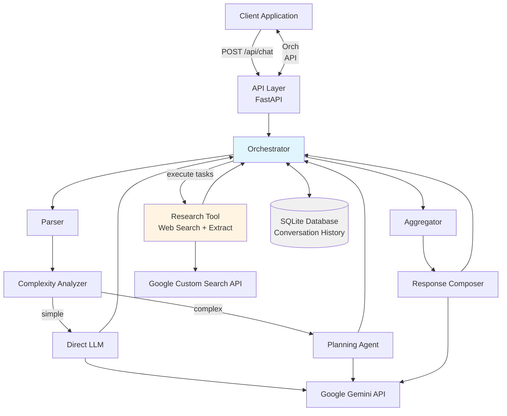
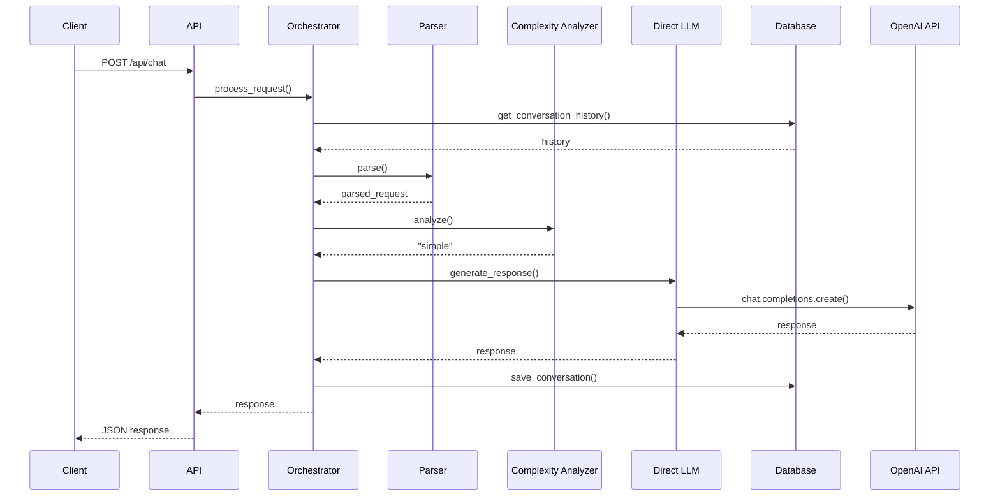
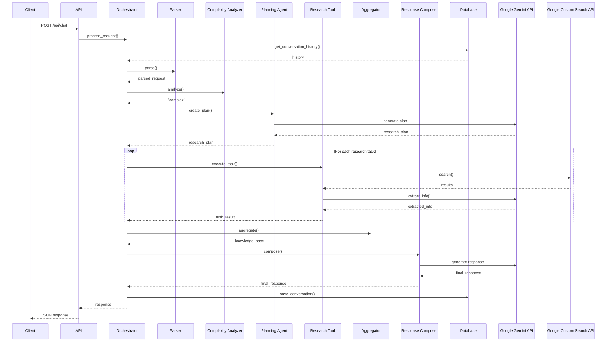
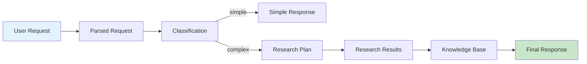

# Design Document: AI Agent with Research Tool

## Overview

Hệ thống AI Agent with Research Tool là một intelligent orchestration system được thiết kế để tự động phân tích và xử lý user requests với hai chiến lược khác nhau dựa trên độ phức tạp. Hệ thống sử dụng kiến trúc pipeline-based với các components độc lập, cho phép xử lý linh hoạt và dễ dàng mở rộng.

### Core Capabilities

- **Intelligent Request Routing**: Tự động phân loại requests thành simple hoặc complex và route đến xử lý phù hợp
- **Adaptive Research**: Tạo và thực thi research plans động cho complex requests
- **Sequential Execution**: Thực thi research tasks tuần tự để tận dụng context từ các tasks trước
- **Knowledge Aggregation**: Tổng hợp và deduplicate thông tin từ nhiều nguồn
- **Source Citation**: Tự động cite sources trong responses
- **Conversation Context**: Duy trì conversation history để cung cấp context-aware responses

### Design Principles

1. **Separation of Concerns**: Mỗi component có một trách nhiệm rõ ràng và độc lập
2. **Fail-Safe Operation**: Hệ thống tiếp tục hoạt động ngay cả khi một số components fail
3. **Observable**: Comprehensive logging cho debugging và monitoring
4. **Configurable**: Flexible configuration qua environment variables
5. **Scalable**: Kiến trúc cho phép dễ dàng thêm components mới

## Architecture

### High-Level Architecture



### Component Interaction Flow

**Simple Request Flow:**


**Complex Request Flow:**


### Data Flow




## Components and Interfaces

### 1. API Layer

**Responsibility**: Expose REST endpoints và handle HTTP request/response

**Technology**: FastAPI

**Interface**:
```python
@app.post("/api/chat")
async def chat(request: ChatRequest) -> ChatResponse:
    """
    Handle user chat requests
    
    Args:
        request: ChatRequest containing message and optional conversation_id
        
    Returns:
        ChatResponse with response text, conversation_id, complexity, and sources
        
    Raises:
        HTTPException: 400 for invalid input, 500 for server errors
    """
    pass
```

**Dependencies**: Orchestrator

---

### 2. Orchestrator

**Responsibility**: Điều phối workflow giữa các components, quản lý conversation history

**Key Methods**:
```python
class Orchestrator:
    def process_request(
        self, 
        message: str, 
        conversation_id: Optional[str] = None
    ) -> ProcessedResponse:
        """
        Main orchestration method
        
        Workflow:
        1. Retrieve conversation history
        2. Parse request
        3. Analyze complexity
        4. Route to appropriate handler (simple or complex)
        5. Save conversation
        6. Return response
        """
        pass
    
    def handle_simple_request(
        self, 
        parsed_request: ParsedRequest,
        history: List[Message]
    ) -> str:
        """Handle simple requests via Direct LLM"""
        pass
    
    def handle_complex_request(
        self,
        parsed_request: ParsedRequest,
        history: List[Message]
    ) -> ComplexResponse:
        """
        Handle complex requests via research workflow
        
        Workflow:
        1. Create research plan
        2. Execute research tasks sequentially
        3. Aggregate results
        4. Compose final response
        """
        pass
    
    def execute_research_tasks(
        self,
        research_plan: ResearchPlan
    ) -> List[ResearchResult]:
        """Execute research tasks in order, collect results"""
        pass
```

**Dependencies**: Parser, ComplexityAnalyzer, DirectLLM, PlanningAgent, ResearchTool, Aggregator, ResponseComposer, Database

---

### 3. Parser

**Responsibility**: Làm sạch và chuẩn hóa user input

**Key Methods**:
```python
class Parser:
    def parse(self, raw_input: str) -> ParsedRequest:
        """
        Clean and normalize user input
        
        Operations:
        - Strip leading/trailing whitespace
        - Normalize Unicode to NFC form
        - Validate non-empty
        
        Args:
            raw_input: Raw user message
            
        Returns:
            ParsedRequest with cleaned_text and original_text
            
        Raises:
            ValueError: If input is empty after cleaning
        """
        pass
```

**Dependencies**: None

---

### 4. Complexity Analyzer

**Responsibility**: Phân tích độ phức tạp của request và classify thành simple hoặc complex

**Key Methods**:
```python
class ComplexityAnalyzer:
    def analyze(self, parsed_request: ParsedRequest) -> ComplexityResult:
        """
        Analyze request complexity using LLM
        
        Classification criteria:
        - Simple: General knowledge questions, definitions, explanations
        - Complex: Current events, specific facts, data requiring external sources
        
        Args:
            parsed_request: Parsed user request
            
        Returns:
            ComplexityResult with level ("simple" or "complex") and reasoning
            
        Timeout: 2 seconds
        """
        pass
    
    def _build_analysis_prompt(self, text: str) -> str:
        """Build prompt for LLM to analyze complexity"""
        pass
```

**Dependencies**: OpenAI API

**LLM Prompt Template**:
```
Analyze the following user request and determine if it requires external research.

Classify as "simple" if:
- Can be answered with general knowledge
- Asks for definitions, explanations, or concepts
- Doesn't require current/specific data

Classify as "complex" if:
- Requires current information (news, prices, weather)
- Needs specific facts or statistics
- Requires data from external sources

User request: {text}

Respond in JSON format:
{
  "complexity": "simple" or "complex",
  "reasoning": "brief explanation"
}
```

---

### 5. Direct LLM

**Responsibility**: Xử lý simple requests bằng cách gọi LLM trực tiếp

**Key Methods**:
```python
class DirectLLM:
    def generate_response(
        self,
        parsed_request: ParsedRequest,
        history: List[Message]
    ) -> str:
        """
        Generate response using LLM with conversation history
        
        Args:
            parsed_request: Parsed user request
            history: Conversation history for context
            
        Returns:
            Generated response text
            
        Timeout: 10 seconds
        Retries: 2 with exponential backoff
        """
        pass
    
    def _build_messages(
        self,
        parsed_request: ParsedRequest,
        history: List[Message]
    ) -> List[Dict]:
        """Build messages array for OpenAI API"""
        pass
```

**Dependencies**: Google Gemini API

---

### 6. Planning Agent

**Responsibility**: Tạo research plan cho complex requests

**Key Methods**:
```python
class PlanningAgent:
    def create_plan(
        self,
        parsed_request: ParsedRequest
    ) -> ResearchPlan:
        """
        Generate research plan using LLM
        
        Creates 1-5 research tasks ordered by importance
        Each task has a search query and information goal
        
        Args:
            parsed_request: Parsed user request
            
        Returns:
            ResearchPlan with ordered list of ResearchTasks
            
        Timeout: 5 seconds
        """
        pass
    
    def _build_planning_prompt(self, text: str) -> str:
        """Build prompt for LLM to create research plan"""
        pass
```

**Dependencies**: Google Gemini API

**LLM Prompt Template**:
```
Create a research plan to answer the following user request.

Generate 1-5 research tasks, ordered from most to least important.
Each task should have:
- query: A search query to find relevant information
- goal: What information to extract from the search results

User request: {text}

Respond in JSON format:
{
  "tasks": [
    {
      "query": "search query",
      "goal": "information to extract"
    }
  ]
}
```

---

### 7. Research Tool

**Responsibility**: Thực hiện web search và extract information (component duy nhất cho research)

**Key Methods**:
```python
class ResearchTool:
    def execute_task(self, task: ResearchTask) -> ResearchResult:
        """
        Execute a single research task
        
        Workflow:
        1. Perform web search with task query
        2. Retrieve top 3 results
        3. Extract relevant information using LLM
        4. Return result with sources
        
        Args:
            task: ResearchTask with query and goal
            
        Returns:
            ResearchResult with extracted info and sources
            
        Timeout: 10 seconds per task
        """
        pass
    
    def _search(self, query: str) -> List[SearchResult]:
        """
        Perform web search using Google Custom Search API
        
        Returns:
            List of top 3 SearchResults with title, url, snippet
        """
        pass
    
    def _extract_information(
        self,
        search_results: List[SearchResult],
        goal: str
    ) -> str:
        """
        Extract relevant information from search results using LLM
        
        Args:
            search_results: List of search results
            goal: Information extraction goal
            
        Returns:
            Extracted information text
        """
        pass
```

**Dependencies**: Google Custom Search API, Google Gemini API

**LLM Extraction Prompt Template**:
```
Extract relevant information from the following search results to achieve the goal.

Goal: {goal}

Search Results:
{formatted_results}

Extract and summarize the relevant information. Be concise and factual.
```

---

### 8. Aggregator

**Responsibility**: Tổng hợp research results từ nhiều tasks

**Key Methods**:
```python
class Aggregator:
    def aggregate(
        self,
        research_results: List[ResearchResult]
    ) -> KnowledgeBase:
        """
        Aggregate research results into unified knowledge base
        
        Operations:
        - Combine information from all tasks
        - Remove duplicate information
        - Organize by topic/relevance
        - Preserve source URLs
        
        Args:
            research_results: List of ResearchResults from tasks
            
        Returns:
            KnowledgeBase with organized information and sources
            
        Timeout: 3 seconds
        """
        pass
    
    def _deduplicate(self, texts: List[str]) -> List[str]:
        """Remove duplicate or highly similar information"""
        pass
    
    def _organize_by_topic(
        self,
        information: List[Tuple[str, List[str]]]
    ) -> Dict[str, List[Tuple[str, List[str]]]]:
        """Group information by topic"""
        pass
```

**Dependencies**: None (pure data processing)

---

### 9. Response Composer

**Responsibility**: Tạo final response dựa trên aggregated knowledge base

**Key Methods**:
```python
class ResponseComposer:
    def compose(
        self,
        parsed_request: ParsedRequest,
        knowledge_base: KnowledgeBase
    ) -> ComposedResponse:
        """
        Generate final response using LLM with research results
        
        Instructions to LLM:
        - Use information from knowledge base
        - Cite sources with inline URLs
        - Write clear, well-structured response
        - Answer the original question directly
        
        Args:
            parsed_request: Original user request
            knowledge_base: Aggregated research results
            
        Returns:
            ComposedResponse with text and source list
            
        Timeout: 15 seconds
        """
        pass
    
    def _build_composition_prompt(
        self,
        request_text: str,
        knowledge_base: KnowledgeBase
    ) -> str:
        """Build prompt for LLM to compose final response"""
        pass
```

**Dependencies**: Google Gemini API

**LLM Composition Prompt Template**:
```
Answer the following user question using the provided research information.

User Question: {question}

Research Information:
{formatted_knowledge_base}

Instructions:
- Answer the question directly and clearly
- Use information from the research results
- Cite sources using inline URLs: [source text](URL)
- Be comprehensive but concise
- Organize information logically

Generate a well-structured response:
```

---

### 10. Database

**Responsibility**: Lưu trữ và truy xuất conversation history

**Schema**:
```sql
CREATE TABLE conversations (
    id TEXT PRIMARY KEY,
    created_at TIMESTAMP DEFAULT CURRENT_TIMESTAMP
);

CREATE TABLE messages (
    id INTEGER PRIMARY KEY AUTOINCREMENT,
    conversation_id TEXT NOT NULL,
    role TEXT NOT NULL,  -- 'user' or 'assistant'
    content TEXT NOT NULL,
    complexity TEXT,  -- 'simple', 'complex', or NULL
    research_plan TEXT,  -- JSON string or NULL
    sources TEXT,  -- JSON array of URLs or NULL
    created_at TIMESTAMP DEFAULT CURRENT_TIMESTAMP,
    FOREIGN KEY (conversation_id) REFERENCES conversations(id)
);

CREATE INDEX idx_messages_conversation ON messages(conversation_id);
CREATE INDEX idx_messages_created_at ON messages(created_at);
```

**Key Methods**:
```python
class Database:
    def get_conversation_history(
        self,
        conversation_id: str,
        limit: int = 10
    ) -> List[Message]:
        """Retrieve recent messages for a conversation"""
        pass
    
    def save_message(
        self,
        conversation_id: str,
        role: str,
        content: str,
        complexity: Optional[str] = None,
        research_plan: Optional[ResearchPlan] = None,
        sources: Optional[List[str]] = None
    ) -> None:
        """Save a message to the database"""
        pass
    
    def create_conversation(self) -> str:
        """Create a new conversation and return its ID"""
        pass
```

**Dependencies**: SQLite

## Data Models

### Request/Response Models

```python
from pydantic import BaseModel, Field
from typing import Optional, List
from datetime import datetime

class ChatRequest(BaseModel):
    """API request model"""
    message: str = Field(..., min_length=1, max_length=10000)
    conversation_id: Optional[str] = None

class ChatResponse(BaseModel):
    """API response model"""
    response: str
    conversation_id: str
    complexity: str  # "simple" or "complex"
    sources: Optional[List[str]] = None
    timestamp: datetime

class ErrorResponse(BaseModel):
    """API error response model"""
    error: str
    detail: Optional[str] = None
    timestamp: datetime
```

### Internal Data Models

```python
class ParsedRequest(BaseModel):
    """Parsed and cleaned user request"""
    cleaned_text: str
    original_text: str
    timestamp: datetime

class ComplexityResult(BaseModel):
    """Result of complexity analysis"""
    level: str  # "simple" or "complex"
    reasoning: str
    confidence: float = Field(ge=0.0, le=1.0)

class ResearchTask(BaseModel):
    """Single research task in a plan"""
    query: str
    goal: str
    priority: int = Field(ge=1, le=5)

class ResearchPlan(BaseModel):
    """Complete research plan"""
    tasks: List[ResearchTask] = Field(min_items=1, max_items=5)
    created_at: datetime

class SearchResult(BaseModel):
    """Single search result from web search"""
    title: str
    url: str
    snippet: str

class ResearchResult(BaseModel):
    """Result from executing a research task"""
    task: ResearchTask
    extracted_info: str
    sources: List[str]
    success: bool
    error: Optional[str] = None
    duration_seconds: float

class KnowledgeBase(BaseModel):
    """Aggregated research results"""
    information: Dict[str, List[Tuple[str, List[str]]]]  # topic -> [(info, sources)]
    all_sources: List[str]
    created_at: datetime

class ComposedResponse(BaseModel):
    """Final composed response"""
    text: str
    sources: List[str]
    created_at: datetime

class Message(BaseModel):
    """Conversation message"""
    role: str  # "user" or "assistant"
    content: str
    timestamp: datetime

class ProcessedResponse(BaseModel):
    """Complete processed response from orchestrator"""
    response: str
    conversation_id: str
    complexity: str
    sources: Optional[List[str]]
    research_plan: Optional[ResearchPlan]
    duration_seconds: float
```

### Configuration Model

```python
class Config(BaseModel):
    """System configuration"""
    # API Keys
    google_api_key: str
    google_model: str = "gemini-pro"
    google_search_api_key: str
    google_search_engine_id: str
    
    # Database
    database_path: str = "conversations.db"
    
    # Timeouts (seconds)
    parser_timeout: float = 1.0
    complexity_analyzer_timeout: float = 2.0
    direct_llm_timeout: float = 10.0
    planning_agent_timeout: float = 5.0
    research_tool_timeout: float = 10.0
    aggregator_timeout: float = 3.0
    response_composer_timeout: float = 15.0
    
    # Retry Configuration
    llm_max_retries: int = 2
    llm_retry_delay: float = 1.0
    
    # Research Configuration
    max_search_results: int = 3
    max_research_tasks: int = 5
    
    # Logging
    log_level: str = "INFO"
    
    @classmethod
    def from_env(cls) -> "Config":
        """Load configuration from environment variables"""
        import os
        return cls(
            google_api_key=os.getenv("GOOGLE_API_KEY"),
            google_model=os.getenv("GOOGLE_MODEL", "gemini-pro"),
            google_search_api_key=os.getenv("GOOGLE_SEARCH_API_KEY"),
            google_search_engine_id=os.getenv("GOOGLE_SEARCH_ENGINE_ID"),
            database_path=os.getenv("DATABASE_PATH", "conversations.db"),
            log_level=os.getenv("LOG_LEVEL", "INFO")
        )
```


## Correctness Properties

*A property is a characteristic or behavior that should hold true across all valid executions of a system—essentially, a formal statement about what the system should do. Properties serve as the bridge between human-readable specifications and machine-verifiable correctness guarantees.*

### Property 1: Orchestrator Routes Based on Complexity

*For any* user request, when the Complexity_Analyzer classifies it as "simple", the Orchestrator should route to Direct_LLM, and when classified as "complex", the Orchestrator should route to Planning_Agent.

**Validates: Requirements 1.3, 1.4**

### Property 2: Parser Normalizes Input

*For any* raw user input string, the Parser should return a ParsedRequest where cleaned_text has no leading/trailing whitespace, is in Unicode NFC form, and both cleaned_text and original_text fields are present.

**Validates: Requirements 2.1, 2.2, 2.4**

### Property 3: Empty Input Rejection

*For any* string composed entirely of whitespace characters, the Parser should raise a ValueError indicating invalid input.

**Validates: Requirements 2.5**

### Property 4: Component Failure Propagation

*For any* component that raises an exception during processing, the Orchestrator should catch the exception and return an error response containing the failure reason.

**Validates: Requirements 1.5**

### Property 5: Complexity Result Structure

*For any* parsed request analyzed by the Complexity_Analyzer, the returned ComplexityResult should contain both a level field ("simple" or "complex") and a reasoning field.

**Validates: Requirements 3.4**

### Property 6: Direct LLM Includes History

*For any* simple request with non-empty conversation history, the Direct_LLM should include all history messages in the API call to the LLM.

**Validates: Requirements 4.2**

### Property 7: Research Plan Size Constraint

*For any* complex request processed by the Planning_Agent, the generated ResearchPlan should contain between 1 and 5 ResearchTasks (inclusive).

**Validates: Requirements 5.2**

### Property 8: Research Task Structure

*For any* ResearchTask in a generated ResearchPlan, the task should have both a query field and a goal field with non-empty string values.

**Validates: Requirements 5.3**

### Property 9: Search Results Limit

*For any* ResearchTask executed by the Research_Tool, the number of search results retrieved should be at most 3.

**Validates: Requirements 6.2**

### Property 10: Search Result Structure

*For any* search result returned by the Research_Tool, it should contain title, url, and snippet fields.

**Validates: Requirements 6.3**

### Property 11: Research Result Contains Sources

*For any* ResearchResult returned by the Research_Tool, it should include both extracted_info and a non-empty sources list containing URLs.

**Validates: Requirements 6.5**

### Property 12: Research Tool Resilience

*For any* ResearchTask where the web search API fails, the Research_Tool should return a ResearchResult with success=False and an error message, and the Orchestrator should continue processing remaining tasks.

**Validates: Requirements 6.6, 7.4**

### Property 13: Sequential Task Execution

*For any* ResearchPlan with multiple tasks, the Orchestrator should execute tasks in order such that task N+1 does not start until task N completes.

**Validates: Requirements 7.1, 7.2**

### Property 14: Result Collection Completeness

*For any* ResearchPlan with N tasks, after execution completes, the Orchestrator should pass exactly N ResearchResults to the Aggregator (including failed tasks).

**Validates: Requirements 7.3, 7.5**

### Property 15: Aggregator Preserves Sources

*For any* set of ResearchResults aggregated into a KnowledgeBase, every source URL from the input results should appear in the KnowledgeBase.all_sources list.

**Validates: Requirements 8.4**

### Property 16: Deduplication Reduces Size

*For any* set of ResearchResults containing duplicate information, the aggregated KnowledgeBase should contain fewer distinct information items than the total number of input items.

**Validates: Requirements 8.2**

### Property 17: Response Composer Includes Context

*For any* composition request, the Response_Composer should include both the original user request and the complete KnowledgeBase in the LLM API call context.

**Validates: Requirements 9.2, 9.3**

### Property 18: Response Contains Source Citations

*For any* ComposedResponse generated from a KnowledgeBase with sources, the response text should contain at least one URL from the KnowledgeBase.all_sources list.

**Validates: Requirements 9.5**

### Property 19: Conversation Persistence Round-Trip

*For any* user request and generated response, after saving to the database, retrieving the conversation history should return messages containing the saved request and response content.

**Validates: Requirements 10.2, 10.1**

### Property 20: Conversation ID Uniqueness

*For any* two distinct conversations created by the system, they should have different conversation_id values.

**Validates: Requirements 10.3**

### Property 21: Message Timestamp Presence

*For any* message saved to the database, retrieving it should return a Message object with a non-null timestamp field.

**Validates: Requirements 10.4**

### Property 22: Complex Request Metadata Storage

*For any* complex request that generates a ResearchPlan, saving the conversation should store the complexity classification and the research plan in the database.

**Validates: Requirements 10.5**

### Property 23: API Response Schema Completeness

*For any* successful request to /api/chat, the JSON response should contain response, conversation_id, and complexity fields, and if complexity is "complex", it should also contain a sources field.

**Validates: Requirements 11.3**

### Property 24: HTTP Status Code Correctness

*For any* request to /api/chat, the HTTP status code should be 200 for successful processing, 400 for invalid input, and 500 for server errors.

**Validates: Requirements 11.4, 11.5**

### Property 25: Error Response Structure

*For any* failed request to /api/chat, the JSON response should contain an error field with a message, and should not contain internal stack traces or implementation details.

**Validates: Requirements 11.6, 13.5**

### Property 26: LLM API Retry Logic

*For any* LLM API call that fails with a retryable error, the system should attempt the call up to 3 times total (1 initial + 2 retries) with exponentially increasing delays between attempts.

**Validates: Requirements 13.1**

### Property 27: Research Failure Fallback

*For any* complex request where all ResearchTasks fail, the system should still generate a response using the Direct_LLM with only the LLM's knowledge.

**Validates: Requirements 13.3**

### Property 28: Timeout Handling

*For any* component operation that exceeds its configured timeout, the system should log the timeout event and either return a partial response or an error, but should not hang indefinitely.

**Validates: Requirements 13.4**

### Property 29: Request Logging Completeness

*For any* incoming request, the system should create a log entry containing the timestamp, conversation_id (or "new"), and the user message content.

**Validates: Requirements 14.1**

### Property 30: Research Task Logging

*For any* ResearchTask executed, the system should create a log entry containing the query, execution duration, and success/failure status.

**Validates: Requirements 14.3**

### Property 31: External API Call Logging

*For any* call to an external API (OpenAI or DuckDuckGo), the system should create a log entry containing the API name, duration, and HTTP status or error.

**Validates: Requirements 14.4**

### Property 32: Error Logging Context

*For any* error that occurs during processing, the system should create a log entry containing the component name where the error occurred and relevant input data context.

**Validates: Requirements 14.5**


## Error Handling

### Error Categories

The system handles four categories of errors:

1. **Input Validation Errors**: Invalid user input, empty messages, malformed JSON
2. **External API Errors**: OpenAI API failures, DuckDuckGo search failures, rate limits
3. **Timeout Errors**: Component operations exceeding configured timeouts
4. **Internal Errors**: Database errors, unexpected exceptions, programming bugs

### Error Handling Strategy

#### 1. Input Validation Errors

**Handling**: Return HTTP 400 with user-friendly error message

```python
# Example
{
  "error": "Invalid input",
  "detail": "Message cannot be empty",
  "timestamp": "2024-01-15T10:30:00Z"
}
```

**Components**: API Layer, Parser

**Recovery**: None - user must provide valid input

#### 2. External API Errors

**Handling**: Retry with exponential backoff, fallback to degraded functionality

**Google Gemini API Failures**:
- Retry up to 2 times with delays: 1s, 2s
- If all retries fail, return error to user
- Log all retry attempts

**Google Custom Search API Failures**:
- Mark ResearchTask as failed
- Continue with remaining tasks
- If all tasks fail, fallback to Direct_LLM response

```python
# Retry logic
async def call_with_retry(func, max_retries=2, base_delay=1.0):
    for attempt in range(max_retries + 1):
        try:
            return await func()
        except RetryableError as e:
            if attempt == max_retries:
                raise
            delay = base_delay * (2 ** attempt)
            await asyncio.sleep(delay)
            logger.warning(f"Retry {attempt + 1}/{max_retries} after {delay}s")
```

#### 3. Timeout Errors

**Handling**: Cancel operation, log timeout, return partial results if available

**Timeout Configuration**:
- Parser: 1 second
- Complexity Analyzer: 2 seconds
- Direct LLM: 10 seconds
- Planning Agent: 5 seconds
- Research Tool: 10 seconds per task
- Aggregator: 3 seconds
- Response Composer: 15 seconds

```python
# Timeout wrapper
async def with_timeout(coro, timeout_seconds, component_name):
    try:
        return await asyncio.wait_for(coro, timeout=timeout_seconds)
    except asyncio.TimeoutError:
        logger.error(f"{component_name} timed out after {timeout_seconds}s")
        raise TimeoutError(f"{component_name} operation timed out")
```

#### 4. Internal Errors

**Handling**: Log full error context, return HTTP 500 with sanitized message

**Error Sanitization**:
- Never expose stack traces to users
- Never expose internal paths or configuration
- Provide generic error message with request ID for support

```python
# Error sanitization
def sanitize_error(error: Exception, request_id: str) -> ErrorResponse:
    logger.error(f"Internal error for request {request_id}", exc_info=True)
    return ErrorResponse(
        error="An internal error occurred",
        detail=f"Please contact support with request ID: {request_id}",
        timestamp=datetime.utcnow()
    )
```

### Error Recovery Patterns

#### Graceful Degradation

When research fails, system falls back to LLM-only response:

```python
async def handle_complex_request(self, request, history):
    try:
        # Attempt full research workflow
        plan = await self.planning_agent.create_plan(request)
        results = await self.execute_research_tasks(plan)
        
        if all(not r.success for r in results):
            # All research failed - fallback to Direct LLM
            logger.warning("All research tasks failed, using LLM-only response")
            return await self.direct_llm.generate_response(request, history)
        
        # Continue with partial results
        kb = await self.aggregator.aggregate(results)
        return await self.response_composer.compose(request, kb)
        
    except Exception as e:
        # Complete failure - try Direct LLM as last resort
        logger.error("Research workflow failed completely", exc_info=True)
        return await self.direct_llm.generate_response(request, history)
```

#### Partial Results

System returns partial results when some components succeed:

```python
# Example: 2 of 3 research tasks succeed
results = [
    ResearchResult(success=True, info="...", sources=["url1"]),
    ResearchResult(success=False, error="Search API timeout"),
    ResearchResult(success=True, info="...", sources=["url2"])
]

# Aggregator processes successful results only
kb = aggregator.aggregate([r for r in results if r.success])
response = composer.compose(request, kb)
```

### Error Logging

All errors are logged with structured context:

```python
logger.error(
    "Component error",
    extra={
        "component": "ResearchTool",
        "request_id": request_id,
        "conversation_id": conversation_id,
        "input": {"query": query, "goal": goal},
        "error_type": type(error).__name__,
        "error_message": str(error)
    },
    exc_info=True
)
```

## Testing Strategy

### Overview

The testing strategy employs a dual approach combining unit tests for specific scenarios and property-based tests for comprehensive coverage of the correctness properties defined in this document.

### Testing Approach

**Unit Tests**: Verify specific examples, edge cases, and integration points
**Property-Based Tests**: Verify universal properties across randomized inputs

Both approaches are complementary and necessary for comprehensive coverage. Unit tests catch concrete bugs in specific scenarios, while property-based tests verify general correctness across a wide input space.

### Property-Based Testing

**Library**: Hypothesis (Python)

**Configuration**: Each property test runs minimum 100 iterations with randomized inputs

**APIs Used**:
- Google Gemini API (free tier: 60 requests/minute)
- Google Custom Search API (free tier: 100 queries/day)

**Test Tagging**: Each property test references its design document property:
```python
# Feature: ai-agent-with-research-tool, Property 1: Orchestrator Routes Based on Complexity
@given(request=st.text(min_size=1), complexity=st.sampled_from(["simple", "complex"]))
def test_orchestrator_routing(request, complexity):
    # Test implementation
    pass
```

### Property Test Examples

#### Property 2: Parser Normalizes Input

```python
from hypothesis import given, strategies as st
import unicodedata

# Feature: ai-agent-with-research-tool, Property 2: Parser Normalizes Input
@given(raw_input=st.text(min_size=1))
def test_parser_normalization(raw_input):
    """For any raw input, parser should normalize and preserve structure"""
    parser = Parser()
    result = parser.parse(raw_input)
    
    # Check whitespace removal
    assert result.cleaned_text == raw_input.strip()
    
    # Check Unicode normalization
    assert unicodedata.is_normalized('NFC', result.cleaned_text)
    
    # Check structure
    assert hasattr(result, 'cleaned_text')
    assert hasattr(result, 'original_text')
    assert result.original_text == raw_input
```

#### Property 7: Research Plan Size Constraint

```python
# Feature: ai-agent-with-research-tool, Property 7: Research Plan Size Constraint
@given(request=st.text(min_size=10, max_size=500))
@settings(max_examples=100)
async def test_research_plan_size(request):
    """For any complex request, plan should have 1-5 tasks"""
    planner = PlanningAgent(config)
    parsed = ParsedRequest(cleaned_text=request, original_text=request)
    
    plan = await planner.create_plan(parsed)
    
    assert 1 <= len(plan.tasks) <= 5
    assert all(isinstance(task, ResearchTask) for task in plan.tasks)
```

#### Property 13: Sequential Task Execution

```python
# Feature: ai-agent-with-research-tool, Property 13: Sequential Task Execution
@given(num_tasks=st.integers(min_value=2, max_value=5))
@settings(max_examples=100)
async def test_sequential_execution(num_tasks):
    """For any plan with multiple tasks, execution should be sequential"""
    execution_order = []
    
    async def mock_execute(task):
        execution_order.append(task.query)
        await asyncio.sleep(0.01)  # Simulate work
        return ResearchResult(task=task, success=True, extracted_info="test")
    
    tasks = [
        ResearchTask(query=f"query_{i}", goal=f"goal_{i}", priority=i)
        for i in range(num_tasks)
    ]
    plan = ResearchPlan(tasks=tasks)
    
    orchestrator = Orchestrator(config)
    orchestrator.research_tool.execute_task = mock_execute
    
    await orchestrator.execute_research_tasks(plan)
    
    # Verify tasks executed in order
    expected_order = [f"query_{i}" for i in range(num_tasks)]
    assert execution_order == expected_order
```

#### Property 19: Conversation Persistence Round-Trip

```python
# Feature: ai-agent-with-research-tool, Property 19: Conversation Persistence Round-Trip
@given(
    user_message=st.text(min_size=1, max_size=1000),
    assistant_response=st.text(min_size=1, max_size=2000)
)
@settings(max_examples=100)
def test_conversation_persistence(user_message, assistant_response):
    """For any conversation, saving and retrieving should preserve content"""
    db = Database(":memory:")
    conversation_id = db.create_conversation()
    
    # Save messages
    db.save_message(conversation_id, "user", user_message)
    db.save_message(conversation_id, "assistant", assistant_response)
    
    # Retrieve history
    history = db.get_conversation_history(conversation_id)
    
    # Verify round-trip
    assert len(history) == 2
    assert history[0].role == "user"
    assert history[0].content == user_message
    assert history[1].role == "assistant"
    assert history[1].content == assistant_response
```

### Unit Test Examples

#### API Endpoint Tests

```python
from fastapi.testclient import TestClient

def test_chat_endpoint_success():
    """Test successful chat request"""
    client = TestClient(app)
    response = client.post(
        "/api/chat",
        json={"message": "What is Python?"}
    )
    
    assert response.status_code == 200
    data = response.json()
    assert "response" in data
    assert "conversation_id" in data
    assert "complexity" in data
    assert data["complexity"] in ["simple", "complex"]

def test_chat_endpoint_empty_message():
    """Test error handling for empty message"""
    client = TestClient(app)
    response = client.post(
        "/api/chat",
        json={"message": ""}
    )
    
    assert response.status_code == 400
    data = response.json()
    assert "error" in data

def test_chat_endpoint_with_conversation_id():
    """Test conversation continuity"""
    client = TestClient(app)
    
    # First message
    response1 = client.post(
        "/api/chat",
        json={"message": "Hello"}
    )
    conv_id = response1.json()["conversation_id"]
    
    # Second message in same conversation
    response2 = client.post(
        "/api/chat",
        json={"message": "Follow-up question", "conversation_id": conv_id}
    )
    
    assert response2.status_code == 200
    assert response2.json()["conversation_id"] == conv_id
```

#### Component Integration Tests

```python
@pytest.mark.asyncio
async def test_simple_request_flow():
    """Test complete flow for simple request"""
    config = Config.from_env()
    orchestrator = Orchestrator(config)
    
    response = await orchestrator.process_request(
        message="What is 2+2?",
        conversation_id=None
    )
    
    assert response.complexity == "simple"
    assert response.sources is None
    assert len(response.response) > 0
    assert response.conversation_id is not None

@pytest.mark.asyncio
async def test_complex_request_flow():
    """Test complete flow for complex request"""
    config = Config.from_env()
    orchestrator = Orchestrator(config)
    
    response = await orchestrator.process_request(
        message="What is the current price of Bitcoin?",
        conversation_id=None
    )
    
    assert response.complexity == "complex"
    assert response.sources is not None
    assert len(response.sources) > 0
    assert len(response.response) > 0
```

#### Error Handling Tests

```python
@pytest.mark.asyncio
async def test_llm_api_retry():
    """Test LLM API retry logic"""
    call_count = 0
    
    async def failing_api_call():
        nonlocal call_count
        call_count += 1
        if call_count < 3:
            raise RetryableError("API temporarily unavailable")
        return "Success"
    
    result = await call_with_retry(failing_api_call, max_retries=2)
    
    assert call_count == 3
    assert result == "Success"

@pytest.mark.asyncio
async def test_research_failure_fallback():
    """Test fallback to Direct LLM when all research fails"""
    config = Config.from_env()
    orchestrator = Orchestrator(config)
    
    # Mock research tool to always fail
    async def failing_research(task):
        return ResearchResult(
            task=task,
            success=False,
            error="Search API unavailable",
            extracted_info="",
            sources=[]
        )
    
    orchestrator.research_tool.execute_task = failing_research
    
    response = await orchestrator.process_request(
        message="What is the weather today?",
        conversation_id=None
    )
    
    # Should still get a response via fallback
    assert len(response.response) > 0
    assert response.complexity == "complex"
```

### Test Coverage Goals

- **Line Coverage**: Minimum 85%
- **Branch Coverage**: Minimum 80%
- **Property Tests**: All 32 correctness properties implemented
- **Integration Tests**: All component interactions covered
- **Error Scenarios**: All error handling paths tested

### Continuous Integration

Tests run automatically on:
- Every commit to main branch
- Every pull request
- Nightly builds with extended property test iterations (1000+ examples)

### Performance Testing

In addition to functional tests, performance benchmarks verify:
- Component timeout compliance
- End-to-end latency for simple requests (< 12 seconds)
- End-to-end latency for complex requests (< 60 seconds)
- Database query performance
- Memory usage under load

