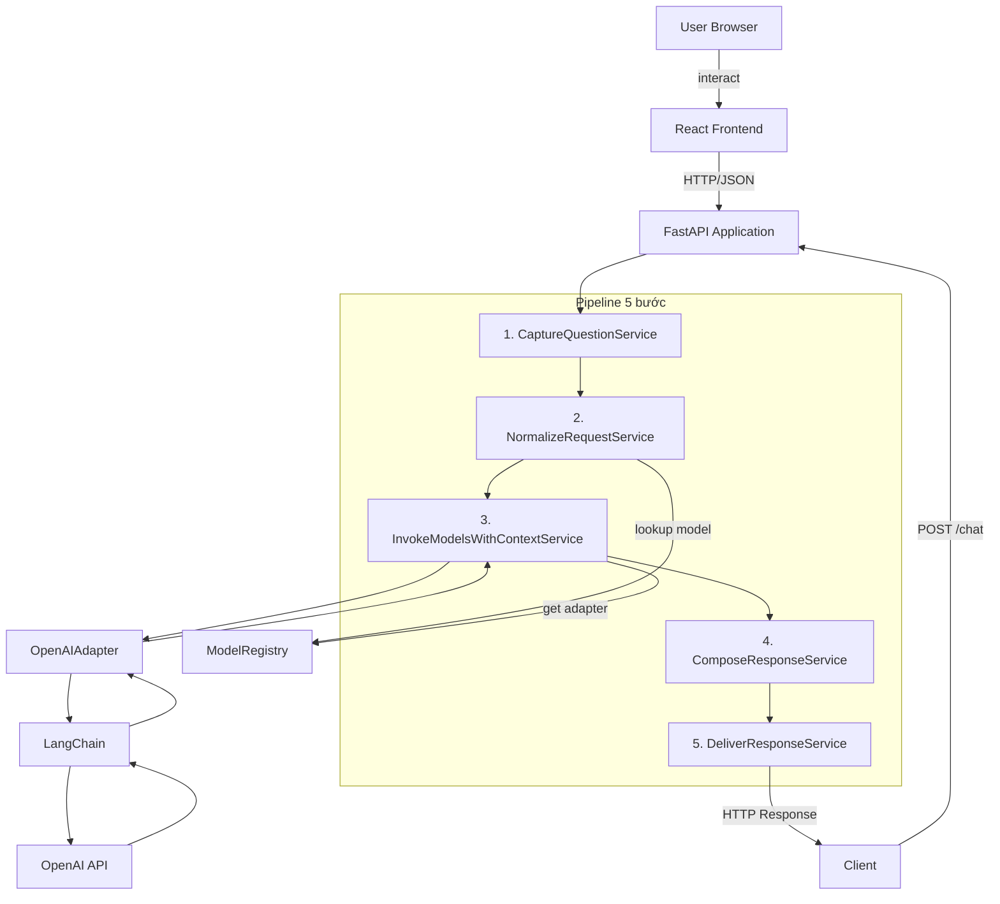
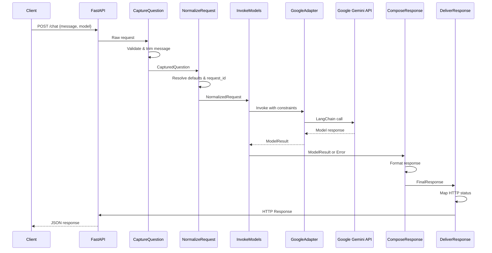
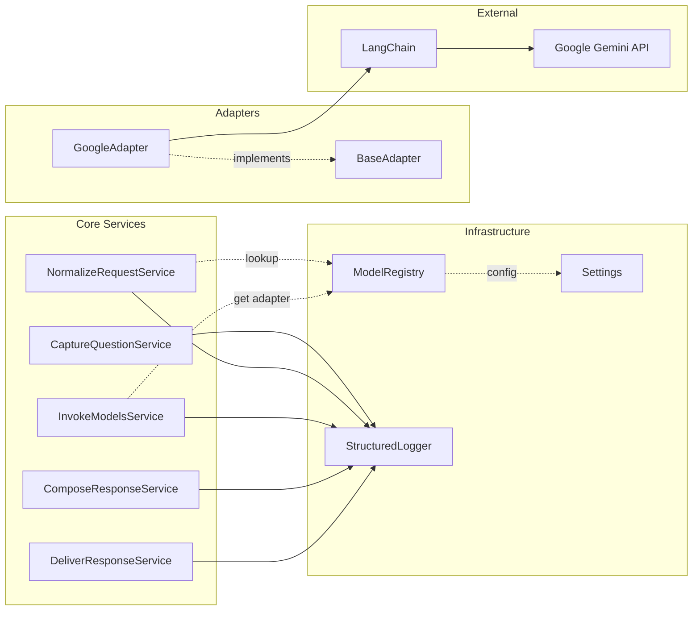
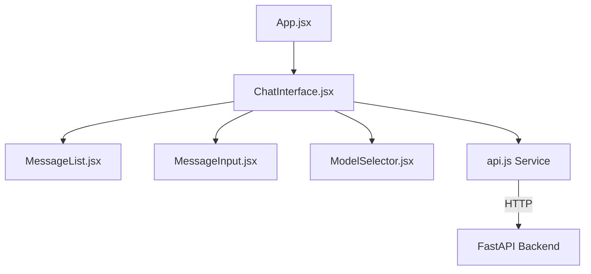

# Tài liệu Thiết kế - Hệ thống Chat AI Đa Model

## Tổng quan

Hệ thống Chat AI Đa Model là một full-stack application bao gồm REST API backend (FastAPI 0.116+ + LangChain 0.3+) và React 19 frontend, cho phép người dùng tương tác với nhiều AI model thông qua giao diện web đơn giản. Phase 1 MVP tập trung vào non-streaming chat với provider Google, hỗ trợ các model như gemini-2.5-flash và gemini-2.5-flash-lite thông qua langchain-google-genai 4.0+.

Kiến trúc hệ thống bao gồm hai phần chính:

**Backend API** - Pipeline 5 bước tuần tự:
1. **Capture Question**: Tiếp nhận và validate request
2. **Normalize Request**: Chuẩn hóa và resolve defaults
3. **Invoke Models with Context**: Gọi AI model thông qua adapter
4. **Compose Response**: Tạo response thống nhất
5. **Deliver Response**: Trả về HTTP response với status code phù hợp

**Frontend UI** - React application:
- Chat interface với message input và history display
- Model selector dropdown
- Error handling và loading states
- Responsive design

### Mục tiêu thiết kế

- **Đơn giản và rõ ràng**: Pipeline tuyến tính dễ hiểu và maintain
- **Mở rộng được**: Dễ dàng thêm provider và model mới
- **Nhất quán**: Response format thống nhất cho cả success và error
- **An toàn**: Validate input, không expose sensitive data
- **Quan sát được**: Logging chi tiết với request_id xuyên suốt pipeline
- **User-friendly**: Giao diện web đơn giản, dễ sử dụng cho end-users

## Kiến trúc

### Kiến trúc tổng quan



### Data Flow



### Component Interaction



## Components và Interfaces

### 1. CaptureQuestionService

**Trách nhiệm**: Tiếp nhận raw HTTP request, validate cơ bản, và chuẩn hóa message.

**Input**: Raw request từ FastAPI endpoint
```python
class ChatRequest(BaseModel):
    message: str
    locale: Optional[str] = None
    channel: Optional[str] = None
    model: Optional[str] = None
```

**Output**: CapturedQuestion
```python
@dataclass
class CapturedQuestion:
    raw_message: str
    locale: Optional[str]
    channel: Optional[str]
    model: Optional[str]
    received_at: datetime
```

**Validation rules**:
- `message` phải là string
- Sau khi trim, `message` không được rỗng
- `len(message) <= 4000` ký tự
- Normalize newline: `\r\n` → `\n`
- Trim whitespace ở đầu và cuối

**Error handling**:
- Message rỗng hoặc chỉ chứa whitespace → `BAD_REQUEST`
- Message quá dài → `BAD_REQUEST`
- Message không phải string → `BAD_REQUEST`

**Implementation notes**:
```python
class CaptureQuestionService:
    MAX_MESSAGE_LENGTH = 4000
    
    def capture(self, request: ChatRequest) -> CapturedQuestion:
        # Validate type
        if not isinstance(request.message, str):
            raise ValidationError("BAD_REQUEST", "Message must be string")
        
        # Normalize newline
        message = request.message.replace('\r\n', '\n')
        
        # Trim whitespace
        message = message.strip()
        
        # Validate not empty
        if not message:
            raise ValidationError("BAD_REQUEST", "Message cannot be empty")
        
        # Validate length
        if len(message) > self.MAX_MESSAGE_LENGTH:
            raise ValidationError("BAD_REQUEST", 
                f"Message too long (max {self.MAX_MESSAGE_LENGTH})")
        
        return CapturedQuestion(
            raw_message=message,
            locale=request.locale,
            channel=request.channel,
            model=request.model,
            received_at=datetime.utcnow()
        )
```

### 2. NormalizeRequestService

**Trách nhiệm**: Chuẩn hóa request thành format nội bộ, resolve defaults, và validate model.

**Input**: 
- `CapturedQuestion`
- `x-request-id` header (optional)
- `ModelRegistry`

**Output**: NormalizedRequest
```python
@dataclass
class NormalizedRequest:
    request_id: str
    message: str
    locale: str
    channel: str
    model: str
    constraints: Constraints
    meta: RequestMeta

@dataclass
class Constraints:
    temperature: float
    max_output_tokens: int

@dataclass
class RequestMeta:
    received_at: datetime
```

**Normalization rules**:
- `request_id`: Ưu tiên `x-request-id` header, nếu không có thì sinh UUID mới
- `locale`: Default `"vi-VN"`, normalize thành lowercase với dấu gạch ngang
- `channel`: Default `"web"`, chỉ chấp nhận `"web"` trong Phase 1
- `model`: Default từ `settings.default_model` nếu không được cung cấp
- `constraints`: Luôn set `temperature=0.3`, `max_output_tokens=500`

**Validation**:
- Model phải tồn tại trong `ModelRegistry` → nếu không thì `UNSUPPORTED_MODEL`
- Channel phải là `"web"` → nếu không thì `BAD_REQUEST`
- Locale format phải hợp lệ (xx-XX)

**Implementation notes**:
```python
class NormalizeRequestService:
    def __init__(self, registry: ModelRegistry, settings: Settings):
        self.registry = registry
        self.settings = settings
    
    def normalize(
        self, 
        captured: CapturedQuestion, 
        request_id_header: Optional[str]
    ) -> NormalizedRequest:
        # Resolve request_id
        request_id = request_id_header or str(uuid.uuid4())
        
        # Resolve locale
        locale = captured.locale or "vi-VN"
        locale = locale.lower()  # normalize
        
        # Resolve channel
        channel = captured.channel or "web"
        if channel != "web":
            raise ValidationError("BAD_REQUEST", 
                "Only 'web' channel supported in Phase 1")
        
        # Resolve model
        model = captured.model or self.settings.default_model
        if not self.registry.has_model(model):
            raise ValidationError("UNSUPPORTED_MODEL", 
                f"Model '{model}' not supported")
        
        # Set constraints
        constraints = Constraints(
            temperature=0.3,
            max_output_tokens=500
        )
        
        return NormalizedRequest(
            request_id=request_id,
            message=captured.raw_message,
            locale=locale,
            channel=channel,
            model=model,
            constraints=constraints,
            meta=RequestMeta(received_at=captured.received_at)
        )
```

### 3. InvokeModelsWithContextService

**Trách nhiệm**: Gọi AI model thông qua adapter pattern, sử dụng LangChain để tương tác với provider.

**Input**: `NormalizedRequest`

**Output**: `ModelResult`
```python
@dataclass
class ModelResult:
    request_id: str
    provider: str
    model: str
    answer_text: str
    finish_reason: str  # "stop", "length", "error"
    usage: TokenUsage

@dataclass
class TokenUsage:
    input_tokens: int
    output_tokens: int
```

**Prompt template**:
```
System: Bạn là trợ lý AI hữu ích, trả lời ngắn gọn và đúng ngôn ngữ user.
User: {message}
```

**Flow**:
1. Lookup adapter từ `ModelRegistry` dựa trên model name
2. Build prompt với LangChain `ChatPromptTemplate`
3. Invoke model với constraints (temperature, max_tokens)
4. Parse response và extract metadata
5. Validate output không rỗng

**Error handling**:
- Provider timeout hoặc connection error → `MODEL_ERROR`
- Provider trả về lỗi (4xx, 5xx) → `MODEL_ERROR`
- Output rỗng hoặc null → `MODEL_EMPTY_OUTPUT`
- Model không tồn tại trong registry → `UNSUPPORTED_MODEL`

**Implementation notes**:
```python
class InvokeModelsWithContextService:
    def __init__(self, registry: ModelRegistry):
        self.registry = registry
        self.prompt_template = ChatPromptTemplate.from_messages([
            ("system", "Bạn là trợ lý AI hữu ích, trả lời ngắn gọn và đúng ngôn ngữ user."),
            ("user", "{message}")
        ])
    
    def invoke(self, request: NormalizedRequest) -> ModelResult:
        # Get adapter
        adapter = self.registry.get_adapter(request.model)
        if not adapter:
            raise ModelError("UNSUPPORTED_MODEL", 
                f"No adapter for model '{request.model}'")
        
        try:
            # Build chain
            chain = self.prompt_template | adapter.get_llm()
            
            # Invoke with constraints
            response = chain.invoke(
                {"message": request.message},
                config={
                    "temperature": request.constraints.temperature,
                    "max_tokens": request.constraints.max_output_tokens
                }
            )
            
            # Extract text
            answer_text = response.content if hasattr(response, 'content') else str(response)
            
            # Validate not empty
            if not answer_text or not answer_text.strip():
                raise ModelError("MODEL_EMPTY_OUTPUT", "Model returned empty output")
            
            # Extract metadata
            finish_reason = getattr(response, 'response_metadata', {}).get('finish_reason', 'stop')
            usage = self._extract_usage(response)
            
            return ModelResult(
                request_id=request.request_id,
                provider=adapter.provider_name,
                model=request.model,
                answer_text=answer_text.strip(),
                finish_reason=finish_reason,
                usage=usage
            )
            
        except (TimeoutError, ConnectionError) as e:
            raise ModelError("MODEL_ERROR", f"Provider error: {str(e)}")
        except Exception as e:
            raise ModelError("MODEL_ERROR", f"Unexpected error: {str(e)}")
```

### 4. ComposeResponseService

**Trách nhiệm**: Tạo response thống nhất cho cả success và error cases.

**Input**: `ModelResult` hoặc `Error`

**Output**: `FinalResponse`
```python
@dataclass
class FinalResponse:
    request_id: str
    status: str  # "ok" or "error"
    answer: str
    error: Optional[ErrorDetail]
    meta: ResponseMeta

@dataclass
class ErrorDetail:
    code: str
    message: str

@dataclass
class ResponseMeta:
    provider: Optional[str]
    model: Optional[str]
    finish_reason: Optional[str]
```

**Success response rules**:
- `status = "ok"`
- `answer = answer_text` (truncated nếu > 3000 ký tự)
- `error = None`
- `meta` chứa provider, model, finish_reason

**Error response rules**:
- `status = "error"`
- `answer` = friendly message dựa trên error code
- `error` chứa code và technical message
- `meta` có keys nhưng values là None

**Error message mapping**:
- `BAD_REQUEST` → "Yêu cầu không hợp lệ. Vui lòng kiểm tra lại thông tin."
- `UNSUPPORTED_MODEL` → "Model bạn chọn không được hỗ trợ. Vui lòng chọn model khác."
- `MODEL_ERROR` → "Xin lỗi, hệ thống đang bận. Bạn thử lại giúp mình."
- `MODEL_EMPTY_OUTPUT` → "Xin lỗi, hệ thống đang bận. Bạn thử lại giúp mình."
- `INTERNAL_ERROR` → "Đã xảy ra lỗi không mong muốn. Vui lòng thử lại sau."

**Implementation notes**:
```python
class ComposeResponseService:
    MAX_ANSWER_LENGTH = 3000
    
    ERROR_MESSAGES = {
        "BAD_REQUEST": "Yêu cầu không hợp lệ. Vui lòng kiểm tra lại thông tin.",
        "UNSUPPORTED_MODEL": "Model bạn chọn không được hỗ trợ. Vui lòng chọn model khác.",
        "MODEL_ERROR": "Xin lỗi, hệ thống đang bận. Bạn thử lại giúp mình.",
        "MODEL_EMPTY_OUTPUT": "Xin lỗi, hệ thống đang bận. Bạn thử lại giúp mình.",
        "INTERNAL_ERROR": "Đã xảy ra lỗi không mong muốn. Vui lòng thử lại sau."
    }
    
    def compose_success(self, result: ModelResult) -> FinalResponse:
        # Truncate if needed
        answer = result.answer_text
        if len(answer) > self.MAX_ANSWER_LENGTH:
            answer = answer[:self.MAX_ANSWER_LENGTH] + "..."
        
        return FinalResponse(
            request_id=result.request_id,
            status="ok",
            answer=answer,
            error=None,
            meta=ResponseMeta(
                provider=result.provider,
                model=result.model,
                finish_reason=result.finish_reason
            )
        )
    
    def compose_error(self, request_id: str, error_code: str, error_msg: str) -> FinalResponse:
        friendly_message = self.ERROR_MESSAGES.get(
            error_code, 
            self.ERROR_MESSAGES["INTERNAL_ERROR"]
        )
        
        return FinalResponse(
            request_id=request_id,
            status="error",
            answer=friendly_message,
            error=ErrorDetail(code=error_code, message=error_msg),
            meta=ResponseMeta(provider=None, model=None, finish_reason=None)
        )
```

### 5. DeliverResponseService

**Trách nhiệm**: Map response nội bộ sang HTTP response với status code phù hợp.

**Input**: `FinalResponse`

**Output**: FastAPI `JSONResponse` với HTTP status code

**HTTP status mapping**:
- `status="ok"` → HTTP 200
- `error.code="BAD_REQUEST"` → HTTP 400
- `error.code="UNSUPPORTED_MODEL"` → HTTP 400
- `error.code="MODEL_ERROR"` → HTTP 502
- `error.code="MODEL_EMPTY_OUTPUT"` → HTTP 502
- `error.code="INTERNAL_ERROR"` → HTTP 500
- Unknown error → HTTP 500

**Logging**:
- Log `request_id`, HTTP status code, latency
- Log error code và message nếu có lỗi
- Không log full message content
- Không log API keys hoặc secrets

**Implementation notes**:
```python
class DeliverResponseService:
    def __init__(self, logger: StructuredLogger):
        self.logger = logger
    
    def deliver(self, response: FinalResponse, start_time: float) -> JSONResponse:
        # Determine HTTP status
        if response.status == "ok":
            http_status = 200
        elif response.error:
            http_status = self._map_error_to_http(response.error.code)
        else:
            http_status = 500
        
        # Calculate latency
        latency_ms = (time.time() - start_time) * 1000
        
        # Log
        self.logger.info(
            "request_completed",
            request_id=response.request_id,
            status=response.status,
            http_status=http_status,
            latency_ms=latency_ms,
            error_code=response.error.code if response.error else None
        )
        
        # Return JSON response
        return JSONResponse(
            status_code=http_status,
            content=response.dict()
        )
    
    def _map_error_to_http(self, error_code: str) -> int:
        mapping = {
            "BAD_REQUEST": 400,
            "UNSUPPORTED_MODEL": 400,
            "MODEL_ERROR": 502,
            "MODEL_EMPTY_OUTPUT": 502,
            "INTERNAL_ERROR": 500
        }
        return mapping.get(error_code, 500)
```

### 6. ModelRegistry

**Trách nhiệm**: Quản lý danh sách model và mapping tới adapter.

**Data structure**:
```python
@dataclass
class ModelInfo:
    name: str
    provider: str
    available: bool
    adapter_class: Type[BaseAdapter]

class ModelRegistry:
    def __init__(self):
        self._models: Dict[str, ModelInfo] = {}
        self._adapters: Dict[str, BaseAdapter] = {}
    
    def register_model(self, info: ModelInfo):
        self._models[info.name] = info
        if info.available and info.name not in self._adapters:
            self._adapters[info.name] = info.adapter_class()
    
    def has_model(self, model_name: str) -> bool:
        return model_name in self._models and self._models[model_name].available
    
    def get_adapter(self, model_name: str) -> Optional[BaseAdapter]:
        return self._adapters.get(model_name)
    
    def list_models(self) -> List[ModelInfo]:
        return list(self._models.values())
    
    def get_available_count(self) -> int:
        return sum(1 for m in self._models.values() if m.available)
```

**Initialization**:
```python
def initialize_registry(settings: Settings) -> ModelRegistry:
    registry = ModelRegistry()
    
    # Register Google models if API key available
    if settings.google_api_key:
        registry.register_model(ModelInfo(
            name="gemini-2.5-flash",
            provider="google",
            available=True,
            adapter_class=GoogleAdapter
        ))
        registry.register_model(ModelInfo(
            name="gemini-2.5-flash-lite",
            provider="google",
            available=True,
            adapter_class=GoogleAdapter
        ))
    else:
        logger.warning("GOOGLE_API_KEY not set, Google models unavailable")
    
    return registry
```

### 7. Adapter Interface

**Trách nhiệm**: Abstract interface cho các provider adapters.

**Base interface**:
```python
from abc import ABC, abstractmethod
from langchain_core.language_models import BaseChatModel

class BaseAdapter(ABC):
    @property
    @abstractmethod
    def provider_name(self) -> str:
        """Return provider name (e.g., 'google')"""
        pass
    
    @abstractmethod
    def get_llm(self) -> BaseChatModel:
        """Return configured LangChain LLM instance"""
        pass
```

**Google implementation**:
```python
from langchain_google_genai import ChatGoogleGenerativeAI

class GoogleAdapter(BaseAdapter):
    def __init__(self, api_key: str, timeout: int = 30):
        self.api_key = api_key
        self.timeout = timeout
    
    @property
    def provider_name(self) -> str:
        return "google"
    
    def get_llm(self) -> BaseChatModel:
        return ChatGoogleGenerativeAI(
            google_api_key=self.api_key,
            timeout=self.timeout,
            request_options={"timeout": self.timeout}
        )
```

## Data Models


### Request/Response Schemas

**ChatRequest** (Pydantic model cho HTTP request):
```python
from pydantic import BaseModel, Field, validator

class ChatRequest(BaseModel):
    message: str = Field(..., description="User message")
    locale: Optional[str] = Field(None, description="User locale (e.g., vi-VN)")
    channel: Optional[str] = Field(None, description="Communication channel")
    model: Optional[str] = Field(None, description="AI model to use")
    
    @validator('message')
    def validate_message(cls, v):
        if not isinstance(v, str):
            raise ValueError("Message must be string")
        v = v.strip()
        if not v:
            raise ValueError("Message cannot be empty")
        if len(v) > 4000:
            raise ValueError("Message too long (max 4000 characters)")
        return v
```

**ChatResponse** (Pydantic model cho HTTP response):
```python
class ErrorDetail(BaseModel):
    code: str
    message: str

class ResponseMeta(BaseModel):
    provider: Optional[str]
    model: Optional[str]
    finish_reason: Optional[str]

class ChatResponse(BaseModel):
    request_id: str
    status: str  # "ok" or "error"
    answer: str
    error: Optional[ErrorDetail]
    meta: ResponseMeta
```

### Internal Data Models

**CapturedQuestion**:
```python
from dataclasses import dataclass
from datetime import datetime

@dataclass
class CapturedQuestion:
    raw_message: str
    locale: Optional[str]
    channel: Optional[str]
    model: Optional[str]
    received_at: datetime
```

**NormalizedRequest**:
```python
@dataclass
class Constraints:
    temperature: float
    max_output_tokens: int

@dataclass
class RequestMeta:
    received_at: datetime

@dataclass
class NormalizedRequest:
    request_id: str
    message: str
    locale: str
    channel: str
    model: str
    constraints: Constraints
    meta: RequestMeta
```

**ModelResult**:
```python
@dataclass
class TokenUsage:
    input_tokens: int
    output_tokens: int

@dataclass
class ModelResult:
    request_id: str
    provider: str
    model: str
    answer_text: str
    finish_reason: str  # "stop", "length", "error"
    usage: TokenUsage
```

**FinalResponse**:
```python
@dataclass
class ErrorDetail:
    code: str
    message: str

@dataclass
class ResponseMeta:
    provider: Optional[str]
    model: Optional[str]
    finish_reason: Optional[str]

@dataclass
class FinalResponse:
    request_id: str
    status: str  # "ok" or "error"
    answer: str
    error: Optional[ErrorDetail]
    meta: ResponseMeta
```

### Error Codes

```python
from enum import Enum

class ErrorCode(str, Enum):
    BAD_REQUEST = "BAD_REQUEST"
    UNSUPPORTED_MODEL = "UNSUPPORTED_MODEL"
    MODEL_ERROR = "MODEL_ERROR"
    MODEL_EMPTY_OUTPUT = "MODEL_EMPTY_OUTPUT"
    INTERNAL_ERROR = "INTERNAL_ERROR"
```

### API Endpoints

#### POST /chat

**Request**:
```json
{
  "message": "Giải thích Python list comprehension",
  "locale": "vi-VN",
  "channel": "web",
  "model": "gemini-2.5-flash"
}
```

**Response (Success - HTTP 200)**:
```json
{
  "request_id": "req_01HT9X2K3M4N5P6Q7R8S9T0V",
  "status": "ok",
  "answer": "List comprehension là cú pháp ngắn gọn để tạo list mới từ iterable...",
  "error": null,
  "meta": {
    "provider": "google",
    "model": "gemini-2.5-flash",
    "finish_reason": "stop"
  }
}
```

**Response (Error - HTTP 400)**:
```json
{
  "request_id": "req_01HT9X2K3M4N5P6Q7R8S9T0V",
  "status": "error",
  "answer": "Model bạn chọn không được hỗ trợ. Vui lòng chọn model khác.",
  "error": {
    "code": "UNSUPPORTED_MODEL",
    "message": "Model 'gpt-5' not found in registry"
  },
  "meta": {
    "provider": null,
    "model": null,
    "finish_reason": null
  }
}
```

**Response (Error - HTTP 502)**:
```json
{
  "request_id": "req_01HT9X2K3M4N5P6Q7R8S9T0V",
  "status": "error",
  "answer": "Xin lỗi, hệ thống đang bận. Bạn thử lại giúp mình.",
  "error": {
    "code": "MODEL_ERROR",
    "message": "Provider timeout after 30s"
  },
  "meta": {
    "provider": null,
    "model": null,
    "finish_reason": null
  }
}
```

#### GET /models

**Response (HTTP 200)**:
```json
{
  "models": [
    {
      "name": "gemini-2.5-flash",
      "provider": "google",
      "available": true
    },
    {
      "name": "gemini-2.5-flash-lite",
      "provider": "google",
      "available": true
    }
  ]
}
```

#### GET /health

**Response (HTTP 200)**:
```json
{
  "status": "ok",
  "uptime_seconds": 3600
}
```

#### GET /ready

**Response (HTTP 200)**:
```json
{
  "status": "ready",
  "available_models": 2
}
```

**Response (HTTP 503)**:
```json
{
  "status": "not_ready",
  "available_models": 0,
  "reason": "No models available in registry"
}
```

## Configuration

### Environment Variables

```python
from pydantic_settings import BaseSettings

class Settings(BaseSettings):
    # Google Configuration
    google_api_key: Optional[str] = None
    google_timeout: int = 30
    
    # Default Model
    default_model: str = "gemini-2.5-flash"
    
    # Constraints
    default_temperature: float = 0.3
    default_max_output_tokens: int = 500
    
    # Validation Limits
    max_message_length: int = 4000
    max_answer_length: int = 3000
    
    # Logging
    log_level: str = "INFO"
    log_format: str = "json"
    
    class Config:
        env_file = ".env"
```

### Model Registry Configuration

Model registry được khởi tạo khi application startup:

```python
@app.on_event("startup")
async def startup_event():
    settings = Settings()
    registry = ModelRegistry()
    
    # Validate and register Google models
    if settings.google_api_key:
        if validate_google_key(settings.google_api_key):
            registry.register_model(ModelInfo(
                name="gemini-2.5-flash",
                provider="google",
                available=True,
                adapter_class=GoogleAdapter
            ))
            registry.register_model(ModelInfo(
                name="gemini-2.5-flash-lite",
                provider="google",
                available=True,
                adapter_class=GoogleAdapter
            ))
            logger.info(f"Registered {registry.get_available_count()} Google models")
        else:
            logger.warning("Invalid GOOGLE_API_KEY format")
    else:
        logger.warning("GOOGLE_API_KEY not set, Google models unavailable")
    
    app.state.registry = registry
    app.state.settings = settings
```

### Example .env file

```bash
# Google Configuration
GOOGLE_API_KEY=AIza...
GOOGLE_TIMEOUT=30

# Default Model
DEFAULT_MODEL=gemini-2.5-flash

# Constraints
DEFAULT_TEMPERATURE=0.3
DEFAULT_MAX_OUTPUT_TOKENS=500

# Validation Limits
MAX_MESSAGE_LENGTH=4000
MAX_ANSWER_LENGTH=3000

# Logging
LOG_LEVEL=INFO
LOG_FORMAT=json
```

## Error Handling

### Error Code Definitions

| Error Code | HTTP Status | Friendly Message | Khi nào xảy ra |
|------------|-------------|------------------|----------------|
| `BAD_REQUEST` | 400 | Yêu cầu không hợp lệ. Vui lòng kiểm tra lại thông tin. | Message rỗng, quá dài, hoặc format không hợp lệ |
| `UNSUPPORTED_MODEL` | 400 | Model bạn chọn không được hỗ trợ. Vui lòng chọn model khác. | Model không tồn tại trong registry |
| `MODEL_ERROR` | 502 | Xin lỗi, hệ thống đang bận. Bạn thử lại giúp mình. | Provider timeout, connection error, hoặc API error |
| `MODEL_EMPTY_OUTPUT` | 502 | Xin lỗi, hệ thống đang bận. Bạn thử lại giúp mình. | Model trả về output rỗng |
| `INTERNAL_ERROR` | 500 | Đã xảy ra lỗi không mong muốn. Vui lòng thử lại sau. | Lỗi không xác định trong pipeline |

### Error Handling Strategy

**Validation Errors** (CaptureQuestionService, NormalizeRequestService):
- Raise `ValidationError` với error code và message
- Được catch ở FastAPI exception handler
- Trả về HTTP 400 với error detail

**Model Errors** (InvokeModelsWithContextService):
- Catch timeout, connection errors từ LangChain/provider
- Wrap thành `ModelError` với appropriate error code
- Không retry trong Phase 1 (no fallback)
- Log error với request_id để debug

**Internal Errors**:
- Catch unexpected exceptions ở top-level handler
- Map thành `INTERNAL_ERROR`
- Log full stacktrace (nhưng không trả về client)
- Trả về friendly message

**Exception Handler**:
```python
from fastapi import Request
from fastapi.responses import JSONResponse

@app.exception_handler(ValidationError)
async def validation_error_handler(request: Request, exc: ValidationError):
    response = ComposeResponseService().compose_error(
        request_id=request.state.request_id,
        error_code=exc.code,
        error_msg=exc.message
    )
    http_status = 400 if exc.code in ["BAD_REQUEST", "UNSUPPORTED_MODEL"] else 500
    return JSONResponse(status_code=http_status, content=response.dict())

@app.exception_handler(ModelError)
async def model_error_handler(request: Request, exc: ModelError):
    response = ComposeResponseService().compose_error(
        request_id=request.state.request_id,
        error_code=exc.code,
        error_msg=exc.message
    )
    http_status = 502
    return JSONResponse(status_code=http_status, content=response.dict())

@app.exception_handler(Exception)
async def general_error_handler(request: Request, exc: Exception):
    logger.error(f"Unexpected error: {exc}", exc_info=True)
    response = ComposeResponseService().compose_error(
        request_id=getattr(request.state, 'request_id', 'unknown'),
        error_code="INTERNAL_ERROR",
        error_msg=str(exc)
    )
    return JSONResponse(status_code=500, content=response.dict())
```

### Security Considerations

**Không expose sensitive information**:
- API keys không được log hoặc trả về trong response
- Raw stacktrace không được trả về client
- Internal error details được sanitize

**Input sanitization**:
- Validate message type và length
- Normalize newline và trim whitespace
- Validate locale format
- Reject invalid channel values

**Logging security**:
- Không log full message content (chỉ log length)
- Không log API keys hoặc credentials
- Sử dụng structured logging để dễ filter sensitive data

## Logging Strategy

### Structured Logging Format

Sử dụng JSON structured logging để dễ dàng parse và analyze:

```python
import structlog

logger = structlog.get_logger()

# Configure structlog
structlog.configure(
    processors=[
        structlog.processors.TimeStamper(fmt="iso"),
        structlog.processors.add_log_level,
        structlog.processors.JSONRenderer()
    ]
)
```

### Log Levels

- **DEBUG**: Chi tiết internal state (chỉ dùng khi debug)
- **INFO**: Normal operations (request completed, model invoked)
- **WARNING**: Degraded state (API key missing, model unavailable)
- **ERROR**: Errors that need attention (model errors, validation failures)
- **CRITICAL**: System failures (startup failures, config errors)

### What to Log at Each Pipeline Step

**1. CaptureQuestionService**:
```python
logger.info(
    "question_captured",
    request_id=request_id,
    message_length=len(message),
    locale=locale,
    channel=channel,
    model=model
)
```

**2. NormalizeRequestService**:
```python
logger.info(
    "request_normalized",
    request_id=request_id,
    resolved_model=model,
    resolved_locale=locale,
    constraints=constraints
)
```

**3. InvokeModelsWithContextService**:
```python
# Before invocation
logger.info(
    "invoking_model",
    request_id=request_id,
    provider=provider,
    model=model,
    input_length=len(message)
)

# After invocation
logger.info(
    "model_invoked",
    request_id=request_id,
    provider=provider,
    model=model,
    output_length=len(answer_text),
    finish_reason=finish_reason,
    input_tokens=usage.input_tokens,
    output_tokens=usage.output_tokens,
    latency_ms=latency
)
```

**4. ComposeResponseService**:
```python
logger.info(
    "response_composed",
    request_id=request_id,
    status=status,
    error_code=error_code if error else None
)
```

**5. DeliverResponseService**:
```python
logger.info(
    "request_completed",
    request_id=request_id,
    status=status,
    http_status=http_status,
    latency_ms=latency_ms,
    error_code=error_code if error else None
)
```

### Error Logging

```python
# Validation errors
logger.warning(
    "validation_error",
    request_id=request_id,
    error_code=error_code,
    error_message=error_message
)

# Model errors
logger.error(
    "model_error",
    request_id=request_id,
    provider=provider,
    model=model,
    error_code=error_code,
    error_message=error_message
)

# Internal errors
logger.error(
    "internal_error",
    request_id=request_id,
    error_message=str(exc),
    exc_info=True  # Include stacktrace
)
```

### Security Considerations in Logging

**KHÔNG log**:
- Full message content (chỉ log length)
- API keys hoặc credentials
- Sensitive user data
- Raw stacktrace trong production logs

**NÊN log**:
- Request ID (để trace request)
- Timestamps
- Latency metrics
- Error codes và messages
- Model usage (tokens)
- HTTP status codes


## Correctness Properties

*A property is a characteristic or behavior that should hold true across all valid executions of a system-essentially, a formal statement about what the system should do. Properties serve as the bridge between human-readable specifications and machine-verifiable correctness guarantees.*

### Property Reflection

Sau khi phân tích prework, tôi đã xác định các properties có thể combine hoặc redundant:

**Redundancy Analysis**:
- Properties 2.3, 2.4, 2.6 (default values) có thể combine thành một property về "default resolution"
- Properties 6.1-6.5 (HTTP status mapping) có thể combine thành một property về "error code to HTTP mapping"
- Properties 8.3 và 8.4 (API key validation) là duplicate, combine thành một
- Properties 9.7, 9.8, 10.3, 10.4 (security logging) có overlap, combine thành security properties
- Properties 5.5, 5.6, 5.7 (error message mapping) có thể combine thành một property về "error to friendly message mapping"

**Final Properties** (sau khi eliminate redundancy):

### Property 1: Message whitespace validation

*For any* string composed entirely of whitespace characters (spaces, tabs, newlines), the system SHALL reject it with BAD_REQUEST error code.

**Validates: Requirements 1.2**

### Property 2: Message newline normalization

*For any* message containing CRLF (`\r\n`) sequences, after processing the message SHALL contain only LF (`\n`) characters.

**Validates: Requirements 1.4**

### Property 3: Message trimming

*For any* message with leading or trailing whitespace, after processing the message SHALL have no leading or trailing whitespace.

**Validates: Requirements 1.5**

### Property 4: Invalid request error handling

*For any* invalid request (empty message, wrong type, too long), the system SHALL return HTTP 400 with error code BAD_REQUEST.

**Validates: Requirements 1.6**

### Property 5: Request timestamp recording

*For any* request, the system SHALL record a received_at timestamp that is within 1 second of the current time.

**Validates: Requirements 1.7**

### Property 6: Request ID preservation

*For any* request with x-request-id header, the normalized request SHALL have the same request_id value as the header.

**Validates: Requirements 2.1**

### Property 7: Request ID generation

*For any* request without x-request-id header, the normalized request SHALL have a request_id that is a valid UUID format.

**Validates: Requirements 2.2**

### Property 8: Default values resolution

*For any* request missing optional fields (locale, channel, model), the normalized request SHALL have default values: locale="vi-VN", channel="web", model=settings.default_model.

**Validates: Requirements 2.3, 2.4, 2.6**

### Property 9: Channel validation

*For any* request with channel value other than "web", the system SHALL reject it with BAD_REQUEST error code.

**Validates: Requirements 2.5**

### Property 10: Model registry validation

*For any* model name not present in the Model_Registry, the system SHALL return error code UNSUPPORTED_MODEL.

**Validates: Requirements 2.7**

### Property 11: Constraints initialization

*For any* normalized request, the constraints SHALL have temperature=0.3 and max_output_tokens=500.

**Validates: Requirements 2.8**

### Property 12: Locale normalization

*For any* locale input, the normalized locale SHALL be in lowercase format with hyphen separator (e.g., "VI-VN" → "vi-vn").

**Validates: Requirements 2.9**

### Property 13: Model registry structure

*For any* model in the Model_Registry, it SHALL have provider, name, and available fields populated.

**Validates: Requirements 3.2**

### Property 14: Model availability status

*For any* model that is unavailable or has errors, the Model_Registry SHALL mark its available field as false.

**Validates: Requirements 3.5**

### Property 15: Adapter lookup

*For any* valid model name in the registry, the Model_Invoker SHALL successfully lookup the corresponding adapter.

**Validates: Requirements 4.1**

### Property 16: Prompt template consistency

*For any* model invocation, the prompt SHALL include the system message "Bạn là trợ lý AI hữu ích, trả lời ngắn gọn và đúng ngôn ngữ user."

**Validates: Requirements 4.3**

### Property 17: Model invocation parameters

*For any* model invocation, the parameters SHALL include the user message and constraints (temperature, max_tokens) from the normalized request.

**Validates: Requirements 4.4**

### Property 18: Model error handling

*For any* provider error or timeout, the Model_Invoker SHALL return error code MODEL_ERROR.

**Validates: Requirements 4.6**

### Property 19: Empty output validation

*For any* model response with empty or whitespace-only output, the Model_Invoker SHALL return error code MODEL_EMPTY_OUTPUT.

**Validates: Requirements 4.7**

### Property 20: Model result structure

*For any* successful model invocation, the ModelResult SHALL contain request_id, provider, model, answer_text, finish_reason, and usage (input_tokens, output_tokens).

**Validates: Requirements 4.8, 4.9**

### Property 21: Success response structure

*For any* successful processing, the response SHALL have status="ok", answer (non-null), error=null, and meta with provider, model, and finish_reason.

**Validates: Requirements 5.1, 5.3**

### Property 22: Error response structure

*For any* failed processing, the response SHALL have status="error", friendly answer message, error with code and message, and meta with null values.

**Validates: Requirements 5.2**

### Property 23: Answer truncation

*For any* answer text exceeding 3000 characters, the composed response SHALL truncate it to 3000 characters plus "...".

**Validates: Requirements 5.4**

### Property 24: Error message mapping

*For any* error code (BAD_REQUEST, UNSUPPORTED_MODEL, MODEL_ERROR, MODEL_EMPTY_OUTPUT, INTERNAL_ERROR), the response SHALL contain the corresponding friendly Vietnamese message.

**Validates: Requirements 5.5, 5.6, 5.7**

### Property 25: No debug information exposure

*For any* error response, it SHALL NOT contain stacktraces, debug information, or internal implementation details.

**Validates: Requirements 5.8**

### Property 26: HTTP status code mapping

*For any* error code, the HTTP response SHALL have the correct status: BAD_REQUEST/UNSUPPORTED_MODEL→400, MODEL_ERROR/MODEL_EMPTY_OUTPUT→502, INTERNAL_ERROR→500, success→200.

**Validates: Requirements 6.1, 6.2, 6.3, 6.4, 6.5**

### Property 27: No model fallback

*For any* model error, the system SHALL NOT automatically retry with a different model.

**Validates: Requirements 6.6**

### Property 28: JSON content type

*For any* response, the Content-Type header SHALL be "application/json".

**Validates: Requirements 6.7**

### Property 29: Request logging completeness

*For any* request, the logs SHALL contain request_id, HTTP status code, and latency_ms.

**Validates: Requirements 6.8**

### Property 30: Health endpoint uptime

*For any* GET request to /health, the response SHALL include an uptime_seconds field with a non-negative value.

**Validates: Requirements 7.2**

### Property 31: Readiness check with models

*For any* GET request to /ready, if available_models > 0 then HTTP status SHALL be 200, otherwise 503.

**Validates: Requirements 7.4, 7.6**

### Property 32: Readiness response structure

*For any* GET request to /ready, the response SHALL include available_models count.

**Validates: Requirements 7.7**

### Property 33: API key format validation

*For any* API key provided, the system SHALL validate its format (e.g., Google API keys start with "AIza") at startup.

**Validates: Requirements 8.2**

### Property 34: Missing API key handling

*For any* provider without a valid API key, the Model_Registry SHALL NOT include models from that provider.

**Validates: Requirements 8.3, 8.4**

### Property 35: Pipeline step logging

*For any* request, the system SHALL log at each pipeline step with the request_id.

**Validates: Requirements 9.1**

### Property 36: Step timing logging

*For any* request, the logs SHALL include timing information for each pipeline step.

**Validates: Requirements 9.2**

### Property 37: Model invocation logging

*For any* model invocation, the logs SHALL include provider, model name, and input length.

**Validates: Requirements 9.3**

### Property 38: Model response logging

*For any* model response, the logs SHALL include output length and finish_reason.

**Validates: Requirements 9.4**

### Property 39: Error logging

*For any* error occurrence, the logs SHALL include error code and error message.

**Validates: Requirements 9.5**

### Property 40: Structured JSON logging

*For any* log entry, it SHALL be in valid JSON format with timestamp, log level, and message fields.

**Validates: Requirements 9.6**

### Property 41: Sensitive data protection in logs

*For any* log entry, it SHALL NOT contain full message content, API keys, or secrets.

**Validates: Requirements 9.7, 9.8, 10.4**

### Property 42: Pydantic schema validation

*For any* input that violates the Pydantic schema, the system SHALL reject it with a validation error.

**Validates: Requirements 10.1**

### Property 43: Message sanitization

*For any* message containing potentially dangerous characters, the system SHALL sanitize them before processing.

**Validates: Requirements 10.2**

### Property 44: No sensitive data in responses

*For any* response, it SHALL NOT contain API keys, credentials, or other sensitive information.

**Validates: Requirements 10.3**

### Property 45: Message type validation

*For any* non-string message value, the system SHALL reject it with BAD_REQUEST error code.

**Validates: Requirements 10.6**

### Property 46: Locale format validation

*For any* locale value, the system SHALL validate or normalize it to the format "xx-XX" or "xx-xx".

**Validates: Requirements 10.7**


## Testing Strategy

### Dual Testing Approach

Hệ thống sử dụng kết hợp hai phương pháp testing bổ trợ cho nhau:

**Unit Tests**: Kiểm tra các trường hợp cụ thể, edge cases, và error conditions
- Tập trung vào specific examples minh họa behavior đúng
- Test integration points giữa các components
- Test edge cases và error conditions cụ thể

**Property-Based Tests**: Kiểm tra universal properties trên nhiều inputs
- Verify properties hold true across all valid inputs
- Sử dụng randomization để cover nhiều trường hợp
- Mỗi property test chạy tối thiểu 100 iterations

Cả hai loại test đều cần thiết: unit tests catch concrete bugs, property tests verify general correctness.

### Property-Based Testing Configuration

**Library**: Sử dụng `hypothesis` cho Python property-based testing

**Configuration**:
```python
from hypothesis import given, settings, strategies as st

@settings(max_examples=100)  # Minimum 100 iterations
@given(
    message=st.text(min_size=1, max_size=4000),
    locale=st.one_of(st.none(), st.text()),
    channel=st.one_of(st.none(), st.just("web")),
    model=st.one_of(st.none(), st.sampled_from(["gemini-2.5-flash", "gemini-2.5-flash-lite"]))
)
def test_property_X_description(message, locale, channel, model):
    """
    Feature: multi-model-ai-chat, Property 1: Message whitespace validation
    
    For any string composed entirely of whitespace characters,
    the system SHALL reject it with BAD_REQUEST error code.
    """
    # Test implementation
    pass
```

**Tagging Format**: Mỗi property test PHẢI có docstring với format:
```
Feature: {feature_name}, Property {number}: {property_text}
```

### Unit Testing Strategy

#### 1. CaptureQuestionService Tests

**Test cases**:
- ✅ Valid message with trim: `"  hello  "` → `"hello"`
- ✅ Empty message: `""` → `BAD_REQUEST`
- ✅ Whitespace-only message: `"   "` → `BAD_REQUEST`
- ✅ Message too long: `len > 4000` → `BAD_REQUEST`
- ✅ Wrong type: `123` → `BAD_REQUEST`
- ✅ Newline normalization: `"hello\r\nworld"` → `"hello\nworld"`

**Example**:
```python
def test_capture_question_valid_with_trim():
    service = CaptureQuestionService()
    request = ChatRequest(message="  hello world  ")
    
    result = service.capture(request)
    
    assert result.raw_message == "hello world"
    assert result.received_at is not None

def test_capture_question_empty_message():
    service = CaptureQuestionService()
    request = ChatRequest(message="   ")
    
    with pytest.raises(ValidationError) as exc:
        service.capture(request)
    
    assert exc.value.code == "BAD_REQUEST"
```

#### 2. NormalizeRequestService Tests

**Test cases**:
- ✅ Default locale: `None` → `"vi-VN"`
- ✅ Default channel: `None` → `"web"`
- ✅ Default model: `None` → `settings.default_model`
- ✅ Keep valid model: `"gemini-2.5-flash"` → `"gemini-2.5-flash"`
- ✅ Reject invalid channel: `"mobile"` → `BAD_REQUEST`
- ✅ Reject unsupported model: `"gpt-5"` → `UNSUPPORTED_MODEL`
- ✅ Locale normalization: `"VI-VN"` → `"vi-vn"`
- ✅ Request ID from header: header present → use header value
- ✅ Request ID generation: no header → generate UUID

**Example**:
```python
def test_normalize_request_defaults():
    registry = ModelRegistry()
    registry.register_model(ModelInfo(name="gemini-2.5-flash", provider="google", available=True))
    settings = Settings(default_model="gemini-2.5-flash")
    service = NormalizeRequestService(registry, settings)
    
    captured = CapturedQuestion(
        raw_message="hello",
        locale=None,
        channel=None,
        model=None,
        received_at=datetime.utcnow()
    )
    
    result = service.normalize(captured, request_id_header=None)
    
    assert result.locale == "vi-vn"
    assert result.channel == "web"
    assert result.model == "gemini-2.5-flash"
    assert result.constraints.temperature == 0.3
    assert result.constraints.max_output_tokens == 500
```

#### 3. InvokeModelsWithContextService Tests

**Test cases** (với mock adapter):
- ✅ Happy path: mock adapter returns valid response
- ✅ Provider timeout: mock raises TimeoutError → `MODEL_ERROR`
- ✅ Provider error: mock raises Exception → `MODEL_ERROR`
- ✅ Empty output: mock returns empty string → `MODEL_EMPTY_OUTPUT`
- ✅ Unsupported model: model not in registry → `UNSUPPORTED_MODEL`
- ✅ Prompt template: verify system message is included
- ✅ Parameters passed: verify message and constraints are passed

**Example**:
```python
def test_invoke_models_happy_path(mocker):
    # Setup
    registry = ModelRegistry()
    mock_adapter = mocker.Mock(spec=BaseAdapter)
    mock_adapter.provider_name = "google"
    mock_llm = mocker.Mock()
    mock_adapter.get_llm.return_value = mock_llm
    
    registry._adapters["gemini-2.5-flash"] = mock_adapter
    
    # Mock LangChain response
    mock_response = mocker.Mock()
    mock_response.content = "This is the answer"
    mock_response.response_metadata = {"finish_reason": "stop"}
    mock_llm.invoke.return_value = mock_response
    
    service = InvokeModelsWithContextService(registry)
    request = NormalizedRequest(
        request_id="req_123",
        message="test question",
        locale="vi-vn",
        channel="web",
        model="gemini-2.5-flash",
        constraints=Constraints(temperature=0.3, max_output_tokens=500),
        meta=RequestMeta(received_at=datetime.utcnow())
    )
    
    # Execute
    result = service.invoke(request)
    
    # Verify
    assert result.answer_text == "This is the answer"
    assert result.provider == "google"
    assert result.model == "gemini-2.5-flash"
    assert result.finish_reason == "stop"
```

#### 4. ComposeResponseService Tests

**Test cases**:
- ✅ Success response: correct schema with all fields
- ✅ Error response: correct schema with error details
- ✅ Always has request_id: both success and error
- ✅ Truncate answer: `len > 3000` → truncated with "..."
- ✅ Error message mapping: each error code → correct friendly message
- ✅ No debug info: error response doesn't contain stacktrace

**Example**:
```python
def test_compose_success_response():
    service = ComposeResponseService()
    model_result = ModelResult(
        request_id="req_123",
        provider="google",
        model="gemini-2.5-flash",
        answer_text="This is the answer",
        finish_reason="stop",
        usage=TokenUsage(input_tokens=10, output_tokens=20)
    )
    
    response = service.compose_success(model_result)
    
    assert response.request_id == "req_123"
    assert response.status == "ok"
    assert response.answer == "This is the answer"
    assert response.error is None
    assert response.meta.provider == "google"
    assert response.meta.model == "gemini-2.5-flash"
    assert response.meta.finish_reason == "stop"

def test_compose_response_truncate():
    service = ComposeResponseService()
    long_answer = "a" * 3500
    model_result = ModelResult(
        request_id="req_123",
        provider="google",
        model="gemini-2.5-flash",
        answer_text=long_answer,
        finish_reason="stop",
        usage=TokenUsage(input_tokens=10, output_tokens=20)
    )
    
    response = service.compose_success(model_result)
    
    assert len(response.answer) == 3003  # 3000 + "..."
    assert response.answer.endswith("...")
```

#### 5. DeliverResponseService Tests

**Test cases**:
- ✅ Success (status=ok) → HTTP 200
- ✅ BAD_REQUEST → HTTP 400
- ✅ UNSUPPORTED_MODEL → HTTP 400
- ✅ MODEL_ERROR → HTTP 502
- ✅ MODEL_EMPTY_OUTPUT → HTTP 502
- ✅ INTERNAL_ERROR → HTTP 500
- ✅ Content-Type: always `application/json`
- ✅ Logging: request_id, status, latency logged

**Example**:
```python
def test_deliver_response_success():
    logger = mocker.Mock()
    service = DeliverResponseService(logger)
    
    response = FinalResponse(
        request_id="req_123",
        status="ok",
        answer="answer",
        error=None,
        meta=ResponseMeta(provider="google", model="gemini-2.5-flash", finish_reason="stop")
    )
    
    start_time = time.time()
    json_response = service.deliver(response, start_time)
    
    assert json_response.status_code == 200
    assert json_response.media_type == "application/json"
    logger.info.assert_called_once()
```

### Integration Testing Strategy

#### Endpoint Tests

**POST /chat**:
```python
def test_chat_endpoint_success(client, mock_google):
    response = client.post("/chat", json={
        "message": "Hello",
        "model": "gemini-2.5-flash"
    })
    
    assert response.status_code == 200
    data = response.json()
    assert data["status"] == "ok"
    assert data["answer"] is not None
    assert data["meta"]["provider"] == "google"

def test_chat_endpoint_invalid_input(client):
    response = client.post("/chat", json={
        "message": "   "  # whitespace only
    })
    
    assert response.status_code == 400
    data = response.json()
    assert data["status"] == "error"
    assert data["error"]["code"] == "BAD_REQUEST"

def test_chat_endpoint_unsupported_model(client):
    response = client.post("/chat", json={
        "message": "Hello",
        "model": "gpt-5"
    })
    
    assert response.status_code == 400
    data = response.json()
    assert data["error"]["code"] == "UNSUPPORTED_MODEL"

def test_chat_endpoint_model_error(client, mock_google_timeout):
    response = client.post("/chat", json={
        "message": "Hello",
        "model": "gemini-2.5-flash"
    })
    
    assert response.status_code == 502
    data = response.json()
    assert data["error"]["code"] == "MODEL_ERROR"
```

**GET /models**:
```python
def test_models_endpoint(client):
    response = client.get("/models")
    
    assert response.status_code == 200
    data = response.json()
    assert "models" in data
    assert len(data["models"]) > 0
    
    for model in data["models"]:
        assert "name" in model
        assert "provider" in model
        assert "available" in model
```

**GET /health**:
```python
def test_health_endpoint(client):
    response = client.get("/health")
    
    assert response.status_code == 200
    data = response.json()
    assert data["status"] == "ok"
    assert "uptime_seconds" in data
    assert data["uptime_seconds"] >= 0
```

**GET /ready**:
```python
def test_ready_endpoint_with_models(client):
    response = client.get("/ready")
    
    assert response.status_code == 200
    data = response.json()
    assert data["status"] == "ready"
    assert data["available_models"] > 0

def test_ready_endpoint_no_models(client_no_api_key):
    response = client_no_api_key.get("/ready")
    
    assert response.status_code == 503
    data = response.json()
    assert data["status"] == "not_ready"
    assert data["available_models"] == 0
```

### Mock Strategy

**External API Mocking**:
```python
import pytest
from unittest.mock import Mock, patch

@pytest.fixture
def mock_google():
    with patch('langchain_google_genai.ChatGoogleGenerativeAI') as mock:
        mock_instance = Mock()
        mock_instance.invoke.return_value = Mock(
            content="Mocked response",
            response_metadata={"finish_reason": "stop"}
        )
        mock.return_value = mock_instance
        yield mock

@pytest.fixture
def mock_google_timeout():
    with patch('langchain_google_genai.ChatGoogleGenerativeAI') as mock:
        mock_instance = Mock()
        mock_instance.invoke.side_effect = TimeoutError("Provider timeout")
        mock.return_value = mock_instance
        yield mock
```

### Property-Based Testing Examples

**Property 2: Message newline normalization**:
```python
from hypothesis import given, settings
from hypothesis import strategies as st

@settings(max_examples=100)
@given(message=st.text(min_size=1, max_size=1000))
def test_property_newline_normalization(message):
    """
    Feature: multi-model-ai-chat, Property 2: Message newline normalization
    
    For any message containing CRLF sequences, after processing
    the message SHALL contain only LF characters.
    """
    # Add some CRLF to the message
    message_with_crlf = message.replace('\n', '\r\n')
    
    service = CaptureQuestionService()
    request = ChatRequest(message=message_with_crlf)
    
    result = service.capture(request)
    
    # Verify no CRLF remains
    assert '\r\n' not in result.raw_message
    # Verify LF is preserved
    if '\n' in message:
        assert '\n' in result.raw_message
```

**Property 8: Default values resolution**:
```python
@settings(max_examples=100)
@given(
    message=st.text(min_size=1, max_size=100),
    has_locale=st.booleans(),
    has_channel=st.booleans(),
    has_model=st.booleans()
)
def test_property_default_values_resolution(message, has_locale, has_channel, has_model):
    """
    Feature: multi-model-ai-chat, Property 8: Default values resolution
    
    For any request missing optional fields, the normalized request
    SHALL have default values.
    """
    registry = create_test_registry()
    settings = Settings(default_model="gemini-2.5-flash")
    service = NormalizeRequestService(registry, settings)
    
    captured = CapturedQuestion(
        raw_message=message,
        locale="en-US" if has_locale else None,
        channel="web" if has_channel else None,
        model="gemini-2.5-flash" if has_model else None,
        received_at=datetime.utcnow()
    )
    
    result = service.normalize(captured, request_id_header=None)
    
    # Verify defaults are applied when missing
    if not has_locale:
        assert result.locale == "vi-vn"
    if not has_channel:
        assert result.channel == "web"
    if not has_model:
        assert result.model == "gemini-2.5-flash"
```

**Property 26: HTTP status code mapping**:
```python
@settings(max_examples=100)
@given(error_code=st.sampled_from([
    "BAD_REQUEST", "UNSUPPORTED_MODEL", "MODEL_ERROR", 
    "MODEL_EMPTY_OUTPUT", "INTERNAL_ERROR"
]))
def test_property_http_status_mapping(error_code):
    """
    Feature: multi-model-ai-chat, Property 26: HTTP status code mapping
    
    For any error code, the HTTP response SHALL have the correct status.
    """
    service = DeliverResponseService(Mock())
    
    response = FinalResponse(
        request_id="req_123",
        status="error",
        answer="Error message",
        error=ErrorDetail(code=error_code, message="Test error"),
        meta=ResponseMeta(provider=None, model=None, finish_reason=None)
    )
    
    json_response = service.deliver(response, time.time())
    
    # Verify correct HTTP status mapping
    expected_status = {
        "BAD_REQUEST": 400,
        "UNSUPPORTED_MODEL": 400,
        "MODEL_ERROR": 502,
        "MODEL_EMPTY_OUTPUT": 502,
        "INTERNAL_ERROR": 500
    }
    
    assert json_response.status_code == expected_status[error_code]
```

### Test Coverage Goals

- **Overall coverage**: Minimum 80%
- **Critical paths**: 100% coverage cho pipeline services
- **Error handling**: 100% coverage cho error paths
- **Property tests**: Mỗi correctness property phải có ít nhất 1 property-based test

### CI/CD Integration

```yaml
# .github/workflows/test.yml
name: Tests

on: [push, pull_request]

jobs:
  test:
    runs-on: ubuntu-latest
    steps:
      - uses: actions/checkout@v2
      - name: Set up Python
        uses: actions/setup-python@v2
        with:
          python-version: '3.11'
      - name: Install dependencies
        run: |
          pip install -r requirements.txt
          pip install pytest pytest-cov hypothesis
      - name: Run unit tests
        run: pytest tests/unit -v --cov=src --cov-report=xml
      - name: Run property tests
        run: pytest tests/property -v
      - name: Run integration tests
        run: pytest tests/integration -v
      - name: Check coverage
        run: |
          coverage report --fail-under=80
```

## Technology Stack

### Backend Framework
- **FastAPI 0.116+**: Modern, fast web framework cho Python
  - Automatic OpenAPI documentation
  - Pydantic integration cho validation
  - Async support (cho future streaming)
  - Dependency injection
  - CORS middleware cho frontend integration
  - Python 3.10+ support (recommended 3.11+)

### LLM Integration
- **LangChain 0.3+**: Framework cho LLM applications
  - Unified interface cho multiple providers
  - Prompt template management
  - Chain composition
  - v1.0 stable release với backward compatibility
- **langchain-google-genai 4.0+**: Google Gemini integration cho LangChain
  - Sử dụng consolidated google-genai SDK
  - Hỗ trợ cả Gemini Developer API và Vertex AI
  - Chat, vision, embeddings, và RAG features

### Data Validation
- **Pydantic 2.12+**: Data validation và settings management
  - Type checking với Rust-based validation core
  - 5-50x faster than Pydantic v1
  - Automatic validation
  - JSON schema generation
  - Settings từ environment variables

### Logging
- **structlog 24.4+**: Structured logging
  - JSON output format
  - Context binding (request_id)
  - Easy parsing và analysis

### Testing
- **pytest 9.0+**: Testing framework
  - Native TOML configuration support
  - Experimental subtests
  - Fixtures cho setup/teardown
  - Parametrized tests
  - Plugin ecosystem
- **pytest-cov 6.0+**: Coverage reporting
- **hypothesis 6.103+**: Property-based testing
  - Automatic test case generation
  - Shrinking failed examples
  - Stateful testing support

### Frontend Framework
- **React 19**: UI library cho building user interfaces
  - React Server Components (RSC) support
  - Actions feature cho async tasks
  - Improved automatic batching
  - Enhanced Concurrent Features
  - Better TypeScript integration
  - Component-based architecture
  - Hooks cho state management
- **Vite 6**: Fast build tool và dev server
  - Hot Module Replacement (HMR)
  - Fast cold start
  - Optimized production builds
  - Native ESM support
- **Axios 1.7+**: HTTP client cho API calls
  - Promise-based
  - Request/response interceptors
  - Automatic JSON transformation

### Development Tools
- **uvicorn 0.34+**: ASGI server cho FastAPI
- **python-dotenv 1.0+**: Load environment variables từ .env
- **black 24.10+**: Code formatting
- **ruff 0.8+**: Fast Python linter
- **mypy 1.13+**: Static type checking
- **ESLint 9+**: JavaScript/React linting
- **Prettier**: Code formatting cho frontend

### Dependencies

**Backend**:
```txt
# requirements.txt
fastapi==0.116.1
uvicorn[standard]==0.34.0
pydantic==2.12.5
pydantic-settings==2.7.1
langchain==0.3.26
langchain-google-genai==4.0.0
structlog==24.4.0
python-dotenv==1.0.1

# requirements-dev.txt
pytest==9.0.2
pytest-cov==6.0.0
pytest-mock==3.14.0
hypothesis==6.103.1
black==24.10.0
ruff==0.8.4
mypy==1.13.0
```

**Frontend**:
```json
// package.json
{
  "dependencies": {
    "react": "^19.0.0",
    "react-dom": "^19.0.0",
    "axios": "^1.7.9"
  },
  "devDependencies": {
    "@vitejs/plugin-react": "^4.3.4",
    "vite": "^6.0.5",
    "eslint": "^9.18.0",
    "eslint-plugin-react": "^7.37.2"
  }
}
```

### Project Structure

```
multi-model-ai-chat/
├── backend/
│   ├── src/
│   │   ├── __init__.py
│   │   ├── main.py                  # FastAPI app
│   ├── config.py                    # Settings
│   ├── models/                      # Data models
│   │   ├── __init__.py
│   │   ├── request.py
│   │   ├── response.py
│   │   └── internal.py
│   ├── adapters/                    # Provider adapters
│   │   ├── __init__.py
│   │   ├── base.py
│   │   └── google_adapter.py
│   │   ├── __init__.py
│   │   ├── capture_question.py
│   │   ├── normalize_request.py
│   │   ├── invoke_models.py
│   │   ├── compose_response.py
│   │   └── deliver_response.py
│   ├── adapters/                    # Provider adapters
│   │   ├── __init__.py
│   │   ├── base.py
│   │   └── google_adapter.py
│   ├── registry/                    # Model registry
│   │   ├── __init__.py
│   │   └── model_registry.py
│   │   └── utils/                   # Utilities
│   │       ├── __init__.py
│   │       ├── logging.py
│   │       └── errors.py
│   ├── tests/
│   ├── unit/
│   │   ├── test_capture_question.py
│   │   ├── test_normalize_request.py
│   │   ├── test_invoke_models.py
│   │   ├── test_compose_response.py
│   │   └── test_deliver_response.py
│   ├── property/
│   │   ├── test_properties_validation.py
│   │   ├── test_properties_normalization.py
│   │   └── test_properties_error_handling.py
│   │   ├── integration/
│   │   │   ├── test_chat_endpoint.py
│   │   │   ├── test_models_endpoint.py
│   │   │   └── test_health_endpoints.py
│   │   └── conftest.py              # Pytest fixtures
│   ├── .env.example
│   ├── requirements.txt
│   ├── requirements-dev.txt
│   └── pyproject.toml               # Project config
├── frontend/
│   ├── src/
│   │   ├── components/
│   │   │   ├── ChatInterface.jsx    # Main chat component
│   │   │   ├── MessageList.jsx      # Chat history display
│   │   │   ├── MessageInput.jsx     # Input form
│   │   │   └── ModelSelector.jsx    # Model dropdown
│   │   ├── services/
│   │   │   └── api.js               # API client
│   │   ├── App.jsx                  # Root component
│   │   ├── App.css                  # Styles
│   │   └── main.jsx                 # Entry point
│   ├── public/
│   │   └── index.html
│   ├── package.json
│   ├── vite.config.js
│   └── .env.example
├── docker-compose.yml               # Docker setup
└── README.md
```

## Frontend Design

### React Component Architecture



### Component Specifications

#### 1. App.jsx (Root Component)

**Trách nhiệm**: Root component, setup và render ChatInterface

**State**: None (stateless wrapper)

**Implementation**:
```jsx
import React from 'react';
import ChatInterface from './components/ChatInterface';
import './App.css';

function App() {
  return (
    <div className="app">
      <header className="app-header">
        <h1>AI Chat Assistant</h1>
      </header>
      <ChatInterface />
    </div>
  );
}

export default App;
```

#### 2. ChatInterface.jsx (Main Component)

**Trách nhiệm**: Quản lý chat state, orchestrate các child components

**State**:
```javascript
{
  messages: [
    { id: string, role: 'user' | 'assistant', content: string, timestamp: Date }
  ],
  selectedModel: string,
  availableModels: [{ name: string, provider: string, available: boolean }],
  isLoading: boolean,
  error: string | null
}
```

**Lifecycle**:
- `useEffect` on mount: Fetch available models từ GET /models
- Handle message submission: Call POST /chat và update messages

**Implementation outline**:
```jsx
import React, { useState, useEffect } from 'react';
import MessageList from './MessageList';
import MessageInput from './MessageInput';
import ModelSelector from './ModelSelector';
import { fetchModels, sendMessage } from '../services/api';

function ChatInterface() {
  const [messages, setMessages] = useState([]);
  const [selectedModel, setSelectedModel] = useState('');
  const [availableModels, setAvailableModels] = useState([]);
  const [isLoading, setIsLoading] = useState(false);
  const [error, setError] = useState(null);

  useEffect(() => {
    // Fetch models on mount
    fetchModels()
      .then(data => {
        setAvailableModels(data.models);
        // Set default model
        const defaultModel = data.models.find(m => m.available);
        if (defaultModel) setSelectedModel(defaultModel.name);
      })
      .catch(err => setError('Failed to load models'));
  }, []);

  const handleSendMessage = async (messageText) => {
    if (!messageText.trim()) return;

    // Add user message
    const userMessage = {
      id: Date.now().toString(),
      role: 'user',
      content: messageText,
      timestamp: new Date()
    };
    setMessages(prev => [...prev, userMessage]);
    setIsLoading(true);
    setError(null);

    try {
      const response = await sendMessage(messageText, selectedModel);
      
      // Add assistant message
      const assistantMessage = {
        id: response.request_id,
        role: 'assistant',
        content: response.answer,
        timestamp: new Date()
      };
      setMessages(prev => [...prev, assistantMessage]);
    } catch (err) {
      setError(err.message || 'Failed to send message');
    } finally {
      setIsLoading(false);
    }
  };

  return (
    <div className="chat-interface">
      <ModelSelector
        models={availableModels}
        selectedModel={selectedModel}
        onModelChange={setSelectedModel}
      />
      <MessageList messages={messages} isLoading={isLoading} />
      {error && <div className="error-message">{error}</div>}
      <MessageInput onSend={handleSendMessage} disabled={isLoading} />
    </div>
  );
}

export default ChatInterface;
```

#### 3. MessageList.jsx

**Trách nhiệm**: Display chat history với auto-scroll

**Props**:
```javascript
{
  messages: Array<{ id, role, content, timestamp }>,
  isLoading: boolean
}
```

**Implementation outline**:
```jsx
import React, { useEffect, useRef } from 'react';

function MessageList({ messages, isLoading }) {
  const messagesEndRef = useRef(null);

  useEffect(() => {
    // Auto-scroll to bottom
    messagesEndRef.current?.scrollIntoView({ behavior: 'smooth' });
  }, [messages]);

  return (
    <div className="message-list">
      {messages.map(msg => (
        <div key={msg.id} className={`message message-${msg.role}`}>
          <div className="message-content">{msg.content}</div>
          <div className="message-timestamp">
            {msg.timestamp.toLocaleTimeString()}
          </div>
        </div>
      ))}
      {isLoading && (
        <div className="message message-assistant">
          <div className="loading-indicator">Thinking...</div>
        </div>
      )}
      <div ref={messagesEndRef} />
    </div>
  );
}

export default MessageList;
```

#### 4. MessageInput.jsx

**Trách nhiệm**: Input form với validation

**Props**:
```javascript
{
  onSend: (message: string) => void,
  disabled: boolean
}
```

**State**:
```javascript
{
  inputValue: string
}
```

**Implementation outline**:
```jsx
import React, { useState } from 'react';

function MessageInput({ onSend, disabled }) {
  const [inputValue, setInputValue] = useState('');

  const handleSubmit = (e) => {
    e.preventDefault();
    if (inputValue.trim() && !disabled) {
      onSend(inputValue);
      setInputValue('');
    }
  };

  return (
    <form className="message-input" onSubmit={handleSubmit}>
      <input
        type="text"
        value={inputValue}
        onChange={(e) => setInputValue(e.target.value)}
        placeholder="Type your message..."
        disabled={disabled}
        maxLength={4000}
      />
      <button type="submit" disabled={disabled || !inputValue.trim()}>
        Send
      </button>
    </form>
  );
}

export default MessageInput;
```

#### 5. ModelSelector.jsx

**Trách nhiệm**: Dropdown để chọn AI model

**Props**:
```javascript
{
  models: Array<{ name, provider, available }>,
  selectedModel: string,
  onModelChange: (modelName: string) => void
}
```

**Implementation outline**:
```jsx
import React from 'react';

function ModelSelector({ models, selectedModel, onModelChange }) {
  return (
    <div className="model-selector">
      <label htmlFor="model-select">Model:</label>
      <select
        id="model-select"
        value={selectedModel}
        onChange={(e) => onModelChange(e.target.value)}
      >
        {models
          .filter(m => m.available)
          .map(model => (
            <option key={model.name} value={model.name}>
              {model.name} ({model.provider})
            </option>
          ))}
      </select>
    </div>
  );
}

export default ModelSelector;
```

### API Service Layer

**File**: `src/services/api.js`

**Trách nhiệm**: Centralized API calls với error handling

**Implementation**:
```javascript
import axios from 'axios';

const API_BASE_URL = import.meta.env.VITE_API_BASE_URL || 'http://localhost:8000';

const apiClient = axios.create({
  baseURL: API_BASE_URL,
  headers: {
    'Content-Type': 'application/json',
  },
  timeout: 30000, // 30 seconds
});

// Fetch available models
export const fetchModels = async () => {
  try {
    const response = await apiClient.get('/models');
    return response.data;
  } catch (error) {
    console.error('Error fetching models:', error);
    throw new Error('Failed to fetch models');
  }
};

// Send chat message
export const sendMessage = async (message, model) => {
  try {
    const response = await apiClient.post('/chat', {
      message,
      model,
      locale: 'vi-VN',
      channel: 'web'
    });
    
    if (response.data.status === 'error') {
      throw new Error(response.data.answer);
    }
    
    return response.data;
  } catch (error) {
    if (error.response) {
      // Server responded with error
      const errorData = error.response.data;
      throw new Error(errorData.answer || 'Server error');
    } else if (error.request) {
      // No response received
      throw new Error('No response from server');
    } else {
      // Request setup error
      throw new Error(error.message);
    }
  }
};

// Health check
export const checkHealth = async () => {
  try {
    const response = await apiClient.get('/health');
    return response.data;
  } catch (error) {
    console.error('Health check failed:', error);
    return { status: 'error' };
  }
};
```

### Styling Strategy

**Approach**: Simple CSS với responsive design

**Key styles** (App.css):
```css
/* Reset và base styles */
* {
  margin: 0;
  padding: 0;
  box-sizing: border-box;
}

body {
  font-family: -apple-system, BlinkMacSystemFont, 'Segoe UI', 'Roboto', sans-serif;
  background-color: #f5f5f5;
}

.app {
  max-width: 800px;
  margin: 0 auto;
  height: 100vh;
  display: flex;
  flex-direction: column;
}

.app-header {
  background-color: #4285f4;
  color: white;
  padding: 1rem;
  text-align: center;
}

.chat-interface {
  flex: 1;
  display: flex;
  flex-direction: column;
  background-color: white;
  box-shadow: 0 2px 4px rgba(0,0,0,0.1);
}

.model-selector {
  padding: 1rem;
  border-bottom: 1px solid #e0e0e0;
  display: flex;
  align-items: center;
  gap: 0.5rem;
}

.message-list {
  flex: 1;
  overflow-y: auto;
  padding: 1rem;
}

.message {
  margin-bottom: 1rem;
  padding: 0.75rem;
  border-radius: 8px;
  max-width: 70%;
}

.message-user {
  background-color: #4285f4;
  color: white;
  margin-left: auto;
}

.message-assistant {
  background-color: #f1f3f4;
  color: #202124;
}

.message-input {
  display: flex;
  padding: 1rem;
  border-top: 1px solid #e0e0e0;
  gap: 0.5rem;
}

.message-input input {
  flex: 1;
  padding: 0.75rem;
  border: 1px solid #e0e0e0;
  border-radius: 4px;
  font-size: 1rem;
}

.message-input button {
  padding: 0.75rem 1.5rem;
  background-color: #4285f4;
  color: white;
  border: none;
  border-radius: 4px;
  cursor: pointer;
  font-size: 1rem;
}

.message-input button:disabled {
  background-color: #ccc;
  cursor: not-allowed;
}

.error-message {
  padding: 0.75rem;
  background-color: #fce4e4;
  color: #cc0000;
  border-left: 4px solid #cc0000;
  margin: 0.5rem 1rem;
}

.loading-indicator {
  color: #666;
  font-style: italic;
}

/* Responsive design */
@media (max-width: 768px) {
  .app {
    max-width: 100%;
  }
  
  .message {
    max-width: 85%;
  }
}
```

### CORS Configuration

**Backend setup** (main.py):
```python
from fastapi import FastAPI
from fastapi.middleware.cors import CORSMiddleware

app = FastAPI()

# CORS middleware
app.add_middleware(
    CORSMiddleware,
    allow_origins=[
        "http://localhost:5173",  # Vite dev server
        "http://localhost:3000",  # Alternative port
    ],
    allow_credentials=True,
    allow_methods=["*"],
    allow_headers=["*"],
)
```

### Environment Configuration

**Backend** (.env.example):
```bash
# Google Configuration
GOOGLE_API_KEY=AIza...
GOOGLE_TIMEOUT=30

# Default Model
DEFAULT_MODEL=gemini-2.5-flash

# CORS
CORS_ORIGINS=http://localhost:5173,http://localhost:3000
```

**Frontend** (.env.example):
```bash
# API Base URL
VITE_API_BASE_URL=http://localhost:8000
```

### Development Workflow

**Start backend**:
```bash
cd backend
python -m venv .venv
source .venv/bin/activate  # Windows: .venv\Scripts\activate
pip install -r requirements.txt
uvicorn src.main:app --reload --port 8000
```

**Start frontend**:
```bash
cd frontend
npm install
npm run dev  # Starts on http://localhost:5173
```

### Deployment Considerations

**Docker Compose** (docker-compose.yml):
```yaml
version: '3.8'

services:
  backend:
    build:
      context: ./backend
      dockerfile: Dockerfile
    ports:
      - "8000:8000"
    environment:
      - GOOGLE_API_KEY=${GOOGLE_API_KEY}
      - DEFAULT_MODEL=gemini-2.5-flash
      - CORS_ORIGINS=http://localhost:5173
    volumes:
      - ./backend:/app

  frontend:
    build:
      context: ./frontend
      dockerfile: Dockerfile
    ports:
      - "5173:5173"
    environment:
      - VITE_API_BASE_URL=http://localhost:8000
    volumes:
      - ./frontend:/app
      - /app/node_modules
    depends_on:
      - backend
```

---

**Document Version**: 1.0  
**Last Updated**: 2024  
**Status**: Ready for Implementation
