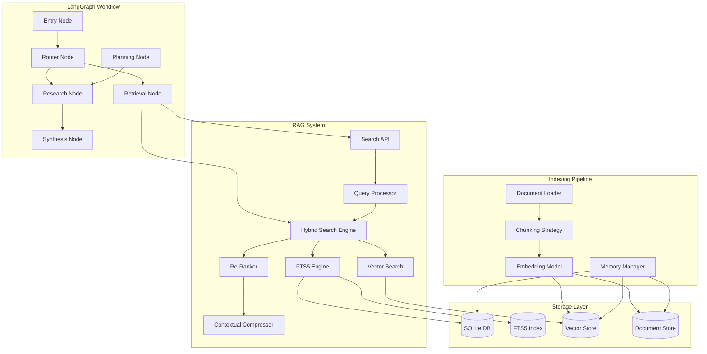
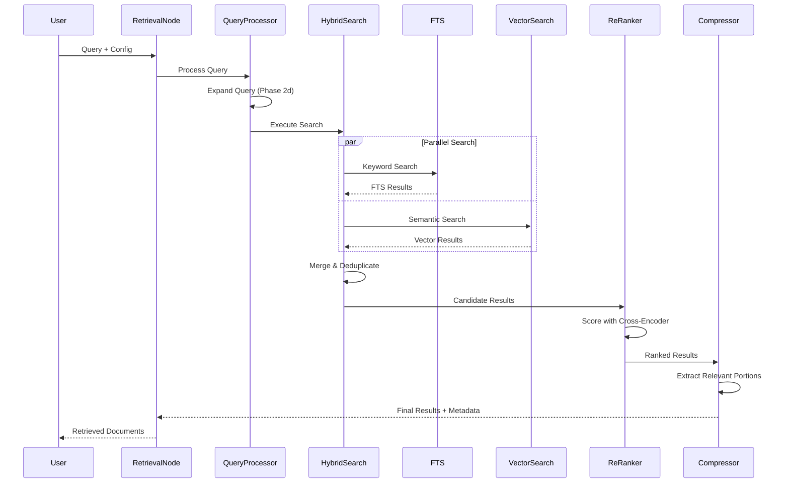
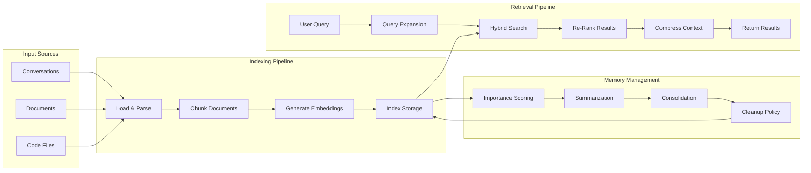

# Design Document: RAG Tool Implementation

## Overview

This design document specifies the technical architecture for implementing a Retrieval-Augmented Generation (RAG) system for a personal research agent built with LangGraph. The system will enable intelligent retrieval and use of information from past conversations, documents, and knowledge bases through five progressive phases.

### System Context

The RAG system integrates into an existing Python-based research agent that uses:
- **LangGraph** for workflow orchestration with nodes (research_node, synthesis_node, planning_node)
- **SQLite** for conversation/message persistence (database.py)
- **State management** via AgentState TypedDict with message history, research plans, and results
- **Checkpointer** for state persistence (SQLite/Postgres support)

### Design Goals

1. **Incremental Enhancement**: Each phase adds capability without breaking existing functionality
2. **Performance**: Sub-second retrieval for typical queries, scalable to 1M+ documents
3. **Flexibility**: Configurable backends (embedding models, vector stores) and search strategies
4. **Resilience**: Graceful degradation when components fail, comprehensive error handling
5. **Testability**: Property-based testing for correctness, comprehensive unit/integration tests

### Phase Overview

- **Phase 1**: SQLite FTS5 for keyword search on existing conversations
- **Phase 2b**: Vector embeddings and semantic search with hybrid retrieval
- **Phase 2c**: Multi-format document loading, chunking, and indexing
- **Phase 2d**: Advanced retrieval (query expansion, compression, multi-query, citations)
- **Phase 2e**: Memory management (summarization, importance scoring, cleanup policies)

## Architecture

### High-Level System Architecture



### Component Interaction Flow



### Data Flow Architecture



## Components and Interfaces

### 1. FTS Engine (Phase 1)

**Purpose**: Provide fast keyword-based search over conversation history using SQLite FTS5.

**Interface**:
```python
class FTSEngine:
    def __init__(self, db_path: str):
        """Initialize FTS5 virtual table linked to messages table."""
        
    def index_message(self, message_id: str, content: str) -> None:
        """Index a single message for full-text search."""
        
    def search(
        self,
        query: str,
        limit: int = 10,
        min_score: float = 0.0,
        filters: dict[str, Any] | None = None
    ) -> list[SearchResult]:
        """Execute FTS5 search with ranking.
        
        Args:
            query: Search query with FTS5 syntax support (phrases, boolean ops)
            limit: Maximum results to return
            min_score: Minimum BM25 score threshold
            filters: Optional metadata filters (conversation_id, date range)
            
        Returns:
            List of SearchResult with content, metadata, and relevance score
        """
        
    def delete_message(self, message_id: str) -> None:
        """Remove message from FTS index."""
        
    def rebuild_index(self) -> None:
        """Rebuild FTS index from messages table (maintenance operation)."""
```

**Implementation Details**:
- Create FTS5 virtual table: `CREATE VIRTUAL TABLE messages_fts USING fts5(content, content=messages, content_rowid=id)`
- Use triggers to keep FTS index synchronized with messages table
- Leverage BM25 ranking algorithm built into FTS5
- Support phrase queries ("exact match"), prefix matching (term*), boolean operators (AND, OR, NOT)
- Index creation adds ~10-15% storage overhead

**Database Schema Changes**:
```sql
-- FTS5 virtual table
CREATE VIRTUAL TABLE messages_fts USING fts5(
    content,
    content='messages',
    content_rowid='id',
    tokenize='porter unicode61'
);

-- Triggers for automatic index maintenance
CREATE TRIGGER messages_fts_insert AFTER INSERT ON messages BEGIN
    INSERT INTO messages_fts(rowid, content) VALUES (new.rowid, new.content);
END;

CREATE TRIGGER messages_fts_delete AFTER DELETE ON messages BEGIN
    DELETE FROM messages_fts WHERE rowid = old.rowid;
END;

CREATE TRIGGER messages_fts_update AFTER UPDATE ON messages BEGIN
    UPDATE messages_fts SET content = new.content WHERE rowid = new.rowid;
END;
```

### 2. Retrieval Node (Phase 1)

**Purpose**: LangGraph node that executes retrieval operations and integrates results into agent workflow.

**Interface**:
```python
class RetrievalNode:
    def __init__(
        self,
        fts_engine: FTSEngine,
        vector_search: VectorSearch | None = None,
        config: RetrievalConfig | None = None
    ):
        """Initialize retrieval node with search backends."""
        
    def __call__(self, state: AgentState) -> AgentState:
        """Execute retrieval based on current query in state.
        
        Extracts query from state.messages, executes configured search,
        and adds retrieved documents to state for downstream nodes.
        """
        
    def retrieve(
        self,
        query: str,
        method: Literal["fts", "vector", "hybrid"] = "hybrid",
        top_k: int = 5,
        min_score: float = 0.3
    ) -> list[RetrievedDocument]:
        """Execute retrieval with specified method and parameters."""
```

**State Integration**:
```python
class AgentState(TypedDict):
    # ... existing fields ...
    retrieved_documents: NotRequired[list[RetrievedDocument]]
    retrieval_metadata: NotRequired[dict[str, Any]]  # timing, method used, etc.
```

**Configuration**:
```python
class RetrievalConfig(BaseModel):
    method: Literal["fts", "vector", "hybrid"] = "hybrid"
    top_k: int = 5
    min_score: float = 0.3
    enable_reranking: bool = True
    enable_compression: bool = False
    fts_weight: float = 0.3  # For hybrid search
    vector_weight: float = 0.7
```

### 3. Search API (Phase 1)

**Purpose**: HTTP endpoints for testing and debugging retrieval functionality.

**Endpoints**:
```python
@router.post("/api/search")
async def search(request: SearchRequest) -> SearchResponse:
    """Execute search and return results.
    
    Request:
        {
            "query": "string",
            "method": "fts" | "vector" | "hybrid",
            "top_k": 10,
            "min_score": 0.3,
            "filters": {"conversation_id": "...", "date_range": [...]}
        }
    
    Response:
        {
            "results": [
                {
                    "content": "...",
                    "score": 0.85,
                    "metadata": {...},
                    "source": "conversation" | "document"
                }
            ],
            "total": 42,
            "execution_time_ms": 123
        }
    """

@router.get("/api/search/health")
async def health_check() -> HealthResponse:
    """Check status of all search components."""
```

### 4. Embedding Model (Phase 2b)

**Purpose**: Convert text to vector representations for semantic search.

**Interface**:
```python
class EmbeddingModel(ABC):
    @abstractmethod
    def embed(self, texts: list[str]) -> np.ndarray:
        """Generate embeddings for batch of texts.
        
        Returns: Array of shape (len(texts), embedding_dim)
        """
        
    @abstractmethod
    def embed_query(self, query: str) -> np.ndarray:
        """Generate embedding for single query (may use different prompt)."""
        
    @property
    @abstractmethod
    def dimension(self) -> int:
        """Embedding vector dimension."""

class SentenceTransformerEmbedding(EmbeddingModel):
    def __init__(self, model_name: str = "all-MiniLM-L6-v2"):
        """Initialize sentence-transformers model.
        
        Default model: 384 dimensions, fast inference, good quality.
        """

class OpenAIEmbedding(EmbeddingModel):
    def __init__(self, model: str = "text-embedding-3-small", api_key: str | None = None):
        """Initialize OpenAI embedding model.
        
        text-embedding-3-small: 1536 dimensions, high quality.
        """
```

**Implementation Strategy**:
- Cache embeddings using content hash as key to avoid recomputation
- Batch processing for efficiency (batch size: 32-64)
- Handle token limits by splitting long texts and averaging embeddings
- Normalize vectors to unit length for cosine similarity
- Support async embedding generation for non-blocking operations

### 5. Vector Store (Phase 2b)

**Purpose**: Efficient storage and similarity search over document embeddings.

**Interface**:
```python
class VectorStore(ABC):
    @abstractmethod
    def add(
        self,
        ids: list[str],
        embeddings: np.ndarray,
        texts: list[str],
        metadata: list[dict[str, Any]]
    ) -> None:
        """Add documents to vector store."""
        
    @abstractmethod
    def search(
        self,
        query_embedding: np.ndarray,
        top_k: int = 10,
        filters: dict[str, Any] | None = None
    ) -> list[VectorSearchResult]:
        """Find most similar documents."""
        
    @abstractmethod
    def delete(self, ids: list[str]) -> None:
        """Remove documents from store."""
        
    @abstractmethod
    def persist(self) -> None:
        """Save index to disk."""
        
    @abstractmethod
    def load(self) -> None:
        """Load index from disk."""

class ChromaVectorStore(VectorStore):
    """Chroma implementation with persistent storage."""
    
class FAISSVectorStore(VectorStore):
    """FAISS implementation for high-performance search."""
```

**Storage Strategy**:
- **Chroma**: Default choice, easy setup, built-in persistence, metadata filtering
- **FAISS**: Optional for large-scale deployments (>100K docs), requires separate metadata store
- Store original text alongside embeddings for retrieval
- Use HNSW index for sub-linear search complexity
- Partition large collections by source type for efficient filtering

**Database Schema for Metadata** (when using FAISS):
```sql
CREATE TABLE vector_metadata (
    id TEXT PRIMARY KEY,
    source_type TEXT NOT NULL,  -- 'conversation', 'document', 'code'
    source_id TEXT NOT NULL,     -- conversation_id or document_id
    chunk_index INTEGER,
    text_content TEXT NOT NULL,
    created_at TEXT NOT NULL,
    metadata_json TEXT,          -- Additional metadata as JSON
    importance_score REAL DEFAULT 0.5
);

CREATE INDEX idx_vector_source ON vector_metadata(source_type, source_id);
CREATE INDEX idx_vector_importance ON vector_metadata(importance_score);
```

### 6. Hybrid Search Engine (Phase 2b)

**Purpose**: Combine FTS and vector search results with intelligent merging.

**Interface**:
```python
class HybridSearchEngine:
    def __init__(
        self,
        fts_engine: FTSEngine,
        vector_store: VectorStore,
        embedding_model: EmbeddingModel,
        fts_weight: float = 0.3,
        vector_weight: float = 0.7
    ):
        """Initialize hybrid search with configurable weights."""
        
    def search(
        self,
        query: str,
        top_k: int = 10,
        min_score: float = 0.0,
        filters: dict[str, Any] | None = None
    ) -> list[HybridSearchResult]:
        """Execute parallel FTS and vector search, merge results.
        
        Algorithm:
        1. Execute FTS and vector search in parallel
        2. Normalize scores to [0, 1] range
        3. Compute weighted score: fts_weight * fts_score + vector_weight * vector_score
        4. Deduplicate by document ID, keeping highest score
        5. Sort by final score descending
        6. Return top_k results
        """
```

**Score Normalization**:
- FTS: Normalize BM25 scores using min-max scaling within result set
- Vector: Cosine similarity already in [-1, 1], map to [0, 1]
- Handle empty result sets gracefully (return results from successful method)

### 7. Re-Ranker (Phase 2b)

**Purpose**: Refine search results using cross-encoder models for better relevance.

**Interface**:
```python
class ReRanker:
    def __init__(self, model_name: str = "cross-encoder/ms-marco-MiniLM-L-6-v2"):
        """Initialize cross-encoder model for re-ranking."""
        
    def rerank(
        self,
        query: str,
        results: list[SearchResult],
        top_k: int | None = None
    ) -> list[SearchResult]:
        """Re-rank results using cross-encoder scores.
        
        Args:
            query: Original search query
            results: Initial search results to re-rank
            top_k: Optional limit on results to return (default: len(results))
            
        Returns:
            Results sorted by cross-encoder relevance score
        """
```

**Implementation**:
- Use cross-encoder models that score query-document pairs directly
- More accurate than bi-encoder (embedding) similarity but slower
- Apply to top-N candidates (e.g., top 100) before final selection
- Cache scores for repeated queries
- Fallback to original scores if cross-encoder fails

### 8. Document Loader (Phase 2c)

**Purpose**: Load and parse various document formats into text for indexing.

**Interface**:
```python
class DocumentLoader(ABC):
    @abstractmethod
    def load(self, file_path: Path) -> Document:
        """Load document from file path.
        
        Returns:
            Document with text content, metadata, and format info
            
        Raises:
            UnsupportedFormatError: If file format is not supported
            DocumentLoadError: If file is corrupted or unreadable
        """
        
    @abstractmethod
    def supports(self, file_path: Path) -> bool:
        """Check if this loader supports the given file."""

class Document(BaseModel):
    id: str  # Unique document identifier (hash of content + metadata)
    text: str  # Extracted text content
    metadata: DocumentMetadata
    source_type: Literal["pdf", "docx", "markdown", "text", "code"]
    
class DocumentMetadata(BaseModel):
    file_name: str
    file_path: str
    file_size: int  # bytes
    created_at: datetime
    modified_at: datetime
    author: str | None = None
    title: str | None = None
    language: str | None = None
    page_count: int | None = None  # For PDFs
    
class PDFLoader(DocumentLoader):
    """Load PDF files using PyPDF2 or pdfplumber."""
    
class DOCXLoader(DocumentLoader):
    """Load DOCX files using python-docx."""
    
class MarkdownLoader(DocumentLoader):
    """Load Markdown files with metadata extraction from frontmatter."""
    
class CodeLoader(DocumentLoader):
    """Load source code files with syntax-aware parsing."""
    
class TextLoader(DocumentLoader):
    """Load plain text files with encoding detection."""
```

**Implementation Strategy**:
- Use factory pattern to select appropriate loader based on file extension
- Extract metadata from file system and document properties
- Preserve formatting hints (headings, lists, code blocks) as metadata
- Handle encoding detection for text files (chardet library)
- For code files, extract docstrings, comments, and function signatures
- Generate document ID from content hash to detect duplicates

**Error Handling**:
- Catch and wrap library-specific exceptions into DocumentLoadError
- Validate file exists and is readable before attempting load
- Log warnings for partial failures (e.g., missing metadata)
- Return partial results when possible (e.g., text without metadata)

### 9. Chunking Strategy (Phase 2c)

**Purpose**: Split documents into optimal segments for retrieval.

**Interface**:
```python
class ChunkingStrategy(ABC):
    @abstractmethod
    def chunk(self, document: Document) -> list[Chunk]:
        """Split document into chunks.
        
        Returns:
            List of chunks with text, metadata, and position info
        """

class Chunk(BaseModel):
    id: str  # Unique chunk identifier
    document_id: str  # Reference to source document
    text: str  # Chunk text content
    chunk_index: int  # Position in document (0-based)
    start_char: int  # Character offset in original document
    end_char: int  # End character offset
    metadata: dict[str, Any]  # Inherited from document + chunk-specific
    
class RecursiveCharacterChunking(ChunkingStrategy):
    def __init__(
        self,
        chunk_size: int = 512,
        chunk_overlap: int = 50,
        separators: list[str] | None = None
    ):
        """Recursive chunking with configurable separators.
        
        Default separators: ["\n\n", "\n", ". ", " ", ""]
        """

class SemanticChunking(ChunkingStrategy):
    def __init__(
        self,
        embedding_model: EmbeddingModel,
        similarity_threshold: float = 0.7
    ):
        """Chunk based on semantic similarity between sentences."""

class CodeAwareChunking(ChunkingStrategy):
    def __init__(self, chunk_size: int = 512):
        """Chunk code by functions/classes, respecting syntax."""
```

**Chunking Algorithms**:

1. **Recursive Character Chunking** (default for prose):
   - Try splitting on paragraph breaks (\n\n)
   - If chunks too large, split on sentence boundaries (. )
   - If still too large, split on words
   - Add overlap by including last N tokens from previous chunk

2. **Semantic Chunking** (optional, slower):
   - Split document into sentences
   - Compute embeddings for each sentence
   - Group consecutive sentences with high similarity
   - Create chunk boundaries where similarity drops

3. **Code-Aware Chunking** (for source files):
   - Parse code into AST
   - Extract functions, classes, methods as natural chunks
   - Include docstrings and comments with code
   - Fall back to character chunking for non-parseable code

**Metadata Preservation**:
- Each chunk inherits document metadata
- Add chunk-specific metadata: index, character offsets, token count
- For code chunks: function name, class name, file path, line numbers
- For document chunks: section heading, page number (if available)

### 10. Query Expander (Phase 2d)

**Purpose**: Generate alternative query formulations to improve recall.

**Interface**:
```python
class QueryExpander:
    def __init__(
        self,
        llm: BaseLLM | None = None,
        expansion_count: int = 3
    ):
        """Initialize query expander with optional LLM."""
        
    def expand(self, query: str) -> list[str]:
        """Generate alternative query formulations.
        
        Returns:
            List of expanded queries including original
        """
        
    def expand_with_synonyms(self, query: str) -> list[str]:
        """Expand using synonym replacement (WordNet)."""
        
    def expand_with_llm(self, query: str) -> list[str]:
        """Expand using LLM to generate related queries."""
```

**Expansion Techniques**:

1. **Synonym Expansion** (rule-based):
   - Use WordNet or similar thesaurus
   - Replace key terms with synonyms
   - Generate 2-3 variations
   - Example: "fix bug" → "resolve issue", "correct error"

2. **LLM-Based Expansion** (when available):
   - Prompt: "Generate 3 alternative ways to ask: {query}"
   - Use temperature=0.7 for diversity
   - Filter out low-quality expansions (too short, too similar)
   - Example: "How do I deploy?" → "What's the deployment process?", "Steps to deploy application", "Deployment guide"

3. **Query Reformulation**:
   - Convert questions to statements and vice versa
   - Add context keywords (e.g., "python" if code-related)
   - Expand acronyms and abbreviations

**Implementation**:
- Cache expansions for common queries
- Timeout after 200ms, return original query if expansion fails
- Deduplicate expanded queries (case-insensitive)
- Limit total expanded queries to 5 to avoid performance impact

### 11. Contextual Compressor (Phase 2d)

**Purpose**: Extract relevant portions from retrieved documents to reduce context size.

**Interface**:
```python
class ContextualCompressor:
    def __init__(
        self,
        embedding_model: EmbeddingModel,
        min_compression_ratio: float = 0.2,
        max_compression_ratio: float = 0.8
    ):
        """Initialize compressor with embedding model for relevance scoring."""
        
    def compress(
        self,
        query: str,
        documents: list[RetrievedDocument]
    ) -> list[CompressedDocument]:
        """Extract relevant portions from documents.
        
        Returns:
            Documents with compressed text and relevance markers
        """

class CompressedDocument(BaseModel):
    original_id: str
    compressed_text: str
    compression_ratio: float  # Actual compression achieved
    relevant_sentences: list[int]  # Indices of kept sentences
    metadata: dict[str, Any]
```

**Compression Algorithm**:

1. **Sentence Extraction**:
   - Split document into sentences
   - Compute embedding for query
   - Compute embeddings for each sentence
   - Calculate cosine similarity between query and each sentence

2. **Relevance Scoring**:
   - Score each sentence by similarity to query
   - Apply position bias (sentences near highly relevant sentences get boost)
   - Consider sentence length (penalize very short sentences)

3. **Selection**:
   - Sort sentences by relevance score
   - Select top sentences until reaching target compression ratio
   - Reorder selected sentences to maintain original document flow
   - Add ellipsis (...) between non-consecutive sentences

4. **Quality Checks**:
   - Ensure at least min_compression_ratio is preserved
   - Ensure no more than max_compression_ratio is preserved
   - Maintain sentence completeness (no partial sentences)

**Performance Optimization**:
- Batch sentence embeddings for efficiency
- Cache sentence embeddings for frequently accessed documents
- Process documents in parallel
- Early exit if document is already short enough

### 12. Multi-Query Retrieval (Phase 2d)

**Purpose**: Decompose complex queries into focused sub-queries for comprehensive retrieval.

**Interface**:
```python
class MultiQueryRetriever:
    def __init__(
        self,
        base_retriever: HybridSearchEngine,
        llm: BaseLLM | None = None
    ):
        """Initialize multi-query retriever."""
        
    def retrieve(
        self,
        query: str,
        top_k: int = 10
    ) -> MultiQueryResult:
        """Decompose query and retrieve for each sub-query.
        
        Returns:
            Aggregated results with sub-query attribution
        """
        
    def decompose_query(self, query: str) -> list[str]:
        """Break complex query into focused sub-queries."""

class MultiQueryResult(BaseModel):
    original_query: str
    sub_queries: list[str]
    results: list[RetrievedDocument]
    result_attribution: dict[str, list[str]]  # doc_id -> sub_queries that found it
```

**Query Decomposition**:

1. **LLM-Based Decomposition** (preferred):
   - Prompt: "Break this question into 2-4 focused sub-questions: {query}"
   - Example: "How do I deploy and monitor my app?" → 
     - "How do I deploy my application?"
     - "How do I monitor my application?"
     - "What deployment tools are available?"

2. **Rule-Based Decomposition** (fallback):
   - Detect conjunctions (and, or, also)
   - Split on question marks for multiple questions
   - Extract distinct topics using keyword extraction
   - Example: "authentication and authorization" → "authentication", "authorization"

**Retrieval Strategy**:
- Execute retrieval for each sub-query in parallel
- Collect results from all sub-queries
- Deduplicate documents (keep highest score)
- Track which sub-queries retrieved each document
- Boost scores for documents found by multiple sub-queries

**Result Aggregation**:
- Merge results using max score across sub-queries
- Add 10% score boost for each additional sub-query that found the document
- Sort by final aggregated score
- Return top-k results with attribution metadata

### 13. Citation Tracker (Phase 2d)

**Purpose**: Maintain source references for retrieved information.

**Interface**:
```python
class CitationTracker:
    def __init__(self, document_store: DocumentStore):
        """Initialize citation tracker with document store."""
        
    def create_citation(
        self,
        document_id: str,
        chunk_id: str | None = None
    ) -> Citation:
        """Create citation for a document or chunk."""
        
    def format_citation(
        self,
        citation: Citation,
        style: Literal["apa", "mla", "chicago"] = "apa"
    ) -> str:
        """Format citation in specified style."""
        
    def get_source_document(self, citation_id: str) -> Document:
        """Retrieve full source document for citation."""
        
    def track_usage(self, citation_id: str, context: str) -> None:
        """Record that a citation was used in a response."""

class Citation(BaseModel):
    id: str  # Unique citation identifier
    document_id: str
    chunk_id: str | None
    title: str
    author: str | None
    date: datetime
    source_type: str
    url: str | None
    page_number: int | None
    excerpt: str  # Short excerpt for context
    
class DocumentStore:
    """Storage for original documents and metadata."""
    
    def get_document(self, document_id: str) -> Document:
        """Retrieve document by ID."""
        
    def store_document(self, document: Document) -> str:
        """Store document and return ID."""
```

**Citation Formats**:

1. **APA Style**:
   ```
   Author, A. (Year). Title. Source. URL
   ```

2. **MLA Style**:
   ```
   Author. "Title." Source, Date, URL.
   ```

3. **Chicago Style**:
   ```
   Author. Title. Source, Year. URL.
   ```

**Implementation**:
- Store citations in SQLite with document references
- Generate citation IDs from document ID + chunk ID
- Track citation usage for analytics
- Support citation export to BibTeX, RIS formats
- Mark citations as unavailable when source document is deleted (soft delete)

**Database Schema**:
```sql
CREATE TABLE citations (
    id TEXT PRIMARY KEY,
    document_id TEXT NOT NULL,
    chunk_id TEXT,
    title TEXT NOT NULL,
    author TEXT,
    date TEXT NOT NULL,
    source_type TEXT NOT NULL,
    url TEXT,
    page_number INTEGER,
    excerpt TEXT,
    created_at TEXT NOT NULL,
    FOREIGN KEY (document_id) REFERENCES documents(id)
);

CREATE TABLE citation_usage (
    citation_id TEXT NOT NULL,
    used_at TEXT NOT NULL,
    context TEXT,
    FOREIGN KEY (citation_id) REFERENCES citations(id)
);

CREATE INDEX idx_citation_document ON citations(document_id);
CREATE INDEX idx_citation_usage ON citation_usage(citation_id, used_at);
```

### 14. Memory Manager (Phase 2e)

**Purpose**: Manage conversation summarization, consolidation, and cleanup.

**Interface**:
```python
class MemoryManager:
    def __init__(
        self,
        db: Database,
        vector_store: VectorStore,
        llm: BaseLLM,
        importance_scorer: ImportanceScorer,
        cleanup_policy: CleanupPolicy
    ):
        """Initialize memory manager with dependencies."""
        
    def summarize_conversation(
        self,
        conversation_id: str,
        incremental: bool = True
    ) -> ConversationSummary:
        """Generate or update conversation summary.
        
        Args:
            conversation_id: ID of conversation to summarize
            incremental: If True, update existing summary; if False, regenerate
        """
        
    def consolidate_memories(
        self,
        similarity_threshold: float = 0.85,
        require_approval: bool = True
    ) -> list[ConsolidationProposal]:
        """Identify and optionally merge similar memories."""
        
    def cleanup(
        self,
        dry_run: bool = False
    ) -> CleanupReport:
        """Execute cleanup based on configured policies."""
        
    def archive_memory(self, memory_id: str) -> None:
        """Move memory to cold storage."""
        
    def restore_memory(self, memory_id: str) -> None:
        """Restore archived memory to active storage."""

class ConversationSummary(BaseModel):
    conversation_id: str
    summary_text: str
    key_entities: list[str]
    key_topics: list[str]
    key_decisions: list[str]
    message_count: int
    created_at: datetime
    updated_at: datetime
    
class ConsolidationProposal(BaseModel):
    memory_ids: list[str]
    similarity_score: float
    proposed_merged_text: str
    requires_approval: bool
```

**Summarization Strategy**:

1. **Initial Summary** (conversation > 50 messages):
   - Extract key messages (high importance scores)
   - Use LLM to generate summary: "Summarize this conversation, focusing on key topics, decisions, and entities"
   - Extract entities using NER (spaCy or similar)
   - Store summary as separate indexed document

2. **Incremental Updates** (new messages added):
   - Summarize new messages since last summary
   - Use LLM to merge: "Update this summary with new information: {old_summary} + {new_messages}"
   - More efficient than regenerating full summary

3. **Summary Indexing**:
   - Index summaries in vector store with metadata: `source_type="summary"`
   - Link summary to original conversation messages
   - Include summary in search results alongside individual messages

**Consolidation Algorithm**:

1. **Similarity Detection**:
   - Compute pairwise cosine similarity for all memories modified in past 30 days
   - Identify clusters with similarity > threshold (default 0.85)
   - Filter out memories with high importance scores (> 0.8) unless manually approved

2. **Merge Proposal**:
   - For each cluster, generate merged text using LLM
   - Preserve all source references and timestamps
   - Calculate combined importance score (max of individual scores)

3. **Execution**:
   - If requires_approval, present to user
   - On approval, create merged memory
   - Mark original memories as consolidated (soft delete)
   - Update vector store with merged embedding

**Database Schema**:
```sql
CREATE TABLE conversation_summaries (
    id TEXT PRIMARY KEY,
    conversation_id TEXT NOT NULL,
    summary_text TEXT NOT NULL,
    key_entities TEXT,  -- JSON array
    key_topics TEXT,    -- JSON array
    key_decisions TEXT, -- JSON array
    message_count INTEGER NOT NULL,
    created_at TEXT NOT NULL,
    updated_at TEXT NOT NULL,
    FOREIGN KEY (conversation_id) REFERENCES conversations(id)
);

CREATE TABLE memory_consolidations (
    id TEXT PRIMARY KEY,
    merged_memory_id TEXT NOT NULL,
    source_memory_ids TEXT NOT NULL,  -- JSON array
    similarity_score REAL NOT NULL,
    consolidated_at TEXT NOT NULL,
    approved_by TEXT
);

CREATE INDEX idx_summary_conversation ON conversation_summaries(conversation_id);
```

### 15. Importance Scorer (Phase 2e)

**Purpose**: Assign relevance scores to memories for prioritization.

**Interface**:
```python
class ImportanceScorer:
    def __init__(self, db: Database, vector_store: VectorStore):
        """Initialize importance scorer."""
        
    def score_memory(self, memory_id: str) -> float:
        """Calculate importance score for a memory.
        
        Returns:
            Score in range [0.0, 1.0]
        """
        
    def update_scores(self, memory_ids: list[str] | None = None) -> None:
        """Recalculate scores for specified memories (or all if None)."""
        
    def record_access(self, memory_id: str) -> None:
        """Record that a memory was accessed (increases importance)."""
        
    def set_manual_importance(self, memory_id: str, score: float) -> None:
        """Override automatic scoring with manual importance."""

class ImportanceFactors(BaseModel):
    recency_score: float  # 0-1, based on age
    access_frequency_score: float  # 0-1, based on access count
    semantic_centrality_score: float  # 0-1, based on similarity to other memories
    user_feedback_score: float  # 0-1, based on explicit user ratings
    manual_override: float | None  # If set, overrides calculated score
```

**Scoring Algorithm**:

1. **Recency Score**:
   ```python
   days_old = (now - created_at).days
   recency_score = exp(-days_old / 30)  # Exponential decay, half-life 30 days
   ```

2. **Access Frequency Score**:
   ```python
   access_count = count_accesses_last_30_days(memory_id)
   access_frequency_score = min(1.0, access_count / 10)  # Cap at 10 accesses
   ```

3. **Semantic Centrality Score**:
   ```python
   # Average similarity to other memories
   similarities = compute_similarities(memory_embedding, all_embeddings)
   centrality_score = mean(top_k(similarities, k=10))
   ```

4. **User Feedback Score**:
   ```python
   # Based on explicit user actions: bookmark, share, reference
   feedback_score = (bookmarks * 0.5 + shares * 0.3 + references * 0.2)
   ```

5. **Final Score**:
   ```python
   if manual_override is not None:
       return manual_override
   
   final_score = (
       0.3 * recency_score +
       0.3 * access_frequency_score +
       0.2 * semantic_centrality_score +
       0.2 * user_feedback_score
   )
   return final_score
   ```

**Database Schema**:
```sql
CREATE TABLE memory_importance (
    memory_id TEXT PRIMARY KEY,
    importance_score REAL NOT NULL,
    recency_score REAL NOT NULL,
    access_frequency_score REAL NOT NULL,
    semantic_centrality_score REAL NOT NULL,
    user_feedback_score REAL NOT NULL,
    manual_override REAL,
    last_updated TEXT NOT NULL,
    FOREIGN KEY (memory_id) REFERENCES vector_metadata(id)
);

CREATE TABLE memory_access_log (
    memory_id TEXT NOT NULL,
    accessed_at TEXT NOT NULL,
    access_type TEXT NOT NULL,  -- 'retrieval', 'bookmark', 'share', 'reference'
    FOREIGN KEY (memory_id) REFERENCES vector_metadata(id)
);

CREATE INDEX idx_importance_score ON memory_importance(importance_score);
CREATE INDEX idx_access_log ON memory_access_log(memory_id, accessed_at);
```

### 16. Cleanup Policy Engine (Phase 2e)

**Purpose**: Define and execute rules for memory archival and deletion.

**Interface**:
```python
class CleanupPolicy:
    def __init__(self, config: CleanupConfig):
        """Initialize cleanup policy with configuration."""
        
    def identify_candidates(self) -> list[CleanupCandidate]:
        """Identify memories eligible for cleanup."""
        
    def should_archive(self, memory: Memory) -> bool:
        """Determine if memory should be archived."""
        
    def should_delete(self, memory: Memory) -> bool:
        """Determine if memory should be permanently deleted."""

class CleanupConfig(BaseModel):
    retention_period_days: int = 90
    min_importance_threshold: float = 0.3
    protected_importance_threshold: float = 0.7
    recent_access_protection_days: int = 7
    storage_limit_gb: float | None = None
    emergency_cleanup_threshold: float = 0.9  # Trigger at 90% storage
    
    # Source-specific retention
    conversation_retention_days: int = 90
    document_retention_days: int = 365
    code_retention_days: int = 180

class CleanupCandidate(BaseModel):
    memory_id: str
    reason: str
    importance_score: float
    age_days: int
    last_accessed: datetime
    storage_size_bytes: int
    
class CleanupReport(BaseModel):
    execution_time: datetime
    dry_run: bool
    candidates_identified: int
    memories_archived: int
    memories_deleted: int
    storage_reclaimed_bytes: int
    errors: list[str]
```

**Cleanup Rules**:

1. **Archive Candidates**:
   - Age > retention_period_days AND importance < min_importance_threshold
   - NOT accessed in last recent_access_protection_days
   - NOT importance > protected_importance_threshold
   - NOT manually marked as important

2. **Delete Candidates** (from archive):
   - Archived > 2 * retention_period_days
   - Importance < 0.1
   - Zero accesses since archival

3. **Emergency Cleanup** (storage > emergency_cleanup_threshold):
   - Sort all memories by importance score
   - Archive lowest-scoring memories until storage < 80%
   - Never delete memories with importance > 0.5

4. **Source-Specific Rules**:
   - Conversations: Apply conversation_retention_days
   - Documents: Apply document_retention_days
   - Code: Apply code_retention_days

**Execution Strategy**:
- Run daily at configured time (default: 2 AM)
- Support dry-run mode for testing
- Generate detailed reports
- Send alerts for emergency cleanups
- Implement rate limiting (max 1000 operations per run)
- Checkpoint progress for resumability

**Database Schema**:
```sql
CREATE TABLE cleanup_history (
    id TEXT PRIMARY KEY,
    execution_time TEXT NOT NULL,
    dry_run INTEGER NOT NULL,
    candidates_identified INTEGER NOT NULL,
    memories_archived INTEGER NOT NULL,
    memories_deleted INTEGER NOT NULL,
    storage_reclaimed_bytes INTEGER NOT NULL,
    errors TEXT,  -- JSON array
    config_snapshot TEXT NOT NULL  -- JSON of CleanupConfig
);

CREATE TABLE archived_memories (
    memory_id TEXT PRIMARY KEY,
    original_data TEXT NOT NULL,  -- JSON snapshot
    archived_at TEXT NOT NULL,
    archive_reason TEXT NOT NULL,
    importance_score REAL NOT NULL
);

CREATE INDEX idx_archived_at ON archived_memories(archived_at);
```

## Data Models

### Core Data Structures

```python
class SearchResult(BaseModel):
    """Result from any search operation."""
    id: str
    content: str
    score: float  # Normalized to [0, 1]
    source_type: Literal["conversation", "document", "code", "summary"]
    metadata: dict[str, Any]
    
class RetrievedDocument(BaseModel):
    """Document retrieved by retrieval node."""
    id: str
    content: str
    score: float
    source: DocumentSource
    chunk_info: ChunkInfo | None
    citation: Citation
    
class DocumentSource(BaseModel):
    type: Literal["conversation", "document", "code"]
    id: str
    title: str
    created_at: datetime
    
class ChunkInfo(BaseModel):
    chunk_index: int
    total_chunks: int
    start_char: int
    end_char: int
    
class HybridSearchResult(SearchResult):
    """Extended result with hybrid search metadata."""
    fts_score: float | None
    vector_score: float | None
    rerank_score: float | None
    
class VectorSearchResult(BaseModel):
    """Result from vector similarity search."""
    id: str
    text: str
    similarity: float  # Cosine similarity
    metadata: dict[str, Any]
```

### Configuration Models

```python
class RAGConfig(BaseModel):
    """Master configuration for RAG system."""
    
    # Database
    db_path: str = "data/rag.db"
    
    # Embedding
    embedding_provider: Literal["sentence-transformers", "openai"] = "sentence-transformers"
    embedding_model: str = "all-MiniLM-L6-v2"
    embedding_dimension: int = 384
    
    # Vector Store
    vector_store_type: Literal["chroma", "faiss"] = "chroma"
    vector_store_path: str = "data/vector_store"
    
    # Search
    default_search_method: Literal["fts", "vector", "hybrid"] = "hybrid"
    fts_weight: float = 0.3
    vector_weight: float = 0.7
    default_top_k: int = 5
    min_relevance_score: float = 0.3
    
    # Re-ranking
    enable_reranking: bool = True
    reranker_model: str = "cross-encoder/ms-marco-MiniLM-L-6-v2"
    rerank_top_n: int = 100
    
    # Chunking
    chunk_size: int = 512
    chunk_overlap: int = 50
    chunking_strategy: Literal["recursive", "semantic", "code-aware"] = "recursive"
    
    # Advanced Retrieval
    enable_query_expansion: bool = True
    enable_compression: bool = False
    enable_multi_query: bool = False
    query_expansion_count: int = 3
    
    # Memory Management
    enable_summarization: bool = True
    summarization_threshold: int = 50  # messages
    enable_consolidation: bool = True
    consolidation_similarity: float = 0.85
    
    # Cleanup
    cleanup_schedule: str = "0 2 * * *"  # Cron format
    retention_period_days: int = 90
    min_importance_threshold: float = 0.3
    storage_limit_gb: float | None = None
    
    # Performance
    max_concurrent_searches: int = 10
    cache_size: int = 1000
    batch_size: int = 32
    
    # LLM (optional)
    llm_provider: str | None = None
    llm_model: str | None = None
    llm_api_key: str | None = None
```


## Correctness Properties

*A property is a characteristic or behavior that should hold true across all valid executions of a system—essentially, a formal statement about what the system should do. Properties serve as the bridge between human-readable specifications and machine-verifiable correctness guarantees.*

### Property Reflection

After analyzing all acceptance criteria, I identified the following redundancies and consolidations:

- **FTS Operations**: Properties 1.2 (insert/index) and 1.5 (delete/remove) can be combined into a single "FTS synchronization" property
- **Metadata Preservation**: Properties 2.2, 7.3, 8.3, 8.6, and 9.4 all test metadata preservation and can be consolidated
- **Score Normalization**: Properties 6.6 and general score range checks can be combined
- **Deduplication**: Properties 6.4, 11.4, and 13.3 all test deduplication and can be unified
- **Round-Trip Operations**: Properties 5.7, 9.7, 14.5, and 17.6 are all round-trip tests that can be grouped
- **Result Ordering**: Properties 1.3, 5.3, and 7.1 all test descending score ordering
- **Cleanup Invariants**: Properties 17.3 and 17.4 are both "never delete" invariants that can be combined

The following properties provide unique validation value and will be included:


### Property 1: FTS Index Synchronization

*For any* message in the conversation database, inserting the message should make it findable via FTS search, and deleting the message should make it unfindable via FTS search.

**Validates: Requirements 1.2, 1.5**

### Property 2: Search Result Ordering

*For any* search operation (FTS, vector, or hybrid), results SHALL be ordered by descending relevance score, with no result having a higher score than any result before it.

**Validates: Requirements 1.3, 5.3, 7.1**

### Property 3: Metadata Preservation

*For any* document or chunk processed through the system (loading, chunking, indexing, retrieval), all original metadata fields SHALL be preserved in the final result, with only relevance scores and retrieval-specific metadata added.

**Validates: Requirements 2.2, 7.3, 8.3, 8.6, 9.4**

### Property 4: Embedding Dimension Consistency

*For any* text input, the embedding model SHALL produce a vector of the configured fixed dimension, regardless of input length or content.

**Validates: Requirements 4.1**

### Property 5: Embedding Caching

*For any* text input, generating embeddings for the same text twice SHALL use the cached result on the second call, producing identical vectors without recomputation.

**Validates: Requirements 4.6**

### Property 6: Self-Similarity Invariant

*For any* text input, computing the embedding and then calculating cosine similarity with itself SHALL yield a score of 1.0 (within floating-point precision ε = 0.0001).

**Validates: Requirements 4.7**


### Property 7: Vector Store Completeness

*For any* document indexed in the vector store, the stored entry SHALL contain the embedding vector, original text, and all metadata fields provided during indexing.

**Validates: Requirements 5.2**

### Property 8: Vector Store Persistence Round-Trip

*For any* set of indexed documents, persisting the vector store to disk and then reloading it SHALL preserve all documents, embeddings, and metadata, with search results identical to before persistence.

**Validates: Requirements 5.4**

### Property 9: Metadata Filtering

*For any* metadata filter applied to a search, all returned results SHALL match the filter criteria, and no results violating the filter SHALL be returned.

**Validates: Requirements 5.5, 10.4**

### Property 10: Index-Search Round-Trip

*For any* document with unique content, indexing the document and then searching with its exact text SHALL return that document as the top result (or tied for top with similarity ≥ 0.99).

**Validates: Requirements 5.7**

### Property 11: Score Normalization

*For any* search result from any search method (FTS, vector, hybrid, re-ranked), the relevance score SHALL be in the range [0.0, 1.0].

**Validates: Requirements 6.6**

### Property 12: Result Deduplication

*For any* search operation that combines multiple result sources (hybrid search, query expansion, multi-query), the final result set SHALL contain no duplicate document IDs.

**Validates: Requirements 6.4, 11.4, 13.3**


### Property 13: Stable Sort Preservation

*For any* result set being re-ranked, documents with identical relevance scores SHALL maintain their relative order from the input (stable sort).

**Validates: Requirements 7.6**

### Property 14: Document Loading Completeness

*For any* supported document type, loading the document SHALL extract all text content without data loss, preserving the complete textual information.

**Validates: Requirements 8.7**

### Property 15: Chunk Size Bounds

*For any* document being chunked with configured chunk_size, each chunk (except possibly the last) SHALL have a token count within the range [chunk_size * 0.8, chunk_size * 1.2], allowing for sentence boundary preservation.

**Validates: Requirements 9.1**

### Property 16: Chunk Overlap Consistency

*For any* two adjacent chunks from the same document, the end of chunk N SHALL overlap with the beginning of chunk N+1 by approximately the configured overlap amount (within 20% tolerance).

**Validates: Requirements 9.2**

### Property 17: Sentence Boundary Preservation

*For any* chunk generated by the chunking strategy, the chunk text SHALL not end mid-sentence (must end with sentence-ending punctuation: . ! ? or end of document).

**Validates: Requirements 9.3**

### Property 18: Chunking Round-Trip

*For any* document, concatenating all chunks in order (by chunk_index) SHALL reproduce the original document text exactly.

**Validates: Requirements 9.7**


### Property 19: Source Type Tagging

*For any* search result, the result SHALL include a source_type tag indicating its origin (conversation, document, code, summary).

**Validates: Requirements 10.3**

### Property 20: Query Expansion Count

*For any* query with expansion enabled, the query expander SHALL generate between 2 and 5 alternative formulations (inclusive), including the original query.

**Validates: Requirements 11.1**

### Property 21: Compression Ratio Bounds

*For any* document processed by the contextual compressor, the compressed text length SHALL be between 20% and 80% of the original document length.

**Validates: Requirements 12.2**

### Property 22: Compression Sentence Completeness

*For any* compressed document, all sentences in the compressed text SHALL be complete sentences from the original document (no partial sentences).

**Validates: Requirements 12.3**

### Property 23: Compression Relevance Correlation

*For any* two documents with different relevance scores, the document with higher relevance SHALL have a compression ratio ≥ the document with lower relevance (more relevant = less compression).

**Validates: Requirements 12.5**

### Property 24: Multi-Query Decomposition Count

*For any* complex query processed by multi-query retrieval, the system SHALL decompose it into 2-4 focused sub-queries.

**Validates: Requirements 13.1**


### Property 25: Sub-Query Attribution

*For any* result from multi-query retrieval, the result SHALL include attribution metadata indicating which sub-query (or queries) retrieved it.

**Validates: Requirements 13.4**

### Property 26: Citation Uniqueness

*For any* indexed document, the citation tracker SHALL assign a unique citation ID that remains stable across system restarts.

**Validates: Requirements 14.1**

### Property 27: Citation Completeness

*For any* retrieved document, the citation SHALL include document ID, title, and location information.

**Validates: Requirements 14.2**

### Property 28: Citation Retrieval Round-Trip

*For any* citation ID, retrieving the full source document SHALL return the original document that the citation references.

**Validates: Requirements 14.5**

### Property 29: Citation Soft Delete

*For any* deleted document, its citations SHALL remain in the system but be marked as unavailable, not permanently removed.

**Validates: Requirements 14.6**

### Property 30: Conversation Summary Generation

*For any* conversation with more than 50 messages, the memory manager SHALL generate a summary that is indexed and searchable.

**Validates: Requirements 15.1**

### Property 31: Summary Indexing

*For any* generated conversation summary, the summary SHALL be indexed in the vector store with source_type="summary" and be retrievable via search.

**Validates: Requirements 15.3**


### Property 32: Summary Source Linking

*For any* retrieved conversation summary, the summary metadata SHALL include links to the original conversation messages.

**Validates: Requirements 15.6**

### Property 33: Importance Score Range

*For any* memory in the system, the importance scorer SHALL assign a score in the range [0.0, 1.0].

**Validates: Requirements 16.1**

### Property 34: Access Increases Importance

*For any* memory, accessing the memory SHALL result in its importance score increasing or staying the same, never decreasing.

**Validates: Requirements 16.3**

### Property 35: Time Decays Importance

*For any* unaccessed memory, the passage of time SHALL result in its importance score decreasing or staying the same, never increasing.

**Validates: Requirements 16.4**

### Property 36: Manual Override Precedence

*For any* memory with a manual importance override, the effective importance score SHALL equal the manual override value, ignoring automatic calculations.

**Validates: Requirements 16.5**

### Property 37: Cleanup Age and Importance Filter

*For any* memory archived by cleanup policy, the memory SHALL satisfy: (age > retention_period AND importance < min_importance_threshold).

**Validates: Requirements 17.2**


### Property 38: High-Importance Protection

*For any* memory with importance score > 0.7, the cleanup policy SHALL never delete or archive the memory, regardless of age or access patterns.

**Validates: Requirements 17.3**

### Property 39: Recent Access Protection

*For any* memory accessed within the past 7 days, the cleanup policy SHALL never delete or archive the memory, regardless of importance score or age.

**Validates: Requirements 17.4**

### Property 40: Archive Preservation

*For any* archived memory, the memory SHALL be moved to cold storage and remain retrievable (not permanently deleted).

**Validates: Requirements 17.5**

### Property 41: Archive-Restore Round-Trip

*For any* memory, archiving the memory and then restoring it SHALL result in the memory being in the active store with all original data preserved.

**Validates: Requirements 17.6**

### Property 42: Cleanup Logging

*For any* cleanup operation (archive or delete), the operation SHALL be logged with timestamp, memory ID, and reason.

**Validates: Requirements 17.7**

### Property 43: Consolidation Similarity Threshold

*For any* consolidation proposal, all memories in the proposal SHALL have pairwise cosine similarity > 0.85.

**Validates: Requirements 18.2**


### Property 44: Consolidation Metadata Preservation

*For any* consolidated memory, the merged result SHALL preserve all source references, timestamps, and metadata from the original memories.

**Validates: Requirements 18.4**

### Property 45: High-Importance Consolidation Approval

*For any* consolidation proposal involving memories with importance > 0.8, the proposal SHALL require manual approval before execution.

**Validates: Requirements 18.6**

### Property 46: Emergency Cleanup Trigger

*For any* system state where storage usage exceeds 90% of the configured limit, the memory manager SHALL trigger emergency cleanup.

**Validates: Requirements 19.3**

### Property 47: Source-Specific Retention

*For any* cleanup operation, memories of different source types (conversation, document, code) SHALL be evaluated against their respective retention periods.

**Validates: Requirements 19.4**

### Property 48: Cleanup Report Generation

*For any* cleanup operation, the memory manager SHALL generate a report including items removed, storage reclaimed, and any policy violations.

**Validates: Requirements 19.5**

### Property 49: Dry-Run Idempotence

*For any* cleanup policy, running in dry-run mode SHALL not modify any system state (no deletions, no archival, no database changes).

**Validates: Requirements 19.6**


## Error Handling

### Error Handling Strategy

The RAG system implements a defense-in-depth error handling approach with multiple layers:

1. **Input Validation**: Validate all inputs at API boundaries
2. **Graceful Degradation**: Fall back to simpler methods when advanced features fail
3. **Retry Logic**: Implement exponential backoff for transient failures
4. **Error Propagation**: Use typed exceptions for clear error communication
5. **Logging**: Comprehensive logging at all error points
6. **Health Checks**: Continuous monitoring of component health

### Exception Hierarchy

```python
class RAGException(Exception):
    """Base exception for all RAG system errors."""
    pass

class ConfigurationError(RAGException):
    """Invalid configuration or missing required settings."""
    pass

class DocumentLoadError(RAGException):
    """Failed to load or parse document."""
    pass

class UnsupportedFormatError(DocumentLoadError):
    """Document format not supported."""
    pass

class EmbeddingError(RAGException):
    """Failed to generate embeddings."""
    pass

class VectorStoreError(RAGException):
    """Vector store operation failed."""
    pass

class SearchError(RAGException):
    """Search operation failed."""
    pass

class CleanupError(RAGException):
    """Memory cleanup operation failed."""
    pass
```


### Component-Specific Error Handling

#### FTS Engine
- **Database Locked**: Retry with exponential backoff (max 3 attempts)
- **Corrupt Index**: Rebuild index from messages table
- **Query Syntax Error**: Log error, return empty results with warning

#### Embedding Model
- **Model Not Found**: Fail fast at initialization with clear error message
- **Token Limit Exceeded**: Automatically split text and average embeddings
- **API Rate Limit** (OpenAI): Implement exponential backoff, queue requests
- **Network Timeout**: Retry up to 3 times, then fail with cached results if available

#### Vector Store
- **Store Not Initialized**: Lazy initialization on first use
- **Disk Full**: Trigger emergency cleanup, alert administrators
- **Corruption Detected**: Attempt recovery from last checkpoint, rebuild if necessary
- **Search Timeout**: Return partial results with warning

#### Hybrid Search
- **FTS Failure**: Fall back to vector-only search, log warning
- **Vector Search Failure**: Fall back to FTS-only search, log warning
- **Both Failed**: Return empty results, log error, alert monitoring

#### Document Loader
- **File Not Found**: Return descriptive error with file path
- **Permission Denied**: Return error with permission requirements
- **Corrupted File**: Log error, skip file, continue with remaining files
- **Unsupported Format**: Return UnsupportedFormatError with format type

#### Memory Manager
- **LLM Unavailable**: Skip summarization, log warning
- **Cleanup Failure**: Rollback transaction, log error, retry on next schedule
- **Archive Storage Full**: Alert administrators, pause archival

### Retry Configuration

```python
class RetryConfig(BaseModel):
    max_attempts: int = 3
    initial_delay_ms: int = 100
    max_delay_ms: int = 5000
    exponential_base: float = 2.0
    jitter: bool = True  # Add randomness to prevent thundering herd
```

### Health Check System

```python
class HealthStatus(BaseModel):
    component: str
    status: Literal["healthy", "degraded", "unhealthy"]
    message: str
    last_check: datetime
    
class SystemHealth(BaseModel):
    overall_status: Literal["healthy", "degraded", "unhealthy"]
    components: list[HealthStatus]
    
# Health check endpoint
@router.get("/api/health")
async def health_check() -> SystemHealth:
    """Check health of all RAG components."""
    checks = [
        check_database_health(),
        check_fts_health(),
        check_vector_store_health(),
        check_embedding_model_health(),
    ]
    return aggregate_health(checks)
```


## Testing Strategy

### Testing Approach

The RAG system employs a comprehensive testing strategy combining multiple testing methodologies:

1. **Unit Tests**: Test individual components in isolation
2. **Property-Based Tests**: Verify universal properties across all inputs
3. **Integration Tests**: Validate end-to-end workflows
4. **Performance Tests**: Benchmark search operations at scale
5. **Regression Tests**: Ensure bug fixes remain fixed

### Dual Testing Philosophy

**Unit Tests** and **Property-Based Tests** are complementary and both required:

- **Unit Tests**: Focus on specific examples, edge cases, and error conditions
  - Verify specific document formats load correctly
  - Test error handling with corrupted files
  - Validate API response formats
  - Test integration between components

- **Property-Based Tests**: Verify universal properties across all inputs
  - Test round-trip operations (embed→search, chunk→concatenate)
  - Verify invariants (score ranges, ordering, metadata preservation)
  - Test with randomly generated data for comprehensive coverage
  - Minimum 100 iterations per property test

Together, unit tests catch concrete bugs while property tests verify general correctness.

### Property-Based Testing Configuration

**Framework**: Use `hypothesis` (Python) for property-based testing

**Configuration**:
```python
from hypothesis import given, settings, strategies as st

@settings(max_examples=100, deadline=None)
@given(text=st.text(min_size=1, max_size=1000))
def test_embedding_dimension_consistency(text):
    """Feature: rag-tool-implementation, Property 4: Embedding dimension consistency"""
    embedding = embedding_model.embed_query(text)
    assert embedding.shape[0] == embedding_model.dimension
```

**Tagging Convention**: Each property test MUST include a comment tag:
```python
"""Feature: rag-tool-implementation, Property {N}: {property description}"""
```


### Test Organization

```
tests/
├── unit/
│   ├── test_fts_engine.py
│   ├── test_embedding_model.py
│   ├── test_vector_store.py
│   ├── test_document_loader.py
│   ├── test_chunking.py
│   ├── test_retrieval_node.py
│   ├── test_memory_manager.py
│   └── test_cleanup_policy.py
├── property/
│   ├── test_properties_phase1.py      # Properties 1-3
│   ├── test_properties_phase2b.py     # Properties 4-13
│   ├── test_properties_phase2c.py     # Properties 14-19
│   ├── test_properties_phase2d.py     # Properties 20-29
│   └── test_properties_phase2e.py     # Properties 30-49
├── integration/
│   ├── test_end_to_end_retrieval.py
│   ├── test_hybrid_search.py
│   ├── test_document_indexing.py
│   └── test_memory_lifecycle.py
├── performance/
│   ├── benchmark_search.py
│   ├── benchmark_indexing.py
│   └── benchmark_cleanup.py
└── fixtures/
    ├── sample_documents/
    ├── sample_conversations.json
    └── test_data_generators.py
```

### Key Test Scenarios

#### Phase 1: FTS Search
- **Unit**: FTS index creation, message insertion, keyword search, deletion
- **Property**: FTS synchronization, result ordering
- **Integration**: End-to-end message storage and retrieval

#### Phase 2b: Vector Search
- **Unit**: Embedding generation, vector store operations, hybrid search merging
- **Property**: Embedding consistency, self-similarity, round-trip, score normalization
- **Integration**: Hybrid search with both FTS and vector results

#### Phase 2c: Document Indexing
- **Unit**: PDF/DOCX/Markdown loading, chunking strategies, metadata extraction
- **Property**: Document completeness, chunking round-trip, chunk size bounds
- **Integration**: Load document → chunk → embed → index → search

#### Phase 2d: Advanced Retrieval
- **Unit**: Query expansion, compression, multi-query, citation formatting
- **Property**: Expansion count, compression bounds, deduplication, citation round-trip
- **Integration**: Complex query → expand → retrieve → compress → cite

#### Phase 2e: Memory Management
- **Unit**: Summarization, importance scoring, consolidation, cleanup
- **Property**: Importance range, access increases importance, cleanup filters, dry-run idempotence
- **Integration**: Conversation growth → summarize → score → cleanup cycle


### Test Data Strategies

#### Generators for Property Tests

```python
import hypothesis.strategies as st

# Text generation
text_strategy = st.text(min_size=1, max_size=10000, alphabet=st.characters(blacklist_categories=('Cs',)))

# Document generation
@st.composite
def document_strategy(draw):
    return Document(
        id=draw(st.uuids()).hex,
        text=draw(text_strategy),
        metadata=DocumentMetadata(
            file_name=draw(st.text(min_size=1, max_size=100)),
            file_path=draw(st.text(min_size=1, max_size=200)),
            file_size=draw(st.integers(min_value=0, max_value=10_000_000)),
            created_at=draw(st.datetimes()),
            modified_at=draw(st.datetimes()),
        ),
        source_type=draw(st.sampled_from(["pdf", "docx", "markdown", "text", "code"]))
    )

# Search query generation
query_strategy = st.text(min_size=3, max_size=200)

# Importance score generation
importance_strategy = st.floats(min_value=0.0, max_value=1.0)
```

#### Fixtures

```python
@pytest.fixture
def sample_conversation():
    """Conversation with 100 messages for testing."""
    return load_fixture("sample_conversations.json")

@pytest.fixture
def sample_documents():
    """Collection of PDF, DOCX, Markdown files."""
    return load_fixture_directory("sample_documents/")

@pytest.fixture
def embedding_model():
    """Initialized embedding model for tests."""
    return SentenceTransformerEmbedding("all-MiniLM-L6-v2")

@pytest.fixture
def vector_store(tmp_path):
    """Temporary vector store for tests."""
    store = ChromaVectorStore(str(tmp_path / "test_store"))
    yield store
    store.cleanup()
```

### Performance Benchmarks

```python
def benchmark_search_latency():
    """Benchmark search performance at various scales."""
    scales = [100, 1_000, 10_000, 100_000]
    for n_docs in scales:
        setup_test_data(n_docs)
        latencies = []
        for _ in range(100):
            start = time.time()
            results = search_engine.search("test query", top_k=10)
            latencies.append(time.time() - start)
        
        print(f"Scale: {n_docs} docs")
        print(f"  P50: {np.percentile(latencies, 50)*1000:.2f}ms")
        print(f"  P95: {np.percentile(latencies, 95)*1000:.2f}ms")
        print(f"  P99: {np.percentile(latencies, 99)*1000:.2f}ms")
```

### Coverage Goals

- **Unit Test Coverage**: Minimum 80% line coverage
- **Property Test Coverage**: All 49 correctness properties implemented
- **Integration Test Coverage**: All major workflows (5 phases)
- **Performance Test Coverage**: Search, indexing, cleanup operations

### Continuous Integration

```yaml
# .github/workflows/test.yml
name: RAG System Tests

on: [push, pull_request]

jobs:
  test:
    runs-on: ubuntu-latest
    steps:
      - uses: actions/checkout@v2
      - name: Set up Python
        uses: actions/setup-python@v2
        with:
          python-version: '3.11'
      - name: Install dependencies
        run: |
          pip install -r requirements.txt
          pip install -r requirements-dev.txt
      - name: Run unit tests
        run: pytest tests/unit/ -v --cov=src --cov-report=xml
      - name: Run property tests
        run: pytest tests/property/ -v --hypothesis-show-statistics
      - name: Run integration tests
        run: pytest tests/integration/ -v
      - name: Upload coverage
        uses: codecov/codecov-action@v2
```


## Deployment Considerations

### Environment Setup

```bash
# Required dependencies
pip install \
    langchain \
    langgraph \
    chromadb \
    sentence-transformers \
    pypdf2 \
    python-docx \
    fastapi \
    uvicorn \
    hypothesis \
    pytest

# Optional dependencies
pip install \
    openai \  # For OpenAI embeddings
    faiss-cpu \  # For FAISS vector store
    spacy \  # For NER in summarization
```

### Configuration Management

**Environment Variables**:
```bash
# Database
RAG_DB_PATH=data/rag.db

# Embedding
RAG_EMBEDDING_PROVIDER=sentence-transformers
RAG_EMBEDDING_MODEL=all-MiniLM-L6-v2

# Vector Store
RAG_VECTOR_STORE_TYPE=chroma
RAG_VECTOR_STORE_PATH=data/vector_store

# Search
RAG_DEFAULT_TOP_K=5
RAG_MIN_RELEVANCE_SCORE=0.3

# Memory Management
RAG_RETENTION_PERIOD_DAYS=90
RAG_CLEANUP_SCHEDULE="0 2 * * *"

# Optional: OpenAI
OPENAI_API_KEY=sk-...
```

**Configuration File** (`config/rag_config.yaml`):
```yaml
database:
  path: data/rag.db
  
embedding:
  provider: sentence-transformers
  model: all-MiniLM-L6-v2
  dimension: 384
  cache_size: 1000
  
vector_store:
  type: chroma
  path: data/vector_store
  
search:
  default_method: hybrid
  fts_weight: 0.3
  vector_weight: 0.7
  top_k: 5
  min_score: 0.3
  enable_reranking: true
  
chunking:
  strategy: recursive
  chunk_size: 512
  chunk_overlap: 50
  
memory:
  enable_summarization: true
  summarization_threshold: 50
  retention_period_days: 90
  min_importance_threshold: 0.3
  cleanup_schedule: "0 2 * * *"
```


### Initialization Sequence

```python
async def initialize_rag_system(config: RAGConfig) -> RAGSystem:
    """Initialize RAG system with all components."""
    
    # 1. Initialize database
    db = Database(config.db_path)
    await db.initialize()
    
    # 2. Initialize FTS engine
    fts_engine = FTSEngine(db)
    await fts_engine.create_index()
    
    # 3. Initialize embedding model
    if config.embedding_provider == "sentence-transformers":
        embedding_model = SentenceTransformerEmbedding(config.embedding_model)
    elif config.embedding_provider == "openai":
        embedding_model = OpenAIEmbedding(config.embedding_model)
    else:
        raise ConfigurationError(f"Unknown embedding provider: {config.embedding_provider}")
    
    # 4. Initialize vector store
    if config.vector_store_type == "chroma":
        vector_store = ChromaVectorStore(config.vector_store_path)
    elif config.vector_store_type == "faiss":
        vector_store = FAISSVectorStore(config.vector_store_path)
    else:
        raise ConfigurationError(f"Unknown vector store type: {config.vector_store_type}")
    
    await vector_store.load()
    
    # 5. Initialize search components
    hybrid_search = HybridSearchEngine(
        fts_engine=fts_engine,
        vector_store=vector_store,
        embedding_model=embedding_model,
        fts_weight=config.fts_weight,
        vector_weight=config.vector_weight
    )
    
    reranker = ReRanker(config.reranker_model) if config.enable_reranking else None
    
    # 6. Initialize retrieval node
    retrieval_node = RetrievalNode(
        fts_engine=fts_engine,
        vector_search=vector_store,
        hybrid_search=hybrid_search,
        reranker=reranker,
        config=config
    )
    
    # 7. Initialize memory management
    importance_scorer = ImportanceScorer(db, vector_store)
    cleanup_policy = CleanupPolicy(config)
    memory_manager = MemoryManager(
        db=db,
        vector_store=vector_store,
        llm=None,  # Optional
        importance_scorer=importance_scorer,
        cleanup_policy=cleanup_policy
    )
    
    # 8. Schedule cleanup
    scheduler = BackgroundScheduler()
    scheduler.add_job(
        memory_manager.cleanup,
        trigger='cron',
        hour=2,
        minute=0
    )
    scheduler.start()
    
    return RAGSystem(
        db=db,
        fts_engine=fts_engine,
        embedding_model=embedding_model,
        vector_store=vector_store,
        hybrid_search=hybrid_search,
        retrieval_node=retrieval_node,
        memory_manager=memory_manager,
        config=config
    )
```

### Monitoring and Observability

**Metrics to Track**:
```python
class RAGMetrics:
    # Search metrics
    search_latency_ms: Histogram
    search_result_count: Histogram
    cache_hit_rate: Gauge
    
    # Index metrics
    total_documents: Gauge
    total_chunks: Gauge
    vector_store_size_mb: Gauge
    
    # Memory metrics
    importance_score_distribution: Histogram
    cleanup_operations_total: Counter
    archived_memories_total: Counter
    
    # Error metrics
    search_errors_total: Counter
    embedding_errors_total: Counter
    document_load_errors_total: Counter
```

**Logging Configuration**:
```python
import logging

logging.basicConfig(
    level=logging.INFO,
    format='%(asctime)s - %(name)s - %(levelname)s - %(message)s',
    handlers=[
        logging.FileHandler('logs/rag_system.log'),
        logging.StreamHandler()
    ]
)

# Component-specific loggers
fts_logger = logging.getLogger('rag.fts')
vector_logger = logging.getLogger('rag.vector')
memory_logger = logging.getLogger('rag.memory')
```


## Phase-Specific Implementation Details

### Phase 1: SQLite FTS (Week 1)

**Deliverables**:
- FTS5 virtual table with triggers
- FTSEngine class with search, index, delete methods
- RetrievalNode integrated into LangGraph
- Search API endpoints
- Unit tests and property tests for FTS operations

**Implementation Steps**:
1. Create FTS5 virtual table and triggers in database.py
2. Implement FTSEngine class with BM25 ranking
3. Create RetrievalNode as LangGraph node
4. Add search API endpoints with FastAPI
5. Write tests for Properties 1-3

**Success Criteria**:
- FTS search returns results in < 100ms for 10K messages
- All messages automatically indexed on insert
- Property tests pass for FTS synchronization and ordering

### Phase 2b: Vector Search (Week 2-3)

**Deliverables**:
- EmbeddingModel interface with sentence-transformers implementation
- VectorStore interface with Chroma implementation
- HybridSearchEngine combining FTS and vector search
- ReRanker with cross-encoder model
- Property tests for embeddings and vector operations

**Implementation Steps**:
1. Implement EmbeddingModel with caching
2. Set up Chroma vector store with persistence
3. Create HybridSearchEngine with score normalization
4. Implement ReRanker with cross-encoder
5. Update RetrievalNode to support hybrid search
6. Write tests for Properties 4-13

**Success Criteria**:
- Vector search returns results in < 200ms for 100K docs
- Hybrid search combines FTS and vector results correctly
- Self-similarity property holds for all embeddings
- Round-trip property holds for index→search

### Phase 2c: Document Indexing (Week 4)

**Deliverables**:
- DocumentLoader implementations for PDF, DOCX, Markdown, code
- ChunkingStrategy implementations (recursive, semantic, code-aware)
- Document indexing pipeline
- Multi-source retrieval support
- Property tests for document loading and chunking

**Implementation Steps**:
1. Implement document loaders for each format
2. Create chunking strategies with overlap
3. Build indexing pipeline: load → chunk → embed → store
4. Add document metadata tracking
5. Support filtering by source type
6. Write tests for Properties 14-19

**Success Criteria**:
- All supported formats load without data loss
- Chunking preserves sentence boundaries
- Round-trip property holds: chunks → concatenate = original
- Documents searchable alongside conversations


### Phase 2d: Advanced Retrieval (Week 5-6)

**Deliverables**:
- QueryExpander with synonym and LLM-based expansion
- ContextualCompressor for result compression
- MultiQueryRetriever for complex queries
- CitationTracker with multiple citation formats
- Property tests for advanced retrieval features

**Implementation Steps**:
1. Implement QueryExpander with WordNet and optional LLM
2. Create ContextualCompressor with sentence extraction
3. Build MultiQueryRetriever with query decomposition
4. Implement CitationTracker with APA/MLA/Chicago formats
5. Integrate all components into retrieval pipeline
6. Write tests for Properties 20-29

**Success Criteria**:
- Query expansion generates 2-5 alternatives
- Compression maintains 20-80% of original length
- Multi-query deduplicates results correctly
- Citations include all required metadata
- Round-trip property holds for citation retrieval

### Phase 2e: Memory Management (Week 7-8)

**Deliverables**:
- MemoryManager with summarization and consolidation
- ImportanceScorer with multi-factor scoring
- CleanupPolicy with configurable rules
- Scheduled cleanup jobs
- Property tests for memory management

**Implementation Steps**:
1. Implement conversation summarization with LLM
2. Create ImportanceScorer with recency, frequency, centrality
3. Build CleanupPolicy with retention rules
4. Implement memory consolidation with similarity clustering
5. Add archive/restore functionality
6. Set up scheduled cleanup jobs
7. Write tests for Properties 30-49

**Success Criteria**:
- Conversations > 50 messages get summaries
- Importance scores in [0, 1] range
- High-importance memories never deleted
- Cleanup respects all protection rules
- Dry-run mode doesn't modify state
- Archive→restore round-trip works


## Migration and Backward Compatibility

### Database Migration Strategy

**Phase 1 Migration**:
```sql
-- Add FTS5 virtual table
CREATE VIRTUAL TABLE IF NOT EXISTS messages_fts USING fts5(
    content,
    content='messages',
    content_rowid='id',
    tokenize='porter unicode61'
);

-- Create triggers
CREATE TRIGGER IF NOT EXISTS messages_fts_insert AFTER INSERT ON messages BEGIN
    INSERT INTO messages_fts(rowid, content) VALUES (new.rowid, new.content);
END;

CREATE TRIGGER IF NOT EXISTS messages_fts_delete AFTER DELETE ON messages BEGIN
    DELETE FROM messages_fts WHERE rowid = old.rowid;
END;

CREATE TRIGGER IF NOT EXISTS messages_fts_update AFTER UPDATE ON messages BEGIN
    UPDATE messages_fts SET content = new.content WHERE rowid = new.rowid;
END;

-- Populate existing messages
INSERT INTO messages_fts(rowid, content)
SELECT rowid, content FROM messages;
```

**Phase 2b Migration**:
```sql
-- Add vector metadata table
CREATE TABLE IF NOT EXISTS vector_metadata (
    id TEXT PRIMARY KEY,
    source_type TEXT NOT NULL,
    source_id TEXT NOT NULL,
    chunk_index INTEGER,
    text_content TEXT NOT NULL,
    created_at TEXT NOT NULL,
    metadata_json TEXT,
    importance_score REAL DEFAULT 0.5
);

CREATE INDEX IF NOT EXISTS idx_vector_source ON vector_metadata(source_type, source_id);
CREATE INDEX IF NOT EXISTS idx_vector_importance ON vector_metadata(importance_score);
```

**Phase 2e Migration**:
```sql
-- Add memory management tables
CREATE TABLE IF NOT EXISTS conversation_summaries (
    id TEXT PRIMARY KEY,
    conversation_id TEXT NOT NULL,
    summary_text TEXT NOT NULL,
    key_entities TEXT,
    key_topics TEXT,
    key_decisions TEXT,
    message_count INTEGER NOT NULL,
    created_at TEXT NOT NULL,
    updated_at TEXT NOT NULL,
    FOREIGN KEY (conversation_id) REFERENCES conversations(id)
);

CREATE TABLE IF NOT EXISTS memory_importance (
    memory_id TEXT PRIMARY KEY,
    importance_score REAL NOT NULL,
    recency_score REAL NOT NULL,
    access_frequency_score REAL NOT NULL,
    semantic_centrality_score REAL NOT NULL,
    user_feedback_score REAL NOT NULL,
    manual_override REAL,
    last_updated TEXT NOT NULL
);

CREATE TABLE IF NOT EXISTS archived_memories (
    memory_id TEXT PRIMARY KEY,
    original_data TEXT NOT NULL,
    archived_at TEXT NOT NULL,
    archive_reason TEXT NOT NULL,
    importance_score REAL NOT NULL
);
```

### Backward Compatibility

**Guarantees**:
- Existing database schema remains unchanged
- All existing queries continue to work
- New features are opt-in via configuration
- Graceful degradation when advanced features disabled

**Version Detection**:
```python
def detect_rag_version(db: Database) -> str:
    """Detect which RAG features are available."""
    has_fts = db.table_exists('messages_fts')
    has_vector = db.table_exists('vector_metadata')
    has_memory = db.table_exists('conversation_summaries')
    
    if has_memory:
        return "2e"
    elif has_vector:
        return "2b"
    elif has_fts:
        return "1"
    else:
        return "0"
```


## Security Considerations

### Data Privacy

- **Embedding Storage**: Embeddings are derived from user data and should be treated as sensitive
- **Document Access**: Implement access control for document retrieval
- **Citation Privacy**: Ensure citations don't leak information across user boundaries
- **Cleanup Logs**: Sanitize logs to avoid exposing sensitive content

### API Security

```python
from fastapi import Depends, HTTPException, Security
from fastapi.security import HTTPBearer, HTTPAuthorizationCredentials

security = HTTPBearer()

async def verify_token(credentials: HTTPAuthorizationCredentials = Security(security)):
    """Verify API token for search requests."""
    token = credentials.credentials
    if not is_valid_token(token):
        raise HTTPException(status_code=401, detail="Invalid authentication token")
    return token

@router.post("/api/search")
async def search(request: SearchRequest, token: str = Depends(verify_token)):
    """Protected search endpoint."""
    # Verify user has access to requested sources
    if not has_access(token, request.filters.get("source_id")):
        raise HTTPException(status_code=403, detail="Access denied")
    
    return execute_search(request)
```

### Input Validation

```python
from pydantic import BaseModel, Field, validator

class SearchRequest(BaseModel):
    query: str = Field(..., min_length=1, max_length=1000)
    method: Literal["fts", "vector", "hybrid"] = "hybrid"
    top_k: int = Field(default=5, ge=1, le=100)
    min_score: float = Field(default=0.3, ge=0.0, le=1.0)
    
    @validator('query')
    def sanitize_query(cls, v):
        """Sanitize query to prevent injection attacks."""
        # Remove potentially dangerous characters
        return v.strip()
```

### Rate Limiting

```python
from slowapi import Limiter, _rate_limit_exceeded_handler
from slowapi.util import get_remote_address

limiter = Limiter(key_func=get_remote_address)

@router.post("/api/search")
@limiter.limit("100/minute")
async def search(request: SearchRequest):
    """Rate-limited search endpoint."""
    return execute_search(request)
```

## Performance Optimization

### Caching Strategy

```python
from functools import lru_cache
from cachetools import TTLCache

# Embedding cache (LRU)
embedding_cache = TTLCache(maxsize=1000, ttl=3600)

def get_cached_embedding(text: str) -> np.ndarray | None:
    """Get embedding from cache if available."""
    cache_key = hashlib.sha256(text.encode()).hexdigest()
    return embedding_cache.get(cache_key)

def cache_embedding(text: str, embedding: np.ndarray) -> None:
    """Store embedding in cache."""
    cache_key = hashlib.sha256(text.encode()).hexdigest()
    embedding_cache[cache_key] = embedding

# Search result cache (TTL)
search_cache = TTLCache(maxsize=500, ttl=300)  # 5 minute TTL
```

### Database Optimization

```sql
-- Indexes for common queries
CREATE INDEX IF NOT EXISTS idx_messages_created_at ON messages(created_at);
CREATE INDEX IF NOT EXISTS idx_messages_conversation_id ON messages(conversation_id);
CREATE INDEX IF NOT EXISTS idx_vector_created_at ON vector_metadata(created_at);

-- Analyze tables for query optimization
ANALYZE messages;
ANALYZE messages_fts;
ANALYZE vector_metadata;
```

### Batch Processing

```python
async def index_documents_batch(documents: list[Document], batch_size: int = 32):
    """Index documents in batches for efficiency."""
    for i in range(0, len(documents), batch_size):
        batch = documents[i:i+batch_size]
        
        # Batch operations
        chunks = [chunk for doc in batch for chunk in chunker.chunk(doc)]
        texts = [chunk.text for chunk in chunks]
        embeddings = embedding_model.embed(texts)  # Batch embedding
        
        # Batch insert
        vector_store.add(
            ids=[chunk.id for chunk in chunks],
            embeddings=embeddings,
            texts=texts,
            metadata=[chunk.metadata for chunk in chunks]
        )
```

## Conclusion

This design document specifies a comprehensive RAG system for the personal research agent, implementing retrieval capabilities through five progressive phases. The system prioritizes correctness through property-based testing, performance through caching and optimization, and reliability through graceful degradation and comprehensive error handling.

Key design decisions:
- **Hybrid search** combining keyword and semantic methods for best recall
- **Incremental implementation** allowing early value delivery and risk mitigation
- **Property-based testing** ensuring correctness across all inputs
- **Flexible configuration** supporting multiple backends and strategies
- **Memory management** enabling long-term knowledge retention with automatic cleanup

The design addresses all 23 requirements with 49 testable correctness properties, providing a solid foundation for implementation and validation.

