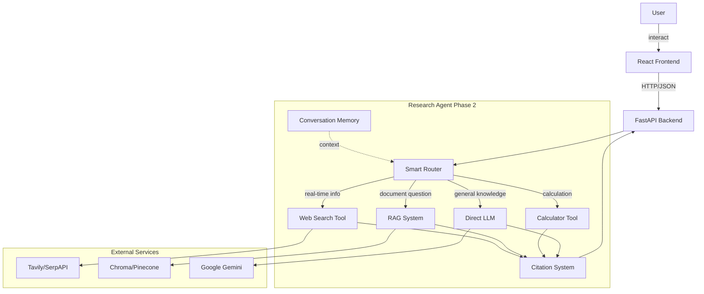
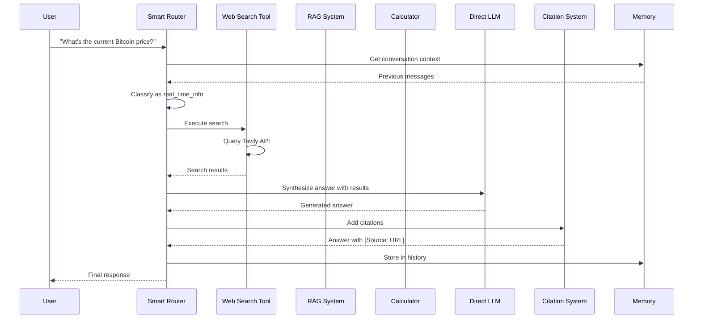
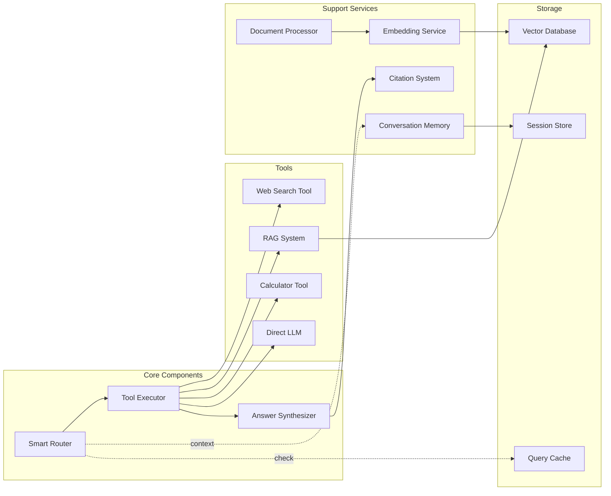

# Tài liệu Thiết kế - Research Agent Phase 2

## Tổng quan

Research Agent Phase 2 nâng cấp hệ thống chat AI cơ bản (Phase 1) thành một intelligent research agent với khả năng tự động tìm kiếm thông tin từ web, truy xuất dữ liệu từ documents đã upload, thực hiện tính toán toán học, và orchestrate nhiều tools để trả lời câu hỏi một cách chính xác và có nguồn gốc rõ ràng.

Hệ thống sử dụng LangChain ReAct (Reasoning and Acting) pattern để tự động phân loại câu hỏi và chọn tool phù hợp:
- **Web Search Tool**: Tìm kiếm thông tin real-time từ internet (Tavily/SerpAPI)
- **RAG System**: Truy xuất và answer từ documents đã upload (Chroma/Pinecone)
- **Calculator Tool**: Xử lý tính toán toán học phức tạp
- **Direct LLM**: Trả lời câu hỏi general knowledge

### Mục tiêu thiết kế

- **Intelligent Routing**: Tự động phân loại câu hỏi và chọn tool phù hợp
- **Source Attribution**: Mọi thông tin đều có citation rõ ràng
- **Graceful Degradation**: Fallback khi tools fail
- **Conversation Context**: Nhớ lịch sử hội thoại để xử lý follow-up questions
- **Extensible**: Dễ dàng thêm tools mới
- **Performance**: Response time tối ưu cho từng loại query

### Kiến trúc tổng quan

Phase 2 mở rộng Phase 1 pipeline bằng cách thêm một layer tool orchestration trước khi invoke model:

```
User Question → Smart Router → Tool Selection → Tool Execution → Answer Synthesis → Citation → Response
```

## Kiến trúc

### Architecture Overview



### Data Flow - Research Query



### Component Interaction



## Components và Interfaces

### 1. Smart Router

**Trách nhiệm**: Phân loại câu hỏi và quyết định tool nào cần sử dụng.

**Input**: 
```python
@dataclass
class RouterInput:
    question: str
    conversation_history: List[Message]
    available_tools: List[str]
    user_context: Optional[Dict[str, Any]]
```

**Output**:
```python
@dataclass
class RoutingDecision:
    question_category: QuestionCategory  # general_knowledge, real_time_info, document_based, calculation
    selected_tools: List[str]  # ["web_search"] or ["rag"] or ["calculator"] or ["direct_llm"]
    confidence: float  # 0.0 to 1.0
    reasoning: str  # Explanation of decision
```

**Question Categories**:
```python
from enum import Enum

class QuestionCategory(str, Enum):
    GENERAL_KNOWLEDGE = "general_knowledge"
    REAL_TIME_INFO = "real_time_info"
    DOCUMENT_BASED = "document_based"
    CALCULATION = "calculation"
```

**Classification Logic**:

```python
class SmartRouter:
    def __init__(self, llm: BaseChatModel, memory: ConversationMemory):
        self.llm = llm
        self.memory = memory
        self.classification_prompt = self._build_classification_prompt()
    
    def route(self, question: str, conversation_id: str) -> RoutingDecision:
        # Get conversation context
        history = self.memory.get_history(conversation_id)
        
        # Build classification prompt
        prompt = self.classification_prompt.format(
            question=question,
            history=self._format_history(history)
        )
        
        # Use LLM to classify
        response = self.llm.invoke(prompt)
        category = self._parse_category(response)
        
        # Map category to tools
        tools = self._map_category_to_tools(category)
        
        # Log decision
        logger.info(
            "routing_decision",
            question=question[:100],
            category=category,
            tools=tools,
            confidence=self._calculate_confidence(response)
        )
        
        return RoutingDecision(
            question_category=category,
            selected_tools=tools,
            confidence=self._calculate_confidence(response),
            reasoning=self._extract_reasoning(response)
        )
    
    def _map_category_to_tools(self, category: QuestionCategory) -> List[str]:
        mapping = {
            QuestionCategory.GENERAL_KNOWLEDGE: ["direct_llm"],
            QuestionCategory.REAL_TIME_INFO: ["web_search"],
            QuestionCategory.DOCUMENT_BASED: ["rag"],
            QuestionCategory.CALCULATION: ["calculator"]
        }
        return mapping.get(category, ["direct_llm"])
```

**Classification Prompt Template**:
```
Bạn là một AI router chuyên phân loại câu hỏi. Phân tích câu hỏi sau và xác định category:

Categories:
- general_knowledge: Kiến thức chung, không cần thông tin real-time hay documents
- real_time_info: Cần thông tin cập nhật (giá cả, tin tức, thời tiết, sự kiện hiện tại)
- document_based: Hỏi về nội dung documents đã upload
- calculation: Tính toán toán học

Conversation History:
{history}

Question: {question}

Trả lời theo format JSON:
{{
  "category": "...",
  "confidence": 0.0-1.0,
  "reasoning": "..."
}}
```

### 2. Web Search Tool

**Trách nhiệm**: Tìm kiếm thông tin real-time từ internet.

**Input**:
```python
@dataclass
class SearchQuery:
    query: str
    max_results: int = 5
    search_depth: str = "basic"  # "basic" or "advanced"
```

**Output**:
```python
@dataclass
class SearchResult:
    title: str
    snippet: str
    url: str
    published_date: Optional[str]
    score: float

@dataclass
class SearchResponse:
    query: str
    results: List[SearchResult]
    total_results: int
    search_time_ms: float
```


**Implementation**:
```python
from typing import Protocol

class SearchProvider(Protocol):
    def search(self, query: str, max_results: int) -> List[SearchResult]:
        ...

class TavilySearchProvider:
    def __init__(self, api_key: str):
        self.api_key = api_key
        self.client = TavilyClient(api_key=api_key)
    
    def search(self, query: str, max_results: int = 5) -> List[SearchResult]:
        try:
            response = self.client.search(
                query=query,
                max_results=max_results,
                search_depth="basic"
            )
            
            return [
                SearchResult(
                    title=result.get("title", ""),
                    snippet=result.get("content", ""),
                    url=result.get("url", ""),
                    published_date=result.get("published_date"),
                    score=result.get("score", 0.0)
                )
                for result in response.get("results", [])
            ]
        except Exception as e:
            logger.error(f"Search failed: {e}")
            raise SearchError(f"Web search failed: {str(e)}")

class WebSearchTool:
    def __init__(self, provider: SearchProvider):
        self.provider = provider
    
    def execute(self, query: SearchQuery) -> SearchResponse:
        start_time = time.time()
        
        results = self.provider.search(
            query=query.query,
            max_results=query.max_results
        )
        
        search_time_ms = (time.time() - start_time) * 1000
        
        logger.info(
            "web_search_completed",
            query=query.query[:100],
            num_results=len(results),
            search_time_ms=search_time_ms
        )
        
        return SearchResponse(
            query=query.query,
            results=results,
            total_results=len(results),
            search_time_ms=search_time_ms
        )
```

**Error Handling**:
- Timeout → Raise `SearchError`, router will fallback to direct LLM
- API error → Raise `SearchError` with descriptive message
- No results → Return empty list, let answer synthesizer handle
- Rate limit → Raise `RateLimitError`, queue request

### 3. Document Processor

**Trách nhiệm**: Xử lý upload, extract text, chunk, và embed documents.

**Input**:
```python
@dataclass
class DocumentUpload:
    file_content: bytes
    filename: str
    content_type: str
    user_id: str
    conversation_id: Optional[str]
```

**Output**:
```python
@dataclass
class ProcessedDocument:
    document_id: str
    filename: str
    num_chunks: int
    total_tokens: int
    processing_time_ms: float
    status: str  # "success" or "failed"
    error_message: Optional[str]
```


**Implementation**:
```python
from langchain.text_splitter import RecursiveCharacterTextSplitter
from langchain_community.document_loaders import PyPDFLoader, TextLoader, Docx2txtLoader, UnstructuredMarkdownLoader

class DocumentProcessor:
    SUPPORTED_FORMATS = {
        "application/pdf": PyPDFLoader,
        "text/plain": TextLoader,
        "application/vnd.openxmlformats-officedocument.wordprocessingml.document": Docx2txtLoader,
        "text/markdown": UnstructuredMarkdownLoader
    }
    
    MAX_FILE_SIZE = 10 * 1024 * 1024  # 10MB
    
    def __init__(self, embedding_service: EmbeddingService, vector_db: VectorDatabase):
        self.embedding_service = embedding_service
        self.vector_db = vector_db
        self.text_splitter = RecursiveCharacterTextSplitter(
            chunk_size=1000,
            chunk_overlap=100,
            length_function=len
        )
    
    async def process_document(self, upload: DocumentUpload) -> ProcessedDocument:
        start_time = time.time()
        document_id = str(uuid.uuid4())
        
        try:
            # Validate file size
            if len(upload.file_content) > self.MAX_FILE_SIZE:
                raise ValidationError(f"File too large (max {self.MAX_FILE_SIZE} bytes)")
            
            # Validate file format
            if upload.content_type not in self.SUPPORTED_FORMATS:
                raise ValidationError(f"Unsupported format: {upload.content_type}")
            
            # Extract text
            text = await self._extract_text(upload)
            
            # Split into chunks
            chunks = self.text_splitter.split_text(text)
            
            # Generate embeddings
            embeddings = await self.embedding_service.embed_documents(chunks)
            
            # Store in vector database
            await self.vector_db.add_documents(
                document_id=document_id,
                chunks=chunks,
                embeddings=embeddings,
                metadata={
                    "filename": upload.filename,
                    "user_id": upload.user_id,
                    "conversation_id": upload.conversation_id,
                    "upload_timestamp": datetime.utcnow().isoformat()
                }
            )
            
            processing_time_ms = (time.time() - start_time) * 1000
            
            logger.info(
                "document_processed",
                document_id=document_id,
                filename=upload.filename,
                num_chunks=len(chunks),
                processing_time_ms=processing_time_ms
            )
            
            return ProcessedDocument(
                document_id=document_id,
                filename=upload.filename,
                num_chunks=len(chunks),
                total_tokens=sum(len(chunk.split()) for chunk in chunks),
                processing_time_ms=processing_time_ms,
                status="success",
                error_message=None
            )
            
        except Exception as e:
            logger.error(f"Document processing failed: {e}")
            return ProcessedDocument(
                document_id=document_id,
                filename=upload.filename,
                num_chunks=0,
                total_tokens=0,
                processing_time_ms=(time.time() - start_time) * 1000,
                status="failed",
                error_message=str(e)
            )
```

### 4. RAG System

**Trách nhiệm**: Semantic search trong documents và generate answer với context.

**Input**:
```python
@dataclass
class RAGQuery:
    question: str
    user_id: str
    conversation_id: Optional[str]
    top_k: int = 5
    similarity_threshold: float = 0.7
```

**Output**:
```python
@dataclass
class RetrievedChunk:
    chunk_id: str
    content: str
    similarity_score: float
    metadata: Dict[str, Any]  # filename, page_number, etc.

@dataclass
class RAGResponse:
    question: str
    answer: str
    retrieved_chunks: List[RetrievedChunk]
    has_relevant_context: bool
    retrieval_time_ms: float
```


**Implementation**:
```python
class RAGSystem:
    def __init__(
        self,
        vector_db: VectorDatabase,
        embedding_service: EmbeddingService,
        llm: BaseChatModel
    ):
        self.vector_db = vector_db
        self.embedding_service = embedding_service
        self.llm = llm
        self.answer_prompt = self._build_answer_prompt()
    
    async def query(self, rag_query: RAGQuery) -> RAGResponse:
        start_time = time.time()
        
        # Generate query embedding
        query_embedding = await self.embedding_service.embed_query(rag_query.question)
        
        # Semantic search
        retrieved = await self.vector_db.similarity_search(
            query_embedding=query_embedding,
            top_k=rag_query.top_k,
            user_id=rag_query.user_id,
            conversation_id=rag_query.conversation_id
        )
        
        # Filter by similarity threshold
        relevant_chunks = [
            chunk for chunk in retrieved
            if chunk.similarity_score >= rag_query.similarity_threshold
        ]
        
        has_relevant_context = len(relevant_chunks) > 0
        
        if not has_relevant_context:
            answer = "Tôi không tìm thấy thông tin liên quan trong documents của bạn. Bạn có thể upload thêm tài liệu hoặc hỏi câu hỏi khác."
        else:
            # Generate answer with context
            context = "\n\n".join([chunk.content for chunk in relevant_chunks])
            answer = await self._generate_answer(rag_query.question, context)
        
        retrieval_time_ms = (time.time() - start_time) * 1000
        
        logger.info(
            "rag_query_completed",
            question=rag_query.question[:100],
            num_retrieved=len(relevant_chunks),
            has_relevant_context=has_relevant_context,
            retrieval_time_ms=retrieval_time_ms
        )
        
        return RAGResponse(
            question=rag_query.question,
            answer=answer,
            retrieved_chunks=relevant_chunks,
            has_relevant_context=has_relevant_context,
            retrieval_time_ms=retrieval_time_ms
        )
    
    async def _generate_answer(self, question: str, context: str) -> str:
        prompt = self.answer_prompt.format(question=question, context=context)
        response = await self.llm.ainvoke(prompt)
        return response.content
    
    def _build_answer_prompt(self) -> ChatPromptTemplate:
        return ChatPromptTemplate.from_messages([
            ("system", "Bạn là trợ lý AI. Trả lời câu hỏi dựa trên context được cung cấp. Nếu context không đủ thông tin, hãy nói rõ."),
            ("user", "Context:\n{context}\n\nQuestion: {question}")
        ])
```

### 5. Calculator Tool

**Trách nhiệm**: Parse và evaluate mathematical expressions.

**Input**:
```python
@dataclass
class CalculationQuery:
    expression: str
    natural_language: str  # Original question
```

**Output**:
```python
@dataclass
class CalculationResult:
    expression: str
    result: float
    formatted_result: str  # With 6 decimal precision
    success: bool
    error_message: Optional[str]
```

**Implementation**:
```python
import math
import re
from typing import Optional

class CalculatorTool:
    ALLOWED_OPERATORS = {
        '+', '-', '*', '/', '**', 
        'sqrt', 'log', 'sin', 'cos', 'tan',
        'abs', 'ceil', 'floor'
    }
    
    def __init__(self):
        self.safe_dict = {
            'sqrt': math.sqrt,
            'log': math.log,
            'sin': math.sin,
            'cos': math.cos,
            'tan': math.tan,
            'abs': abs,
            'ceil': math.ceil,
            'floor': math.floor,
            'pi': math.pi,
            'e': math.e
        }
    
    def execute(self, query: CalculationQuery) -> CalculationResult:
        try:
            # Extract expression from natural language if needed
            expression = self._extract_expression(query.natural_language) or query.expression
            
            # Validate expression
            if not self._is_safe_expression(expression):
                raise ValueError("Invalid or unsafe expression")
            
            # Evaluate
            result = eval(expression, {"__builtins__": {}}, self.safe_dict)
            
            # Format result
            formatted = f"{result:.6f}".rstrip('0').rstrip('.')
            
            logger.info(
                "calculation_completed",
                expression=expression,
                result=result
            )
            
            return CalculationResult(
                expression=expression,
                result=float(result),
                formatted_result=formatted,
                success=True,
                error_message=None
            )
            
        except Exception as e:
            logger.warning(f"Calculation failed: {e}")
            return CalculationResult(
                expression=query.expression,
                result=0.0,
                formatted_result="",
                success=False,
                error_message=f"Không thể tính toán: {str(e)}"
            )
    
    def _extract_expression(self, natural_language: str) -> Optional[str]:
        # Simple regex to extract mathematical expressions
        pattern = r'[\d\+\-\*/\(\)\.\s]+'
        matches = re.findall(pattern, natural_language)
        return matches[0].strip() if matches else None
    
    def _is_safe_expression(self, expression: str) -> bool:
        # Check for dangerous patterns
        dangerous = ['import', '__', 'exec', 'eval', 'compile', 'open', 'file']
        return not any(d in expression.lower() for d in dangerous)
```


### 6. Conversation Memory

**Trách nhiệm**: Lưu trữ và quản lý lịch sử hội thoại.

**Data Models**:
```python
@dataclass
class Message:
    role: str  # "user" or "assistant"
    content: str
    timestamp: datetime
    metadata: Optional[Dict[str, Any]] = None

@dataclass
class Conversation:
    conversation_id: str
    user_id: str
    messages: List[Message]
    created_at: datetime
    updated_at: datetime
```

**Implementation**:
```python
class ConversationMemory:
    MAX_MESSAGES = 20  # 10 pairs (user + assistant)
    
    def __init__(self, session_store: SessionStore):
        self.session_store = session_store
    
    def add_message(self, conversation_id: str, message: Message):
        conversation = self.session_store.get(conversation_id)
        
        if not conversation:
            conversation = Conversation(
                conversation_id=conversation_id,
                user_id=message.metadata.get("user_id", "unknown"),
                messages=[],
                created_at=datetime.utcnow(),
                updated_at=datetime.utcnow()
            )
        
        conversation.messages.append(message)
        
        # Keep only last MAX_MESSAGES
        if len(conversation.messages) > self.MAX_MESSAGES:
            conversation.messages = conversation.messages[-self.MAX_MESSAGES:]
        
        conversation.updated_at = datetime.utcnow()
        self.session_store.set(conversation_id, conversation)
    
    def get_history(self, conversation_id: str, limit: Optional[int] = None) -> List[Message]:
        conversation = self.session_store.get(conversation_id)
        if not conversation:
            return []
        
        messages = conversation.messages
        if limit:
            messages = messages[-limit:]
        
        return messages
    
    def clear_history(self, conversation_id: str):
        self.session_store.delete(conversation_id)
    
    def format_history_for_prompt(self, conversation_id: str) -> str:
        messages = self.get_history(conversation_id)
        formatted = []
        for msg in messages:
            role = "User" if msg.role == "user" else "Assistant"
            formatted.append(f"{role}: {msg.content}")
        return "\n".join(formatted)
```

### 7. Citation System

**Trách nhiệm**: Format và add citations vào answers.

**Data Models**:
```python
@dataclass
class Citation:
    source_type: str  # "web" or "document"
    title: Optional[str]
    url: Optional[str]
    filename: Optional[str]
    page_number: Optional[int]
    
    def format(self) -> str:
        if self.source_type == "web":
            return f"[Source: {self.title} - {self.url}]"
        elif self.source_type == "document":
            page_info = f", page {self.page_number}" if self.page_number else ""
            return f"[Source: {self.filename}{page_info}]"
        return "[Source: General Knowledge]"

@dataclass
class AnswerWithCitations:
    answer: str
    citations: List[Citation]
    formatted_answer: str  # Answer with inline citations
```

**Implementation**:
```python
class CitationSystem:
    def add_web_citations(self, answer: str, search_results: List[SearchResult]) -> AnswerWithCitations:
        citations = [
            Citation(
                source_type="web",
                title=result.title,
                url=result.url,
                filename=None,
                page_number=None
            )
            for result in search_results
        ]
        
        # Deduplicate by URL
        unique_citations = self._deduplicate_citations(citations)
        
        # Add citations at end of answer
        formatted_citations = "\n\n" + "\n".join([c.format() for c in unique_citations])
        formatted_answer = answer + formatted_citations
        
        return AnswerWithCitations(
            answer=answer,
            citations=unique_citations,
            formatted_answer=formatted_answer
        )
    
    def add_document_citations(self, answer: str, chunks: List[RetrievedChunk]) -> AnswerWithCitations:
        citations = [
            Citation(
                source_type="document",
                title=None,
                url=None,
                filename=chunk.metadata.get("filename"),
                page_number=chunk.metadata.get("page_number")
            )
            for chunk in chunks
        ]
        
        # Deduplicate by filename
        unique_citations = self._deduplicate_citations(citations)
        
        formatted_citations = "\n\n" + "\n".join([c.format() for c in unique_citations])
        formatted_answer = answer + formatted_citations
        
        return AnswerWithCitations(
            answer=answer,
            citations=unique_citations,
            formatted_answer=formatted_answer
        )
    
    def _deduplicate_citations(self, citations: List[Citation]) -> List[Citation]:
        seen = set()
        unique = []
        for citation in citations:
            key = citation.url if citation.url else citation.filename
            if key and key not in seen:
                seen.add(key)
                unique.append(citation)
        return unique
```


### 8. Embedding Service

**Trách nhiệm**: Generate vector embeddings cho text.

**Implementation**:
```python
from langchain_google_genai import GoogleGenerativeAIEmbeddings

class EmbeddingService:
    def __init__(self, api_key: str, model: str = "models/embedding-001"):
        self.embeddings = GoogleGenerativeAIEmbeddings(
            google_api_key=api_key,
            model=model
        )
    
    async def embed_query(self, text: str) -> List[float]:
        """Generate embedding for a single query."""
        return await self.embeddings.aembed_query(text)
    
    async def embed_documents(self, texts: List[str]) -> List[List[float]]:
        """Generate embeddings for multiple documents."""
        return await self.embeddings.aembed_documents(texts)
    
    def get_dimension(self) -> int:
        """Return embedding dimension (768 for Google's embedding-001)."""
        return 768
```

### 9. Vector Database Interface

**Trách nhiệm**: Abstract interface cho vector storage (Chroma/Pinecone).

**Interface**:
```python
from abc import ABC, abstractmethod

class VectorDatabase(ABC):
    @abstractmethod
    async def add_documents(
        self,
        document_id: str,
        chunks: List[str],
        embeddings: List[List[float]],
        metadata: Dict[str, Any]
    ):
        """Store document chunks with embeddings."""
        pass
    
    @abstractmethod
    async def similarity_search(
        self,
        query_embedding: List[float],
        top_k: int,
        user_id: str,
        conversation_id: Optional[str] = None
    ) -> List[RetrievedChunk]:
        """Search for similar chunks."""
        pass
    
    @abstractmethod
    async def delete_document(self, document_id: str):
        """Delete a document and all its chunks."""
        pass
    
    @abstractmethod
    async def health_check(self) -> bool:
        """Check if database is accessible."""
        pass
```

**Chroma Implementation**:
```python
import chromadb
from chromadb.config import Settings

class ChromaVectorDatabase(VectorDatabase):
    def __init__(self, persist_directory: str = "./chroma_db"):
        self.client = chromadb.Client(Settings(
            persist_directory=persist_directory,
            anonymized_telemetry=False
        ))
        self.collection = self.client.get_or_create_collection(
            name="documents",
            metadata={"hnsw:space": "cosine"}
        )
    
    async def add_documents(
        self,
        document_id: str,
        chunks: List[str],
        embeddings: List[List[float]],
        metadata: Dict[str, Any]
    ):
        chunk_ids = [f"{document_id}_{i}" for i in range(len(chunks))]
        metadatas = [
            {**metadata, "chunk_index": i, "document_id": document_id}
            for i in range(len(chunks))
        ]
        
        self.collection.add(
            ids=chunk_ids,
            embeddings=embeddings,
            documents=chunks,
            metadatas=metadatas
        )
    
    async def similarity_search(
        self,
        query_embedding: List[float],
        top_k: int,
        user_id: str,
        conversation_id: Optional[str] = None
    ) -> List[RetrievedChunk]:
        where_filter = {"user_id": user_id}
        if conversation_id:
            where_filter["conversation_id"] = conversation_id
        
        results = self.collection.query(
            query_embeddings=[query_embedding],
            n_results=top_k,
            where=where_filter
        )
        
        chunks = []
        for i in range(len(results['ids'][0])):
            chunks.append(RetrievedChunk(
                chunk_id=results['ids'][0][i],
                content=results['documents'][0][i],
                similarity_score=1 - results['distances'][0][i],  # Convert distance to similarity
                metadata=results['metadatas'][0][i]
            ))
        
        return chunks
    
    async def delete_document(self, document_id: str):
        self.collection.delete(where={"document_id": document_id})
    
    async def health_check(self) -> bool:
        try:
            self.client.heartbeat()
            return True
        except:
            return False
```

## Data Models

### Request/Response Schemas

**ResearchChatRequest** (extends Phase 1 ChatRequest):
```python
from pydantic import BaseModel, Field

class ResearchChatRequest(BaseModel):
    message: str = Field(..., description="User question")
    conversation_id: Optional[str] = Field(None, description="Conversation ID for context")
    user_id: Optional[str] = Field(None, description="User ID for document filtering")
    model: Optional[str] = Field(None, description="AI model to use")
    force_tool: Optional[str] = Field(None, description="Force specific tool: web_search, rag, calculator, direct_llm")
```


**ResearchChatResponse** (extends Phase 1 ChatResponse):
```python
class ToolUsage(BaseModel):
    tool_name: str
    execution_time_ms: float
    success: bool

class ResearchMeta(BaseModel):
    provider: Optional[str]
    model: Optional[str]
    finish_reason: Optional[str]
    question_category: Optional[str]
    tools_used: List[ToolUsage]
    has_citations: bool

class ResearchChatResponse(BaseModel):
    request_id: str
    conversation_id: str
    status: str  # "ok" or "error"
    answer: str
    citations: List[Citation]
    error: Optional[ErrorDetail]
    meta: ResearchMeta
```

**DocumentUploadRequest**:
```python
from fastapi import UploadFile

class DocumentUploadRequest(BaseModel):
    file: UploadFile
    user_id: str
    conversation_id: Optional[str] = None
```

**DocumentUploadResponse**:
```python
class DocumentUploadResponse(BaseModel):
    document_id: str
    filename: str
    status: str  # "processing", "completed", "failed"
    num_chunks: int
    processing_time_ms: float
    error_message: Optional[str]
```

## API Endpoints

### POST /research/chat

Enhanced chat endpoint với research capabilities.

**Request**:
```json
{
  "message": "What's the current Bitcoin price?",
  "conversation_id": "conv_123",
  "user_id": "user_456",
  "model": "gemini-1.5-flash"
}
```

**Response (Success - HTTP 200)**:
```json
{
  "request_id": "req_789",
  "conversation_id": "conv_123",
  "status": "ok",
  "answer": "Based on current data, Bitcoin is trading at $43,250...",
  "citations": [
    {
      "source_type": "web",
      "title": "Bitcoin Price Today",
      "url": "https://example.com/btc-price"
    }
  ],
  "error": null,
  "meta": {
    "provider": "google",
    "model": "gemini-1.5-flash",
    "finish_reason": "stop",
    "question_category": "real_time_info",
    "tools_used": [
      {
        "tool_name": "web_search",
        "execution_time_ms": 1250.5,
        "success": true
      }
    ],
    "has_citations": true
  }
}
```

### POST /research/upload

Upload document for RAG.

**Request** (multipart/form-data):
```
file: [binary content]
user_id: "user_456"
conversation_id: "conv_123"
```

**Response (Success - HTTP 200)**:
```json
{
  "document_id": "doc_abc123",
  "filename": "research_paper.pdf",
  "status": "completed",
  "num_chunks": 45,
  "processing_time_ms": 3500.2,
  "error_message": null
}
```

**Response (Error - HTTP 400)**:
```json
{
  "document_id": "doc_abc123",
  "filename": "large_file.pdf",
  "status": "failed",
  "num_chunks": 0,
  "processing_time_ms": 150.0,
  "error_message": "File too large (max 10MB)"
}
```

### GET /research/documents

List uploaded documents for a user.

**Query Parameters**:
- `user_id` (required)
- `conversation_id` (optional)

**Response (HTTP 200)**:
```json
{
  "documents": [
    {
      "document_id": "doc_abc123",
      "filename": "research_paper.pdf",
      "num_chunks": 45,
      "upload_timestamp": "2024-01-15T10:30:00Z"
    }
  ],
  "total": 1
}
```

### DELETE /research/documents/{document_id}

Delete a document.

**Response (HTTP 200)**:
```json
{
  "document_id": "doc_abc123",
  "status": "deleted"
}
```

### GET /research/health

Health check for research agent tools.

**Response (HTTP 200)**:
```json
{
  "status": "healthy",
  "tools": {
    "web_search": {
      "available": true,
      "provider": "tavily"
    },
    "rag": {
      "available": true,
      "vector_db": "chroma",
      "num_documents": 150
    },
    "calculator": {
      "available": true
    },
    "direct_llm": {
      "available": true,
      "provider": "google"
    }
  }
}
```

## Integration với Phase 1

### Extending Phase 1 Pipeline

Phase 2 extends Phase 1 by adding a tool orchestration layer:

```python
# Phase 1 Pipeline
class ChatPipeline:
    def process(self, request: ChatRequest) -> ChatResponse:
        captured = self.capture_service.capture(request)
        normalized = self.normalize_service.normalize(captured)
        result = self.invoke_service.invoke(normalized)
        response = self.compose_service.compose(result)
        return self.deliver_service.deliver(response)

# Phase 2 Enhanced Pipeline
class ResearchChatPipeline(ChatPipeline):
    def __init__(self, *args, research_orchestrator: ResearchOrchestrator, **kwargs):
        super().__init__(*args, **kwargs)
        self.research_orchestrator = research_orchestrator
    
    def process(self, request: ResearchChatRequest) -> ResearchChatResponse:
        captured = self.capture_service.capture(request)
        normalized = self.normalize_service.normalize(captured)
        
        # NEW: Research orchestration
        research_result = self.research_orchestrator.execute(
            question=normalized.message,
            conversation_id=request.conversation_id,
            user_id=request.user_id
        )
        
        # Compose with citations
        response = self.compose_service.compose_with_citations(research_result)
        return self.deliver_service.deliver(response)
```


### Research Orchestrator

**Trách nhiệm**: Coordinate tool selection và execution.

```python
class ResearchOrchestrator:
    def __init__(
        self,
        router: SmartRouter,
        web_search: WebSearchTool,
        rag_system: RAGSystem,
        calculator: CalculatorTool,
        llm: BaseChatModel,
        memory: ConversationMemory,
        citation_system: CitationSystem
    ):
        self.router = router
        self.tools = {
            "web_search": web_search,
            "rag": rag_system,
            "calculator": calculator,
            "direct_llm": llm
        }
        self.memory = memory
        self.citation_system = citation_system
    
    async def execute(
        self,
        question: str,
        conversation_id: str,
        user_id: str
    ) -> ResearchResult:
        start_time = time.time()
        
        # Store user message
        self.memory.add_message(
            conversation_id,
            Message(role="user", content=question, timestamp=datetime.utcnow())
        )
        
        # Route question
        routing = self.router.route(question, conversation_id)
        
        # Execute tools
        tool_results = []
        answer = ""
        citations = []
        
        try:
            if "web_search" in routing.selected_tools:
                result = await self._execute_web_search(question)
                tool_results.append(result)
                answer = result.answer
                citations = result.citations
            
            elif "rag" in routing.selected_tools:
                result = await self._execute_rag(question, user_id, conversation_id)
                tool_results.append(result)
                answer = result.answer
                citations = result.citations
            
            elif "calculator" in routing.selected_tools:
                result = await self._execute_calculator(question)
                tool_results.append(result)
                answer = result.answer
            
            else:  # direct_llm
                result = await self._execute_direct_llm(question, conversation_id)
                tool_results.append(result)
                answer = result.answer
        
        except Exception as e:
            logger.error(f"Tool execution failed: {e}")
            # Fallback to direct LLM
            result = await self._execute_direct_llm(question, conversation_id)
            tool_results.append(result)
            answer = f"[Fallback] {result.answer}"
        
        # Store assistant message
        self.memory.add_message(
            conversation_id,
            Message(role="assistant", content=answer, timestamp=datetime.utcnow())
        )
        
        execution_time_ms = (time.time() - start_time) * 1000
        
        return ResearchResult(
            question=question,
            answer=answer,
            citations=citations,
            question_category=routing.question_category,
            tools_used=tool_results,
            execution_time_ms=execution_time_ms
        )
    
    async def _execute_web_search(self, question: str) -> ToolResult:
        start_time = time.time()
        try:
            search_response = await self.tools["web_search"].execute(
                SearchQuery(query=question, max_results=5)
            )
            
            # Synthesize answer from search results
            context = "\n\n".join([
                f"{r.title}: {r.snippet}" for r in search_response.results
            ])
            answer = await self._synthesize_answer(question, context)
            
            # Add citations
            cited = self.citation_system.add_web_citations(answer, search_response.results)
            
            return ToolResult(
                tool_name="web_search",
                answer=cited.formatted_answer,
                citations=cited.citations,
                execution_time_ms=(time.time() - start_time) * 1000,
                success=True
            )
        except Exception as e:
            logger.error(f"Web search failed: {e}")
            raise
    
    async def _execute_rag(self, question: str, user_id: str, conversation_id: str) -> ToolResult:
        start_time = time.time()
        try:
            rag_response = await self.tools["rag"].query(
                RAGQuery(
                    question=question,
                    user_id=user_id,
                    conversation_id=conversation_id,
                    top_k=5,
                    similarity_threshold=0.7
                )
            )
            
            if not rag_response.has_relevant_context:
                return ToolResult(
                    tool_name="rag",
                    answer=rag_response.answer,
                    citations=[],
                    execution_time_ms=(time.time() - start_time) * 1000,
                    success=False
                )
            
            # Add citations
            cited = self.citation_system.add_document_citations(
                rag_response.answer,
                rag_response.retrieved_chunks
            )
            
            return ToolResult(
                tool_name="rag",
                answer=cited.formatted_answer,
                citations=cited.citations,
                execution_time_ms=(time.time() - start_time) * 1000,
                success=True
            )
        except Exception as e:
            logger.error(f"RAG failed: {e}")
            raise
    
    async def _synthesize_answer(self, question: str, context: str) -> str:
        prompt = f"Context:\n{context}\n\nQuestion: {question}\n\nTrả lời ngắn gọn dựa trên context:"
        response = await self.tools["direct_llm"].ainvoke(prompt)
        return response.content
```

## Configuration

### Environment Variables

```python
from pydantic_settings import BaseSettings

class ResearchSettings(BaseSettings):
    # Phase 1 settings (inherited)
    google_api_key: str
    default_model: str = "gemini-1.5-flash"
    
    # Web Search
    tavily_api_key: Optional[str] = None
    serpapi_key: Optional[str] = None
    web_search_provider: str = "tavily"  # "tavily" or "serpapi"
    
    # Vector Database
    vector_db_type: str = "chroma"  # "chroma" or "pinecone"
    chroma_persist_directory: str = "./chroma_db"
    pinecone_api_key: Optional[str] = None
    pinecone_environment: Optional[str] = None
    pinecone_index_name: str = "research-agent"
    
    # Document Processing
    max_file_size_mb: int = 10
    chunk_size: int = 1000
    chunk_overlap: int = 100
    
    # RAG
    rag_top_k: int = 5
    rag_similarity_threshold: float = 0.7
    
    # Performance
    web_search_timeout: int = 10
    rag_timeout: int = 5
    calculator_timeout: int = 1
    
    # Caching
    enable_query_cache: bool = True
    cache_ttl_seconds: int = 3600
    
    # Retry
    max_retries: int = 2
    retry_backoff_factor: float = 2.0
    
    class Config:
        env_file = ".env"
```

### Example .env file

```bash
# Phase 1 (inherited)
GOOGLE_API_KEY=AIza...
DEFAULT_MODEL=gemini-1.5-flash

# Web Search
TAVILY_API_KEY=tvly-...
WEB_SEARCH_PROVIDER=tavily

# Vector Database
VECTOR_DB_TYPE=chroma
CHROMA_PERSIST_DIRECTORY=./chroma_db

# Document Processing
MAX_FILE_SIZE_MB=10
CHUNK_SIZE=1000
CHUNK_OVERLAP=100

# RAG
RAG_TOP_K=5
RAG_SIMILARITY_THRESHOLD=0.7

# Performance
WEB_SEARCH_TIMEOUT=10
RAG_TIMEOUT=5

# Caching
ENABLE_QUERY_CACHE=true
CACHE_TTL_SECONDS=3600

# Retry
MAX_RETRIES=2
RETRY_BACKOFF_FACTOR=2.0
```


## Error Handling

### Error Types

```python
class ResearchError(Exception):
    """Base exception for research agent errors."""
    pass

class SearchError(ResearchError):
    """Web search failed."""
    pass

class RAGError(ResearchError):
    """RAG system error."""
    pass

class DocumentProcessingError(ResearchError):
    """Document upload/processing failed."""
    pass

class VectorDatabaseError(ResearchError):
    """Vector database connection/operation failed."""
    pass

class RateLimitError(ResearchError):
    """API rate limit exceeded."""
    pass
```

### Error Handling Strategy

**Tool Failures**:
1. **Web Search Fails** → Fallback to direct LLM, inform user
2. **RAG No Results** → Inform user, suggest uploading documents
3. **Calculator Error** → Explain error, ask user to rephrase
4. **Vector DB Down** → Disable RAG, return error message
5. **Rate Limit** → Queue request, inform estimated wait time

**Retry Logic**:
```python
class RetryHandler:
    def __init__(self, max_retries: int = 2, backoff_factor: float = 2.0):
        self.max_retries = max_retries
        self.backoff_factor = backoff_factor
    
    async def execute_with_retry(self, func, *args, **kwargs):
        last_exception = None
        
        for attempt in range(self.max_retries + 1):
            try:
                return await func(*args, **kwargs)
            except (SearchError, RAGError, VectorDatabaseError) as e:
                last_exception = e
                if attempt < self.max_retries:
                    wait_time = self.backoff_factor ** attempt
                    logger.warning(f"Attempt {attempt + 1} failed, retrying in {wait_time}s: {e}")
                    await asyncio.sleep(wait_time)
                else:
                    logger.error(f"All {self.max_retries + 1} attempts failed: {e}")
        
        raise last_exception
```

**Graceful Degradation**:
```python
class GracefulDegradation:
    async def execute_with_fallback(self, primary_func, fallback_func, *args, **kwargs):
        try:
            return await primary_func(*args, **kwargs)
        except Exception as e:
            logger.warning(f"Primary function failed, using fallback: {e}")
            try:
                result = await fallback_func(*args, **kwargs)
                result.answer = f"[Fallback Mode] {result.answer}"
                return result
            except Exception as fallback_error:
                logger.error(f"Fallback also failed: {fallback_error}")
                raise
```

### Error Response Format

```json
{
  "request_id": "req_789",
  "conversation_id": "conv_123",
  "status": "error",
  "answer": "Xin lỗi, tôi không thể tìm kiếm web lúc này. Tôi sẽ trả lời dựa trên kiến thức của mình.",
  "citations": [],
  "error": {
    "code": "SEARCH_ERROR",
    "message": "Web search API timeout",
    "tool": "web_search"
  },
  "meta": {
    "provider": "google",
    "model": "gemini-1.5-flash",
    "finish_reason": "stop",
    "question_category": "real_time_info",
    "tools_used": [
      {
        "tool_name": "web_search",
        "execution_time_ms": 10500.0,
        "success": false
      },
      {
        "tool_name": "direct_llm",
        "execution_time_ms": 1200.0,
        "success": true
      }
    ],
    "has_citations": false
  }
}
```

## Performance Optimization

### Caching Strategy

**Query Cache**:
```python
from functools import lru_cache
import hashlib

class QueryCache:
    def __init__(self, ttl_seconds: int = 3600):
        self.cache = {}
        self.ttl_seconds = ttl_seconds
    
    def get_cache_key(self, question: str, tool: str) -> str:
        content = f"{tool}:{question.lower().strip()}"
        return hashlib.md5(content.encode()).hexdigest()
    
    def get(self, question: str, tool: str) -> Optional[Any]:
        key = self.get_cache_key(question, tool)
        if key in self.cache:
            cached_item = self.cache[key]
            if time.time() - cached_item['timestamp'] < self.ttl_seconds:
                logger.info(f"Cache hit for {tool}: {question[:50]}")
                return cached_item['result']
            else:
                del self.cache[key]
        return None
    
    def set(self, question: str, tool: str, result: Any):
        key = self.get_cache_key(question, tool)
        self.cache[key] = {
            'result': result,
            'timestamp': time.time()
        }
```

**Embedding Cache**:
- Cache embeddings for frequently queried documents
- Use LRU cache with max size 1000

**Search Results Cache**:
- Cache web search results for 1 hour
- Invalidate on new information detection

### Async Processing

**Document Upload**:
```python
from fastapi import BackgroundTasks

@app.post("/research/upload")
async def upload_document(
    file: UploadFile,
    user_id: str,
    background_tasks: BackgroundTasks
):
    # Validate immediately
    if file.size > MAX_FILE_SIZE:
        raise HTTPException(400, "File too large")
    
    # Generate document ID
    document_id = str(uuid.uuid4())
    
    # Process in background
    background_tasks.add_task(
        process_document_async,
        document_id=document_id,
        file_content=await file.read(),
        filename=file.filename,
        user_id=user_id
    )
    
    # Return immediately
    return {
        "document_id": document_id,
        "status": "processing",
        "message": "Document is being processed in the background"
    }
```

### Batch Operations

**Batch Embedding**:
```python
async def embed_documents_batch(texts: List[str], batch_size: int = 10) -> List[List[float]]:
    embeddings = []
    for i in range(0, len(texts), batch_size):
        batch = texts[i:i + batch_size]
        batch_embeddings = await embedding_service.embed_documents(batch)
        embeddings.extend(batch_embeddings)
    return embeddings
```

### Connection Pooling

**Vector Database**:
```python
class VectorDBPool:
    def __init__(self, max_connections: int = 10):
        self.pool = []
        self.max_connections = max_connections
    
    async def get_connection(self):
        if len(self.pool) < self.max_connections:
            conn = await create_vector_db_connection()
            self.pool.append(conn)
            return conn
        return self.pool[0]  # Reuse existing
```


## Correctness Properties

*A property is a characteristic or behavior that should hold true across all valid executions of a system-essentially, a formal statement about what the system should do. Properties serve as the bridge between human-readable specifications and machine-verifiable correctness guarantees.*

### Property Reflection

After analyzing the prework, I identified several areas where properties can be combined or are redundant:

**Redundancy Analysis**:
- Properties about routing (1.2, 4.2-4.5) can be consolidated into routing correctness properties
- Citation format properties (1.6, 3.8, 7.3, 7.4) are similar and can be grouped
- Memory management properties (6.2, 6.5) are duplicates
- Error handling properties across tools share common patterns

**Final Properties** (after eliminating redundancy):

### Property 1: Question category classification

*For any* user question, the Smart Router SHALL assign it to exactly one category from: general_knowledge, real_time_info, document_based, or calculation.

**Validates: Requirements 4.1**

### Property 2: Tool routing consistency

*For any* question classified as a specific category, the Smart Router SHALL consistently route to the same tool type (real_time_info→web_search, document_based→rag, calculation→calculator, general_knowledge→direct_llm).

**Validates: Requirements 1.2, 4.2, 4.3, 4.4, 4.5**

### Property 3: Search result structure

*For any* successful web search, each returned SearchResult SHALL contain non-empty title, snippet, and url fields.

**Validates: Requirements 1.3, 1.4**

### Property 4: Search result count

*For any* web search query, the number of returned results SHALL be at most the requested max_results (default 5).

**Validates: Requirements 1.3**

### Property 5: Answer synthesis from search

*For any* web search with results, the synthesized answer SHALL reference information from at least one of the search results.

**Validates: Requirements 1.5**

### Property 6: Web citation format

*For any* answer using web search, citations SHALL follow the format "[Source: <title> - <URL>]" and be present in the response.

**Validates: Requirements 1.6, 7.1, 7.3**

### Property 7: File format validation

*For any* uploaded file, if its content_type is not in [PDF, TXT, DOCX, MD], the Document_Processor SHALL reject it with a validation error.

**Validates: Requirements 2.1, 2.2**

### Property 8: File size validation

*For any* uploaded file exceeding 10MB, the Document_Processor SHALL reject it with a descriptive error message.

**Validates: Requirements 2.2**

### Property 9: Text extraction success

*For any* valid document upload, the Document_Processor SHALL extract non-empty text content.

**Validates: Requirements 2.3**

### Property 10: Chunk size constraints

*For any* document chunking operation, each chunk SHALL have size between 500-1000 tokens with 100 token overlap between consecutive chunks.

**Validates: Requirements 2.4**

### Property 11: Embedding generation

*For any* document chunk, the Embedding_Service SHALL generate a vector embedding with dimension 768 (for Google's embedding-001 model).

**Validates: Requirements 2.5**

### Property 12: Document storage round-trip

*For any* processed document, storing it in the Vector_Database and then querying for its chunks SHALL return the same chunks with their metadata.

**Validates: Requirements 2.6**

### Property 13: Chunk metadata completeness

*For any* stored document chunk, its metadata SHALL contain filename, chunk_index, document_id, and upload_timestamp fields.

**Validates: Requirements 2.7**

### Property 14: Query embedding generation

*For any* user question to the RAG system, a query embedding SHALL be generated before performing similarity search.

**Validates: Requirements 3.2**

### Property 15: Semantic search result count

*For any* RAG query, the number of retrieved chunks SHALL be at most the requested top_k value (default 5).

**Validates: Requirements 3.3**

### Property 16: Similarity score range

*For any* retrieved document chunk, its similarity_score SHALL be a float value between 0.0 and 1.0.

**Validates: Requirements 3.4**

### Property 17: Context inclusion in RAG

*For any* RAG query with relevant chunks, the retrieved chunks SHALL be included in the LLM prompt as context.

**Validates: Requirements 3.6**

### Property 18: RAG answer generation

*For any* RAG query with relevant context, the generated answer SHALL reference information from the retrieved chunks.

**Validates: Requirements 3.7**

### Property 19: Document citation format

*For any* answer using RAG, citations SHALL follow the format "[Source: <filename>, page <number>]" and be present in the response.

**Validates: Requirements 3.8, 7.2, 7.4**

### Property 20: Calculator operator support

*For any* mathematical expression using operators [+, -, *, /, **, sqrt, log, sin, cos, tan], the Calculator_Tool SHALL evaluate it and return a numerical result.

**Validates: Requirements 5.1**

### Property 21: Calculation result precision

*For any* successful calculation, the formatted result SHALL have at most 6 decimal places.

**Validates: Requirements 5.4**

### Property 22: Expression parsing from natural language

*For any* natural language calculation question, the Calculator_Tool SHALL extract the mathematical expression before evaluation.

**Validates: Requirements 5.3**

### Property 23: Conversation history storage

*For any* message added to Conversation_Memory, it SHALL be retrievable via get_history for that conversation_id.

**Validates: Requirements 6.1**

### Property 24: Memory size limit

*For any* conversation with more than 10 message pairs (20 messages), the Conversation_Memory SHALL retain only the most recent 10 pairs.

**Validates: Requirements 6.2, 6.5**

### Property 25: Context inclusion in routing

*For any* question with existing conversation history, the Smart Router SHALL include the history as context when making routing decisions.

**Validates: Requirements 6.3**

### Property 26: Conversation memory persistence

*For any* conversation stored in session storage, it SHALL be retrievable across multiple requests using the same conversation_id.

**Validates: Requirements 6.6**

### Property 27: Conversation ID uniqueness

*For any* new conversation, it SHALL have a unique conversation_id that doesn't conflict with existing conversations.

**Validates: Requirements 6.8**

### Property 28: Citation deduplication

*For any* answer with multiple references to the same source (same URL or filename), the citation SHALL appear only once in the final formatted answer.

**Validates: Requirements 7.6**

### Property 29: Citation placement

*For any* answer with citations, they SHALL be placed after the relevant information they support.

**Validates: Requirements 7.5**

### Property 30: Error logging completeness

*For any* error occurrence, the logs SHALL contain timestamp, error_type, error_message, and context fields.

**Validates: Requirements 8.6**

### Property 31: Retry attempt limit

*For any* failed operation with retry enabled, the system SHALL attempt at most 2 retries (3 total attempts) before raising the error.

**Validates: Requirements 8.8**

### Property 32: Exponential backoff timing

*For any* retry sequence, the wait time between attempts SHALL follow exponential backoff: attempt 1 → 2s, attempt 2 → 4s.

**Validates: Requirements 8.8**

### Property 33: Query cache round-trip

*For any* question cached with TTL 1 hour, asking the same question within the TTL SHALL return the cached result without re-executing the tool.

**Validates: Requirements 9.7**

### Property 34: Routing decision logging

*For any* routing decision, the logs SHALL contain the question, selected category, selected tools, and reasoning.

**Validates: Requirements 4.9**

### Property 35: API key environment loading

*For any* required API key (GOOGLE_API_KEY, TAVILY_API_KEY, etc.), the system SHALL load it from environment variables at startup.

**Validates: Requirements 10.1**

### Property 36: Tool availability with missing keys

*For any* tool whose API key is missing, the system SHALL mark that tool as unavailable and log a warning, but continue operating with other tools.

**Validates: Requirements 10.4**


## Testing Strategy

### Dual Testing Approach

Hệ thống sử dụng kết hợp hai phương pháp testing bổ trợ cho nhau:

**Unit Tests**: Kiểm tra các trường hợp cụ thể, edge cases, và error conditions
- Tập trung vào specific examples minh họa behavior đúng
- Test integration points giữa các components
- Test edge cases và error conditions cụ thể
- Mock external services (Tavily, Vector DB, LLM)

**Property-Based Tests**: Kiểm tra universal properties trên nhiều inputs
- Verify properties hold true across all valid inputs
- Sử dụng randomization để cover nhiều trường hợp
- Mỗi property test chạy tối thiểu 100 iterations

Cả hai loại test đều cần thiết: unit tests catch concrete bugs, property tests verify general correctness.

### Property-Based Testing Configuration

**Library**: Sử dụng `hypothesis` cho Python property-based testing

**Configuration**:
```python
from hypothesis import given, settings, strategies as st

@settings(max_examples=100)
@given(
    question=st.text(min_size=1, max_size=500),
    category=st.sampled_from(["general_knowledge", "real_time_info", "document_based", "calculation"])
)
def test_property_question_category_classification(question, category):
    """
    Feature: research-agent, Property 1: Question category classification
    
    For any user question, the Smart Router SHALL assign it to exactly one category.
    """
    router = SmartRouter(llm=mock_llm, memory=mock_memory)
    decision = router.route(question, conversation_id="test_conv")
    
    # Verify exactly one category assigned
    assert decision.question_category in QuestionCategory
    assert isinstance(decision.question_category, QuestionCategory)
```

**Tagging Format**: Mỗi property test PHẢI có docstring với format:
```
Feature: research-agent, Property {number}: {property_text}
```

### Unit Testing Strategy

#### 1. Smart Router Tests

**Test cases**:
- ✅ Real-time question → routes to web_search
- ✅ Document question → routes to rag
- ✅ Calculation question → routes to calculator
- ✅ General question → routes to direct_llm
- ✅ Ambiguous question → tries multiple tools
- ✅ Routing decision logged with reasoning

**Example**:
```python
def test_router_real_time_question():
    router = SmartRouter(llm=mock_llm, memory=mock_memory)
    
    decision = router.route("What's the current Bitcoin price?", "conv_123")
    
    assert decision.question_category == QuestionCategory.REAL_TIME_INFO
    assert "web_search" in decision.selected_tools
    assert decision.confidence > 0.7

def test_router_logs_decision(caplog):
    router = SmartRouter(llm=mock_llm, memory=mock_memory)
    
    router.route("Test question", "conv_123")
    
    assert "routing_decision" in caplog.text
    assert "category" in caplog.text
```

#### 2. Web Search Tool Tests

**Test cases**:
- ✅ Successful search returns results
- ✅ Each result has title, snippet, url
- ✅ Max results respected
- ✅ Timeout raises SearchError
- ✅ API error raises SearchError
- ✅ Empty results handled gracefully

**Example**:
```python
@pytest.mark.asyncio
async def test_web_search_success(mocker):
    mock_provider = mocker.Mock(spec=SearchProvider)
    mock_provider.search.return_value = [
        SearchResult(
            title="Bitcoin Price",
            snippet="BTC is at $43,250",
            url="https://example.com/btc",
            published_date="2024-01-15",
            score=0.95
        )
    ]
    
    tool = WebSearchTool(provider=mock_provider)
    response = await tool.execute(SearchQuery(query="bitcoin price", max_results=5))
    
    assert len(response.results) == 1
    assert response.results[0].title == "Bitcoin Price"
    assert response.results[0].url == "https://example.com/btc"

@pytest.mark.asyncio
async def test_web_search_timeout(mocker):
    mock_provider = mocker.Mock(spec=SearchProvider)
    mock_provider.search.side_effect = TimeoutError("Search timeout")
    
    tool = WebSearchTool(provider=mock_provider)
    
    with pytest.raises(SearchError):
        await tool.execute(SearchQuery(query="test", max_results=5))
```

#### 3. Document Processor Tests

**Test cases**:
- ✅ Valid PDF upload succeeds
- ✅ File too large rejected
- ✅ Unsupported format rejected
- ✅ Text extraction works
- ✅ Chunking produces correct sizes
- ✅ Embeddings generated for all chunks
- ✅ Metadata stored correctly

**Example**:
```python
@pytest.mark.asyncio
async def test_document_processor_valid_pdf(mocker):
    mock_embedding = mocker.Mock(spec=EmbeddingService)
    mock_embedding.embed_documents.return_value = [[0.1] * 768] * 10
    
    mock_vector_db = mocker.Mock(spec=VectorDatabase)
    
    processor = DocumentProcessor(
        embedding_service=mock_embedding,
        vector_db=mock_vector_db
    )
    
    upload = DocumentUpload(
        file_content=b"PDF content here",
        filename="test.pdf",
        content_type="application/pdf",
        user_id="user_123"
    )
    
    result = await processor.process_document(upload)
    
    assert result.status == "success"
    assert result.num_chunks > 0
    mock_vector_db.add_documents.assert_called_once()

@pytest.mark.asyncio
async def test_document_processor_file_too_large():
    processor = DocumentProcessor(
        embedding_service=mock_embedding,
        vector_db=mock_vector_db
    )
    
    large_content = b"x" * (11 * 1024 * 1024)  # 11MB
    upload = DocumentUpload(
        file_content=large_content,
        filename="large.pdf",
        content_type="application/pdf",
        user_id="user_123"
    )
    
    result = await processor.process_document(upload)
    
    assert result.status == "failed"
    assert "too large" in result.error_message.lower()
```

#### 4. RAG System Tests

**Test cases**:
- ✅ Query generates embedding
- ✅ Semantic search returns top_k results
- ✅ Similarity scores in range [0, 1]
- ✅ Low similarity returns "no relevant info" message
- ✅ Context passed to LLM
- ✅ Answer references retrieved chunks

**Example**:
```python
@pytest.mark.asyncio
async def test_rag_system_with_relevant_context(mocker):
    mock_vector_db = mocker.Mock(spec=VectorDatabase)
    mock_vector_db.similarity_search.return_value = [
        RetrievedChunk(
            chunk_id="chunk_1",
            content="Bitcoin is a cryptocurrency",
            similarity_score=0.85,
            metadata={"filename": "crypto.pdf", "page_number": 1}
        )
    ]
    
    mock_embedding = mocker.Mock(spec=EmbeddingService)
    mock_embedding.embed_query.return_value = [0.1] * 768
    
    mock_llm = mocker.Mock()
    mock_llm.ainvoke.return_value = mocker.Mock(content="Bitcoin is a digital currency")
    
    rag = RAGSystem(
        vector_db=mock_vector_db,
        embedding_service=mock_embedding,
        llm=mock_llm
    )
    
    response = await rag.query(RAGQuery(
        question="What is Bitcoin?",
        user_id="user_123",
        top_k=5,
        similarity_threshold=0.7
    ))
    
    assert response.has_relevant_context
    assert len(response.retrieved_chunks) == 1
    assert "Bitcoin" in response.answer

@pytest.mark.asyncio
async def test_rag_system_no_relevant_context(mocker):
    mock_vector_db = mocker.Mock(spec=VectorDatabase)
    mock_vector_db.similarity_search.return_value = [
        RetrievedChunk(
            chunk_id="chunk_1",
            content="Unrelated content",
            similarity_score=0.3,  # Below threshold
            metadata={"filename": "other.pdf"}
        )
    ]
    
    mock_embedding = mocker.Mock(spec=EmbeddingService)
    mock_embedding.embed_query.return_value = [0.1] * 768
    
    rag = RAGSystem(
        vector_db=mock_vector_db,
        embedding_service=mock_embedding,
        llm=mock_llm
    )
    
    response = await rag.query(RAGQuery(
        question="What is Bitcoin?",
        user_id="user_123",
        top_k=5,
        similarity_threshold=0.7
    ))
    
    assert not response.has_relevant_context
    assert "không tìm thấy" in response.answer.lower()
```

#### 5. Calculator Tool Tests

**Test cases**:
- ✅ Basic arithmetic: 2 + 3 = 5
- ✅ Order of operations: (2 + 3) * 4 = 20
- ✅ Functions: sqrt(16) = 4
- ✅ Precision: result has max 6 decimals
- ✅ Invalid expression returns error
- ✅ Unsafe expression rejected

**Example**:
```python
def test_calculator_basic_arithmetic():
    calc = CalculatorTool()
    
    result = calc.execute(CalculationQuery(
        expression="2 + 3 * 4",
        natural_language="What is 2 plus 3 times 4?"
    ))
    
    assert result.success
    assert result.result == 14.0

def test_calculator_functions():
    calc = CalculatorTool()
    
    result = calc.execute(CalculationQuery(
        expression="sqrt(16)",
        natural_language="What is the square root of 16?"
    ))
    
    assert result.success
    assert result.result == 4.0

def test_calculator_precision():
    calc = CalculatorTool()
    
    result = calc.execute(CalculationQuery(
        expression="1 / 3",
        natural_language="What is 1 divided by 3?"
    ))
    
    assert result.success
    # Should have max 6 decimal places
    assert len(result.formatted_result.split('.')[-1]) <= 6

def test_calculator_invalid_expression():
    calc = CalculatorTool()
    
    result = calc.execute(CalculationQuery(
        expression="invalid",
        natural_language="Calculate invalid"
    ))
    
    assert not result.success
    assert result.error_message is not None
```

#### 6. Conversation Memory Tests

**Test cases**:
- ✅ Add message stores in memory
- ✅ Get history retrieves messages
- ✅ Max 20 messages (10 pairs) enforced
- ✅ Clear history removes all messages
- ✅ Conversation ID uniqueness
- ✅ Session persistence

**Example**:
```python
def test_conversation_memory_add_and_retrieve():
    memory = ConversationMemory(session_store=InMemorySessionStore())
    
    message = Message(
        role="user",
        content="Hello",
        timestamp=datetime.utcnow()
    )
    
    memory.add_message("conv_123", message)
    history = memory.get_history("conv_123")
    
    assert len(history) == 1
    assert history[0].content == "Hello"

def test_conversation_memory_max_messages():
    memory = ConversationMemory(session_store=InMemorySessionStore())
    
    # Add 25 messages (exceeds limit of 20)
    for i in range(25):
        memory.add_message("conv_123", Message(
            role="user" if i % 2 == 0 else "assistant",
            content=f"Message {i}",
            timestamp=datetime.utcnow()
        ))
    
    history = memory.get_history("conv_123")
    
    # Should only keep last 20
    assert len(history) == 20
    assert history[0].content == "Message 5"  # Oldest kept
    assert history[-1].content == "Message 24"  # Newest

def test_conversation_memory_clear():
    memory = ConversationMemory(session_store=InMemorySessionStore())
    
    memory.add_message("conv_123", Message(
        role="user",
        content="Hello",
        timestamp=datetime.utcnow()
    ))
    
    memory.clear_history("conv_123")
    history = memory.get_history("conv_123")
    
    assert len(history) == 0
```

#### 7. Citation System Tests

**Test cases**:
- ✅ Web citations formatted correctly
- ✅ Document citations formatted correctly
- ✅ Citations deduplicated
- ✅ Citations placed after answer
- ✅ No sources → general knowledge indicator

**Example**:
```python
def test_citation_system_web_format():
    citation_system = CitationSystem()
    
    search_results = [
        SearchResult(
            title="Bitcoin Price",
            snippet="BTC at $43k",
            url="https://example.com/btc",
            published_date=None,
            score=0.9
        )
    ]
    
    result = citation_system.add_web_citations("Bitcoin is at $43,250", search_results)
    
    assert "[Source: Bitcoin Price - https://example.com/btc]" in result.formatted_answer
    assert len(result.citations) == 1

def test_citation_system_deduplication():
    citation_system = CitationSystem()
    
    # Same URL appears twice
    search_results = [
        SearchResult(title="Title 1", snippet="", url="https://example.com", published_date=None, score=0.9),
        SearchResult(title="Title 2", snippet="", url="https://example.com", published_date=None, score=0.8)
    ]
    
    result = citation_system.add_web_citations("Answer", search_results)
    
    # Should only have one citation
    assert len(result.citations) == 1

def test_citation_system_document_format():
    citation_system = CitationSystem()
    
    chunks = [
        RetrievedChunk(
            chunk_id="chunk_1",
            content="Content",
            similarity_score=0.85,
            metadata={"filename": "doc.pdf", "page_number": 5}
        )
    ]
    
    result = citation_system.add_document_citations("Answer from document", chunks)
    
    assert "[Source: doc.pdf, page 5]" in result.formatted_answer
```

### Integration Testing Strategy

#### Endpoint Tests

**POST /research/chat**:
```python
@pytest.mark.asyncio
async def test_research_chat_web_search(client, mock_tavily):
    response = await client.post("/research/chat", json={
        "message": "What's the current Bitcoin price?",
        "conversation_id": "conv_123",
        "user_id": "user_456"
    })
    
    assert response.status_code == 200
    data = response.json()
    assert data["status"] == "ok"
    assert data["meta"]["question_category"] == "real_time_info"
    assert any(tool["tool_name"] == "web_search" for tool in data["meta"]["tools_used"])
    assert len(data["citations"]) > 0

@pytest.mark.asyncio
async def test_research_chat_rag(client, mock_vector_db):
    # First upload a document
    await client.post("/research/upload", files={
        "file": ("test.pdf", b"PDF content", "application/pdf")
    }, data={"user_id": "user_456"})
    
    # Then query about it
    response = await client.post("/research/chat", json={
        "message": "What does the document say about Bitcoin?",
        "conversation_id": "conv_123",
        "user_id": "user_456"
    })
    
    assert response.status_code == 200
    data = response.json()
    assert data["meta"]["question_category"] == "document_based"
    assert any(tool["tool_name"] == "rag" for tool in data["meta"]["tools_used"])

@pytest.mark.asyncio
async def test_research_chat_calculator(client):
    response = await client.post("/research/chat", json={
        "message": "What is 15 * 23 + 7?",
        "conversation_id": "conv_123"
    })
    
    assert response.status_code == 200
    data = response.json()
    assert data["meta"]["question_category"] == "calculation"
    assert "352" in data["answer"]  # 15 * 23 + 7 = 352
```

**POST /research/upload**:
```python
@pytest.mark.asyncio
async def test_upload_valid_pdf(client):
    response = await client.post("/research/upload", files={
        "file": ("test.pdf", b"PDF content", "application/pdf")
    }, data={"user_id": "user_456"})
    
    assert response.status_code == 200
    data = response.json()
    assert data["status"] in ["processing", "completed"]
    assert "document_id" in data

@pytest.mark.asyncio
async def test_upload_file_too_large(client):
    large_content = b"x" * (11 * 1024 * 1024)
    response = await client.post("/research/upload", files={
        "file": ("large.pdf", large_content, "application/pdf")
    }, data={"user_id": "user_456"})
    
    assert response.status_code == 400
    data = response.json()
    assert "too large" in data["error_message"].lower()

@pytest.mark.asyncio
async def test_upload_unsupported_format(client):
    response = await client.post("/research/upload", files={
        "file": ("test.exe", b"EXE content", "application/x-msdownload")
    }, data={"user_id": "user_456"})
    
    assert response.status_code == 400
    data = response.json()
    assert "unsupported" in data["error_message"].lower()
```

### Property-Based Testing Examples

**Property 2: Tool routing consistency**:
```python
@settings(max_examples=100)
@given(
    question=st.text(min_size=5, max_size=200),
    seed=st.integers(min_value=0, max_value=1000)
)
def test_property_tool_routing_consistency(question, seed):
    """
    Feature: research-agent, Property 2: Tool routing consistency
    
    For any question classified as a specific category, the Smart Router
    SHALL consistently route to the same tool type.
    """
    router = SmartRouter(llm=mock_llm, memory=mock_memory)
    
    # Route the same question twice
    decision1 = router.route(question, f"conv_{seed}")
    decision2 = router.route(question, f"conv_{seed}")
    
    # Should get same category and tools
    assert decision1.question_category == decision2.question_category
    assert decision1.selected_tools == decision2.selected_tools
```

**Property 10: Chunk size constraints**:
```python
@settings(max_examples=100)
@given(
    text=st.text(min_size=1000, max_size=10000)
)
def test_property_chunk_size_constraints(text):
    """
    Feature: research-agent, Property 10: Chunk size constraints
    
    For any document chunking operation, each chunk SHALL have size
    between 500-1000 tokens with 100 token overlap.
    """
    splitter = RecursiveCharacterTextSplitter(
        chunk_size=1000,
        chunk_overlap=100,
        length_function=len
    )
    
    chunks = splitter.split_text(text)
    
    for chunk in chunks:
        # Each chunk should be within size limits
        assert 0 < len(chunk) <= 1000
```

**Property 24: Memory size limit**:
```python
@settings(max_examples=100)
@given(
    num_messages=st.integers(min_value=21, max_value=50)
)
def test_property_memory_size_limit(num_messages):
    """
    Feature: research-agent, Property 24: Memory size limit
    
    For any conversation with more than 10 message pairs (20 messages),
    the Conversation_Memory SHALL retain only the most recent 10 pairs.
    """
    memory = ConversationMemory(session_store=InMemorySessionStore())
    
    # Add many messages
    for i in range(num_messages):
        memory.add_message("conv_test", Message(
            role="user" if i % 2 == 0 else "assistant",
            content=f"Message {i}",
            timestamp=datetime.utcnow()
        ))
    
    history = memory.get_history("conv_test")
    
    # Should only keep last 20 messages
    assert len(history) <= 20
```

### Test Coverage Goals

- **Overall coverage**: Minimum 80%
- **Critical paths**: 100% coverage cho routing, tool execution, citation
- **Error handling**: 100% coverage cho error paths và fallbacks
- **Property tests**: Mỗi correctness property phải có ít nhất 1 property-based test

### Mock Strategy

**External Services**:
```python
@pytest.fixture
def mock_tavily():
    with patch('tavily.TavilyClient') as mock:
        mock_instance = Mock()
        mock_instance.search.return_value = {
            "results": [
                {
                    "title": "Test Result",
                    "content": "Test content",
                    "url": "https://example.com",
                    "score": 0.9
                }
            ]
        }
        mock.return_value = mock_instance
        yield mock

@pytest.fixture
def mock_vector_db():
    mock = Mock(spec=VectorDatabase)
    mock.similarity_search.return_value = []
    mock.health_check.return_value = True
    return mock

@pytest.fixture
def mock_embedding_service():
    mock = Mock(spec=EmbeddingService)
    mock.embed_query.return_value = [0.1] * 768
    mock.embed_documents.return_value = [[0.1] * 768]
    mock.get_dimension.return_value = 768
    return mock
```

### CI/CD Integration

```yaml
# .github/workflows/test-research-agent.yml
name: Research Agent Tests

on: [push, pull_request]

jobs:
  test:
    runs-on: ubuntu-latest
    steps:
      - uses: actions/checkout@v2
      - name: Set up Python
        uses: actions/setup-python@v2
        with:
          python-version: '3.11'
      - name: Install dependencies
        run: |
          pip install -r requirements.txt
          pip install pytest pytest-asyncio pytest-cov hypothesis
      - name: Run unit tests
        run: pytest tests/unit --cov=src --cov-report=xml
      - name: Run property tests
        run: pytest tests/property --hypothesis-seed=0
      - name: Run integration tests
        run: pytest tests/integration
      - name: Upload coverage
        uses: codecov/codecov-action@v2
```
