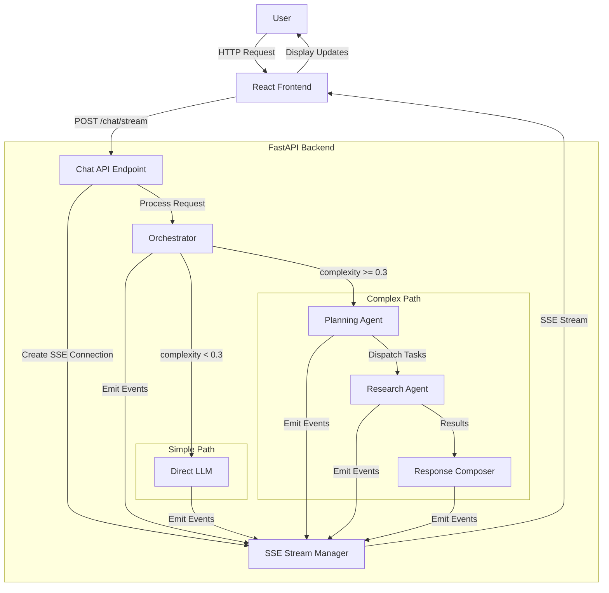
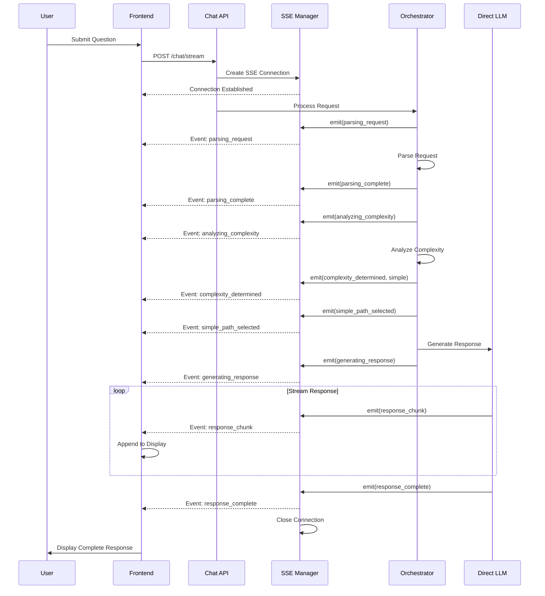
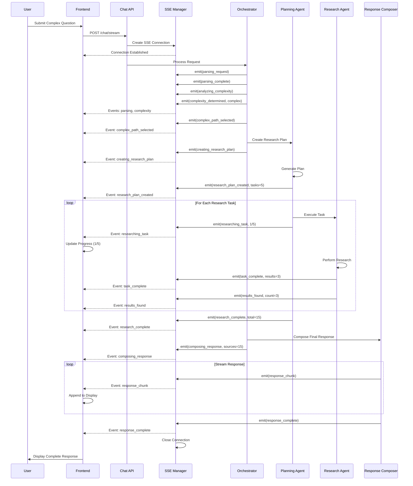

# Design Document: Streaming Status Notifications

## Overview

Streaming Status Notifications feature cung cấp real-time status updates cho người dùng trong suốt quá trình xử lý request của AI agent system. Tính năng này sử dụng Server-Sent Events (SSE) protocol để streaming các status events từ FastAPI backend đến React frontend, giúp người dùng theo dõi tiến trình xử lý từng bước một cách trực quan và minh bạch.

Hệ thống hỗ trợ hai luồng xử lý chính:
- **Simple Path**: Direct LLM call cho các câu hỏi đơn giản (complexity < 0.3)
- **Complex Path**: Full orchestration với Research Agent, Planning Agent, và multiple research tasks

Mỗi luồng xử lý emit các status events tương ứng với các giai đoạn khác nhau: parsing request, analyzing complexity, executing research tasks, composing response, và streaming response chunks. Frontend nhận các events này qua SSE connection và hiển thị real-time progress indicators, task counters, và partial responses.

Kiến trúc được thiết kế với error handling robust (retry mechanism, fallback strategies), connection management (reconnection với exponential backoff), và comprehensive logging cho debugging và performance monitoring.

## Architecture

### System Architecture



### Event Flow - Simple Path



### Event Flow - Complex Path



## Components and Interfaces

### Component 1: SSEStreamManager

**Purpose**: Quản lý SSE connections và emit status events đến clients

**Interface**:
```python
from typing import AsyncGenerator, Dict, Any, Optional
from fastapi import Request
from fastapi.responses import StreamingResponse
from dataclasses import dataclass
from datetime import datetime
import json
import asyncio

@dataclass
class StatusEvent:
    """Status event structure"""
    event_type: str
    timestamp: float
    request_id: str
    message: Optional[str] = None
    data: Optional[Dict[str, Any]] = None
    metadata: Optional[Dict[str, Any]] = None

class SSEStreamManager:
    """Manage SSE connections and event streaming"""
    
    def __init__(self):
        self.active_connections: Dict[str, asyncio.Queue] = {}
    
    async def create_stream(
        self,
        request_id: str,
        request: Request
    ) -> StreamingResponse:
        """Create SSE stream for a request"""
        pass
    
    async def emit_event(
        self,
        request_id: str,
        event: StatusEvent
    ) -> None:
        """Emit status event to client"""
        pass
    
    async def _event_generator(
        self,
        request_id: str,
        request: Request
    ) -> AsyncGenerator[str, None]:
        """Generate SSE formatted events"""
        pass
    
    def _format_sse_event(self, event: StatusEvent) -> str:
        """Format event as SSE message"""
        pass
    
    async def close_stream(self, request_id: str) -> None:
        """Close SSE stream"""
        pass
```

**Responsibilities**:
- Tạo và quản lý SSE connections
- Format events theo SSE protocol
- Handle connection lifecycle (open, emit, close)
- Detect client disconnections
- Queue events khi client chưa ready

### Component 2: StatusEventEmitter

**Purpose**: Provide convenient API để emit các loại status events khác nhau

**Interface**:
```python
from enum import Enum

class EventType(str, Enum):
    # Connection events
    CONNECTION_ESTABLISHED = "connection_established"
    
    # Parsing events
    PARSING_REQUEST = "parsing_request"
    PARSING_COMPLETE = "parsing_complete"
    PARSING_ERROR = "parsing_error"
    
    # Complexity analysis events
    ANALYZING_COMPLEXITY = "analyzing_complexity"
    COMPLEXITY_DETERMINED = "complexity_determined"
    ANALYSIS_TIMEOUT = "analysis_timeout"
    
    # Path selection events
    SIMPLE_PATH_SELECTED = "simple_path_selected"
    COMPLEX_PATH_SELECTED = "complex_path_selected"
    
    # Simple path events
    GENERATING_RESPONSE = "generating_response"
    
    # Complex path events
    CREATING_RESEARCH_PLAN = "creating_research_plan"
    RESEARCH_PLAN_CREATED = "research_plan_created"
    PLAN_CREATION_ERROR = "plan_creation_error"
    
    # Research task events
    RESEARCHING_TASK = "researching_task"
    TASK_COMPLETE = "task_complete"
    TASK_ERROR = "task_error"
    RESEARCH_COMPLETE = "research_complete"
    
    # Results events
    RESULTS_FOUND = "results_found"
    NO_RESULTS_FOUND = "no_results_found"
    
    # Response composition events
    COMPOSING_RESPONSE = "composing_response"
    RESPONSE_CHUNK = "response_chunk"
    RESPONSE_COMPLETE = "response_complete"
    
    # Error events
    ERROR = "error"
    RETRYING = "retrying"

class StatusEventEmitter:
    """Emit typed status events"""
    
    def __init__(self, stream_manager: SSEStreamManager):
        self.stream_manager = stream_manager
    
    async def emit_connection_established(
        self,
        request_id: str
    ) -> None:
        """Emit connection established event"""
        pass
    
    async def emit_parsing_request(
        self,
        request_id: str
    ) -> None:
        """Emit parsing request event"""
        pass
    
    async def emit_parsing_complete(
        self,
        request_id: str
    ) -> None:
        """Emit parsing complete event"""
        pass
    
    async def emit_complexity_determined(
        self,
        request_id: str,
        path: str,  # "simple" or "complex"
        confidence: float
    ) -> None:
        """Emit complexity determined event"""
        pass
    
    async def emit_research_plan_created(
        self,
        request_id: str,
        total_tasks: int,
        task_descriptions: list[str]
    ) -> None:
        """Emit research plan created event"""
        pass
    
    async def emit_researching_task(
        self,
        request_id: str,
        task_index: int,
        total_tasks: int,
        task_description: str,
        estimated_duration_ms: float
    ) -> None:
        """Emit researching task event"""
        pass
    
    async def emit_task_complete(
        self,
        request_id: str,
        task_index: int,
        result_count: int
    ) -> None:
        """Emit task complete event"""
        pass
    
    async def emit_response_chunk(
        self,
        request_id: str,
        chunk: str,
        chunk_index: int
    ) -> None:
        """Emit response chunk event"""
        pass
    
    async def emit_error(
        self,
        request_id: str,
        error_code: str,
        error_message: str,
        recoverable: bool
    ) -> None:
        """Emit error event"""
        pass
```

**Responsibilities**:
- Provide type-safe API cho các event types
- Construct StatusEvent objects với correct structure
- Delegate to SSEStreamManager để emit
- Validate event data trước khi emit

### Component 3: StreamingChatRouter

**Purpose**: FastAPI router endpoint cho streaming chat với SSE

**Interface**:
```python
from fastapi import APIRouter, Depends, Request, HTTPException
from fastapi.responses import StreamingResponse
from app.schema.chat_schema import ChatRequest

router = APIRouter(prefix="/chat", tags=["chat"])

class StreamingChatRouter:
    """FastAPI router for streaming chat"""
    
    def __init__(
        self,
        stream_manager: SSEStreamManager,
        event_emitter: StatusEventEmitter,
        orchestrator: StreamingOrchestrator
    ):
        self.stream_manager = stream_manager
        self.event_emitter = event_emitter
        self.orchestrator = orchestrator
    
    @router.post("/stream")
    async def stream_chat(
        self,
        payload: ChatRequest,
        request: Request
    ) -> StreamingResponse:
        """Stream chat with status updates"""
        pass
```

**Responsibilities**:
- Expose SSE endpoint `/chat/stream`
- Create SSE connection via SSEStreamManager
- Trigger orchestrator processing
- Handle request validation
- Return StreamingResponse với correct headers

### Component 4: StreamingOrchestrator

**Purpose**: Orchestrate request processing và emit status events tại mỗi bước

**Interface**:
```python
from typing import Optional
from app.schema.chat_schema import ChatRequest, ChatResponse

class StreamingOrchestrator:
    """Orchestrate request processing with status streaming"""
    
    def __init__(
        self,
        event_emitter: StatusEventEmitter,
        parser: RequestParser,
        complexity_analyzer: ComplexityAnalyzer,
        simple_path_handler: SimplePathHandler,
        complex_path_handler: ComplexPathHandler
    ):
        self.event_emitter = event_emitter
        self.parser = parser
        self.complexity_analyzer = complexity_analyzer
        self.simple_path_handler = simple_path_handler
        self.complex_path_handler = complex_path_handler
    
    async def process_request(
        self,
        request_id: str,
        payload: ChatRequest
    ) -> ChatResponse:
        """Process request with status streaming"""
        pass
    
    async def _parse_request(
        self,
        request_id: str,
        payload: ChatRequest
    ) -> ParsedRequest:
        """Parse request and emit events"""
        pass
    
    async def _analyze_complexity(
        self,
        request_id: str,
        parsed: ParsedRequest
    ) -> ComplexityResult:
        """Analyze complexity and emit events"""
        pass
    
    async def _execute_simple_path(
        self,
        request_id: str,
        parsed: ParsedRequest
    ) -> str:
        """Execute simple path and emit events"""
        pass
    
    async def _execute_complex_path(
        self,
        request_id: str,
        parsed: ParsedRequest
    ) -> str:
        """Execute complex path and emit events"""
        pass
```

**Responsibilities**:
- Orchestrate toàn bộ request processing workflow
- Emit status events tại mỗi processing stage
- Route giữa Simple và Complex path
- Handle errors và emit error events
- Coordinate với các handlers

### Component 5: SimplePathHandler

**Purpose**: Xử lý Simple Path với direct LLM call và streaming response

**Interface**:
```python
class SimplePathHandler:
    """Handle simple path with direct LLM"""
    
    def __init__(
        self,
        event_emitter: StatusEventEmitter,
        llm_service: LLMService
    ):
        self.event_emitter = event_emitter
        self.llm_service = llm_service
    
    async def execute(
        self,
        request_id: str,
        parsed: ParsedRequest
    ) -> str:
        """Execute simple path with streaming"""
        pass
    
    async def _stream_llm_response(
        self,
        request_id: str,
        prompt: str
    ) -> str:
        """Stream LLM response chunks"""
        pass
```

**Responsibilities**:
- Emit simple_path_selected event
- Call LLM service để generate response
- Stream response chunks qua event emitter
- Emit response_complete event
- Handle LLM errors

### Component 6: ComplexPathHandler

**Purpose**: Xử lý Complex Path với Planning Agent và Research Agent

**Interface**:
```python
class ComplexPathHandler:
    """Handle complex path with research"""
    
    def __init__(
        self,
        event_emitter: StatusEventEmitter,
        planning_agent: PlanningAgent,
        research_agent: ResearchAgent,
        response_composer: ResponseComposer
    ):
        self.event_emitter = event_emitter
        self.planning_agent = planning_agent
        self.research_agent = research_agent
        self.response_composer = response_composer
    
    async def execute(
        self,
        request_id: str,
        parsed: ParsedRequest
    ) -> str:
        """Execute complex path with research"""
        pass
    
    async def _create_research_plan(
        self,
        request_id: str,
        parsed: ParsedRequest
    ) -> ResearchPlan:
        """Create research plan and emit events"""
        pass
    
    async def _execute_research_tasks(
        self,
        request_id: str,
        plan: ResearchPlan
    ) -> list[ResearchResult]:
        """Execute research tasks and emit progress"""
        pass
    
    async def _compose_final_response(
        self,
        request_id: str,
        results: list[ResearchResult]
    ) -> str:
        """Compose final response and stream chunks"""
        pass
```

**Responsibilities**:
- Emit complex_path_selected event
- Create research plan via Planning Agent
- Execute research tasks và emit progress (X/N format)
- Collect research results
- Compose final response và stream chunks
- Handle research errors

### Component 7: SSEClient (Frontend)

**Purpose**: React hook để connect và consume SSE stream

**Interface**:
```typescript
interface StatusEvent {
  event_type: string;
  timestamp: number;
  request_id: string;
  message?: string;
  data?: Record<string, any>;
  metadata?: Record<string, any>;
}

interface UseSSEStreamOptions {
  onEvent?: (event: StatusEvent) => void;
  onError?: (error: Error) => void;
  onComplete?: () => void;
  reconnect?: boolean;
  maxReconnectAttempts?: number;
}

interface UseSSEStreamReturn {
  events: StatusEvent[];
  isConnected: boolean;
  error: Error | null;
  sendRequest: (message: string) => Promise<void>;
  disconnect: () => void;
}

function useSSEStream(options?: UseSSEStreamOptions): UseSSEStreamReturn {
  // Implementation
}
```

**Responsibilities**:
- Establish SSE connection đến `/chat/stream`
- Parse SSE events
- Maintain event history
- Handle reconnection với exponential backoff
- Detect connection interruptions
- Provide React-friendly API

### Component 8: StatusDisplay (Frontend)

**Purpose**: React component hiển thị status updates

**Interface**:
```typescript
interface StatusDisplayProps {
  events: StatusEvent[];
  isConnected: boolean;
}

function StatusDisplay({ events, isConnected }: StatusDisplayProps): JSX.Element {
  // Implementation
}
```

**Responsibilities**:
- Render status messages từ events
- Display progress indicators cho research tasks
- Show timestamps cho mỗi update
- Display connection status
- Highlight errors
- Show completion indicator

### Component 9: ResponseDisplay (Frontend)

**Purpose**: React component hiển thị streaming response

**Interface**:
```typescript
interface ResponseDisplayProps {
  chunks: string[];
  isComplete: boolean;
}

function ResponseDisplay({ chunks, isComplete }: ResponseDisplayProps): JSX.Element {
  // Implementation
}
```

**Responsibilities**:
- Append response chunks incrementally
- Auto-scroll khi có chunks mới
- Display completion indicator
- Format markdown content
- Handle code blocks và citations

### Component 10: EventLogger

**Purpose**: Log tất cả status events cho debugging

**Interface**:
```python
import logging
from typing import Optional

class EventLogger:
    """Log status events for debugging"""
    
    def __init__(self, logger: logging.Logger):
        self.logger = logger
    
    def log_event(
        self,
        event: StatusEvent,
        level: str = "INFO"
    ) -> None:
        """Log status event"""
        pass
    
    def log_stream_lifecycle(
        self,
        request_id: str,
        action: str,  # "open", "close", "error"
        metadata: Optional[Dict[str, Any]] = None
    ) -> None:
        """Log stream lifecycle events"""
        pass
```

**Responsibilities**:
- Log mọi status event với structured format
- Log stream lifecycle (open, close, error)
- Include request_id, event_type, timestamp
- Log với appropriate levels (INFO, ERROR)
- Compatible với existing logging infrastructure

## Data Models

### Model 1: StatusEvent

```python
from pydantic import BaseModel, Field
from typing import Optional, Dict, Any
from datetime import datetime

class StatusEvent(BaseModel):
    """Status event structure"""
    
    event_type: str = Field(..., description="Type of status event")
    timestamp: float = Field(
        default_factory=lambda: datetime.utcnow().timestamp(),
        description="Unix timestamp"
    )
    request_id: str = Field(..., description="Unique request identifier")
    message: Optional[str] = Field(None, description="Human-readable message")
    data: Optional[Dict[str, Any]] = Field(None, description="Event-specific data")
    metadata: Optional[Dict[str, Any]] = Field(None, description="Additional metadata")
    
    class Config:
        json_schema_extra = {
            "example": {
                "event_type": "researching_task",
                "timestamp": 1704067200.0,
                "request_id": "req_123",
                "message": "Researching task 1/5",
                "data": {
                    "task_index": 1,
                    "total_tasks": 5,
                    "task_description": "Search for Bitcoin price",
                    "estimated_duration_ms": 2000
                },
                "metadata": {
                    "user_id": "user_456"
                }
            }
        }
```

**Validation Rules**:
- `event_type` phải non-empty string
- `timestamp` phải valid Unix timestamp
- `request_id` phải non-empty string
- `data` structure depends on `event_type`

### Model 2: Event-Specific Data Structures

```python
class ComplexityDeterminedData(BaseModel):
    """Data for complexity_determined event"""
    path: str = Field(..., pattern="^(simple|complex)$")
    confidence: float = Field(..., ge=0.0, le=1.0)
    complexity_score: float = Field(..., ge=0.0, le=1.0)

class ResearchPlanCreatedData(BaseModel):
    """Data for research_plan_created event"""
    total_tasks: int = Field(..., gt=0)
    task_descriptions: list[str]
    estimated_total_duration_ms: float = Field(..., gt=0)

class ResearchingTaskData(BaseModel):
    """Data for researching_task event"""
    task_index: int = Field(..., gt=0)
    total_tasks: int = Field(..., gt=0)
    task_description: str
    estimated_duration_ms: float = Field(..., gt=0)

class TaskCompleteData(BaseModel):
    """Data for task_complete event"""
    task_index: int = Field(..., gt=0)
    result_count: int = Field(..., ge=0)
    actual_duration_ms: float = Field(..., gt=0)

class ResultsFoundData(BaseModel):
    """Data for results_found event"""
    result_count: int = Field(..., gt=0)
    result_types: Dict[str, int]  # {"documents": 3, "web_pages": 2}

class ResponseChunkData(BaseModel):
    """Data for response_chunk event"""
    chunk: str
    chunk_index: int = Field(..., ge=0)
    is_final: bool = False

class ErrorData(BaseModel):
    """Data for error event"""
    error_code: str
    error_message: str
    recoverable: bool
    stack_trace: Optional[str] = None
```

**Validation Rules**:
- All numeric fields phải trong valid ranges
- `path` chỉ accept "simple" hoặc "complex"
- `task_index` phải <= `total_tasks`
- `chunk_index` phải sequential

### Model 3: SSE Connection State

```python
from enum import Enum

class ConnectionState(str, Enum):
    CONNECTING = "connecting"
    CONNECTED = "connected"
    DISCONNECTED = "disconnected"
    RECONNECTING = "reconnecting"
    FAILED = "failed"

class SSEConnection(BaseModel):
    """SSE connection state"""
    request_id: str
    state: ConnectionState
    connected_at: Optional[float] = None
    disconnected_at: Optional[float] = None
    reconnect_attempts: int = Field(default=0, ge=0)
    last_event_timestamp: Optional[float] = None
```

**Validation Rules**:
- `reconnect_attempts` phải >= 0
- `connected_at` phải < `disconnected_at` nếu cả hai exist
- `state` phải valid ConnectionState

## Error Handling

### Error Categories

```python
class StreamingError(Exception):
    """Base exception for streaming errors"""
    pass

class ConnectionError(StreamingError):
    """SSE connection errors"""
    pass

class EventEmissionError(StreamingError):
    """Event emission errors"""
    pass

class ClientDisconnectedError(StreamingError):
    """Client disconnected during streaming"""
    pass
```

### Error Handling Strategy

1. **Connection Errors**:
   - Frontend: Retry với exponential backoff (1s, 2s, 4s, 8s)
   - Max 4 reconnection attempts
   - Display reconnection indicator
   - Sau 4 failed attempts: display error message

2. **Event Emission Errors**:
   - Log error với ERROR level
   - Continue processing (don't fail entire request)
   - Emit error event nếu có thể
   - Track failed emissions trong metrics

3. **Client Disconnection**:
   - Backend detect disconnection
   - Stop emitting events
   - Clean up resources
   - Log disconnection event

4. **Processing Errors**:
   - Emit error event với error details
   - If recoverable: emit retrying event và retry
   - If not recoverable: emit final error và close stream
   - Max 3 retry attempts

### Timeout Handling

```python
class TimeoutConfig:
    """Timeout configuration"""
    SSE_CONNECTION_TIMEOUT_MS = 5000
    EVENT_EMISSION_TIMEOUT_MS = 1000
    PARSING_TIMEOUT_MS = 5000
    COMPLEXITY_ANALYSIS_TIMEOUT_MS = 10000
    RESEARCH_TASK_TIMEOUT_MS = 30000
    TOTAL_REQUEST_TIMEOUT_MS = 300000  # 5 minutes
```

## Testing Strategy

### Unit Testing

Sử dụng pytest cho backend và Jest/React Testing Library cho frontend.

**Backend Unit Tests**:
- Test SSEStreamManager: create stream, emit events, format SSE, close stream
- Test StatusEventEmitter: emit từng loại event với correct data structure
- Test StreamingOrchestrator: orchestration logic, path routing, error handling
- Test SimplePathHandler: LLM streaming, chunk emission
- Test ComplexPathHandler: research plan creation, task execution, progress tracking
- Test EventLogger: log formatting, log levels

**Frontend Unit Tests**:
- Test useSSEStream hook: connection, event parsing, reconnection logic
- Test StatusDisplay: render events, progress indicators, timestamps
- Test ResponseDisplay: append chunks, auto-scroll, completion indicator
- Test event filtering logic
- Test error handling và reconnection UI

### Property-Based Testing

Minimum 100 iterations per property test.

**Property Test Configuration**:
- Library: Hypothesis (Python), fast-check (TypeScript)
- Iterations: 100 minimum
- Tag format: **Feature: streaming-status-notifications, Property {number}: {property_text}**


## Correctness Properties

*A property is a characteristic or behavior that should hold true across all valid executions of a system-essentially, a formal statement about what the system should do. Properties serve as the bridge between human-readable specifications and machine-verifiable correctness guarantees.*

### Property Reflection

After analyzing all 75 acceptance criteria, I identified the following redundancies:

**Redundant Properties**:
- Properties 4.3, 8.3, and 9.1 all test chunk emission during generation - can be combined into one comprehensive property
- Properties 2.2, 3.3, 6.2, 7.2, 8.2, 12.1 all test event structure fields - can be combined into schema validation properties
- Properties 4.4 and 8.4 both test response_complete emission - can be unified
- Properties 1.3 and connection establishment can be combined with connection lifecycle property

**Combined Properties**:
- Event schema validation (covers required fields, optional fields, type-specific data)
- Response chunk streaming (covers all chunk emission scenarios)
- Event emission for processing stages (covers all stage transitions)

### Property 1: SSE Connection Creation

*For any* valid chat request, when the backend receives it, an SSE connection SHALL be created and a connection confirmation event SHALL be emitted.

**Validates: Requirements 1.1, 1.3**

### Property 2: SSE Protocol Headers

*For any* SSE stream response, the HTTP headers SHALL include `Content-Type: text/event-stream`, `Cache-Control: no-cache`, and `Connection: keep-alive`.

**Validates: Requirements 1.2**

### Property 3: Connection Error Handling

*For any* connection failure scenario, the backend SHALL return an HTTP error response with an appropriate status code (4xx for client errors, 5xx for server errors).

**Validates: Requirements 1.4**

### Property 4: Connection Lifecycle

*For any* SSE connection, it SHALL remain open until either the response is complete (response_complete event emitted) or a timeout occurs.

**Validates: Requirements 1.5**

### Property 5: Parsing Stage Events

*For any* request being parsed, the backend SHALL emit a "parsing_request" event at the start and either a "parsing_complete" event on success or a "parsing_error" event on failure.

**Validates: Requirements 2.1, 2.3, 2.4**

### Property 6: Complexity Analysis Events

*For any* complexity analysis, the backend SHALL emit an "analyzing_complexity" event at the start and either a "complexity_determined" event with path decision on success or an "analysis_timeout" event with fallback decision on timeout.

**Validates: Requirements 3.1, 3.2, 3.4**

### Property 7: Path Selection Events

*For any* request classification, the backend SHALL emit exactly one path selection event: either "simple_path_selected" or "complex_path_selected", based on the complexity score threshold (0.3).

**Validates: Requirements 4.1, 5.1**

### Property 8: Simple Path Response Generation

*For any* simple path execution, the backend SHALL emit a "generating_response" event at the start and a "response_complete" event at the end.

**Validates: Requirements 4.2, 4.4**

### Property 9: Research Plan Creation Events

*For any* complex path execution, the backend SHALL emit a "creating_research_plan" event at the start and either a "research_plan_created" event with task count on success or a "plan_creation_error" event with fallback action on failure.

**Validates: Requirements 5.2, 5.3, 5.5**

### Property 10: Research Task Progress Events

*For any* research task in a plan, the backend SHALL emit a "researching_task" event with task index (X/N format) at the start and either a "task_complete" event with result count on success or a "task_error" event on failure.

**Validates: Requirements 6.1, 6.3, 6.5**

### Property 11: Research Completion Event

*For any* research plan where all tasks have completed (successfully or with errors), the backend SHALL emit a "research_complete" event with the total number of results found.

**Validates: Requirements 6.4**

### Property 12: Results Found Events

*For any* research task that finds results, the backend SHALL emit a "results_found" event with the result count and result type summary.

**Validates: Requirements 7.1, 7.2, 7.4**

### Property 13: Response Composition Events

*For any* final response composition in complex path, the backend SHALL emit a "composing_response" event with the number of research results being used at the start and a "response_complete" event at the end.

**Validates: Requirements 8.1, 8.2, 8.4**

### Property 14: Response Chunk Streaming

*For any* response being generated (simple or complex path), the backend SHALL emit Response_Chunk events containing partial text content and sequential chunk indices, with the final chunk marked with a completion flag.

**Validates: Requirements 4.3, 8.3, 9.1, 9.2, 9.4**

### Property 15: Chunk Sequential Ordering

*For any* sequence of response chunks emitted for a request, the chunk indices SHALL be strictly sequential starting from 0 (i.e., chunk_index[i+1] = chunk_index[i] + 1).

**Validates: Requirements 9.3**

### Property 16: Error Event Emission

*For any* error that occurs during request processing, the backend SHALL emit a Status_Event with type "error" containing error code, error message, and recoverable flag.

**Validates: Requirements 10.1, 10.2**

### Property 17: Retry Event Emission

*For any* recoverable error, the backend SHALL emit a "retrying" event with the retry attempt number before each retry attempt (up to maximum 3 attempts).

**Validates: Requirements 10.3**

### Property 18: Non-Recoverable Error Stream Closure

*For any* non-recoverable error, the backend SHALL close the SSE stream after emitting the error event.

**Validates: Requirements 10.4**

### Property 19: Frontend Event Display

*For any* Status_Event received by the frontend, the frontend SHALL display the status message in the UI with a timestamp.

**Validates: Requirements 11.1, 11.4**

### Property 20: Research Task Progress Display

*For any* "researching_task" event received, the frontend SHALL display a progress indicator with the format "Task X/N" where X is the task_index and N is the total_tasks.

**Validates: Requirements 11.2**

### Property 21: Response Chunk Appending

*For any* Response_Chunk event received by the frontend, the frontend SHALL append the chunk content to the response display area in the order received.

**Validates: Requirements 11.3**

### Property 22: Stream Completion Display

*For any* SSE stream that closes (either successfully or due to error), the frontend SHALL display a completion indicator.

**Validates: Requirements 11.5**

### Property 23: Event Schema Required Fields

*For any* Status_Event emitted by the backend, it SHALL contain the required fields: event_type (non-empty string), timestamp (valid Unix timestamp), and request_id (non-empty string).

**Validates: Requirements 12.1**

### Property 24: Event Schema Optional Fields

*For any* Status_Event, the optional fields (message, data, metadata) SHALL be accepted and properly serialized if present.

**Validates: Requirements 12.2**

### Property 25: Event Type-Specific Data

*For any* Status_Event with a specific event_type, the data field SHALL contain the type-specific information structure defined for that event_type (e.g., "complexity_determined" SHALL have path and confidence fields).

**Validates: Requirements 12.3**

### Property 26: Event JSON Serialization Round-Trip

*For any* Status_Event, serializing to JSON and then deserializing SHALL produce an equivalent Status_Event object with all fields preserved.

**Validates: Requirements 12.4**

### Property 27: Event Schema Validation

*For any* Status_Event before emission, the backend SHALL validate it against the schema and reject invalid events (preventing emission of malformed events).

**Validates: Requirements 12.5**

### Property 28: Reconnection Indicator Display

*For any* SSE connection interruption detected by the frontend, the frontend SHALL display a reconnection indicator.

**Validates: Requirements 13.2**

### Property 29: Exponential Backoff Reconnection

*For any* reconnection attempt sequence, the frontend SHALL wait with exponential backoff delays: 1s before attempt 1, 2s before attempt 2, 4s before attempt 3, and 8s before attempt 4.

**Validates: Requirements 13.3**

### Property 30: Max Reconnection Attempts

*For any* reconnection sequence where all 4 attempts fail, the frontend SHALL display an error message and stop attempting reconnection.

**Validates: Requirements 13.5**

### Property 31: Event Filtering

*For any* SSE connection with event_type filters specified, the backend SHALL only emit Status_Events whose event_type matches at least one of the filter criteria.

**Validates: Requirements 14.1, 14.3**

### Property 32: Filter Specification

*For any* SSE connection request, the frontend SHALL be able to specify zero or more event_type filters in the request parameters.

**Validates: Requirements 14.2**

### Property 33: No Filter Default Behavior

*For any* SSE connection without filters specified, the backend SHALL emit all Status_Event types (no filtering applied).

**Validates: Requirements 14.4**

### Property 34: Filter Independence from Chunks

*For any* SSE connection with event_type filters, Response_Chunk events SHALL always be emitted regardless of filter configuration.

**Validates: Requirements 14.5**

### Property 35: Event Logging

*For any* Status_Event emitted by the backend, a log entry SHALL be created at INFO level containing request_id, event_type, timestamp, and event data.

**Validates: Requirements 15.1, 15.2**

### Property 36: Error Event Logging

*For any* Status_Event with type "error", the backend SHALL log it at ERROR level with the full stack trace included.

**Validates: Requirements 15.3**

### Property 37: Stream Lifecycle Logging

*For any* SSE stream lifecycle event (open, close, error), the backend SHALL create a log entry with the request_id and lifecycle action.

**Validates: Requirements 15.4**

## Main Algorithm/Workflow

### Backend SSE Streaming Workflow

```python
async def stream_chat_with_status(
    request_id: str,
    payload: ChatRequest,
    stream_manager: SSEStreamManager,
    event_emitter: StatusEventEmitter,
    orchestrator: StreamingOrchestrator
) -> AsyncGenerator[str, None]:
    """
    Main workflow for streaming chat with status updates.
    
    Preconditions:
    - request_id is unique and non-empty
    - payload is valid ChatRequest
    - stream_manager, event_emitter, orchestrator are initialized
    
    Postconditions:
    - SSE connection is established
    - All processing stages emit appropriate events
    - Response chunks are streamed
    - Connection is closed after completion or error
    - All events are logged
    """
    
    try:
        # 1. Establish connection
        await event_emitter.emit_connection_established(request_id)
        
        # 2. Parse request
        await event_emitter.emit_parsing_request(request_id)
        parsed = await orchestrator.parse_request(payload)
        await event_emitter.emit_parsing_complete(request_id)
        
        # 3. Analyze complexity
        await event_emitter.emit_analyzing_complexity(request_id)
        complexity = await orchestrator.analyze_complexity(parsed)
        await event_emitter.emit_complexity_determined(
            request_id,
            path="simple" if complexity.score < 0.3 else "complex",
            confidence=complexity.confidence
        )
        
        # 4. Route to appropriate path
        if complexity.score < 0.3:
            # Simple path
            await event_emitter.emit_simple_path_selected(request_id)
            await event_emitter.emit_generating_response(request_id)
            
            # Stream response chunks
            chunk_index = 0
            async for chunk in orchestrator.generate_simple_response(parsed):
                await event_emitter.emit_response_chunk(
                    request_id, chunk, chunk_index
                )
                chunk_index += 1
            
            await event_emitter.emit_response_complete(request_id)
        
        else:
            # Complex path
            await event_emitter.emit_complex_path_selected(request_id)
            
            # Create research plan
            await event_emitter.emit_creating_research_plan(request_id)
            plan = await orchestrator.create_research_plan(parsed)
            await event_emitter.emit_research_plan_created(
                request_id,
                total_tasks=len(plan.tasks),
                task_descriptions=[t.description for t in plan.tasks]
            )
            
            # Execute research tasks
            results = []
            for i, task in enumerate(plan.tasks, start=1):
                await event_emitter.emit_researching_task(
                    request_id,
                    task_index=i,
                    total_tasks=len(plan.tasks),
                    task_description=task.description,
                    estimated_duration_ms=task.estimated_duration_ms
                )
                
                try:
                    result = await orchestrator.execute_research_task(task)
                    results.append(result)
                    
                    await event_emitter.emit_task_complete(
                        request_id,
                        task_index=i,
                        result_count=len(result.items)
                    )
                    
                    if len(result.items) > 0:
                        await event_emitter.emit_results_found(
                            request_id,
                            result_count=len(result.items),
                            result_types=result.type_summary
                        )
                
                except Exception as e:
                    await event_emitter.emit_task_error(
                        request_id,
                        task_index=i,
                        error_message=str(e)
                    )
                    # Continue with remaining tasks
            
            await event_emitter.emit_research_complete(
                request_id,
                total_results=sum(len(r.items) for r in results)
            )
            
            # Compose final response
            await event_emitter.emit_composing_response(
                request_id,
                sources_used=len(results)
            )
            
            # Stream response chunks
            chunk_index = 0
            async for chunk in orchestrator.compose_final_response(results):
                await event_emitter.emit_response_chunk(
                    request_id, chunk, chunk_index
                )
                chunk_index += 1
            
            await event_emitter.emit_response_complete(request_id)
    
    except Exception as e:
        # Error handling
        is_recoverable = orchestrator.is_recoverable_error(e)
        
        await event_emitter.emit_error(
            request_id,
            error_code=type(e).__name__,
            error_message=str(e),
            recoverable=is_recoverable
        )
        
        if is_recoverable and orchestrator.retry_count < 3:
            await event_emitter.emit_retrying(
                request_id,
                retry_attempt=orchestrator.retry_count + 1
            )
            # Retry logic would go here
        else:
            # Non-recoverable or max retries reached
            await stream_manager.close_stream(request_id)
    
    finally:
        # Cleanup
        await stream_manager.close_stream(request_id)
```

**Loop Invariants**:

1. **Chunk Index Invariant** (in chunk streaming loops):
   - At the start of iteration i: `chunk_index == i`
   - After emitting chunk: `chunk_index == i + 1`
   - Ensures sequential chunk numbering

2. **Task Progress Invariant** (in research task loop):
   - At the start of iteration i: `task_index == i` and `1 <= i <= total_tasks`
   - After task completion: exactly one of (task_complete, task_error) event emitted
   - Ensures all tasks are tracked

3. **Event Emission Invariant**:
   - For every processing stage entered, a corresponding start event is emitted
   - For every processing stage completed, a corresponding completion/error event is emitted
   - Ensures complete event coverage

### Frontend SSE Consumption Workflow

```typescript
function useSSEStream(options?: UseSSEStreamOptions): UseSSEStreamReturn {
  /**
   * React hook for consuming SSE stream.
   * 
   * Preconditions:
   * - Component is mounted
   * - Backend SSE endpoint is available
   * 
   * Postconditions:
   * - SSE connection is established on sendRequest
   * - Events are parsed and stored in state
   * - Reconnection is attempted on disconnection (if enabled)
   * - Connection is cleaned up on unmount
   * 
   * Loop Invariants:
   * - reconnectAttempts <= maxReconnectAttempts
   * - events array maintains chronological order
   */
  
  const [events, setEvents] = useState<StatusEvent[]>([]);
  const [isConnected, setIsConnected] = useState(false);
  const [error, setError] = useState<Error | null>(null);
  const [reconnectAttempts, setReconnectAttempts] = useState(0);
  const eventSourceRef = useRef<EventSource | null>(null);
  
  const connect = useCallback(async (message: string) => {
    try {
      // Create SSE connection
      const url = `/chat/stream?message=${encodeURIComponent(message)}`;
      const eventSource = new EventSource(url);
      eventSourceRef.current = eventSource;
      
      eventSource.onopen = () => {
        setIsConnected(true);
        setReconnectAttempts(0);
        setError(null);
      };
      
      eventSource.onmessage = (e) => {
        const event: StatusEvent = JSON.parse(e.data);
        setEvents(prev => [...prev, event]);
        options?.onEvent?.(event);
        
        // Check for completion
        if (event.event_type === 'response_complete') {
          eventSource.close();
          setIsConnected(false);
          options?.onComplete?.();
        }
      };
      
      eventSource.onerror = (e) => {
        setIsConnected(false);
        const error = new Error('SSE connection error');
        setError(error);
        options?.onError?.(error);
        
        // Attempt reconnection with exponential backoff
        if (options?.reconnect && reconnectAttempts < (options?.maxReconnectAttempts ?? 4)) {
          const delay = Math.pow(2, reconnectAttempts) * 1000; // 1s, 2s, 4s, 8s
          setTimeout(() => {
            setReconnectAttempts(prev => prev + 1);
            connect(message);
          }, delay);
        } else {
          eventSource.close();
        }
      };
      
    } catch (e) {
      const error = e instanceof Error ? e : new Error('Connection failed');
      setError(error);
      options?.onError?.(error);
    }
  }, [options, reconnectAttempts]);
  
  const disconnect = useCallback(() => {
    if (eventSourceRef.current) {
      eventSourceRef.current.close();
      eventSourceRef.current = null;
      setIsConnected(false);
    }
  }, []);
  
  // Cleanup on unmount
  useEffect(() => {
    return () => {
      disconnect();
    };
  }, [disconnect]);
  
  return {
    events,
    isConnected,
    error,
    sendRequest: connect,
    disconnect
  };
}
```

**Loop Invariants**:

1. **Reconnection Attempts Invariant**:
   - At any point: `0 <= reconnectAttempts <= maxReconnectAttempts`
   - After successful connection: `reconnectAttempts == 0`
   - Ensures bounded reconnection attempts

2. **Event Order Invariant**:
   - For any two events e1, e2 in events array where e1 appears before e2:
   - `e1.timestamp <= e2.timestamp`
   - Ensures chronological ordering

3. **Connection State Invariant**:
   - If `isConnected == true`, then `eventSourceRef.current != null`
   - If `isConnected == false`, then no active event source or it's closed
   - Ensures state consistency

## Performance Considerations

### Backend Performance

1. **Event Emission Overhead**:
   - Each event emission involves JSON serialization and queue operation
   - Target: < 1ms per event emission
   - Use efficient JSON serialization (orjson)
   - Batch events when possible

2. **SSE Connection Management**:
   - Each connection maintains an asyncio.Queue
   - Memory per connection: ~10KB
   - Max concurrent connections: 1000 (configurable)
   - Implement connection pooling and cleanup

3. **Chunk Streaming Frequency**:
   - Target: emit chunks every 50-100ms
   - Balance between responsiveness and overhead
   - Buffer small chunks to reduce emission frequency

### Frontend Performance

1. **Event Processing**:
   - Parse and process events as they arrive
   - Use React.memo for event display components
   - Virtualize long event lists (react-window)

2. **Response Display**:
   - Append chunks efficiently (avoid full re-renders)
   - Use textarea or contentEditable for large responses
   - Implement auto-scroll with performance throttling

3. **Memory Management**:
   - Limit event history (keep last 100 events)
   - Clear old events after completion
   - Cleanup event listeners on unmount

## Security Considerations

1. **Input Validation**:
   - Validate all request parameters
   - Sanitize user input before processing
   - Prevent injection attacks

2. **Rate Limiting**:
   - Limit SSE connections per user
   - Implement request rate limiting
   - Prevent DoS attacks

3. **Authentication**:
   - Verify user authentication for SSE endpoints
   - Include auth tokens in SSE requests
   - Validate tokens on each connection

4. **Data Sanitization**:
   - Sanitize event data before emission
   - Prevent XSS in frontend display
   - Escape HTML in status messages

5. **Error Information Disclosure**:
   - Don't expose sensitive error details to clients
   - Log full errors server-side only
   - Return generic error messages to frontend

## Monitoring and Observability

### Metrics to Track

1. **Connection Metrics**:
   - Active SSE connections count
   - Connection duration distribution
   - Connection failure rate
   - Reconnection attempt rate

2. **Event Metrics**:
   - Events emitted per request (by type)
   - Event emission latency
   - Failed event emissions
   - Event queue depth

3. **Performance Metrics**:
   - Request processing time (by path)
   - Time between events
   - Chunk streaming frequency
   - End-to-end latency

4. **Error Metrics**:
   - Error rate (by error type)
   - Retry success rate
   - Non-recoverable error rate
   - Client disconnection rate

### Logging Strategy

1. **Structured Logging**:
   - Use JSON format for all logs
   - Include request_id in all log entries
   - Include event_type for event logs
   - Include timestamps (ISO 8601)

2. **Log Levels**:
   - INFO: Normal events, lifecycle events
   - WARNING: Recoverable errors, retries
   - ERROR: Non-recoverable errors, failures
   - DEBUG: Detailed debugging information

3. **Log Aggregation**:
   - Centralize logs (ELK stack, CloudWatch)
   - Enable log search by request_id
   - Set up alerts for error spikes
   - Create dashboards for key metrics

## Deployment Considerations

1. **Environment Configuration**:
   - SSE timeout settings
   - Max concurrent connections
   - Retry configuration
   - Event filtering defaults

2. **Scaling**:
   - Horizontal scaling with load balancer
   - Sticky sessions for SSE connections
   - Redis for shared state (if needed)
   - Connection draining on deployment

3. **Backwards Compatibility**:
   - Version SSE event schema
   - Support old event formats during transition
   - Graceful degradation for old clients

4. **Testing in Production**:
   - Feature flags for SSE streaming
   - A/B testing with percentage rollout
   - Monitor error rates during rollout
   - Quick rollback capability
