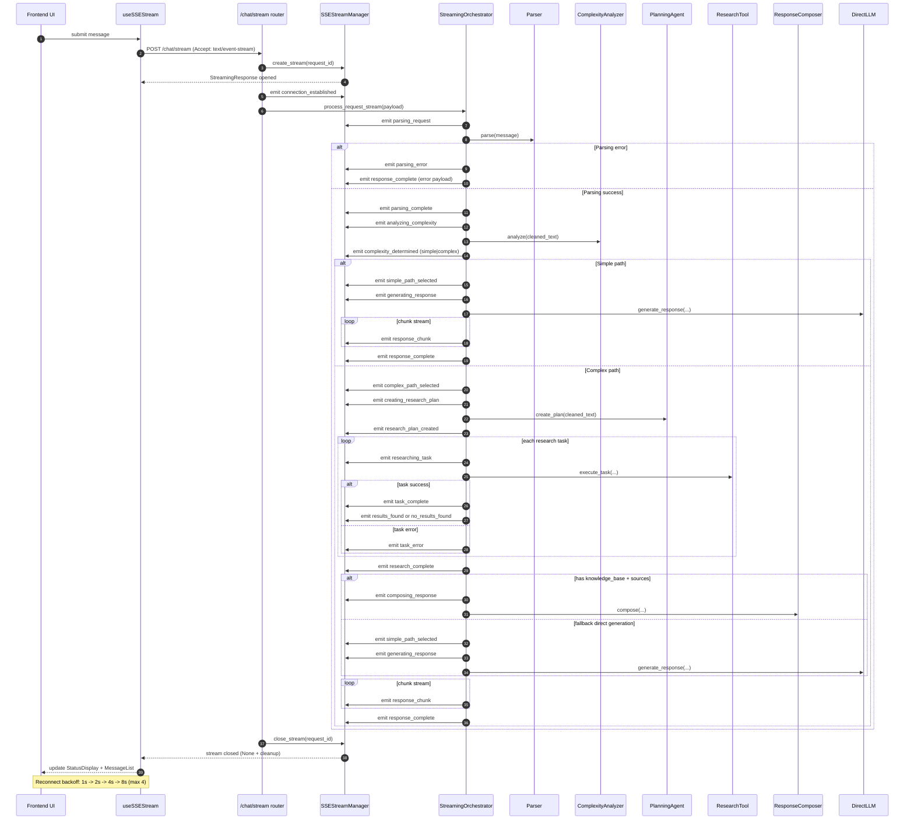

# Streaming Status Workflow (Runtime)

Luồng dưới đây mô tả đúng trình tự thực thi của chức năng streaming status trong code hiện tại (backend + frontend).

## Ghi chú

- Event filter `event_types` được áp dụng ở `SSEStreamManager`; riêng `response_chunk` luôn được gửi.
- Keepalive được gửi định kỳ dưới dạng comment SSE `: keepalive` khi queue chưa có event.
- Mỗi event có schema chuẩn: `event_type`, `timestamp`, `request_id`, `message?`, `data?`, `metadata?`.
