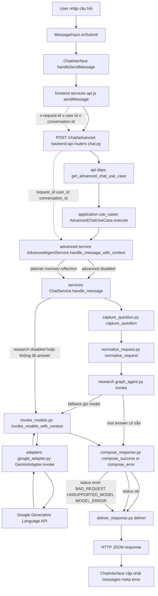
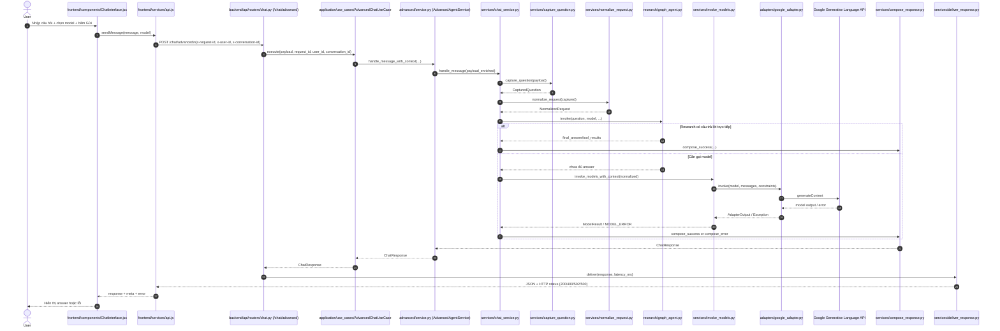

# Request-Response Flow

## Tổng quan

Tài liệu này mô tả đường đi từ lúc user gửi câu hỏi ở UI đến lúc agent trả response về frontend.

## Mermaid Flow

## Mermaid Sequence

## Các điểm chính

- Frontend gửi request tại `frontend/src/services/api.js` với headers `x-request-id`, `x-user-id`, `x-conversation-id`.
- API vào tại route `POST /chat/advanced` trong `backend/src/api/routers/chat.py`.
- `AdvancedAgentService` có thể enrich context (memory/planner/reflection) trước khi gọi `ChatService`.
- `ChatService` chạy pipeline capture -> normalize -> research graph -> invoke model.
- Adapter Gemini (`backend/src/adapters/google_adapter.py`) là nơi gọi provider thật.
- `ComposeResponseService` chuẩn hóa payload trả về, `DeliverResponseService` map status HTTP.
