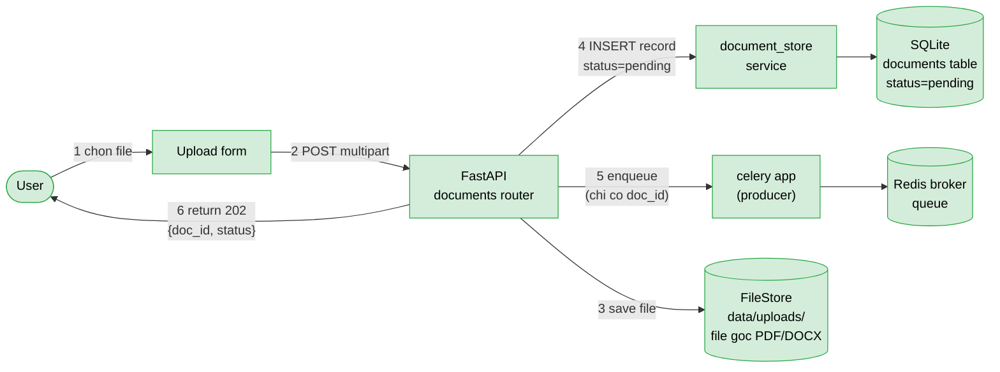
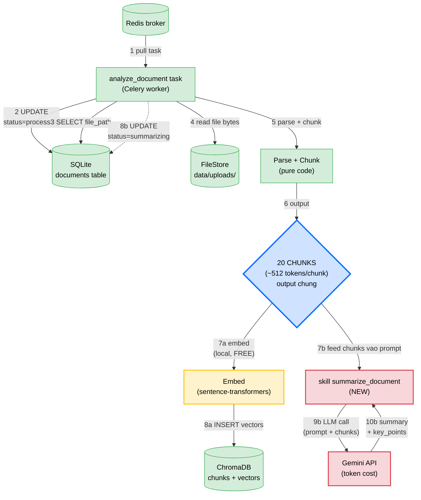
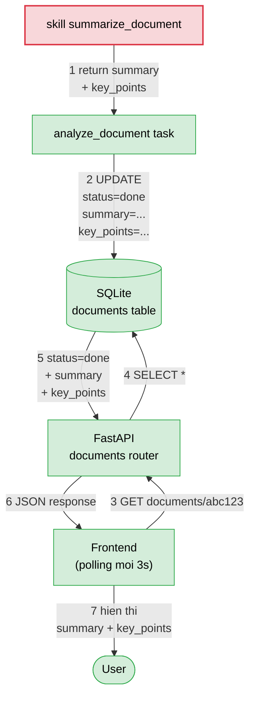
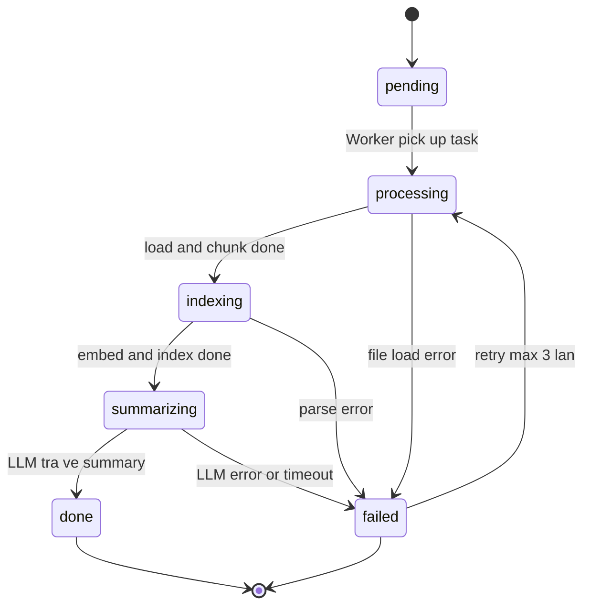
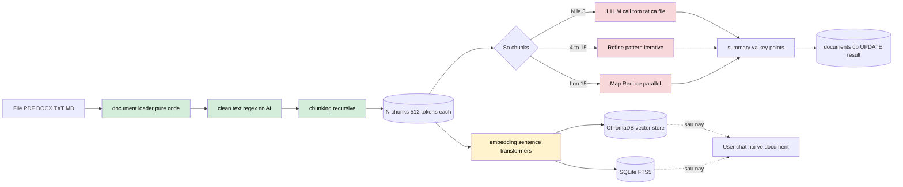
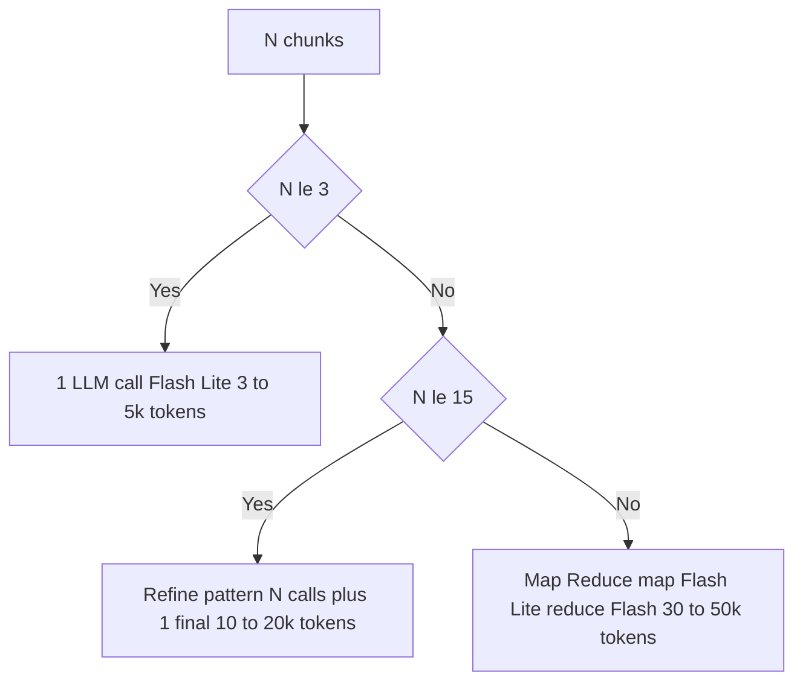

# Document Analysis Feature - Architecture

Feature cho phép user upload tài liệu, hệ thống trả về `202 Accepted` ngay lập tức, sau đó **Celery worker** phân tích background (load, chunk, embed, tóm tắt bằng LLM) và user nhận kết quả qua **polling**.

> **Triết lý thiết kế:** AI chỉ can thiệp ở bước tóm tắt cuối cùng. Khoảng 90% pipeline là pure code. Tận dụng tối đa RAG pipeline có sẵn (chunking, embedding, vector store).

---

## Mục lục

1. [High-level Component Architecture](#1-high-level-component-architecture)
2. [Sequence Diagram](#2-sequence-diagram)
3. [State Machine](#3-state-machine)
4. [Data Flow](#4-data-flow)
5. [Chú giải chi phí AI](#chú-giải-chi-phí-ai)
6. [Components mới cần thêm](#components-mới-cần-thêm)
7. [Tối ưu token cho free tier](#tối-ưu-token-cho-free-tier)

---

## 1. High-level Component Architecture

Feature được chia **3 phase độc lập**: Upload → Analyze → Save Result. Mỗi phase 1 sơ đồ.

Color code: 🟢 xanh = free / pure code · 🟡 vàng = AI local · 🔴 đỏ = AI API (tốn token)

---

### Phase 1: Upload (đồng bộ, ~0.5s)

User upload file → API lưu xong trả `202` ngay. **KHÔNG chờ** worker.



**Kết quả phase 1:**
- File gốc nằm ở **FileStore** (`data/uploads/abc123.pdf`)
- Record `{id: abc123, status: pending}` trong **SQLite**
- 1 task `{doc_id: abc123}` chờ trong **Redis**
- User thấy "Đang phân tích..." sau 0.5s

---

### Phase 2: Analyze (background, 5-30s)

Worker pull task, parse file, embed chunks, gọi LLM tóm tắt. **User không liên quan đến phase này.**



**Cách đọc:**
- Bước **1-6**: tuần tự (pull task → đọc file → parse → ra **20 chunks**).
- Sau đó **20 chunks là input chung**, chia 2 nhánh **song song**:
  - **Nhánh a (FREE):** embed → lưu vào ChromaDB (cho chat hỏi đáp sau này)
  - **Nhánh b (TỐN TOKEN):** feed chunks vào prompt → gọi Gemini → nhận summary + key_points
- Box xanh dương `20 CHUNKS` ở giữa = **điểm rẽ nhánh** quan trọng nhất của phase này.
- Chỉ **1 lần gọi LLM** trong toàn bộ flow → tiết kiệm token.
- Frontend đang polling SQLite, đọc được status từng giai đoạn (`processing → summarizing`).

---

### Phase 3: Save Result & Trả kết quả (1s)

Worker lưu kết quả AI vào SQLite. User polling lần tiếp theo nhận được summary.



**Kết quả phase 3:**
- SQLite cập nhật: `{status: done, summary: "...", key_points: [...]}`
- User thấy summary + key_points trên UI
- ChromaDB đã có chunks → user có thể chat hỏi document này (bonus, không vẽ ở đây)

---

### Tổng kết 3 phase

| Phase | Thời gian | User chờ? | Component chính |
|---|---|---|---|
| 1. Upload | ~0.5s | ✅ Có (sync) | FastAPI + FileStore + SQLite + Redis |
| 2. Analyze | 5-30s | ❌ Không (async) | Celery worker + RAG + ChromaDB + Gemini |
| 3. Save & Return | <1s | ❌ Không (polling) | SQLite + FastAPI + Frontend |

---

## 2. Sequence Diagram

Luồng từ upload đến nhận kết quả.

```mermaid
sequenceDiagram
    actor User
    participant FE as Frontend
    participant API as FastAPI
    participant DB as SQLite
    participant FS as FileStore
    participant R as Redis
    participant W as CeleryWorker
    participant CDB as ChromaDB
    participant LLM as GeminiAPI

    rect rgb(40, 60, 40)
    Note over User,R: PHASE 1 - Upload (sync, ~0.5s)
    User->>FE: Chon file va upload
    FE->>API: POST /documents (multipart)
    API->>FS: Luu file -> data/uploads/abc123.pdf
    API->>DB: INSERT documents (status=pending)
    API->>R: enqueue task {doc_id: abc123}
    API-->>FE: 202 Accepted {doc_id, status=pending}
    FE-->>User: "Da nhan, dang phan tich..."
    end

    rect rgb(60, 50, 30)
    Note over FE,DB: PHASE 3a - User polling (chay song song voi Phase 2)
    loop moi 3 giay
        FE->>API: GET /documents/abc123
        API->>DB: SELECT * WHERE id=abc123
        DB-->>API: {status: processing/summarizing/...}
        API-->>FE: status hien tai
    end
    end

    rect rgb(40, 50, 70)
    Note over R,LLM: PHASE 2 - Worker analyze (async, 5-30s)
    R->>W: pull task {doc_id: abc123}
    W->>DB: UPDATE status=processing
    W->>DB: SELECT file_path WHERE id=abc123
    DB-->>W: "data/uploads/abc123.pdf"
    W->>FS: read file by path
    FS-->>W: file bytes (PDF/DOCX/TXT)

    Note over W: Pure code (FREE)
    W->>W: parse PDF -> text (50,000 chu)
    W->>W: chunk -> 20 doan (~512 tokens/doan)

    Note over W,LLM: 20 chunks duoc dung cho 2 muc dich SONG SONG

    Note over W,CDB: Muc dich 1 - Index cho semantic search (FREE)
    W->>W: embed 20 chunks (sentence-transformers, local)
    W->>CDB: INSERT 20 chunks + 20 vectors (metadata: doc_id)
    CDB-->>W: ok (sau nay user chat hoi dap dung cai nay)
    W->>DB: UPDATE status=summarizing

    Note over W,LLM: Muc dich 2 - Tom tat (TON TOKEN, 1 lan duy nhat)
    W->>LLM: summarize_document(prompt + 20 chunks)
    Note over W,LLM: Gemini doc CAC CHUNKS -> tao summary
    LLM-->>W: {summary ~500 chu, key_points [...]}
    end

    rect rgb(50, 40, 60)
    Note over W,User: PHASE 3 - Save & tra ket qua
    W->>DB: UPDATE status=done, summary=..., key_points=..., num_chunks=20
    Note over W: Worker xong, task ket thuc

    FE->>API: GET /documents/abc123 (lan poll tiep theo)
    API->>DB: SELECT * WHERE id=abc123
    DB-->>API: {status: done, summary, key_points, ...}
    API-->>FE: 200 OK + full result
    FE-->>User: Hien thi summary + key_points
    end
```



**Cách đọc sơ đồ:**
- 🟢 **Phase 1 (xanh la)** — Upload đồng bộ, user chờ 0.5s rồi nhận `202`.
- 🟡 **Phase 3a (vàng)** — Frontend polling chạy **song song** với Phase 2, không cần đợi Phase 2 xong mới poll.
- 🔵 **Phase 2 (xanh dương)** — Worker xử lý nền: đọc file → parse → chunk → embed → index ChromaDB → gọi LLM.
- 🟣 **Phase 3 (tím)** — Worker UPDATE kết quả AI vào SQLite, lần poll tiếp theo của user nhận được summary.

**Điểm quan trọng:**
- Worker ghi **2 nơi**: chunks vào **ChromaDB** (cho semantic search), summary vào **SQLite** (cho user đọc).
- Worker và User **không liên lạc trực tiếp** — SQLite làm trung gian (worker UPDATE, user SELECT).
- Chỉ **1 lần gọi Gemini** trong toàn bộ flow → tiết kiệm token.

---

## 3. State Machine

Vòng đời 1 document.



---

## 4. Data Flow

Pipeline xử lý 1 file.



---

## Chú giải chi phí AI

| Màu | Ý nghĩa | Chi phí token | Ví dụ |
|---|---|---|---|
| Xanh lá | Pure code (Python, regex, I/O) | 0 | load file, chunk, lưu DB |
| Vàng | AI local (sentence-transformers) | 0 (tốn CPU/RAM) | embedding, rerank |
| Đỏ | AI qua API (Gemini/Groq) | Tốn token | summarize, key points |

**Tóm gọn pipeline:**

```
File -> [code] -> [code] -> [local AI] -> [API AI 1 lan] -> DB
         load     chunk    embedding      summarize
         FREE     FREE      FREE         TON TOKEN
```

90% pipeline miễn phí, AI chỉ vào cuộc 1 lần ở bước cuối.

---

## Components mới cần thêm

### Backend code

```
backend/src/
├── tasks/                              (MOI)
│   ├── __init__.py
│   ├── celery_app.py                   # Celery instance + config
│   └── document_tasks.py               # @app.task analyze_document
│
├── api/routers/
│   └── documents.py                    (MOI)
│
├── services/
│   └── document_store.py               (MOI) CRUD documents table
│
├── models/
│   └── document.py                     (MOI) DocumentRow, DocumentStatus enum
│
└── skills/
    └── summarize_document/             (MOI - skill moi)
        ├── skill.yaml
        ├── prompt.md
        └── handler.py
```

### Schema DB mới

Thêm vào `data/conversations.db` hoặc tách ra `data/documents.db`.

```sql
CREATE TABLE documents (
  id TEXT PRIMARY KEY,
  user_id TEXT,
  filename TEXT,
  file_path TEXT,
  file_size INTEGER,
  mime_type TEXT,
  status TEXT NOT NULL,
  summary TEXT,
  key_points TEXT,
  language TEXT,
  num_chunks INTEGER,
  error TEXT,
  created_at TIMESTAMP NOT NULL,
  updated_at TIMESTAMP NOT NULL
);
CREATE INDEX idx_documents_status ON documents(status);
CREATE INDEX idx_documents_user ON documents(user_id);
```

`status` values: `pending`, `processing`, `indexing`, `summarizing`, `done`, `failed`.

### docker-compose.yml — services thêm

```yaml
redis:
  image: redis:7-alpine
  volumes: [redis_data:/data]
  ports: ["6379:6379"]

worker:
  build:
    context: .
    dockerfile: Dockerfile.backend
  command: celery -A backend.src.tasks.celery_app worker -Q analysis,default --concurrency=2 --loglevel=info
  environment:
    - CELERY_BROKER_URL=redis://redis:6379/0
    - CELERY_RESULT_BACKEND=redis://redis:6379/1
    - GEMINI_API_KEY=${GEMINI_API_KEY}
    - DEFAULT_MODEL=${DEFAULT_MODEL:-gemini/gemini-2.5-flash-lite}
  volumes:
    - ./data:/app/data
    - hf_cache:/root/.cache/huggingface
  depends_on: [redis]

volumes:
  redis_data:
  hf_cache:
```

### API endpoints

| Method | Path | Mô tả | Response |
|---|---|---|---|
| `POST` | `/api/v2/documents` | Upload file (multipart) | `202` `{document_id, status, status_url}` |
| `GET` | `/api/v2/documents/{id}` | Poll status + result | `200` `{status, summary, key_points, ...}` |
| `GET` | `/api/v2/documents` | List user's documents | `200` `[{...}]` |
| `DELETE` | `/api/v2/documents/{id}` | Xoá document + index | `204` |

### Task design

```python
@celery_app.task(
    bind=True,
    name="analyze_document",
    autoretry_for=(TimeoutError, ConnectionError),
    retry_backoff=True,
    retry_kwargs={"max_retries": 3},
    soft_time_limit=120,
    time_limit=180,
    rate_limit="10/m",
)
def analyze_document(self, doc_id: str):
    # 1. UPDATE status=processing
    # 2. Load file (reuse rag.document_loader)
    # 3. Clean + chunk (reuse rag.chunking)
    # 4. Embed + index (reuse rag.document_indexer - FREE local)
    # 5. Invoke skill summarize_document (TOKEN COST)
    # 6. UPDATE status=done, summary, key_points
```

> **Quan trọng:** task chỉ truyền `doc_id`, KHÔNG truyền nội dung file qua Celery message.

---

## Tối ưu token cho free tier

### Skill `summarize_document` - config đề xuất

```yaml
# backend/src/skills/summarize_document/skill.yaml
name: summarize_document
version: 1
description: Tom tat tai lieu va trich key points
model: gemini/gemini-2.5-flash-lite
temperature: 0.1
max_output_tokens: 600
llm: true

single_call_threshold_chunks: 3
refine_threshold_chunks: 15
```

### Pattern lựa chọn theo size



### Bonus: tận dụng RAG có sẵn

Vì pipeline đã index document vào ChromaDB + FTS5, **user có thể chat hỏi về document đó** mà không cần re-analyze:

- Câu hỏi cụ thể -> RAG retrieve chunks liên quan -> 1 LLM call để trả lời
- Không phải gửi cả document vào context mỗi lần

---

## Ghi chú triển khai

1. **MVP dùng polling** - đơn giản, không cần Redis pub/sub giữa worker và FastAPI. Có thể nâng lên SSE sau.
2. **Auto-index vào RAG** khi upload - leverage được pattern chat hỏi đáp.
3. **Cache theo file hash** (SHA-256) - upload trùng trả ngay summary cũ, 0 token.
4. **Rate limit task** `10/m` để không vượt RPM của Gemini Free.
5. **Volume share** giữa backend container và worker container là bắt buộc - file uploads, SQLite, ChromaDB phải dùng chung.

---

## Tài liệu liên quan

- [README.md](../../README.md) - Tổng quan project
- [backend/src/rag/README.md](../../backend/src/rag/README.md) - RAG pipeline có sẵn để tái sử dụng
- [docs/architecture/diagrams/](diagrams/) - Các diagram khác
