# Architecture Diagrams

Sơ đồ Mermaid minh họa sự thay đổi kiến trúc: **trước vs sau** refactor sang skill-based.

---

## 1. High-level: Before vs After

### 1.1 Trước refactor — prompt scattered

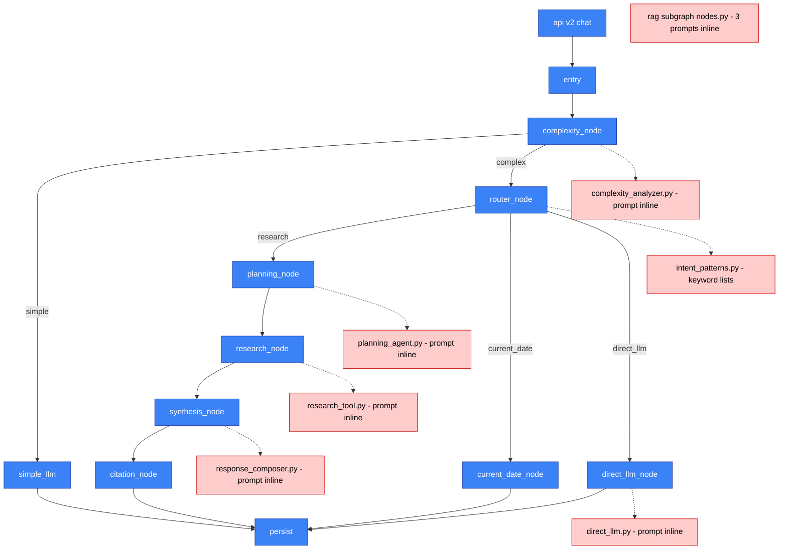

### 1.2 Sau refactor — skills centralized

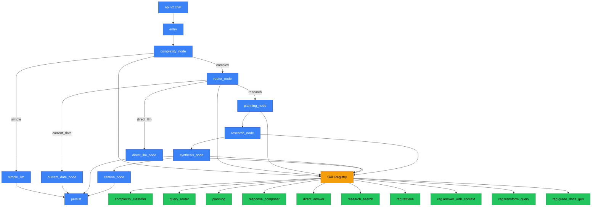

---

## 2. Skill anatomy — cấu trúc một skill

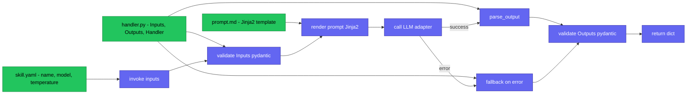

---

## 3. Registry discovery + skill invocation

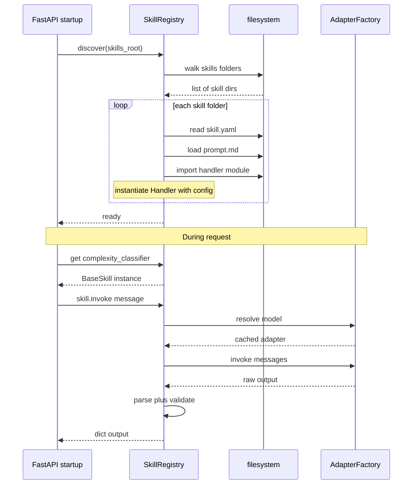

---

## 4. Node flow — complexity_node trước và sau

### 4.1 Trước

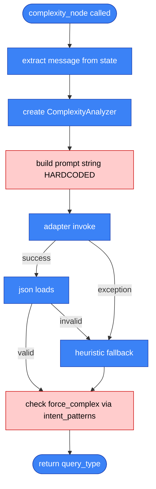

### 4.2 Sau

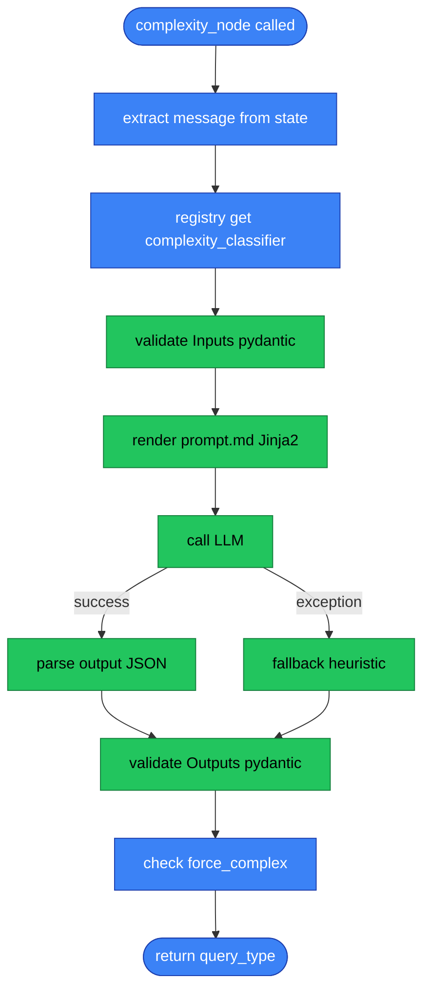

---

## 5. Directory structure — before vs after

### 5.1 Trước

```mermaid
graph TB
    Root[backend src]
    RA[research_agent]
    RAG[rag]
    Adapters[adapters]
    API[api]

    Root --> RA
    Root --> RAG
    Root --> Adapters
    Root --> API

    RA --> RA_Nodes[nodes]
    RA --> RA_Edges[edges]
    RA --> RA_Graph[graph]
    RA --> CA[complexity_analyzer.py - prompt inline]
    RA --> PA[planning_agent.py - prompt inline]
    RA --> RC[response_composer.py - prompt inline]
    RA --> DL[direct_llm.py - prompt inline]
    RA --> RT[research_tool.py - prompt inline]
    RA --> RA_Utils[intent_patterns.py - keyword lists]

    RAG --> RAG_Sub[subgraph nodes.py - 3 prompts inline]
    RAG --> RAG_QE[query_expander.py]
    RAG --> RAG_HS[hybrid_search.py]
    RAG --> RAG_RR[reranker.py]

    classDef dir fill:#3b82f6,stroke:#1e40af,color:#fff
    classDef bad fill:#ffcccc,stroke:#c00,color:#000
    class Root,RA,RAG,Adapters,API,RA_Nodes,RA_Edges,RA_Graph,RAG_QE,RAG_HS,RAG_RR dir
    class CA,PA,RC,DL,RT,RA_Utils,RAG_Sub bad
```

### 5.2 Sau

```mermaid
graph TB
    Root[backend src]
    Skills[skills NEW]
    RA[research_agent]
    RAG[rag]
    Adapters[adapters]
    API[api]

    Root --> Skills
    Root --> RA
    Root --> RAG
    Root --> Adapters
    Root --> API

    Skills --> S_Base[_base.py]
    Skills --> S_Reg[_registry.py]
    Skills --> S_Loader[_prompt_loader.py]
    Skills --> S_Err[_errors.py]
    Skills --> S_CC[complexity_classifier]
    Skills --> S_QR[query_router]
    Skills --> S_Plan[planning]
    Skills --> S_RC[response_composer]
    Skills --> S_DA[direct_answer]
    Skills --> S_RS[research_search]
    Skills --> S_RAG[rag folder]

    S_RAG --> S_Retrieve[retrieve]
    S_RAG --> S_Answer[answer_with_context]
    S_RAG --> S_QE[query_expand]
    S_RAG --> S_TQ[transform_query]
    S_RAG --> S_GD[grade_documents]
    S_RAG --> S_GG[grade_generation]

    RA --> RA_Nodes[nodes - thin wrappers]
    RA --> RA_Edges[edges - unchanged]
    RA --> RA_Graph[graph - unchanged]

    RAG --> RAG_Sub[subgraph - thin wrappers]
    RAG --> RAG_Primitives[fts vector rerank - unchanged]

    classDef dir fill:#3b82f6,stroke:#1e40af,color:#fff
    classDef new fill:#22c55e,stroke:#15803d,color:#000
    classDef framework fill:#6366f1,stroke:#3730a3,color:#fff
    class Root,RA,RAG,Adapters,API,RA_Nodes,RA_Edges,RA_Graph,RAG_Sub,RAG_Primitives dir
    class Skills,S_CC,S_QR,S_Plan,S_RC,S_DA,S_RS,S_RAG,S_Retrieve,S_Answer,S_QE,S_TQ,S_GD,S_GG new
    class S_Base,S_Reg,S_Loader,S_Err framework
```

---

## 6. Phased migration — lộ trình

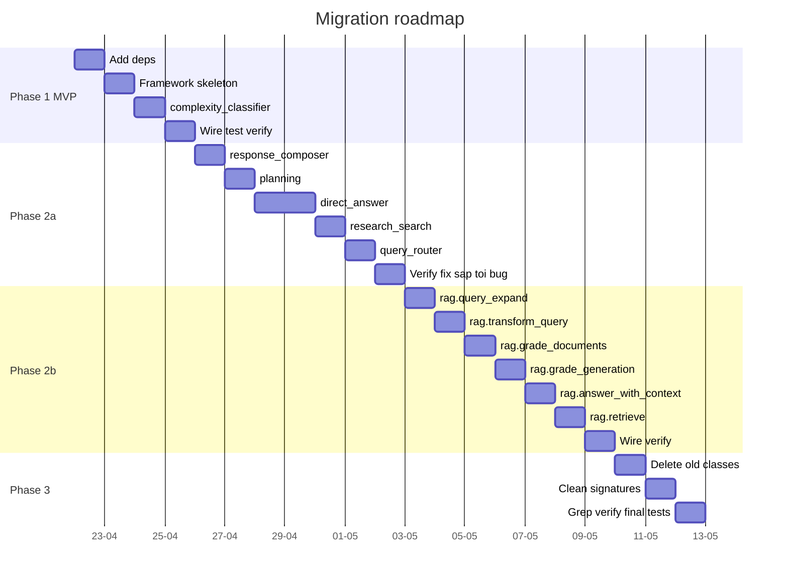

---

## 7. State flow — skill gọi LLM end-to-end

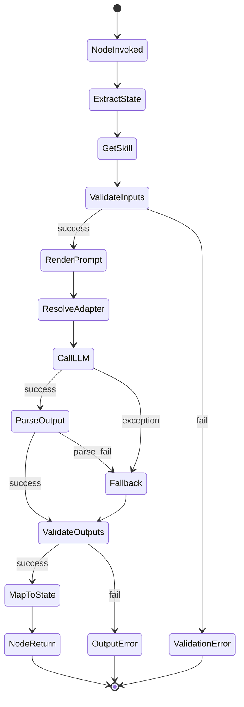

---

## 8. Dependencies graph

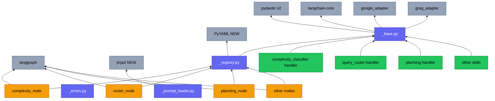

---

## Chú thích màu

| Màu | Ý nghĩa |
|---|---|
| 🟦 Xanh dương (blue) | Node có sẵn trong graph / directory hiện tại |
| 🟩 Xanh lá (green) | Thành phần mới thêm (skills) |
| 🟥 Đỏ nhạt (red) | Pain point — prompt hardcode cần refactor |
| 🟨 Vàng (amber) | Skill Registry / LangGraph nodes |
| 🟪 Tím indigo | Framework base classes |
| ⬜ Xám | External libraries, adapters (không thay đổi) |

## Ghi chú kiến trúc

- **LangGraph topology** (graph nodes/edges) KHÔNG đổi — chỉ body của node thay đổi cách gọi logic
- **AgentState shape** KHÔNG đổi — checkpointer cũ tiếp tục hoạt động
- **API contract** KHÔNG đổi — endpoint request/response identical
- **Adapters** KHÔNG đổi — skill gọi qua cùng interface hiện tại

---

## Cách xem preview

Nếu mở trong VSCode mà diagram không render, cài một trong các extension sau:

1. **Markdown Preview Mermaid Support** (bierner.markdown-mermaid) — khuyến nghị, nhẹ
2. **Markdown All in One** (yzhang.markdown-all-in-one) — full featured

Sau khi cài, reload window (Ctrl+Shift+P → "Reload Window") rồi mở preview (Ctrl+Shift+V).

Hoặc push lên GitHub — Mermaid render native trong `.md` files.
